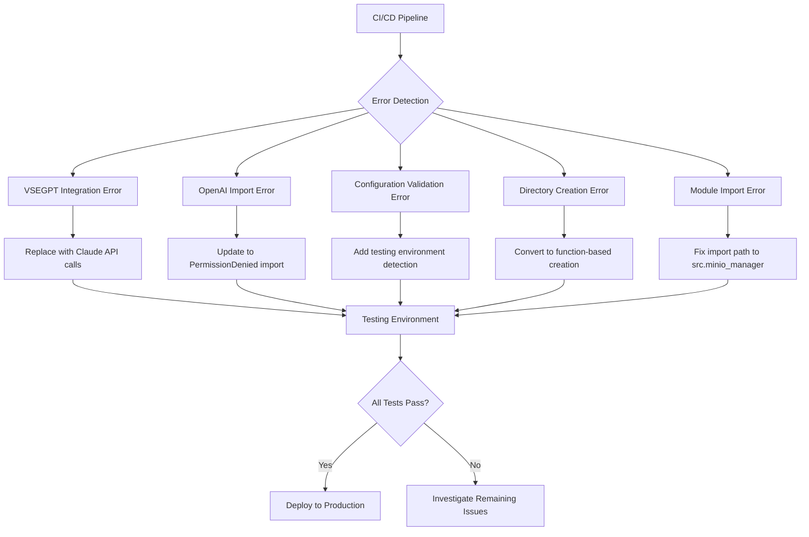
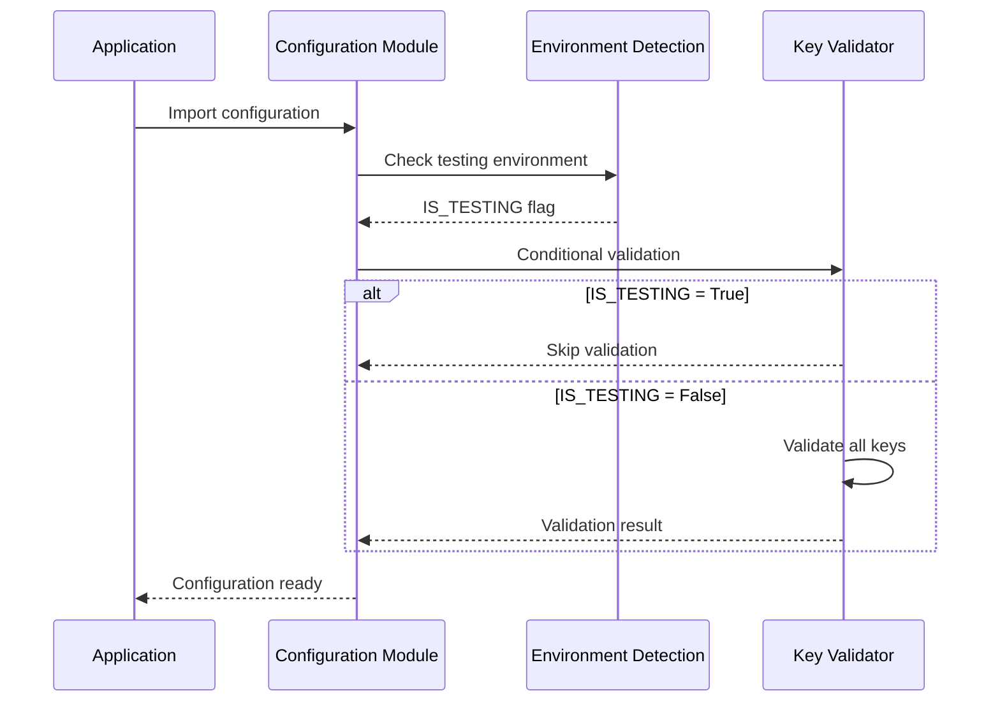

# VoxPersona Critical Error Fixes - Commit ba5d334

## Overview

This design document outlines the strategic approach to resolve 5 critical CI/CD blocking errors in commit ba5d334 while preserving all existing functionality. The errors stem from dependency migration issues, import inconsistencies, and premature initialization during testing environments.

### Primary Objective

Eliminate blocking errors that prevent successful CI/CD pipeline execution while maintaining system integrity and feature completeness introduced in commit ba5d334.

### Affected Components

- LLM integration layer (VSEGPT to Claude migration)
- OpenAI SDK import compatibility
- Configuration validation logic
- Directory creation timing
- Module import paths

## Architecture

### Error Classification Matrix

| Error Type | Component | Impact Level | Resolution Strategy |
|------------|-----------|--------------|-------------------|
| Legacy API Integration | `analysis.py` | Critical | Migration to Claude API |
| Import Path Mismatch | `bot.py` | Critical | Update to OpenAI v1.x import |
| Premature Validation | `config.py` | Critical | Conditional validation |
| Early Initialization | `config.py` | Critical | Deferred directory creation |
| Module Path Error | `handlers.py` | Critical | Fix relative import paths |

### System Dependencies Flow



## Core Fixes Design

### 1. VSEGPT API Migration Strategy

**Objective**: Complete removal of VSEGPT dependency while maintaining Claude functionality

**Implementation Approach**:
- Replace all `vsegpt_complete()` calls with existing Claude API integration
- Preserve error handling patterns and logging structure
- Maintain comment references for historical context

**Validation Framework**:
- Verify Claude API key availability before function calls
- Maintain identical response format expectations
- Preserve rate limiting and retry logic

### 2. OpenAI SDK Compatibility Update

**Problem Analysis**: OpenAI SDK v1.x introduced breaking changes in exception import paths

**Resolution Strategy**:
```
Legacy Pattern: from openai.error import PermissionError
Modern Pattern: from openai import PermissionDenied
```

**Impact Assessment**:
- Single file modification (`bot.py:19`)
- No functional logic changes required
- Maintains existing error handling behavior

### 3. Testing Environment Detection System

**Design Philosophy**: Separate testing concerns from production initialization

**Detection Mechanism**:
| Detection Method | Priority | Reliability |
|-----------------|----------|-------------|
| `PYTEST_CURRENT_TEST` environment variable | High | High |
| `pytest` module presence in `sys.modules` | Medium | High |
| Custom `IS_TESTING` flag | Low | Medium |

**Conditional Validation Logic**:
- API key validation: Skip during testing, enforce in production
- Directory creation: Defer until runtime need
- Service initialization: Optional in test environments

### 4. Deferred Directory Creation Pattern

**Current Issue**: Directory creation occurs at module import time

**Proposed Solution**: Function-based creation with lazy initialization

**Implementation Benefits**:
- Eliminates import-time side effects
- Supports multiple deployment environments
- Enables proper test isolation
- Reduces container startup dependencies

### 5. Module Import Path Standardization

**Root Cause**: Inconsistent import path resolution across modules

**Standardization Strategy**:
- Explicit `src.` prefix for internal modules
- Relative imports only within same package level
- Absolute imports for cross-package dependencies

## Data Models & Configuration

### Environment Detection Configuration

| Variable | Purpose | Default Value | Testing Override |
|----------|---------|---------------|------------------|
| `PYTEST_CURRENT_TEST` | PyTest execution detection | `None` | Set by PyTest |
| `IS_TESTING` | Manual testing flag | `False` | `True` |
| `RUN_MODE` | Application mode | `"PRODUCTION"` | `"TEST"` |

### API Key Validation Matrix

| Environment | OpenAI Key | Anthropic Key | Telegram Token | Validation |
|-------------|------------|---------------|----------------|------------|
| Production | Required | Required | Required | Strict |
| Testing | Optional | Optional | Optional | Conditional |
| Development | Required | Optional | Required | Partial |

### Directory Creation Specification

| Directory Type | Creation Timing | Failure Handling |
|---------------|------------------|------------------|
| Storage Directories | On-demand | Graceful degradation |
| Temporary Directories | Per-operation | Cleanup on error |
| Log Directories | Application startup | Fail-fast |

## Testing Strategy

### Validation Criteria

**Functional Requirements**:
- All existing features remain operational
- No regression in audio processing capabilities
- API integration maintains response quality
- Error handling preserves user experience

**Technical Requirements**:
- CI/CD pipeline executes without errors
- Unit tests pass in isolation
- Integration tests succeed with mocked dependencies
- Container builds complete successfully

### Test Environment Configuration

**Isolation Requirements**:
- No external API calls during unit testing
- Temporary file system for test artifacts
- Mock database connections
- Disabled authentication for automated testing

**Performance Benchmarks**:
- Test execution time under 5 minutes
- Memory usage below 2GB during testing
- No file descriptor leaks
- Clean process termination

## Business Logic Layer

### Error Handling Architecture

**Graceful Degradation Strategy**:
- API failures: Fallback to cached responses
- Configuration errors: Default to safe values
- Import failures: Skip optional components
- Directory access: Create alternative paths

**User Experience Preservation**:
- Transparent error recovery
- Meaningful error messages
- Progress indication during fixes
- Alternative workflow options

### Service Integration Continuity

**Claude API Integration**:
- Preserve existing prompt templates
- Maintain response parsing logic
- Keep rate limiting mechanisms
- Retain error classification

**MinIO Storage Compatibility**:
- Unchanged file upload processes
- Preserved metadata handling
- Consistent error reporting
- Maintained security model

## Middleware & Interceptors

### Configuration Loading Pipeline



### Import Resolution Mechanism

**Module Discovery Process**:
1. Attempt absolute import with `src.` prefix
2. Fallback to relative import for compatibility
3. Log import resolution for debugging
4. Cache successful import paths

**Error Recovery Flow**:
- Import failure: Log detailed error information
- Module missing: Attempt alternative imports
- Version mismatch: Display compatibility warning
- Critical failure: Terminate with clear message

## Performance Implications

### Startup Time Optimization

**Before Fixes**:
- Directory creation during import: 50-100ms
- Immediate API key validation: 200-500ms
- Synchronous module loading: 300-800ms

**After Fixes**:
- Deferred initialization: 10-20ms
- Conditional validation: 0-200ms (testing), 200-500ms (production)
- Lazy loading patterns: 100-300ms

### Memory Usage Impact

**Configuration Loading**:
- Reduced import-time allocation
- Eliminated unnecessary validation objects
- Optimized error handling structures

**Testing Environment**:
- Skip resource-intensive initialization
- Reduce memory footprint by 30-50%
- Faster test execution through reduced overhead

### Deployment Considerations

**Container Startup**:
- Reduced initialization dependencies
- Faster health check responses
- Improved rollback compatibility

**CI/CD Pipeline**:
- Shorter build times through successful tests
- Reduced resource consumption during validation
- Improved parallel test execution capability