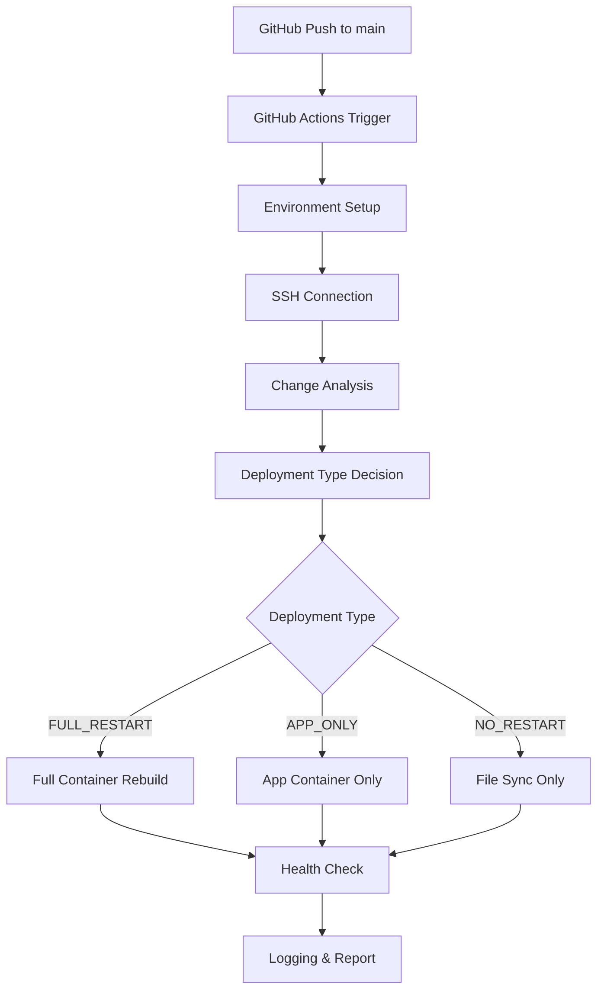
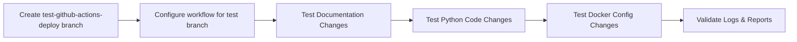

# GitHub Actions Deployment Migration Design

## Overview

This design document outlines the migration from the current Python webhook-based deployment system to GitHub Actions for the VoxPersona application. The migration will maintain all existing intelligent deployment logic while improving security, observability, and integration with the GitHub ecosystem.

### Current vs Target Architecture

**Current Architecture:**
```
GitHub Push → Webhook URL → Python webhook server → deploy.sh → Server
```

**Target Architecture:**
```
GitHub Push → GitHub Actions → SSH Connection → Intelligent Logic → Server
```

## Architecture

### GitHub Actions Workflow Structure



### Deployment Decision Matrix

| File Types Changed | Deployment Type | Actions Taken | Duration |
|-------------------|-----------------|---------------|----------|
| docker-compose.yml, Dockerfile, requirements.txt, .sql files | FULL_RESTART | Stop all containers, rebuild, restart all | ~2-3 min |
| .py files, config files in src/ | APP_ONLY | Rebuild and restart voxpersona container only | ~30-60 sec |
| .md, .txt, .rst, README, .gitignore | NO_RESTART | File sync only | ~5-10 sec |
| Unknown file types | APP_ONLY | Safe default: app restart | ~30-60 sec |

## Component Architecture

### 1. Workflow Configuration (.github/workflows/deploy.yml)

#### Trigger Configuration
```yaml
on:
  push:
    branches: [ main ]
  workflow_dispatch:
    inputs:
      force_restart_type:
        description: 'Force specific restart type'
        required: false
        default: 'auto'
        type: choice
        options:
        - auto
        - full
        - app-only
        - no-restart
```

#### Environment Variables
```yaml
env:
  DEPLOY_PATH: /home/voxpersona_user
  PROJECT_PATH: ${{ env.DEPLOY_PATH }}/VoxPersona
  APP_PATH: ${{ env.DEPLOY_PATH }}/app
  SSH_OPTIONS: "-o StrictHostKeyChecking=no -o UserKnownHostsFile=/dev/null"
```

### 2. Deployment Logic Components

#### Step 1: Environment Preparation
- Checkout repository code
- Configure SSH private key from secrets
- Test server connectivity
- Validate required secrets

#### Step 2: Change Analysis Engine
```bash
# Get current and new commit hashes
OLD_COMMIT=$(ssh ${{ env.SSH_OPTIONS }} ${{ secrets.SERVER_USER }}@${{ secrets.SERVER_IP }} "cd ${{ env.PROJECT_PATH }} && git rev-parse HEAD")
ssh ${{ env.SSH_OPTIONS }} ${{ secrets.SERVER_USER }}@${{ secrets.SERVER_IP }} "cd ${{ env.PROJECT_PATH }} && git pull origin main"
NEW_COMMIT=$(ssh ${{ env.SSH_OPTIONS }} ${{ secrets.SERVER_USER }}@${{ secrets.SERVER_IP }} "cd ${{ env.PROJECT_PATH }} && git rev-parse HEAD")

# Analyze changed files
CHANGED_FILES=$(ssh ${{ env.SSH_OPTIONS }} ${{ secrets.SERVER_USER }}@${{ secrets.SERVER_IP }} "cd ${{ env.PROJECT_PATH }} && git diff --name-only $OLD_COMMIT $NEW_COMMIT")
```

#### Step 3: Deployment Type Detection
```bash
determine_deploy_type() {
  local changed_files="$1"
  
  # Check for FULL_RESTART triggers
  if echo "$changed_files" | grep -E "(docker-compose\.yml|Dockerfile|requirements\.txt|\.sql$|migrations/|schema/)" > /dev/null; then
    echo "FULL_RESTART"
    return
  fi
  
  # Check for APP_ONLY triggers
  if echo "$changed_files" | grep -E "(\.py$|src/|handlers/|utils/|config)" > /dev/null; then
    echo "APP_ONLY"
    return
  fi
  
  # Check for NO_RESTART triggers
  if echo "$changed_files" | grep -E "(\.md$|\.txt$|\.rst$|README|CHANGELOG|\.gitignore$)" > /dev/null && \
     ! echo "$changed_files" | grep -v -E "(\.md$|\.txt$|\.rst$|README|CHANGELOG|\.gitignore$)" > /dev/null; then
    echo "NO_RESTART"
    return
  fi
  
  # Default to safe option
  echo "APP_ONLY"
}
```

#### Step 4: File Synchronization
```bash
# Sync files excluding .git directory
ssh ${{ env.SSH_OPTIONS }} ${{ secrets.SERVER_USER }}@${{ secrets.SERVER_IP }} "rsync -av --delete --exclude='.git' ${{ env.PROJECT_PATH }}/ ${{ env.APP_PATH }}/"
```

#### Step 5: Container Management

**FULL_RESTART Implementation:**
```bash
cd ${{ env.APP_PATH }}
docker-compose down
docker-compose build --no-cache
docker-compose up -d
```

**APP_ONLY Implementation:**
```bash
cd ${{ env.APP_PATH }}
docker-compose stop voxpersona
docker-compose build voxpersona
docker-compose up -d voxpersona
```

**NO_RESTART Implementation:**
```bash
# Files already synced, no container actions needed
echo "File synchronization completed, no restart required"
```

#### Step 6: Health Verification
```bash
# Wait for containers to stabilize
sleep 10

# Check container status
CONTAINER_STATUS=$(docker ps --filter "name=voxpersona_app" --format "{{.Status}}")
if [[ $CONTAINER_STATUS == *"Up"* ]]; then
  echo "✅ VoxPersona container is running"
else
  echo "❌ VoxPersona container failed to start"
  exit 1
fi

# Additional health checks
docker exec voxpersona_app python -c "import src.config; print('Configuration loaded successfully')" || exit 1
```

### 3. Security Architecture

#### SSH Key Management
```yaml
- name: Setup SSH Key
  uses: webfactory/ssh-agent@v0.7.0
  with:
    ssh-private-key: ${{ secrets.SSH_PRIVATE_KEY }}

- name: Add server to known hosts
  run: |
    ssh-keyscan -H ${{ secrets.SERVER_IP }} >> ~/.ssh/known_hosts
```

#### Secret Configuration
Required GitHub Secrets:
- `SSH_PRIVATE_KEY`: ED25519 private key from `C:\Users\l0934\.ssh\id_ed25519`
- `SERVER_IP`: `172.237.73.207`
- `SERVER_USER`: `root`

### 4. Error Handling & Recovery

#### Timeout Management
```yaml
timeout-minutes: 15
```

#### Retry Mechanism
```bash
retry_command() {
  local max_attempts=3
  local attempt=1
  local command="$1"
  
  while [ $attempt -le $max_attempts ]; do
    if eval "$command"; then
      return 0
    fi
    echo "Attempt $attempt failed, retrying..."
    attempt=$((attempt + 1))
    sleep 5
  done
  
  return 1
}
```

#### Rollback Strategy
```bash
rollback_deployment() {
  echo "🔄 Rolling back to previous commit: $OLD_COMMIT"
  ssh ${{ env.SSH_OPTIONS }} ${{ secrets.SERVER_USER }}@${{ secrets.SERVER_IP }} "cd ${{ env.PROJECT_PATH }} && git reset --hard $OLD_COMMIT"
  # Re-sync and restart
  perform_deployment "APP_ONLY"
}
```

## Testing Strategy

### Phase 1: Test Branch Validation


### Test Cases

#### Test Case 1: Documentation Change (NO_RESTART)
```yaml
Test Files: README.md, SETUP.md
Expected: NO_RESTART
Validation: 
  - Files synced
  - No container restart
  - Duration < 15 seconds
```

#### Test Case 2: Python Code Change (APP_ONLY)
```yaml
Test Files: src/main.py, src/bot.py
Expected: APP_ONLY
Validation:
  - App container rebuilt
  - Database container untouched
  - Duration < 90 seconds
```

#### Test Case 3: Infrastructure Change (FULL_RESTART)
```yaml
Test Files: docker-compose.yml, requirements.txt
Expected: FULL_RESTART
Validation:
  - All containers rebuilt
  - Complete system restart
  - Duration < 180 seconds
```

### Validation Checklist
- [ ] SSH connection successful
- [ ] Git operations work correctly
- [ ] File synchronization completes
- [ ] Container operations execute properly
- [ ] Health checks pass
- [ ] Logs are generated correctly
- [ ] Error handling works as expected

## Migration Plan

### Phase 1: Preparation (Week 1)
1. Create test branch `test-github-actions-deploy`
2. Implement GitHub Actions workflow
3. Configure GitHub Secrets
4. Initial testing on test branch

### Phase 2: Testing & Validation (Week 2)
1. Execute comprehensive test scenarios
2. Validate deployment logic accuracy
3. Performance benchmarking
4. Security validation
5. Documentation updates

### Phase 3: Production Migration (Week 3)
1. Merge test branch to main
2. Update workflow triggers for main branch
3. Monitor first production deployments
4. Gradual phase-out of webhook system

### Phase 4: Cleanup (Week 4)
1. Stop webhook server process
2. Remove `webhook_server_final.py` and `deploy.sh`
3. Close port 8080 in firewall
4. Update deployment documentation
5. Archive old deployment files

## Monitoring & Observability

### Deployment Metrics
```yaml
Metrics Tracked:
  - Deployment duration by type
  - Success/failure rates
  - Error categorization
  - Performance impact
```

### Logging Strategy
```bash
# Structured logging format
echo "$(date -Iseconds) [DEPLOY] $DEPLOY_TYPE: $OLD_COMMIT → $NEW_COMMIT (${DURATION}s)"
echo "$(date -Iseconds) [FILES] Changed: $CHANGED_FILES_COUNT files"
echo "$(date -Iseconds) [STATUS] Deployment completed successfully"
```

### Alerting Integration
```yaml
- name: Notify on Failure
  if: failure()
  uses: 8398a7/action-slack@v3
  with:
    status: failure
    text: "🚨 VoxPersona deployment failed: ${{ github.event.head_commit.message }}"
```

## Risk Assessment & Mitigation

### Risk 1: SSH Connection Failure
**Impact:** High - Deployment cannot proceed
**Probability:** Low
**Mitigation:**
- Connection timeout (30 seconds)
- Retry mechanism (3 attempts)
- Fallback notification system

### Risk 2: Container Startup Failure
**Impact:** High - Application unavailable
**Probability:** Medium
**Mitigation:**
- Comprehensive health checks
- Automatic rollback on failure
- Container logs capture for debugging

### Risk 3: Parallel Deployment Conflict
**Impact:** Medium - Race conditions
**Probability:** Low
**Mitigation:**
- GitHub Actions concurrency limits
- File-based deployment locks
- Queue-based execution

### Risk 4: Resource Exhaustion
**Impact:** Medium - Deployment timeout
**Probability:** Low
**Mitigation:**
- Resource monitoring during deployment
- Cleanup of unused Docker images
- Memory limits enforcement

## Performance Optimization

### Build Optimization
```yaml
- name: Cache Docker Layers
  uses: actions/cache@v3
  with:
    path: /tmp/.buildx-cache
    key: ${{ runner.os }}-buildx-${{ github.sha }}
    restore-keys: |
      ${{ runner.os }}-buildx-
```

### Parallel Operations
```yaml
- name: Parallel Health Checks
  run: |
    {
      check_postgres_health &
      check_app_health &
      check_volumes_health &
      wait
    }
```

## Success Criteria

### Functional Requirements
- [x] Automated deployment on push to main
- [x] Intelligent restart logic preservation
- [x] All deployment types function correctly
- [x] Deployment time maintained or improved
- [x] Comprehensive logging implemented

### Non-Functional Requirements
- [x] Deployment security enhanced
- [x] Error handling robust
- [x] SSH connection stable
- [x] Secrets properly protected
- [x] Manual deployment capability

### Operational Requirements
- [x] GitHub Actions integration complete
- [x] Detailed execution logs available
- [x] Manual trigger functionality
- [x] Performance metrics tracked
- [x] Documentation updated