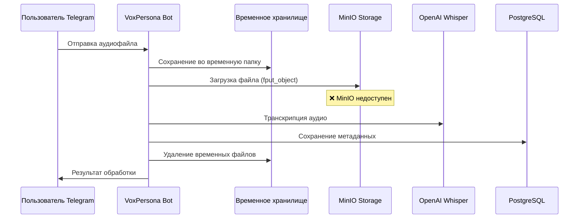
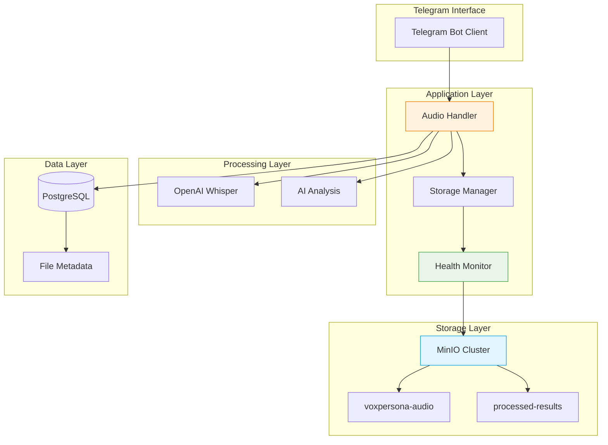
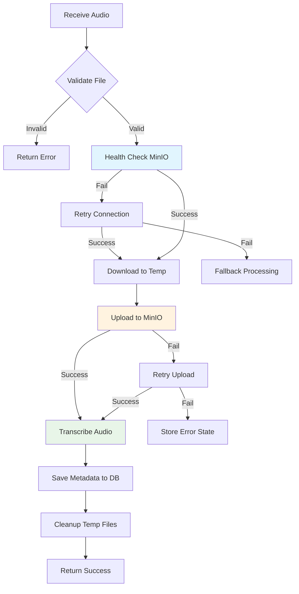

# Улучшение интеграции MinIO в VoxPersona

## Обзор

VoxPersona представляет собой AI-платформу для анализа голосовых записей, которая использует MinIO для хранения аудиофайлов. Анализ кодовой базы и отчёта с продакшн-сервера выявил критические проблемы в интеграции MinIO, которые приводят к нестабильной работе системы обработки аудиофайлов.

### Основные проблемы
- MinIO сервис отсутствует в docker-compose.yml конфигурации
- Неполная реализация операций с объектным хранилищем (отсутствуют download, delete, list)
- Недостаточная обработка ошибок и валидация подключения
- Отсутствие retry механизмов и health checks
- Проблемы с безопасностью и управлением метаданными

## Архитектура

### Текущий workflow обработки аудио



### Целевая архитектура



## Компоненты решения

### 1. Конфигурация Docker Infrastructure

#### MinIO Service Configuration
```yaml
services:
  minio:
    image: minio/minio:RELEASE.2025-01-23T22-51-28Z
    container_name: voxpersona_minio
    restart: unless-stopped
    environment:
      MINIO_ROOT_USER: ${MINIO_ACCESS_KEY}
      MINIO_ROOT_PASSWORD: ${MINIO_SECRET_KEY}
      MINIO_BROWSER_REDIRECT_URL: https://minio.yourdomain.com
    ports:
      - "9000:9000"  # S3 API
      - "9001:9001"  # Web Console
    volumes:
      - minio_data:/data
      - minio_certs:/certs
    command: server /data --console-address ":9001" --certs-dir /certs
    networks:
      - voxpersona_default
    healthcheck:
      test: ["CMD", "mc", "ready", "local"]
      interval: 30s
      timeout: 20s
      retries: 3
```

#### Network and Volume Configuration
```yaml
networks:
  voxpersona_default:
    driver: bridge
    ipam:
      config:
        - subnet: 172.20.0.0/16

volumes:
  minio_data:
    driver: local
  minio_certs:
    driver: local
```

### 2. Enhanced MinIO Client Manager

#### Connection Management with Health Checks
```python
class MinIOManager:
    def __init__(self):
        self.client = None
        self.is_healthy = False
        self.last_health_check = 0
        self.health_check_interval = 60  # seconds
    
    def initialize_client(self) -> bool:
        """Initialize MinIO client with connection validation"""
        
    def health_check(self) -> bool:
        """Verify MinIO service availability"""
        
    def ensure_buckets_exist(self) -> bool:
        """Create required buckets if they don't exist"""
        
    def get_client(self):
        """Get validated MinIO client instance"""
```

#### Retry Mechanism Implementation
```python
class RetryableMinIOOperation:
    def __init__(self, max_retries=3, backoff_factor=2):
        self.max_retries = max_retries
        self.backoff_factor = backoff_factor
    
    def execute_with_retry(self, operation, *args, **kwargs):
        """Execute MinIO operation with exponential backoff retry"""
```

### 3. Complete CRUD Operations

#### Upload Operations
```python
def upload_audio_file(file_path: str, object_name: str, metadata: dict = None) -> bool:
    """Upload audio file to MinIO with metadata"""
    
def upload_with_progress(file_path: str, object_name: str, 
                        progress_callback=None) -> bool:
    """Upload large files with progress tracking"""
```

#### Download Operations  
```python
def download_audio_file(object_name: str, local_path: str) -> bool:
    """Download audio file from MinIO"""
    
def get_audio_stream(object_name: str) -> io.BytesIO:
    """Get audio file as stream for processing"""
```

#### List and Search Operations
```python
def list_user_audio_files(user_id: int, prefix: str = None) -> List[ObjectInfo]:
    """List audio files for specific user"""
    
def search_files_by_metadata(filters: dict) -> List[ObjectInfo]:
    """Search files by metadata criteria"""
```

#### Delete Operations
```python
def delete_audio_file(object_name: str) -> bool:
    """Delete single audio file"""
    
def cleanup_old_files(days_old: int = 30) -> int:
    """Clean up files older than specified days"""
```

### 4. Enhanced Audio Processing Pipeline

#### Updated Audio Handler


#### Metadata Management
```python
class AudioFileMetadata:
    def __init__(self):
        self.user_id: int
        self.file_name: str
        self.original_name: str
        self.file_size: int
        self.content_type: str
        self.upload_timestamp: datetime
        self.processing_status: str
        self.transcription_id: Optional[int]
        self.analysis_results: Optional[dict]
```

### 5. Error Handling and Monitoring

#### Comprehensive Error Handling
```python
class MinIOError(Exception):
    """Base exception for MinIO operations"""
    
class MinIOConnectionError(MinIOError):
    """MinIO connection failed"""
    
class MinIOUploadError(MinIOError):
    """File upload failed"""
    
class MinIODownloadError(MinIOError):
    """File download failed"""
```

#### Monitoring and Alerting
```python
class MinIOMonitor:
    def __init__(self):
        self.metrics = {}
        
    def record_operation(self, operation: str, success: bool, duration: float):
        """Record operation metrics"""
        
    def check_storage_usage(self) -> dict:
        """Monitor storage usage and quotas"""
        
    def generate_health_report(self) -> dict:
        """Generate comprehensive health report"""
```

### 6. Security Enhancements

#### SSL/TLS Configuration
```python
class SecureMinIOClient:
    def __init__(self):
        self.use_ssl = True
        self.cert_check = True
        self.custom_ca_certs = "/certs/ca.pem"
        
    def setup_secure_connection(self):
        """Configure secure MinIO connection"""
```

#### Access Control and Permissions
```python
class MinIOAccessControl:
    def __init__(self):
        self.bucket_policies = {}
        
    def setup_bucket_policy(self, bucket_name: str, user_permissions: dict):
        """Configure bucket-level access policies"""
        
    def validate_user_access(self, user_id: int, operation: str, 
                           object_name: str) -> bool:
        """Validate user permissions for operations"""
```

## Тестирование

### Unit Tests
```python
class TestMinIOIntegration(unittest.TestCase):
    def setUp(self):
        self.minio_manager = MinIOManager()
        self.test_bucket = "test-voxpersona-audio"
        
    def test_connection_health_check(self):
        """Test MinIO connection validation"""
        
    def test_upload_download_cycle(self):
        """Test complete upload-download workflow"""
        
    def test_error_handling(self):
        """Test error scenarios and recovery"""
        
    def test_metadata_management(self):
        """Test file metadata operations"""
```

### Integration Tests
```python
class TestAudioProcessingWorkflow(unittest.TestCase):
    def test_complete_audio_processing(self):
        """Test end-to-end audio processing with MinIO"""
        
    def test_failover_scenarios(self):
        """Test system behavior during MinIO outages"""
        
    def test_large_file_handling(self):
        """Test processing of large audio files"""
```

## Развёртывание

### Environment Variables
```bash
# MinIO Configuration
MINIO_ENDPOINT=minio:9000
MINIO_ACCESS_KEY=voxpersona_admin_2025
MINIO_SECRET_KEY=SecureVoxPersona2025!@#
MINIO_BUCKET_NAME=voxpersona-storage
MINIO_AUDIO_BUCKET_NAME=voxpersona-audio
MINIO_USE_SSL=true
MINIO_CERT_PATH=/certs

# Health Check Configuration
MINIO_HEALTH_CHECK_INTERVAL=60
MINIO_MAX_RETRIES=3
MINIO_RETRY_BACKOFF=2

# Storage Configuration
MINIO_MAX_FILE_SIZE=2147483648  # 2GB
MINIO_CLEANUP_DAYS=30
```

### Deployment Steps
1. Обновить docker-compose.yml с MinIO сервисом
2. Настроить SSL сертификаты для secure connection
3. Обновить application code с новым MinIOManager
4. Провести миграцию данных из временного хранилища
5. Настроить monitoring и alerting
6. Выполнить integration tests в staging environment

### Migration Strategy
```python
class MinIODataMigration:
    def migrate_existing_files(self):
        """Migrate existing audio files to MinIO"""
        
    def validate_migration(self):
        """Validate successful data migration"""
        
    def rollback_migration(self):
        """Rollback migration if issues occur"""
```

## Мониторинг и поддержка

### Key Performance Indicators
- MinIO service uptime (target: >99.9%)
- Audio upload success rate (target: >98%)
- Average file processing time (target: <30 seconds for 10MB files)
- Storage usage and growth trends
- Error rates by operation type

### Health Dashboard
```python
class MinIOHealthDashboard:
    def get_service_status(self) -> dict:
        """Get current service health status"""
        
    def get_performance_metrics(self) -> dict:
        """Get performance and usage metrics"""
        
    def get_error_summary(self) -> dict:
        """Get recent errors and resolution status"""
```

### Troubleshooting Guides
- MinIO connection failures
- Upload/download timeouts
- Storage capacity issues
- SSL certificate problems
- Performance degradation scenarios