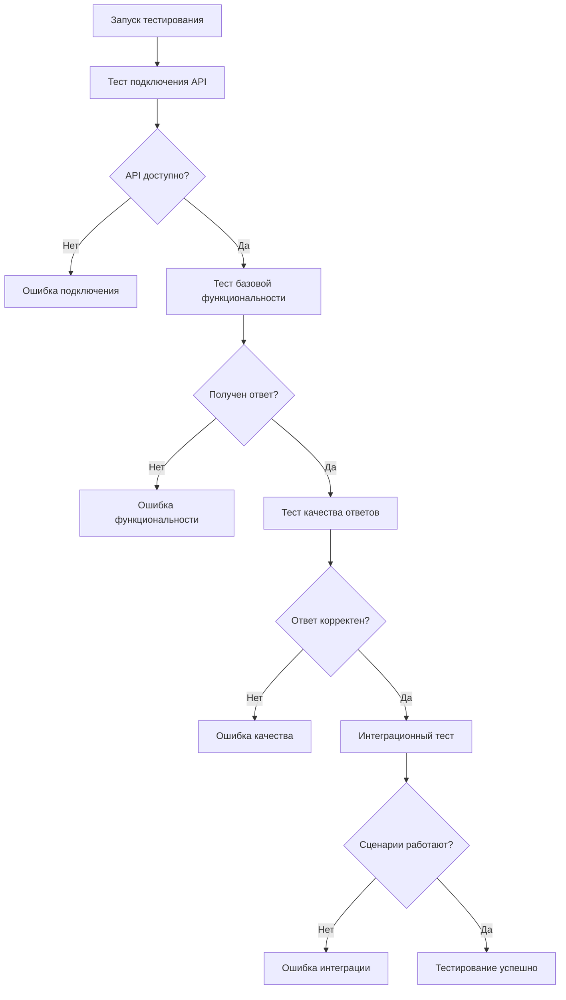

# Обновление модели Anthropic до Claude Sonnet 4 (20250514)

## Обзор

Данный документ описывает изменения для обновления модели анализа Anthropic с текущей версии `claude-3-5-sonnet-20241022` на новую модель `claude-sonnet-4-20250514`. Обновление включает изменение конфигурации модели, обновление fallback значений и разработку системы тестирования для проверки корректности работы новой модели.

## Архитектура изменений

### Текущее состояние модели
- **Основная модель**: Конфигурируется через переменную окружения `REPORT_MODEL_NAME`
- **Fallback модель**: `claude-3-5-sonnet-20241022` (используется когда `REPORT_MODEL_NAME` не задан)
- **Места использования**: 
  - Функция `send_msg_to_model` в analysis.py (строки 146, 184, 286, 365, 449, 457)
  - Функция `send_msg_to_model_async` в analysis.py
  - Инициализация tiktoken encoder в config.py

### Компоненты для изменения

#### 1. Переменные окружения
| Компонент | Файл | Текущее значение | Новое значение |
|-----------|------|------------------|----------------|
| REPORT_MODEL_NAME (default) | docker-compose.yml | claude-3-7-sonnet-20250219 | claude-sonnet-4-20250514 |
| Fallback модель | analysis.py | claude-3-5-sonnet-20241022 | claude-sonnet-4-20250514 |

#### 2. Файлы для изменения
- `docker-compose.yml` - обновление значения по умолчанию
- `src/analysis.py` - обновление fallback значений в функциях
- Тестовые сценарии для проверки работы API

## Детальный план изменений

### Изменение 1: Обновление docker-compose.yml
**Цель**: Изменить значение по умолчанию для переменной окружения `REPORT_MODEL_NAME`

**Изменение**: В секции environment обновить:
```
- REPORT_MODEL_NAME=${REPORT_MODEL_NAME:-claude-sonnet-4-20250514}
```

### Изменение 2: Обновление fallback модели в analysis.py
**Цель**: Обновить hardcoded fallback значения на новую модель

**Локации для изменения**:
- Строка 184: `model=model or REPORT_MODEL_NAME or "claude-sonnet-4-20250514"`
- Строка 286: `model=REPORT_MODEL_NAME or "claude-sonnet-4-20250514"`
- Строка 365: `model=REPORT_MODEL_NAME or "claude-sonnet-4-20250514"`
- Строка 457: `model = "claude-sonnet-4-20250514"`

### Изменение 3: Система тестирования
**Цель**: Создать механизм проверки работоспособности новой модели

#### Компоненты тестирования:
1. **Тест подключения API** - проверка доступности модели
2. **Тест базовой функциональности** - простой запрос-ответ
3. **Тест качества ответов** - проверка соответствия ожидаемому формату
4. **Интеграционный тест** - проверка работы в рамках основных сценариев

#### Структура тестового процесса:



## Тестовые сценарии

### Тест 1: Проверка API подключения
**Описание**: Минимальный запрос для проверки доступности модели
**Метод**: Отправка простого сообщения "test" через `send_msg_to_model`
**Ожидаемый результат**: Получение ответа без ошибок

### Тест 2: Тест транскрипции и анализа
**Описание**: Полный цикл обработки аудио
**Метод**: Использование тестового аудиофайла для проверки цепочки: транскрипция → анализ
**Ожидаемый результат**: Получение структурированного отчета

### Тест 3: Тест назначения ролей
**Описание**: Проверка функции `assign_roles`
**Метод**: Отправка тестового текста с диалогом
**Ожидаемый результат**: Получение текста с назначенными ролями

### Тест 4: Тест RAG-поиска
**Описание**: Проверка работы семантического поиска с новой моделью
**Метод**: Выполнение поиска по базе знаний с использованием `search_and_analyze`
**Ожидаемый результат**: Релевантные результаты поиска

## Стратегия валидации

### Метрики качества
| Метрика | Описание | Критерий успеха |
|---------|----------|-----------------|
| Время ответа | Среднее время получения ответа от API | < 30 секунд |
| Качество JSON | Процент корректно сформированных JSON-ответов | > 95% |
| Полнота ответов | Наличие всех ожидаемых полей в ответе | 100% |
| Релевантность | Соответствие ответов заданным промптам | Экспертная оценка |

### Процедура валидации
1. **Автоматическое тестирование**: Запуск набора автотестов
2. **Ручная проверка**: Тестирование основных сценариев через Telegram бот
3. **Сравнительный анализ**: Сопоставление результатов старой и новой модели
4. **Производительность**: Измерение времени ответа и потребления ресурсов

## Обработка ошибок

### Стратегии fallback
- **Ошибка модели**: Автоматический возврат к предыдущей версии модели
- **Ошибка API**: Использование альтернативных API ключей
- **Ошибка формата**: Повторная попытка с модифицированным промптом

### Мониторинг
- Логирование всех ошибок связанных с новой моделью
- Отслеживание метрик производительности
- Алерты при критических ошибках

## Конфигурация окружения

### Переменные окружения для тестирования
| Переменная | Значение | Описание |
|------------|----------|----------|
| REPORT_MODEL_NAME | claude-sonnet-4-20250514 | Новая модель для анализа |
| TEST_MODE | true | Включение расширенного логирования |
| FALLBACK_MODEL | claude-3-5-sonnet-20241022 | Резервная модель |

### Требования к инфраструктуре
- Доступ к API Anthropic с поддержкой новой модели
- Достаточные лимиты API для тестирования
- Мониторинг производительности системы

## Критерии готовности

### Технические критерии
- [ ] Все тесты API проходят успешно
- [ ] Время ответа соответствует требованиям
- [ ] Качество ответов не ухудшилось
- [ ] Система мониторинга настроена

### Функциональные критерии
- [ ] Все основные сценарии работают корректно
- [ ] Структура ответов соответствует ожиданиям
- [ ] RAG-поиск функционирует корректно
- [ ] Telegram бот реагирует адекватно

### Критерии безопасности
- [ ] API ключи защищены
- [ ] Логирование не содержит чувствительных данных
- [ ] Система fallback функционирует
- [ ] Обработка ошибок работает корректно