# Дизайн исправления импортов Python и управления контейнерами

## Обзор

Этот документ описывает дизайн решения критических проблем деплоя VoxPersona: исправление импортов Python и устранение дублирования Docker контейнеров. Система страдает от ImportError из-за неправильного использования относительных импортов и неэффективного управления Docker образами.

## Архитектура

### Анализ текущего состояния

| Компонент | Статус | Проблема |
|-----------|--------|----------|
| VoxPersona App | 🔴 Цикл перезапуска | ImportError в utils.py |
| PostgreSQL | ✅ Работает | Стабильно работает |
| MinIO | ✅ Работает и здоров | Стабильно работает |
| Docker образы | ⚠️ Дублируются | 2 образа занимают ~25GB |

### Корневая причина проблемы

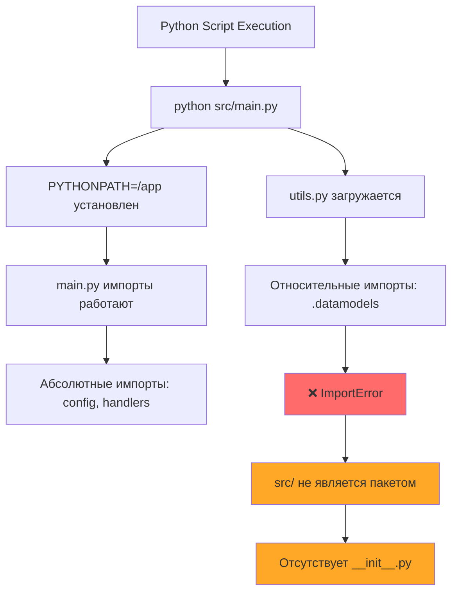

### Архитектура стратегии импортов

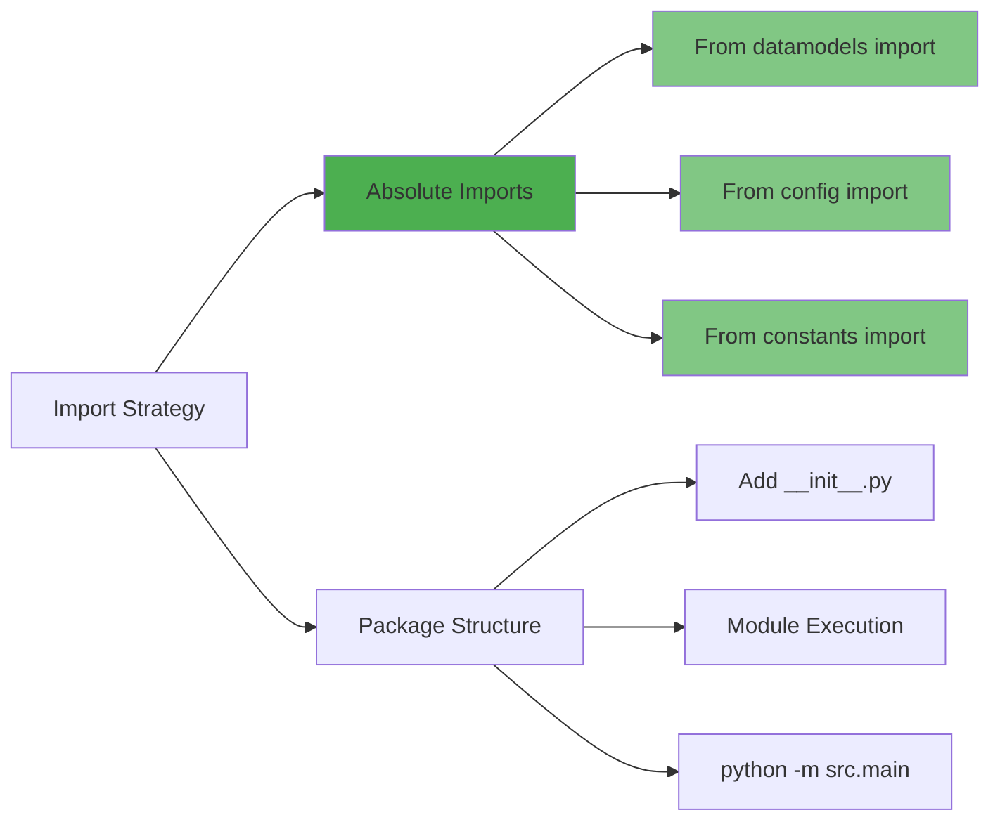

## Дизайн решения импортов

### Матрица выбора стратегии

| Критерий | Абсолютные импорты | Структура пакетов |
|----------|--------------------|-----------------|
| Скорость реализации | ⚡ Быстро (5 мин) | 🐌 Медленно (30 мин) |
| Изменения кода | 🔧 Минимальные (3 файла) | 📝 Обширные (все файлы) |
| Соответствие архитектуре | ✅ Подходит текущей | 🔄 Требует реструктуризации |
| Уровень риска | 🟢 Низкий | 🟡 Средний |
| Поддерживаемость | ✅ Хорошая | ✅ Лучше |

**Выбранная стратегия: Абсолютные импорты** - минимальные изменения для быстрого решения критической проблемы.

### Дизайн преобразования импортов

#### Целевые файлы для модификации

| Файл | Текущий импорт | Целевой импорт | Строки |
|------|----------------|----------------|--------|
| utils.py | `from .datamodels import` | `from datamodels import` | 13 |
| utils.py | `from .config import` | `from config import` | 14 |
| utils.py | `from .constants import` | `from constants import` | 15 |
| utils.py | `from .md_storage import` | `from md_storage import` | 251 |
| utils.py | `from .chat_history import` | `from chat_history import` | 327 |

#### Рабочий процесс разрешения импортов

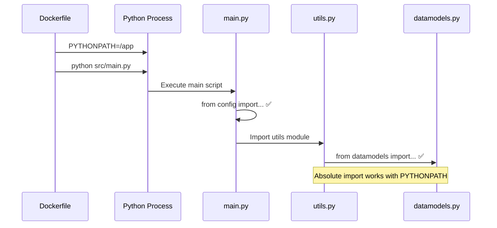

## Дизайн управления контейнерами

### Проблема дублирования Docker образов

#### Текущее состояние Docker образов

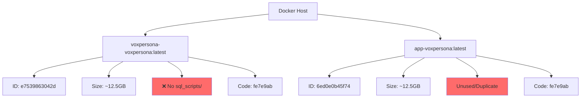

#### Стратегия именования образов

| Фактор | Текущее поведение | Целевое поведение |
|--------|------------------|-------------------|
| Зависимость от директории | ❌ Зависит от директории сборки | ✅ Постоянное именование |
| Имя образа | Переменное (app-* или voxpersona-*) | Фиксированное: voxpersona-voxpersona |
| Эффективность хранения | ❌ ~25GB общий | ✅ ~12.5GB общий |
| Консистентность сборки | ❌ Непоследовательная | ✅ Предсказуемая |

### Стратегия очистки контейнеров

#### Рабочий процесс очистки

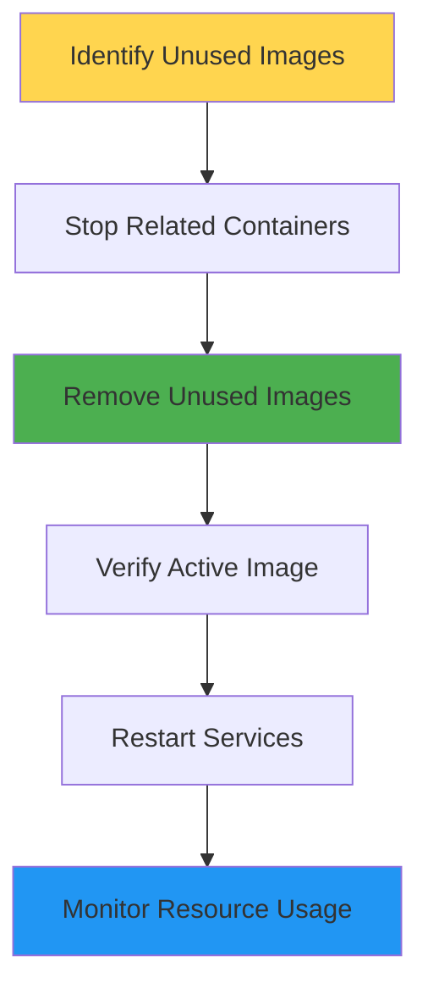

## Дизайн реализации

### Фаза 1: Реализация исправления импортов

#### Стратегия модификации файлов

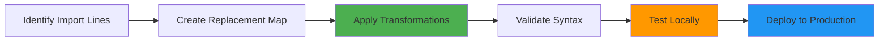

#### Карта замен

| Исходный шаблон | Шаблон замены |
|-----------------|---------------|
| `from .module import` | `from module import` |
| `from .package.module import` | `from package.module import` |

### Фаза 2: Оптимизация контейнеров

#### Рабочий процесс управления образами

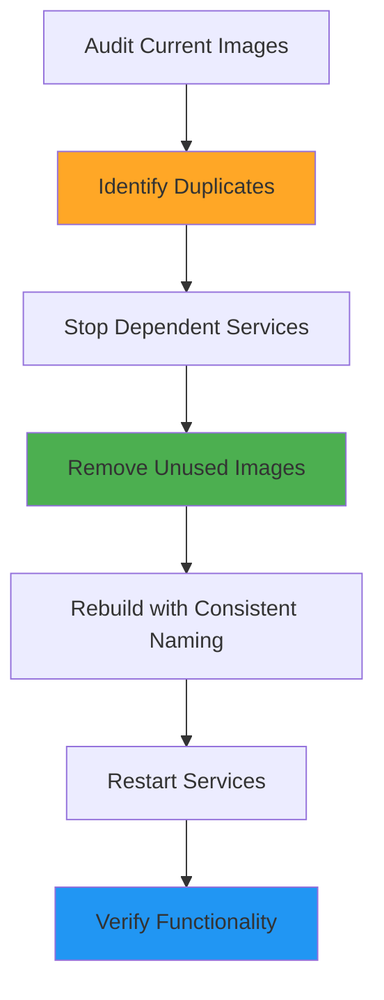

### Интеграция конвейера развёртывания

#### Улучшение рабочего процесса CI/CD


## Стратегия тестирования

### Тесты валидации импортов

| Тип теста | Метод валидации | Критерии успеха |
|-----------|-----------------|------------------|
| Проверка синтаксиса | Парсинг Python AST | Нет синтаксических ошибок |
| Разрешение импортов | Загрузка модулей | Все импорты разрешаются |
| Запуск приложения | Логи Docker контейнера | Нет ImportError |
| Функциональный тест | Ответ бота | Нормальная работа |

### Тесты управления контейнерами

| Тип теста | Метод валидации | Критерии успеха |
|-----------|-----------------|------------------|
| Количество образов | Подсчёт `docker images` | Один образ voxpersona |
| Использование диска | `docker system df` | <15GB общее использование |
| Здоровье контейнеров | Эндпоинты проверки здоровья | Все сервисы здоровы |
| Использование ресурсов | `docker stats` | Нормальный CPU/память |

## Мониторинг и обслуживание

### Мониторинг после развёртывания

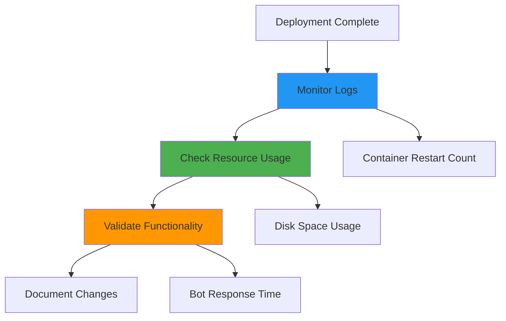

### Процедуры обслуживания

| Деятельность | Частота | Действие |
|--------------|---------|----------|
| Очистка образов | Еженедельно | Удаление неиспользуемых образов |
| Ротация логов | Ежедневно | Архивирование старых логов |
| Мониторинг ресурсов | Непрерывно | Оповещение при превышении порогов |
| Проверки здоровья | Каждые 5 минут | Валидация статуса сервисов |

## Оценка рисков

### Риски реализации

| Риск | Вероятность | Влияние | Смягчение |
|------|-------------|---------|------------|
| Сбой разрешения импортов | Низкая | Высокое | Локальное тестирование перед развёртыванием |
| Простой сервиса | Средняя | Среднее | Процедура быстрого отката |
| Потеря данных | Очень низкая | Высокое | Проверка резервных копий БД |
| Исчерпание ресурсов | Низкая | Среднее | Мониторинг и оповещения |

### Стратегия отката

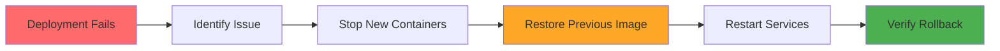

## Идеальная архитектура развертывания

### Концепция единого источника правды

#### Текущая проблемная архитектура

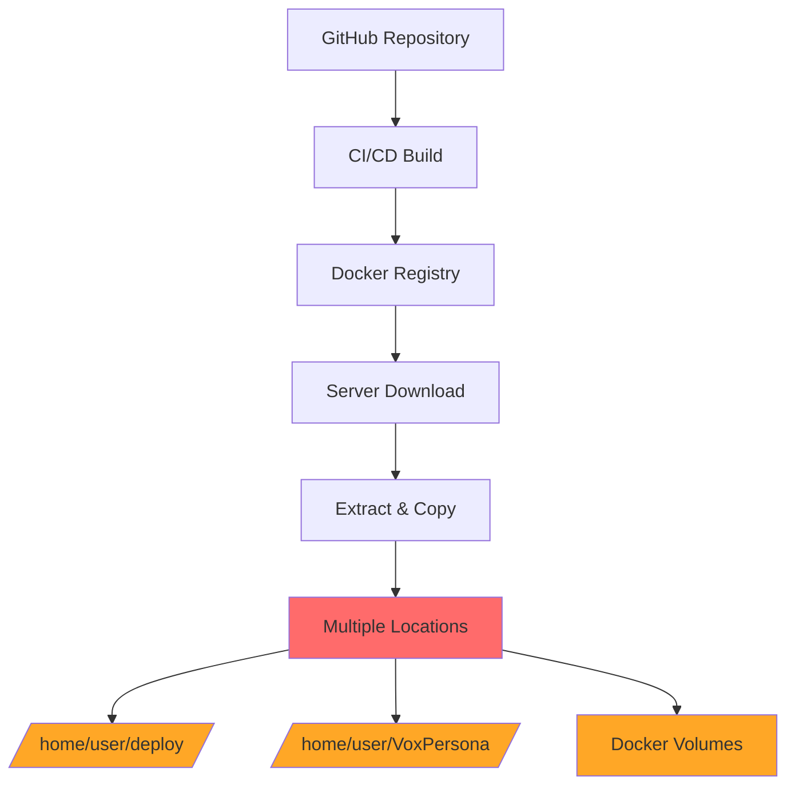

#### Идеальная архитектура: Один источник правды

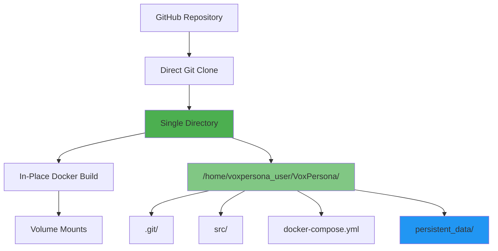

### Архитектура хранения данных

#### Стратегия персистентности PostgreSQL

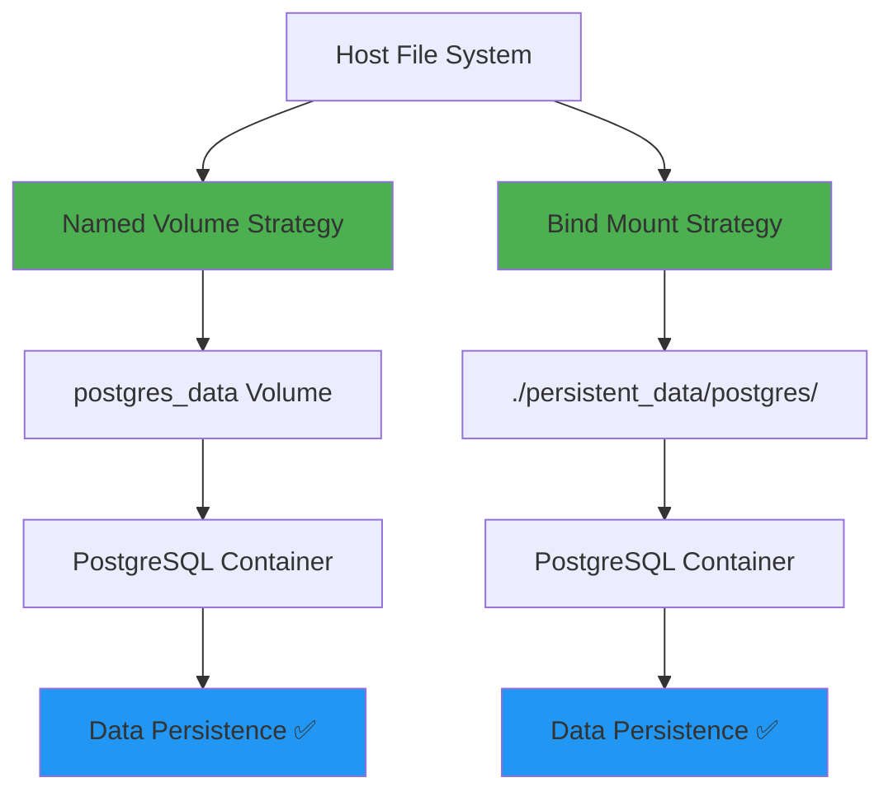

### Оптимизированная структура проекта

#### Единая директорная структура

| Компонент | Путь | Назначение | Персистентность |
|-----------|------|------------|----------------|
| Исходный код | `/home/voxpersona_user/VoxPersona/src/` | Код приложения | Git управляемый |
| Конфигурация | `/home/voxpersona_user/VoxPersona/docker-compose.yml` | Оркестрация контейнеров | Git управляемый |
| Данные PostgreSQL | `/home/voxpersona_user/VoxPersona/persistent_data/postgres/` | База данных | Персистентный |
| Логи приложения | `/home/voxpersona_user/VoxPersona/persistent_data/logs/` | Журналы системы | Персистентный |
| RAG индексы | `/home/voxpersona_user/VoxPersona/persistent_data/rag/` | Векторные индексы | Персистентный |
| MinIO данные | `/home/voxpersona_user/VoxPersona/persistent_data/minio/` | Объектное хранилище | Персистентный |

### Дизайн оптимизации развертывания

#### Стратегия кэширования зависимостей

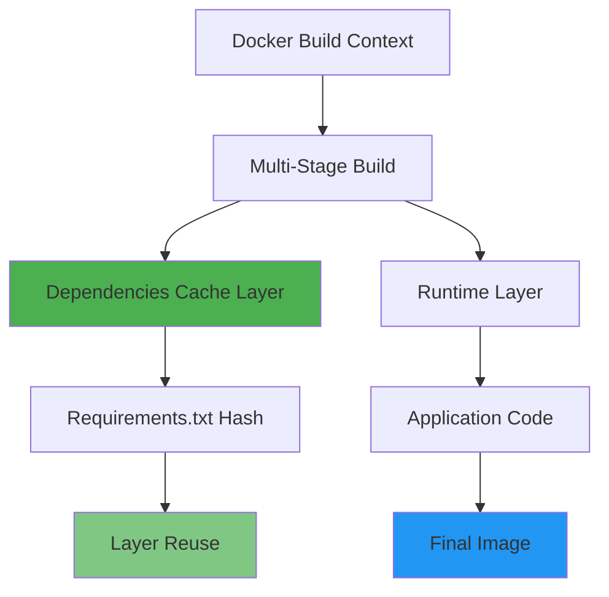

#### Оптимизированный Dockerfile дизайн

| Этап сборки | Действие | Кэширование | Результат |
|-------------|----------|-------------|----------|
| Base Layer | Установка системных пакетов | ✅ Долгосрочное | Базовые зависимости |
| Dependencies | pip install requirements.txt | ✅ По хэшу файла | Python библиотеки |
| AI Models | Предзагрузка ML моделей | ✅ По версии модели | Готовые модели |
| Application | Копирование исходного кода | ❌ При каждой сборке | Рабочее приложение |

### Дизайн защиты данных

#### Стратегия резервного копирования

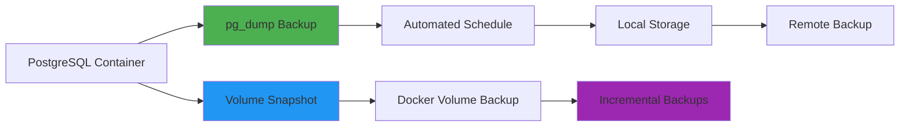

#### Матрица защиты от потери данных

| Сценарий | Риск потери | Защитная мера | Восстановление |
|----------|-------------|---------------|----------------|
| Пересборка контейнера | 🟢 Низкий | Named volumes | Автоматическое |
| Удаление docker-compose | 🟡 Средний | Bind mounts | Немедленное |
| Сбой файловой системы | 🔴 Высокий | Backup & replication | Ручное восстановление |
| Человеческая ошибка | 🟡 Средний | Version control + backups | Откат к backup |

### Дизайн CI/CD оптимизации

#### Стратегия развертывания без повторной загрузки

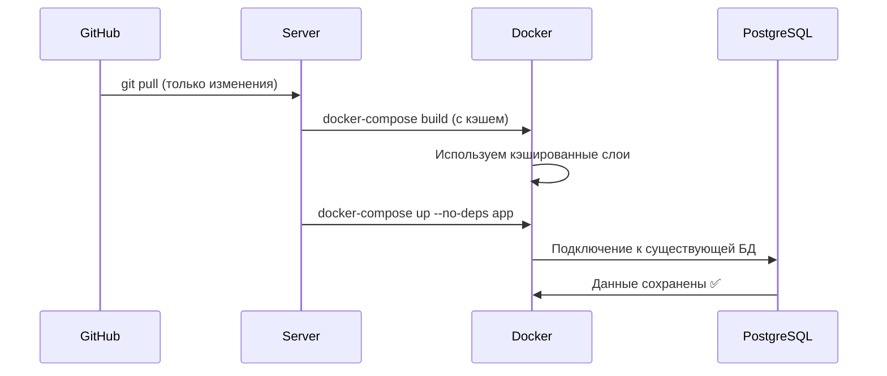

#### Правила развертывания без потерь

| Принцип | Реализация | Гарантия |
|---------|------------|----------|
| Immutable Infrastructure | Контейнеры как временные | Данные в volumes |
| Database Separation | PostgreSQL в отдельном контейнере | Независимое обновление |
| Graceful Shutdown | SIGTERM handling | Корректное закрытие соединений |
| Health Checks | Readiness/Liveness probes | Контролируемый запуск |

### Архитектура мониторинга персистентности

#### Система контроля целостности данных

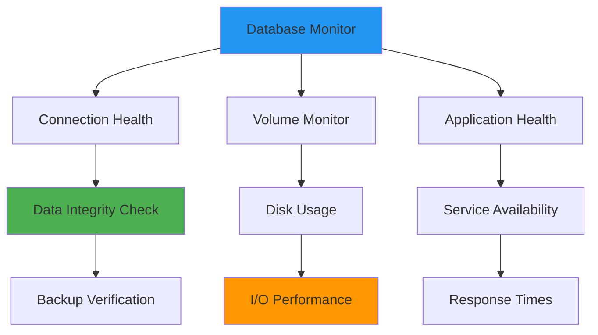

### Процедуры безопасного обновления

#### Пошаговый протокол развертывания

| Шаг | Действие | Проверка | Откат |
|-----|----------|----------|--------|
| 1 | Backup PostgreSQL | pg_dump успешен | - |
| 2 | Git pull changes | Нет конфликтов | git reset --hard |
| 3 | Build new image | Сборка успешна | Использовать предыдущий образ |
| 4 | Stop app container | Graceful shutdown | - |
| 5 | Start new container | Health check ✅ | docker-compose down && up |
| 6 | Verify database connection | Queries работают | Restore from backup |
| 7 | Run smoke tests | Все тесты ✅ | Полный откат |

### Архитектура отказоустойчивости

#### Многоуровневая защита данных

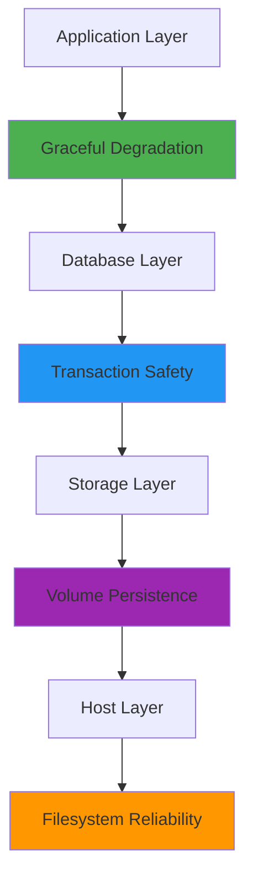

## Детальный план исправления на основе серверного отчета

### Анализ текущих проблем импортов

#### Файлы с проблемными импортами

| Файл | Строки | Проблемные импорты | Статус |
|------|--------|-------------------|--------|
| src/utils.py | 13-15, 251, 327 | Относительные импорты | 🔴 Критично |
| src/chat_history.py | 14-16 | Относительные импорты | 🔴 Критично |
| src/md_storage.py | 14-16 | Относительные импорты | 🔴 Критично |
| src/minio_manager.py | 23 | Относительные импорты | 🔴 Критично |

### Конкретные исправления по файлам

#### Исправления src/utils.py

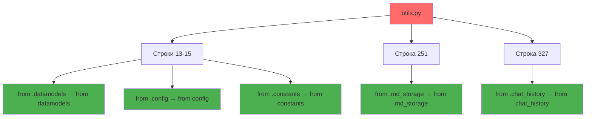

#### Детальная карта замен

| Файл | Исходный импорт | Целевой импорт | Строка |
|------|----------------|----------------|--------|
| utils.py | `from .datamodels import spinner_chars, OPENAI_AUDIO_EXTS` | `from datamodels import spinner_chars, OPENAI_AUDIO_EXTS` | 13 |
| utils.py | `from .config import ENC, TELEGRAM_MESSAGE_THRESHOLD, PREVIEW_TEXT_LENGTH, EMBEDDING_MODEL` | `from config import ENC, TELEGRAM_MESSAGE_THRESHOLD, PREVIEW_TEXT_LENGTH, EMBEDDING_MODEL` | 14 |
| utils.py | `from .constants import ERROR_FILE_SEND_FAILED` | `from constants import ERROR_FILE_SEND_FAILED` | 15 |
| utils.py | `from .md_storage import md_storage_manager` | `from md_storage import md_storage_manager` | 251 |
| utils.py | `from .chat_history import chat_history_manager` | `from chat_history import chat_history_manager` | 327 |
| chat_history.py | `from .config import CHAT_HISTORY_DIR` | `from config import CHAT_HISTORY_DIR` | 14 |
| chat_history.py | `from .constants import HISTORY_FILE_EXTENSION, INDEX_FILE_NAME` | `from constants import HISTORY_FILE_EXTENSION, INDEX_FILE_NAME` | 15 |
| chat_history.py | `from .utils import count_tokens` | `from utils import count_tokens` | 16 |
| md_storage.py | `from .config import MD_REPORTS_DIR` | `from config import MD_REPORTS_DIR` | 14 |
| md_storage.py | `from .constants import MD_FILE_PREFIX, MD_FILE_EXTENSION, INDEX_FILE_NAME` | `from constants import MD_FILE_PREFIX, MD_FILE_EXTENSION, INDEX_FILE_NAME` | 15 |
| md_storage.py | `from .utils import count_tokens` | `from utils import count_tokens` | 16 |
| minio_manager.py | `from .config import (...)` | `from config import (...)` | 23 |

### Дополнительные проблемы Docker

#### Анализ дублирования образов

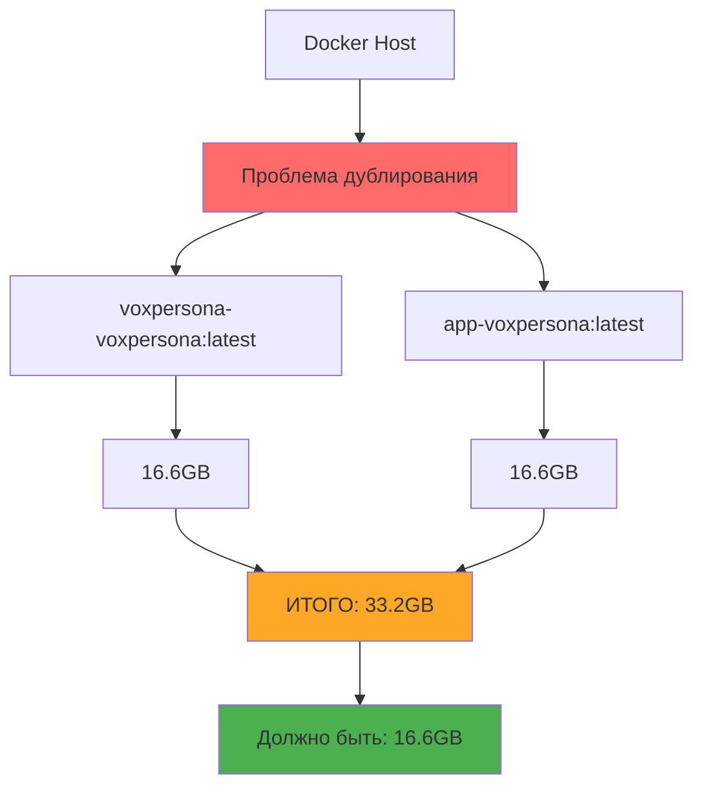

#### Проблемы docker-compose.yml

| Компонент | Текущее состояние | Проблема | Решение |
|-----------|------------------|----------|----------|
| MinIO Image | `minio/minio:RELEASE.2025-01-23T22-51-28Z` | 🔴 Будущая дата | `minio/minio:latest` |
| Compose Version | `version: '3.8'` | ⚠️ Устарело | Удалить строку |
| Project Name | Дублирование образов | 🟡 Неэффективность | Использовать единый COMPOSE_PROJECT_NAME |

### Пошаговый план экстренного исправления

#### Фаза 1: Критические исправления (15 минут)

```mermaid
gantt
    title График экстренного исправления
    dateFormat X
    axisFormat %s
    
    section Код
    Исправить импорты           :1, 5
    
    section Конфигурация
    MinIO version              :6, 2
    Удалить version: '3.8'     :8, 1
    
    section Git
    Коммит изменений           :9, 1
    Push в main                :10, 1
    
    section Развертывание
    GitHub Actions             :11, 5
    
    section Проверка
    Логи контейнера            :16, 1
```

#### Детальные команды исправления

| Шаг | Время | Действие | Команда/Изменение |
|-----|-------|----------|-------------------|
| 1 | 1 мин | utils.py строки 13-15 | Заменить относительные импорты |
| 2 | 1 мин | utils.py строки 251, 327 | Заменить функциональные импорты |
| 3 | 1 мин | chat_history.py строки 14-16 | Заменить относительные импорты |
| 4 | 1 мин | md_storage.py строки 14-16 | Заменить относительные импорты |
| 5 | 1 мин | minio_manager.py строка 23 | Заменить относительный импорт |
| 6 | 1 мин | docker-compose.yml строка 62 | `image: minio/minio:latest` |
| 7 | 1 мин | docker-compose.yml строка 1 | Удалить `version: '3.8'` |
| 8 | 1 мин | Git commit | `git add . && git commit -m "fix: replace relative imports"` |
| 9 | 1 мин | Git push | `git push origin main` |
| 10 | 3-5 мин | GitHub Actions | Автоматический APP_ONLY деплой |
| 11 | 1 мин | Проверка | `docker logs voxpersona_app` |

### Система мониторинга исправлений

#### Критерии успешного исправления

```mermaid
graph TD
    A[Развертывание] --> B[Проверка логов]
    B --> C{ImportError отсутствует?}
    C -->|Да| D[Проверка здоровья]
    C -->|Нет| E[Анализ ошибок]
    
    D --> F{Все сервисы работают?}
    F -->|Да| G[Успешное исправление ✅]
    F -->|Нет| H[Диагностика сервисов]
    
    E --> I[Откат к предыдущей версии]
    H --> I
    
    style G fill:#4caf50
    style I fill:#ff6b6b
```

#### Метрики успеха

| Метрика | Целевое значение | Команда проверки |
|---------|------------------|------------------|
| Статус контейнера | `Up X minutes` | `docker ps \| grep voxpersona_app` |
| Отсутствие ImportError | 0 ошибок | `docker logs voxpersona_app \| grep ImportError` |
| Время запуска | < 2 минут | Timestamp первого лога |
| Размер образа | ≤ 16.6GB | `docker images \| grep voxpersona` |
| Подключение к БД | Успешно | `docker logs voxpersona_app \| grep "Connected to database"` |

### План последующих действий

#### Фаза 2: Оптимизация (не критично)

```mermaid
graph LR
    A[Удаление дублей] --> B[Очистка образов]
    B --> C[Проверка COMPOSE_PROJECT_NAME]
    C --> D[Оптимизация размера]
    D --> E[Настройка мониторинга]
    
    style A fill:#ff9800
    style E fill:#2196f3
```

#### Долгосрочные улучшения

| Приоритет | Задача | Срок | Польза |
|-----------|--------|------|--------|
| 🔴 Высокий | Pre-commit hooks для импортов | 1 неделя | Предотвращение повторных ошибок |
| 🟡 Средний | Локальное тестирование Docker | 2 недели | Ранняя диагностика |
| 🟢 Низкий | Переход на Python пакеты | 1 месяц | Архитектурная чистота |
| 🟢 Низкий | Оптимизация размера образа | 1 месяц | Экономия ресурсов |

### Процедуры аварийного восстановления

#### Сценарии отката

```mermaid
graph TD
    A[Обнаружена проблема] --> B{Тип проблемы}
    B -->|ImportError| C[Быстрый откат кода]
    B -->|Падение БД| D[Восстановление данных]
    B -->|Сетевые проблемы| E[Диагностика инфраструктуры]
    
    C --> F[git revert HEAD]
    C --> G[GitHub Actions rollback]
    
    D --> H[Restore from backup]
    D --> I[Restart DB container]
    
    E --> J[Check network connectivity]
    E --> K[Restart networking]
    
    style A fill:#ff6b6b
    style F fill:#4caf50
    style H fill:#2196f3
```

### Технические детали реализации

#### Команды для экстренного исправления

```bash
# Команды для немедленного выполнения
ssh root@172.237.73.207 "docker ps | grep voxpersona_app"  # Статус
ssh root@172.237.73.207 "docker logs voxpersona_app"       # Логи
ssh root@172.237.73.207 "docker rmi app-voxpersona:latest" # Удаление дубля
```

#### Автоматизированная проверка

```bash
# Скрипт проверки после деплоя
#!/bin/bash
echo "Проверка статуса VoxPersona..."
STATUS=$(docker ps --filter "name=voxpersona_app" --format "{{.Status}}")
echo "Статус контейнера: $STATUS"

ERRORS=$(docker logs voxpersona_app 2>&1 | grep -c "ImportError")
echo "Количество ImportError: $ERRORS"

if [ $ERRORS -eq 0 ]; then
    echo "✅ Исправление успешно!"
else
    echo "❌ Остались ошибки импорта"
fi
```