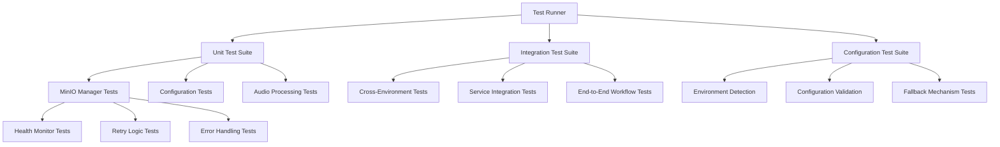
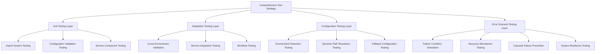
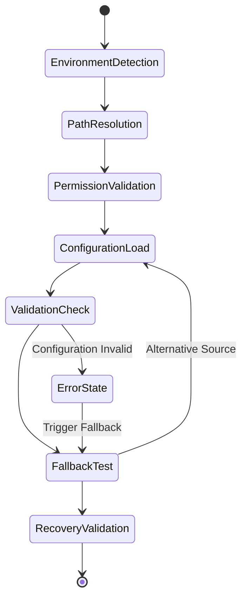
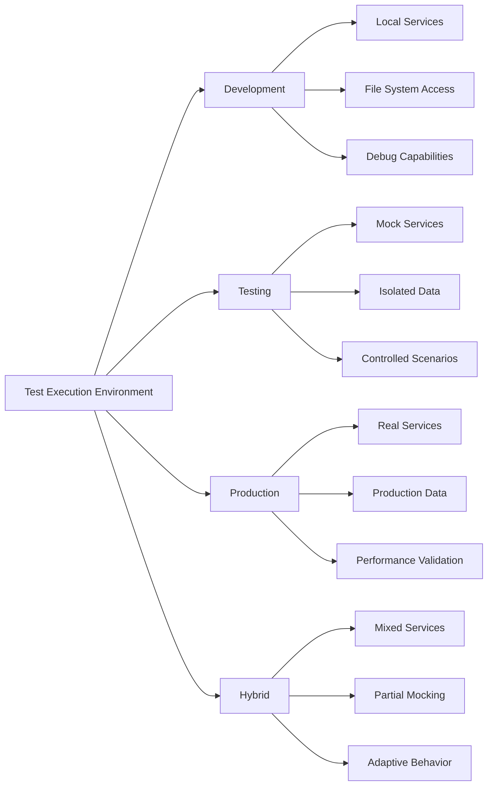
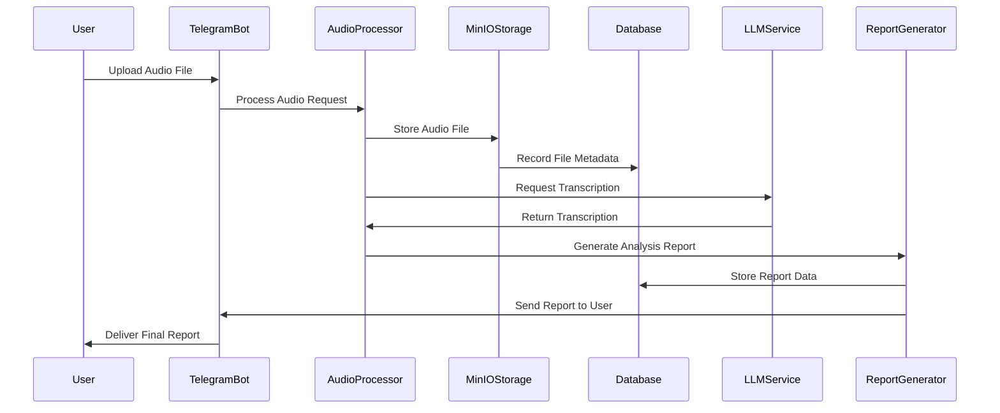
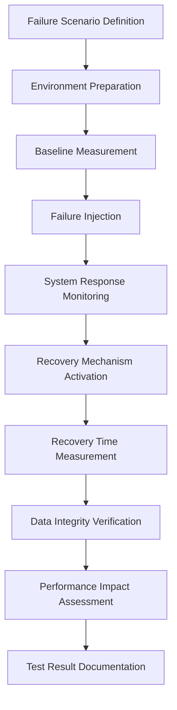
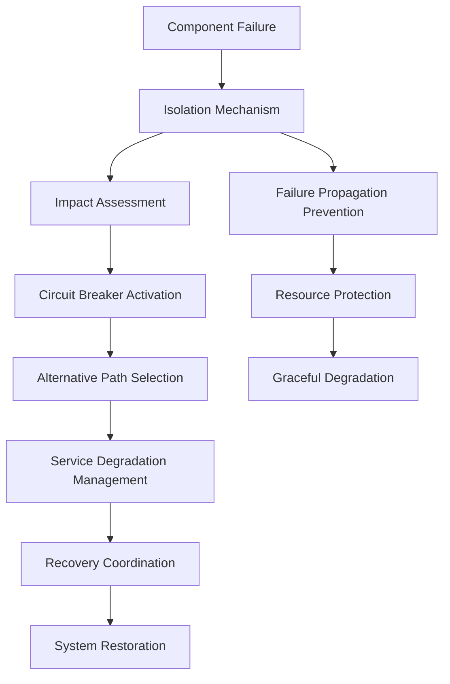
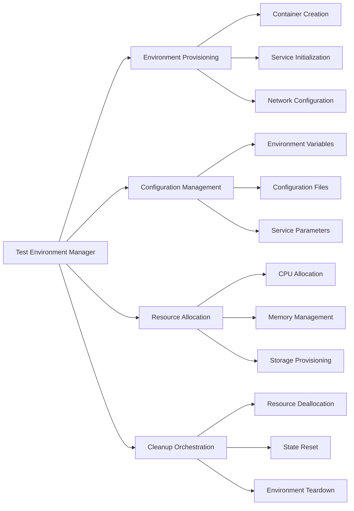
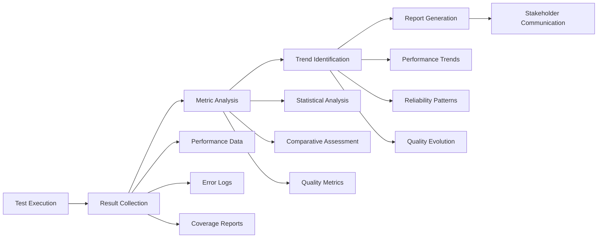
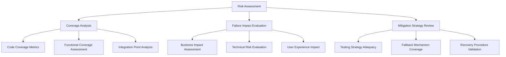

# Comprehensive Testing Strategy Implementation for VoxPersona

## Overview

This document defines a comprehensive testing strategy for the VoxPersona audio analysis application, focusing on enhanced unit testing, configuration validation, integration testing across multiple environments, and error scenario testing with robust fallback mechanisms.

## Technology Stack & Testing Dependencies

The VoxPersona application utilizes Python with the following testing frameworks:
- **Unit Testing**: unittest (standard library)
- **Mocking**: unittest.mock for service isolation
- **Environment Management**: python-dotenv for test configurations
- **Integration Testing**: Custom test harnesses for MinIO and database integration
- **Test Orchestration**: Custom test runner with parallel execution capabilities

## Architecture

### Current Testing Infrastructure

### Enhanced Testing Architecture

## Enhanced Unit Testing Strategy

### Import System Testing

The application's modular import system requires comprehensive testing across different deployment contexts and environment configurations.

| Test Category | Description | Validation Points |
|---------------|-------------|-------------------|
| Environment-Specific Imports | Test module imports in development, testing, and production environments | Module availability, dependency resolution, version compatibility |
| Fallback Import Mechanisms | Validate alternative import paths when primary modules are unavailable | Graceful degradation, error handling, alternative implementations |
| Cross-Platform Import Validation | Ensure consistent import behavior across operating systems | Path resolution, module discovery, platform-specific dependencies |
| Dynamic Import Testing | Test runtime module loading and configuration-based imports | Module initialization, dependency injection, configuration binding |

#### Import Testing Methodology

### Configuration Validation Testing

The configuration system requires robust testing to ensure accurate environment detection, dynamic path resolution, and proper fallback mechanisms.

| Configuration Area | Testing Focus | Expected Behavior |
|-------------------|---------------|-------------------|
| Environment Detection | Multi-method detection accuracy | Correct identification of development, test, and production contexts |
| Dynamic Path Resolution | Context-aware path construction | Appropriate directory structures for each environment |
| Permission Handling | Access control validation | Proper fallback when directories are inaccessible |
| Fallback Configuration | Alternative configuration sources | Seamless degradation when primary configuration fails |

#### Configuration Testing Flow

## Integration Testing Strategy

### Cross-Environment Validation

Integration testing validates system behavior across multiple deployment contexts, ensuring consistent functionality regardless of the execution environment.

| Environment Type | Test Scenarios | Validation Criteria |
|-----------------|----------------|-------------------|
| Development Environment | Local development setup, file system access, debugging capabilities | Module loading, configuration parsing, development tool integration |
| Testing Environment | Isolated test containers, mock services, controlled data sets | Test data isolation, service mocking, reproducible results |
| Production Environment | Production-like containers, real service connections, production data patterns | Performance benchmarks, security compliance, scalability validation |
| Hybrid Environments | Mixed local and remote services, partial mock implementations | Service discovery, connection management, graceful degradation |

#### Environment Testing Matrix

### Service Integration Testing

Comprehensive validation of inter-service communication, data flow, and system coordination across all application components.

| Integration Point | Test Coverage | Success Metrics |
|------------------|---------------|-----------------|
| Telegram Bot API | Message handling, user authentication, session management | Response time < 2s, 99.9% uptime, proper error messaging |
| PostgreSQL Database | Data persistence, query performance, transaction integrity | Query response < 100ms, ACID compliance, connection pooling |
| MinIO Object Storage | File upload/download, metadata management, health monitoring | File integrity verification, 99.99% availability, automatic recovery |
| LLM API Integration | Request processing, response parsing, error handling | Successful transcription rate > 95%, proper error classification |

### End-to-End Workflow Testing

Complete workflow validation from user input to final report generation, ensuring system coherence and data integrity.

## Error Scenario Testing Strategy

### Failure Condition Simulation

Systematic testing of system behavior under various failure conditions to validate resilience and recovery mechanisms.

| Failure Type | Simulation Method | Expected Recovery Behavior |
|--------------|------------------|---------------------------|
| Network Connectivity Loss | Connection interruption, timeout simulation | Automatic retry with exponential backoff, graceful degradation |
| Service Unavailability | Service shutdown, resource exhaustion | Fallback service activation, error notification, queue management |
| Database Connection Failure | Connection pool exhaustion, database downtime | Connection retry logic, cached data utilization, transaction rollback |
| Storage System Failure | MinIO unavailability, disk space exhaustion | Alternative storage activation, data migration, integrity verification |
| API Rate Limiting | Request throttling, quota exhaustion | Request queuing, rate limiting compliance, alternative endpoints |

#### Failure Testing Methodology

### Recovery Mechanism Testing

Validation of automatic recovery systems, ensuring rapid restoration of service functionality following failure events.

| Recovery Mechanism | Test Scenarios | Success Criteria |
|-------------------|----------------|------------------|
| Automatic Service Restart | Process crash, memory exhaustion | Service restoration within 30 seconds, state preservation |
| Database Connection Recovery | Connection timeout, network partition | Connection re-establishment, query continuation, data consistency |
| MinIO Health Monitoring | Storage service disruption, network issues | Health status detection, alternative storage activation, data synchronization |
| API Fallback Systems | Primary API failure, quota exhaustion | Secondary API activation, request routing, response format consistency |

### Cascade Failure Prevention

Testing system resilience against cascading failures, ensuring isolated component failures do not compromise overall system stability.

## Test Execution Framework

### Parallel Test Execution Strategy

Optimized test execution through intelligent parallelization, reducing overall test suite runtime while maintaining result accuracy.

| Execution Category | Parallelization Approach | Resource Management |
|-------------------|-------------------------|-------------------|
| Unit Tests | Process-level parallelization | CPU-bound optimization, memory isolation |
| Integration Tests | Container-based isolation | Network namespace separation, resource quotas |
| End-to-End Tests | Sequential execution with staging | Environment coordination, data consistency |
| Performance Tests | Controlled concurrency | Resource monitoring, baseline comparison |

### Test Environment Management

Comprehensive environment management ensuring consistent, reproducible test conditions across all testing scenarios.

### Test Data Management

Systematic approach to test data creation, management, and cleanup ensuring data consistency and test isolation.

| Data Category | Management Strategy | Lifecycle Control |
|---------------|-------------------|-------------------|
| Synthetic Audio Files | Programmatic generation, format variation | Creation per test, automatic cleanup |
| Configuration Sets | Template-based generation, environment-specific | Version control, rollback capabilities |
| Mock Service Responses | Scenario-based response definition | Dynamic generation, response validation |
| Database Test Data | Transaction-based isolation, rollback cleanup | Setup per test, automatic teardown |

## Test Monitoring and Reporting

### Performance Metrics Collection

Comprehensive performance monitoring during test execution, capturing system behavior and resource utilization patterns.

| Metric Category | Collection Method | Analysis Focus |
|-----------------|------------------|----------------|
| Response Time Metrics | Request/response timing, operation duration | Performance regression detection, bottleneck identification |
| Resource Utilization | CPU, memory, network, storage monitoring | Resource efficiency, capacity planning |
| Error Rate Analysis | Error frequency, error type classification | System reliability, failure pattern identification |
| Throughput Measurement | Request processing rate, data transfer volume | Scalability assessment, performance optimization |

### Test Result Documentation

Structured documentation of test results, enabling comprehensive analysis and continuous improvement of system quality.

## Quality Assurance Integration

### Continuous Testing Pipeline

Integration of comprehensive testing into the development workflow, ensuring continuous quality validation throughout the software lifecycle.

| Pipeline Stage | Testing Integration | Quality Gates |
|----------------|-------------------|---------------|
| Code Commit | Unit test execution, static analysis | Code coverage > 80%, zero critical issues |
| Pull Request | Integration test suite, security scanning | All tests pass, performance within baseline |
| Staging Deployment | End-to-end testing, performance validation | User acceptance criteria met, stability confirmed |
| Production Release | Smoke testing, monitoring activation | Zero critical failures, performance monitoring active |

### Risk Assessment Framework

Systematic evaluation of testing coverage and system risk, ensuring comprehensive protection against potential failures.

