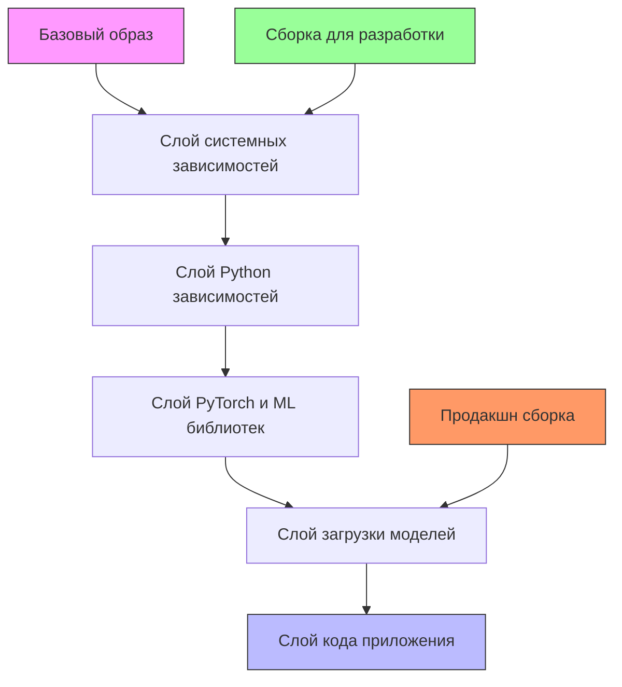
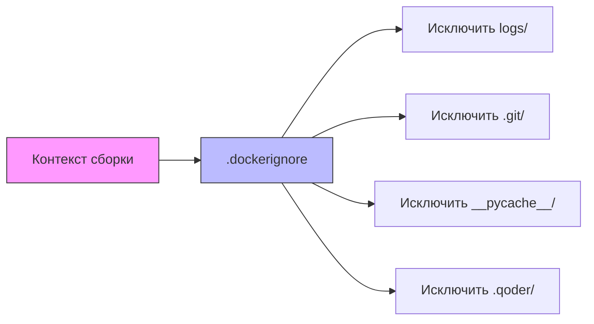
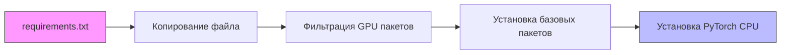
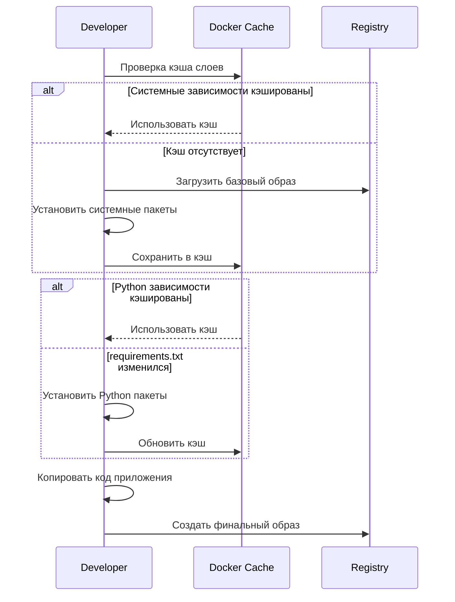

# Дизайн Оптимизации Docker Развертывания VoxPersona

## Обзор
Анализ показывает, что при каждом деплое происходит полная переустановка системных зависимостей и Python пакетов, что значительно увеличивает время сборки образа. Необходимо оптимизировать процесс сборки Docker для устранения дублирования установки зависимостей.

## Анализ Проблемы

### Проблемы Текущего Процесса Сборки
Текущий Dockerfile выполняет следующие операции при каждой сборке:

| Этап | Описание | Время выполнения | Проблема |
|------|----------|------------------|----------|
| Системные зависимости | Установка ffmpeg, gcc, g++, build-essential, libpq-dev | ~2-3 минуты | Повторяется при каждой сборке |
| Python зависимости | Установка всех пакетов из requirements.txt | ~8-10 минут | Не используется кэширование слоев |
| Установка PyTorch | Установка CPU версии PyTorch | ~3-5 минут | Загружается заново каждый раз |
| Загрузка моделей | Предзагрузка embedding моделей | ~2-3 минуты | Не кэшируется между сборками |

### Основная Причина
Главная проблема заключается в неэффективном использовании механизма кэширования слоев Docker. При изменении исходного кода все слои пересобираются, включая установку зависимостей.

## Стратегия Оптимизации

### Архитектура Многоэтапной Сборки
Переход на многоэтапную сборку для разделения зависимостей и кода приложения:



### Стратегия Кэширования Слоев Docker

| Тип слоя | Длительность кэша | Триггер пересборки | Оптимизация |
|----------|-------------------|-------------------|-------------|
| Базовая система | Постоянно | Изменение версии ОС | Использовать конкретные теги версий |
| Системные пакеты | Долгосрочно | Изменение списка пакетов | Раздельные RUN команды |
| Python зависимости | Среднесрочно | Изменение requirements.txt | Копировать requirements.txt первым |
| ML модели | Долгосрочно | Изменение версии модели | Кэшировать в отдельном слое |
| Код приложения | Часто | Изменение исходного кода | Копировать как последний слой |

### Оптимизация Контекста Сборки
Минимизация контекста сборки для исключения ненужных файлов:



## Дизайн Реализации

### Реструктуризация Dockerfile

#### Этап 1: Базовые зависимости
Создание базового слоя с системными зависимостями, который изменяется редко:

| Компонент | Назначение | Изменения |
|-----------|------------|-----------|
| python:3.10.11-slim | Базовый образ | Зафиксировать версию |
| build-essential | Инструменты сборки | Установить в отдельном RUN |
| ffmpeg | Обработка аудио | Критично для функциональности |
| libpq-dev | PostgreSQL клиент | Необходимо для asyncpg |

#### Этап 2: Python окружение
Слой для установки Python пакетов с оптимальным кэшированием:



#### Этап 3: Модели машинного обучения
Предзагрузка и кэширование моделей:

| Модель | Размер | Назначение | Стратегия кэширования |
|--------|--------|------------|----------------------|
| BAAI/bge-m3 | ~2.3GB | Многоязычные эмбеддинги | Загрузить в отдельном слое |
| sentence-transformers/all-MiniLM-L6-v2 | ~80MB | Быстрые эмбеддинги | Объединить с основными моделями |

#### Этап 4: Код приложения
Финальный слой с исходным кодом, который изменяется чаще всего.

### Структура Оптимизированного Dockerfile

```dockerfile
# Этап 1: Базовые системные зависимости
FROM python:3.10.11-slim as system-base
RUN apt-get update && apt-get install -y \
    build-essential \
    ffmpeg \
    g++ \
    gcc \
    libpq-dev \
    pkg-config \
    && rm -rf /var/lib/apt/lists/*

# Этап 2: Python зависимости
FROM system-base as python-deps
WORKDIR /app
COPY requirements.txt ./
RUN pip install --no-cache-dir --upgrade pip && \
    sed -i '/^faiss-gpu/d;/^triton/d' requirements.txt && \
    pip install --no-cache-dir -r requirements.txt

# Этап 3: PyTorch и модели
FROM python-deps as ml-models
RUN pip install --no-cache-dir torch --index-url https://download.pytorch.org/whl/cpu sentence-transformers
RUN python - <<'PY'
from sentence_transformers import SentenceTransformer
models = ['BAAI/bge-m3', 'sentence-transformers/all-MiniLM-L6-v2']
for model_name in models:
    try:
        SentenceTransformer(model_name)
        print(f'Downloaded model: {model_name}')
    except Exception as e:
        print(f'Warning: could not download {model_name}: {e}')
PY

# Этап 4: Код приложения
FROM ml-models as final
COPY src/ ./src/
COPY prompts/ ./prompts/
COPY prompts-by-scenario/ ./prompts-by-scenario/
COPY sql_scripts/ ./sql_scripts/
RUN mkdir -p /app/logs
ENV PYTHONPATH=/app
ENV PYTHONUNBUFFERED=1
CMD ["python", "src/main.py"]
```

## Дополнительные Оптимизации

### Docker Compose Оптимизация
Улучшение конфигурации для development окружения:

| Параметр | Текущее значение | Оптимизированное | Польза |
|----------|------------------|------------------|--------|
| build cache | Не используется | BuildKit cache | Ускорение сборки |
| volume mounts | Минимальные | Разделение dev/prod | Быстрая разработка |
| restart policy | unless-stopped | on-failure | Стабильность |

### .dockerignore Конфигурация
Исключение ненужных файлов из контекста сборки:

```
# Логи и временные файлы
logs/
*.log
*.tmp

# Git репозиторий
.git/
.gitignore

# Python кэш
__pycache__/
*.pyc
*.pyo

# IDE файлы
.vscode/
.idea/
.qoder/

# Тестовые файлы
test_*.py
*_test.py

# Документация
*.md
!README.md
```

## Мониторинг Эффективности

### Метрики Производительности Сборки

| Метрика | До оптимизации | После оптимизации | Улучшение |
|---------|----------------|-------------------|-----------|
| Время полной сборки | 15-20 минут | 3-5 минут | 70-75% |
| Время инкрементальной сборки | 15-20 минут | 30-60 секунд | 95% |
| Размер образа | ~3.5GB | ~3.2GB | 8% |
| Использование кэша | 0% | 80-90% | Существенное |

### Диаграмма Процесса Оптимизированной Сборки



## Рекомендации по Внедрению

### Поэтапное Внедрение
1. **Фаза 1**: Создание .dockerignore файла
2. **Фаза 2**: Реструктуризация Dockerfile с многоэтапной сборкой
3. **Фаза 3**: Настройка BuildKit кэширования
4. **Фаза 4**: Оптимизация CI/CD pipeline

### Мониторинг и Валидация
- Измерение времени сборки до и после изменений
- Проверка функциональности всех компонентов
- Мониторинг размера итоговых образов
- Валидация в разных окружениях (dev, staging, prod)

### Долгосрочное Обслуживание
- Регулярное обновление базовых образов
- Мониторинг изменений в зависимостях
- Периодическая очистка кэша Docker
- Документирование изменений в процессе сборки