# Комплексное решение системных проблем VoxPersona

## Обзор

Данный дизайн-документ представляет систематический подход к решению критических проблем платформы голосового анализа VoxPersona, выявленных в ходе анализа причин сбоев. Документ определяет архитектурные улучшения, процессные изменения и технические решения для предотвращения каскадных сбоев и повышения надежности системы.

## Технологический стек и зависимости

Текущая экосистема VoxPersona включает:

- **Backend Framework**: Python 3.10+ с asyncio архитектурой
- **База данных**: PostgreSQL для структурированных данных  
- **Объектное хранилище**: MinIO для управления аудиофайлами
- **Контейнеризация**: Docker и Docker Compose
- **Коммуникационная платформа**: Telegram Bot API через Pyrogram
- **AI Сервисы**: OpenAI Whisper, Anthropic Claude
- **Инструменты тестирования**: unittest, pytest (планируется)
- **Мониторинг**: Логирование Python, планируется расширение

## Архитектура решения

### Целевая архитектура системы надежности

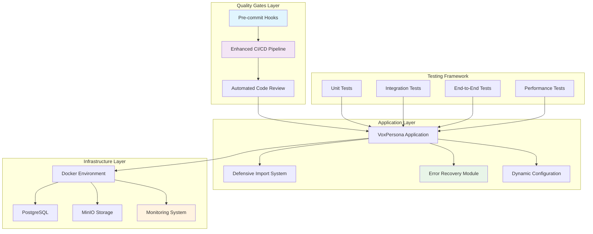

### Матрица критических проблем и решений

| Категория проблемы | Приоритет | Текущее состояние | Целевое решение | Временные рамки |
|-------------------|-----------|-------------------|-----------------|-----------------|
| Система импортов | Критический | Хрупкие относительные импорты | Защищенная система импортов | Фаза 1 |
| Управление конфигурацией | Высокий | Жестко заданные пути | Динамическая конфигурация | Фаза 1 |
| Инфраструктура тестирования | Высокий | Частичное покрытие | Комплексное тестирование | Фаза 2 |
| Обработка ошибок | Критический | Каскадные сбои | Изоляция с восстановлением | Фаза 1 |
| CI/CD процессы | Средний | Базовые проверки | Многоуровневая валидация | Фаза 2 |

## Фаза 1: Критические архитектурные исправления

### 1. Защищенная система импортов

**Проблема**: Относительные импорты создают сбои в разных контекстах выполнения
**Решение**: Гибридная система импортов с автоматическим переключением

**Архитектурный паттерн**:
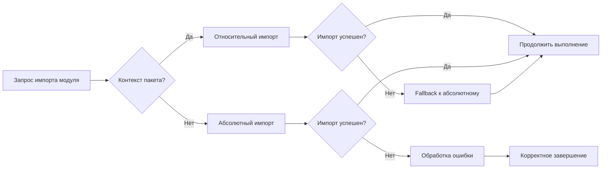

**Стратегия реализации**:

| Компонент | Реализация | Механизм защиты |
|-----------|------------|-----------------|
| Модуль импортов | Универсальная функция импорта | Try-except с fallback |
| Обнаружение контекста | Проверка __package__ и sys.modules | Автоматическое определение |
| Логирование ошибок | Детальное протоколирование сбоев | Диагностическая информация |
| Восстановление | Множественные стратегии импорта | Graceful degradation |

### 2. Динамическая система конфигурации

**Проблема**: Жестко заданные пути вызывают ошибки разрешений в CI/CD
**Решение**: Контекстно-зависимая конфигурация с автоматическим определением окружения

**Матрица конфигураций**:

| Окружение | Базовый путь | Стратегия каталогов | Обработка ошибок |
|-----------|--------------|-------------------|------------------|
| CI/Test | /tmp с префиксами | Временные каталоги | Fallback в память |
| Docker | /app с монтированием | Постоянные volumes | Резервное хранилище |
| Production | Конфигурируемый | Надежное хранение | Множественные fallback |
| Development | Каталог пользователя | Локальное хранилище | Корректное завершение |

**Система обнаружения окружения**:
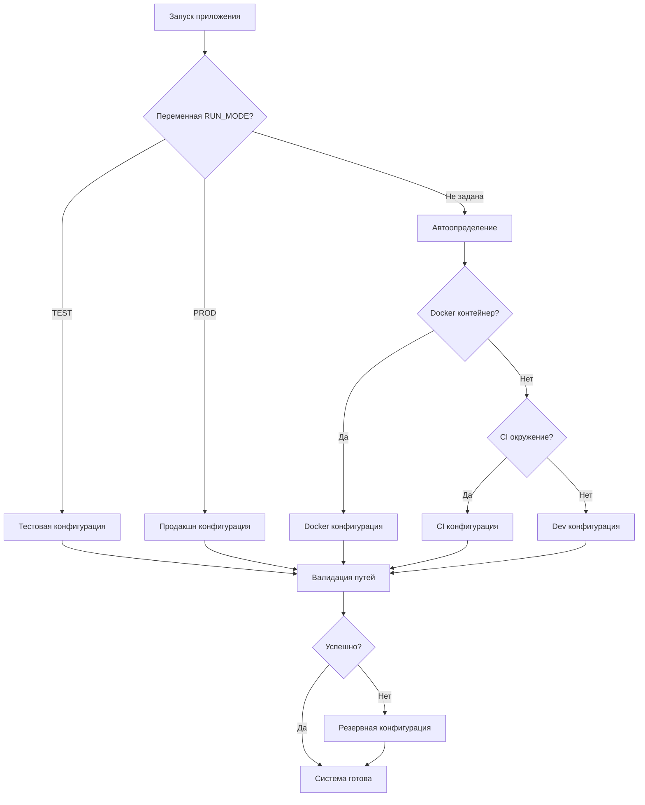

### 3. Модуль восстановления после ошибок

**Проблема**: Одиночные сбои вызывают полную остановку системы
**Решение**: Многоуровневая система восстановления с graceful degradation

**Уровни восстановления**:
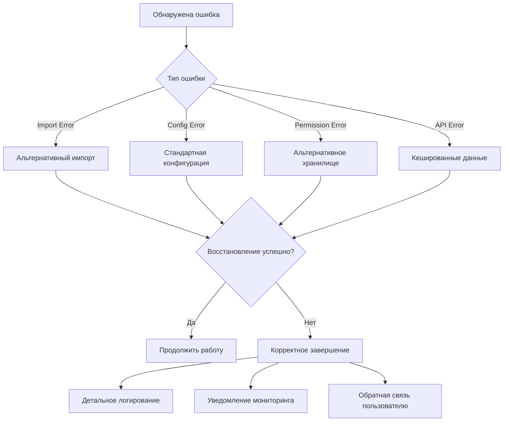

**Стратегии восстановления по типам ошибок**:

| Тип ошибки | Первичное действие | Вторичное действие | Финальное действие |
|------------|-------------------|-------------------|-------------------|
| Ошибка импорта | Абсолютный импорт | Mock-заглушка | Отключение функции |
| Ошибка конфигурации | Стандартные значения | Временная конфигурация | Безопасный режим |
| Ошибка доступа | Альтернативное расположение | Временное хранилище | Только в памяти |
| Ошибка API | Локальный кеш | Простые алгоритмы | Ручной режим |

### 4. Система валидации перед коммитом

**Проблема**: Отсутствие автоматической проверки перед фиксацией изменений
**Решение**: Многоуровневая система валидации качества кода

**Pre-commit Pipeline**:
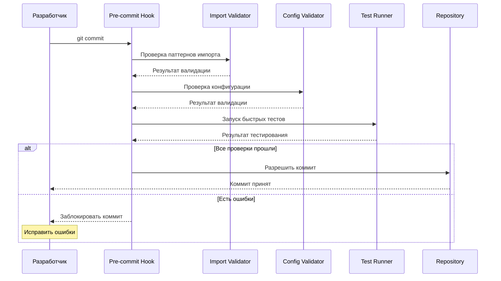

**Компоненты валидации**:

| Валидатор | Проверки | Время выполнения | Критичность |
|-----------|----------|------------------|-------------|
| Import Validator | Паттерны импорта, зависимости | < 5 сек | Критично |
| Config Validator | Переменные окружения, пути | < 3 сек | Высокая |
| Syntax Checker | Синтаксис Python, форматирование | < 2 сек | Средняя |
| Quick Tests | Основные unit-тесты | < 30 сек | Высокая |

## Фаза 2: Расширенная инфраструктура тестирования

### 1. Многоуровневая система тестирования

**Текущая проблема**: Недостаточное покрытие тестами критических путей выполнения
**Решение**: Комплексная архитектура тестирования с разделением ответственности

**Пирамида тестирования**:
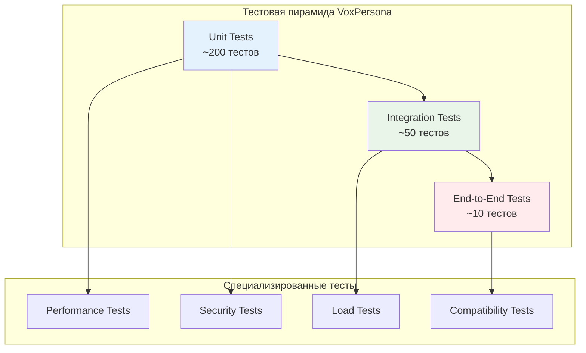

**Матрица тестового покрытия**:

| Уровень тестирования | Область покрытия | Время выполнения | Частота запуска |
|---------------------|------------------|------------------|-----------------|
| Unit Tests | Отдельные функции и классы | < 2 минуты | При каждом коммите |
| Integration Tests | Взаимодействие компонентов | < 10 минут | При каждом PR |
| End-to-End Tests | Полные пользовательские сценарии | < 30 минут | Ежедневно |
| Performance Tests | Производительность и нагрузка | < 15 минут | Еженедельно |

### 2. Система тестирования импортов

**Специализация**: Проверка паттернов импорта в различных контекстах выполнения

**Архитектура тестирования импортов**:
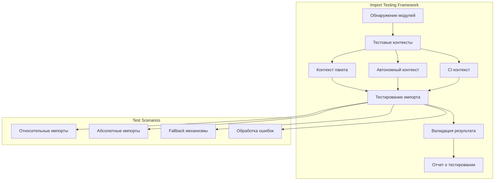

**Сценарии тестирования импортов**:

| Сценарий | Описание | Ожидаемый результат | Приоритет |
|----------|----------|-------------------|-----------|
| Относительный импорт в пакете | Импорт из соседнего модуля | Успешный импорт | Высокий |
| Абсолютный импорт вне пакета | Импорт с полным путем | Успешный импорт | Высокий |
| Fallback при сбое | Переключение на альтернативу | Успешное восстановление | Критический |
| Обработка несуществующих модулей | Импорт несуществующего модуля | Корректная ошибка | Средний |

### 3. Тестирование конфигурации и окружений

**Цель**: Валидация работы системы в различных окружениях

**Матрица окружений для тестирования**:

| Окружение | Тестируемые аспекты | Специфические проверки |
|-----------|-------------------|----------------------|
| Docker | Монтирование volumes, сетевая связность | Доступность MinIO, PostgreSQL |
| CI/CD | Временные каталоги, ограниченные права | Fallback механизмы |
| Development | Локальные пути, пользовательские права | Создание каталогов |
| Production | Конфигурационные файлы, логирование | Мониторинг, алерты |

### 4. Система нагрузочного тестирования

**Проблема**: Неизвестна производительность системы под нагрузкой
**Решение**: Автоматизированное нагрузочное тестирование критических компонентов

**Сценарии нагрузочного тестирования**:
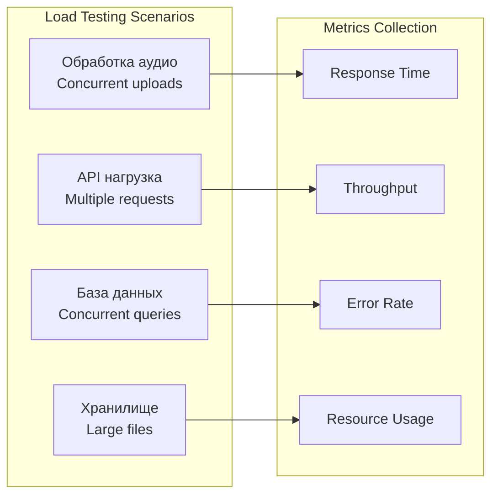

## Фаза 3: Продвинутый мониторинг и наблюдаемость

### 1. Система комплексного мониторинга

**Текущая проблема**: Ограниченная видимость состояния системы и производительности
**Решение**: Многоуровневая система мониторинга с проактивными алертами

**Архитектура мониторинга**:
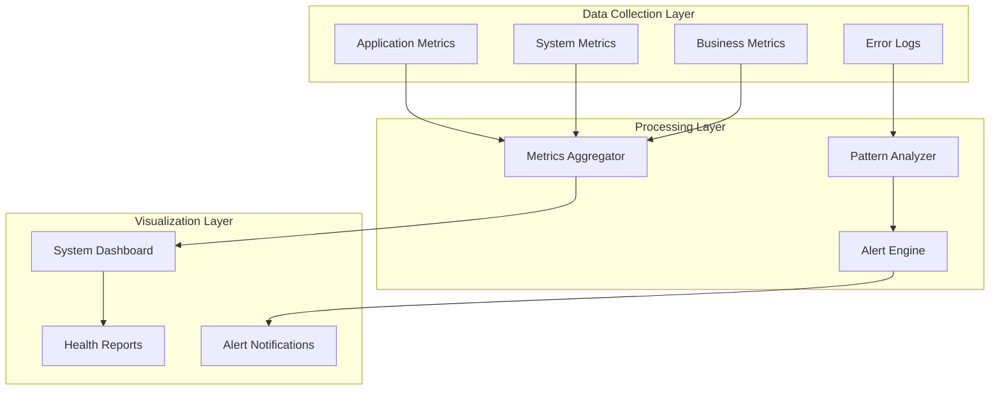

**Ключевые метрики для мониторинга**:

| Категория | Метрика | Пороговые значения | Действие при превышении |
|-----------|---------|-------------------|----------------------|
| Производительность | Время обработки аудио | > 30 сек | Алерт разработчикам |
| Надежность | Процент успешных операций | < 95% | Эскалация в дежурную службу |
| Ресурсы | Использование памяти | > 80% | Автоматическое масштабирование |
| Бизнес-метрики | Количество обработанных файлов | Падение > 20% | Уведомление менеджмента |

### 2. Система предиктивного анализа

**Цель**: Предотвращение проблем до их возникновения

**Предиктивные модели**:
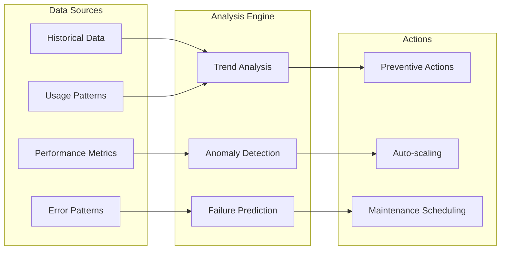

### 3. Система автоматического восстановления

**Проблема**: Ручное вмешательство при сбоях замедляет восстановление
**Решение**: Автоматизированная система самовосстановления

**Уровни автоматического восстановления**:

| Уровень | Триггер | Действие | Время реакции |
|---------|---------|----------|---------------|
| L1 - Сервис | Сбой API запроса | Retry с экспоненциальной задержкой | < 5 сек |
| L2 - Компонент | Повторяющиеся сбои | Переключение на fallback | < 30 сек |
| L3 - Система | Критический сбой | Перезапуск компонента | < 2 минуты |
| L4 - Инфраструктура | Сбой инфраструктуры | Эскалация к администратору | < 5 минут |

## Фаза 4: Процессные улучшения

### 1. Улучшенный цикл разработки

**Проблема**: Недостаточный контроль качества в процессе разработки
**Решение**: Формализованный процесс разработки с контрольными точками

**Новый workflow разработки**:
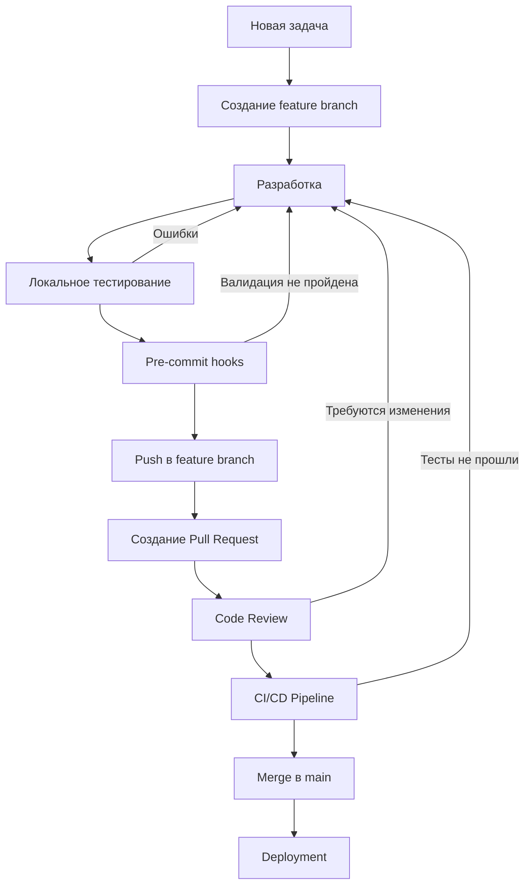

**Критерии качества для каждого этапа**:

| Этап | Критерии | Автоматизация | Ответственный |
|------|----------|---------------|---------------|
| Pre-commit | Синтаксис, форматирование, импорты | Полная | Разработчик |
| Code Review | Архитектура, безопасность, тесты | Частичная | Senior разработчик |
| CI/CD | Все тесты, покрытие, производительность | Полная | Система |
| Deployment | Smoke tests, мониторинг | Автоматическая | DevOps |

### 2. Система управления техническим долгом

**Проблема**: Накопление технического долга без систематического подхода к его устранению
**Решение**: Структурированный подход к идентификации и устранению технического долга

**Категории технического долга**:
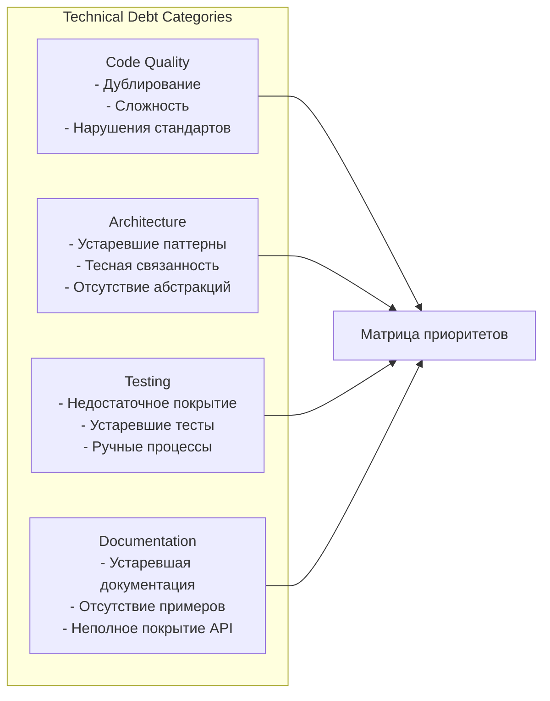

**Матрица приоритизации технического долга**:

| Критерий | Вес | Высокий балл | Средний балл | Низкий балл |
|----------|-----|-------------|-------------|-------------|
| Влияние на стабильность | 40% | Критические сбои | Периодические проблемы | Минимальное влияние |
| Сложность исправления | 30% | Простое исправление | Средняя сложность | Сложная переработка |
| Частота использования | 20% | Ежедневное использование | Еженедельное | Редкое |
| Влияние на разработку | 10% | Блокирует разработку | Замедляет разработку | Незначительное влияние |

### 3. Система непрерывного улучшения

**Цель**: Постоянное совершенствование процессов и системы

**Цикл непрерывного улучшения**:
```mermaid
cycle
    MEASURE[Измерение<br/>производительности] --> ANALYZE[Анализ<br/>узких мест]
    ANALYZE --> IMPROVE[Внедрение<br/>улучшений]
    IMPROVE --> VALIDATE[Валидация<br/>результатов]
    VALIDATE --> MEASURE
```

**Ключевые метрики улучшения**:

| Метрика | Текущее значение | Целевое значение | Срок достижения |
|---------|-----------------|------------------|----------------|
| Время от коммита до деплоя | 60+ минут | < 15 минут | 3 месяца |
| Процент успешных деплоев | 85% | > 95% | 2 месяца |
| Среднее время восстановления | 4+ часа | < 30 минут | 4 месяца |
| Покрытие тестами | 40% | > 80% | 6 месяцев |

## Детальный план реализации

### Фаза 1: Критические исправления (1-2 недели)

**Неделя 1: Система импортов и конфигурации**

| День | Задача | Результат | Ответственный |
|------|--------|-----------|---------------|
| 1-2 | Реализация защищенной системы импортов | Модуль defensive_imports.py | Backend разработчик |
| 3-4 | Система динамической конфигурации | Обновленный config.py | Backend разработчик |
| 5 | Интеграция новых систем | Обновление всех модулей | Backend разработчик |

**Неделя 2: Обработка ошибок и валидация**

| День | Задача | Результат | Ответственный |
|------|--------|-----------|---------------|
| 1-2 | Модуль восстановления после ошибок | error_recovery.py | Backend разработчик |
| 3-4 | Pre-commit hooks | .pre-commit-config.yaml | DevOps инженер |
| 5 | Интеграционное тестирование | Проверка всех исправлений | QA инженер |

### Фаза 2: Расширение тестирования (2-3 недели)

**Тестовая инфраструктура**:

| Неделя | Фокус | Ключевые deliverables |
|--------|-------|----------------------|
| 1 | Unit тестирование | 150+ новых unit тестов |
| 2 | Integration тестирование | 30+ интеграционных тестов |
| 3 | End-to-end тестирование | 10+ e2e тестов |

### Фаза 3: Мониторинг и наблюдаемость (2-3 недели)

**Система мониторинга**:

| Компонент | Технология | Временные рамки |
|-----------|------------|----------------|
| Сбор метрик | Prometheus/собственная система | Неделя 1 |
| Визуализация | Grafana/веб-дашборд | Неделя 2 |
| Алертинг | AlertManager/Telegram уведомления | Неделя 3 |

### Фаза 4: Процессные улучшения (1-2 недели)

**Workflow и документация**:

| Задача | Результат | Срок |
|--------|-----------|------|
| Документирование процессов | Руководство разработчика | 1 неделя |
| Настройка CI/CD pipeline | Обновленная конфигурация | 1 неделя |
| Обучение команды | Проведение workshops | Параллельно |

## Критерии успеха и метрики

### Технические метрики

| Метрика | Baseline | Цель | Способ измерения |
|---------|----------|------|------------------|
| Процент успешных коммитов | 60% | 95% | Git hooks статистика |
| Время выполнения тестов | 45+ минут | < 10 минут | CI/CD метрики |
| Покрытие кода тестами | 40% | 80% | Coverage reports |
| Время восстановления после сбоя | 4+ часа | < 30 минут | Incident reports |

### Бизнес-метрики

| Метрика | Baseline | Цель | Способ измерения |
|---------|----------|------|------------------|
| Время разработки новых функций | 2+ недели | < 1 недели | Project tracking |
| Количество продакшн багов | 8-10/месяц | < 2/месяц | Bug tracking |
| Удовлетворенность разработчиков | Не измерялось | > 8/10 | Опросы команды |
| Время внедрения исправлений | 2-3 дня | < 4 часа | Deployment metrics |

### Качественные критерии

**Архитектурные улучшения**:
- Устойчивость к сбоям отдельных компонентов
- Возможность независимого развития модулей
- Простота добавления новых функций
- Прозрачность работы системы

**Процессные улучшения**:
- Предсказуемость процесса разработки
- Автоматизация рутинных операций
- Быстрая обратная связь по качеству кода
- Проактивное выявление проблем

## Риски и митигации

### Технические риски

| Риск | Вероятность | Влияние | Стратегия митигации |
|------|-------------|---------|--------------------|
| Нарушение совместимости при рефакторинге | Средняя | Высокое | Поэтапное внедрение, extensive testing |
| Производительность новых систем | Низкая | Среднее | Performance тестирование, мониторинг |
| Сложность интеграции с существующим кодом | Высокая | Среднее | Постепенная миграция, fallback механизмы |

### Процессные риски

| Риск | Вероятность | Влияние | Стратегия митигации |
|------|-------------|---------|--------------------|
| Сопротивление команды новым процессам | Средняя | Высокое | Обучение, постепенное внедрение |
| Увеличение времени разработки на начальном этапе | Высокая | Среднее | Четкие временные рамки, поддержка команды |
| Недостаточная экспертиза в новых технологиях | Средняя | Среднее | Внешние консультации, обучение |

### Бизнес-риски

| Риск | Вероятность | Влияние | Стратегия митигации |
|------|-------------|---------|--------------------|
| Задержка в разработке новых функций | Средняя | Высокое | Параллельное выполнение, приоритизация |
| Временная нестабильность системы | Низкая | Критическое | Тестирование на staging, rollback планы |
| Превышение бюджета на реализацию | Средняя | Среднее | Поэтапное внедрение, monitoring costs |

## Долгосрочная стратегия эволюции

### Архитектурное видение (6-12 месяцев)

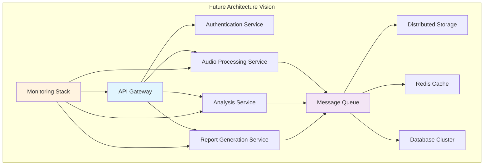

### Технологические направления

**Ближайшие 6 месяцев**:
- Микросервисная архитектура для изоляции компонентов
- Асинхронная обработка через очереди сообщений
- Горизонтальное масштабирование критических сервисов
- Продвинутый мониторинг и алертинг

**6-12 месяцев**:
- Kubernetes для оркестрации контейнеров
- Distributed tracing для отслеживания запросов
- Автоматическое масштабирование на основе нагрузки
- AI-powered anomaly detection

### Организационные изменения

**Структура команды**:
- Выделенный DevOps инженер для инфраструктуры
- QA automation engineer для тестирования
- Site Reliability Engineer для мониторинга
- Platform engineer для общих сервисов

**Процессы и культура**:
- Внедрение SRE практик
- Культура "you build it, you run it"
- Регулярные post-mortem анализы
- Continuous learning и knowledge sharing

Этот дизайн-документ представляет комплексную стратегию решения системных проблем VoxPersona, обеспечивающую переход от реактивного устранения ошибок к проактивному предотвращению сбоев через улучшенную архитектуру, процессы и культуру разработки.