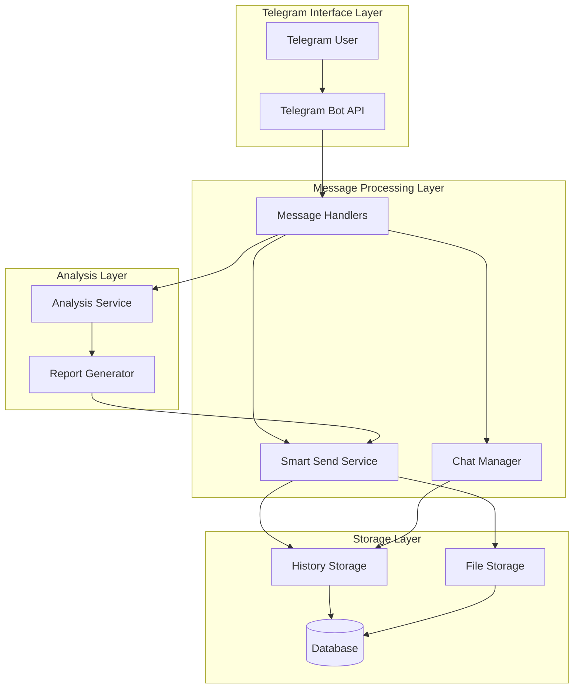
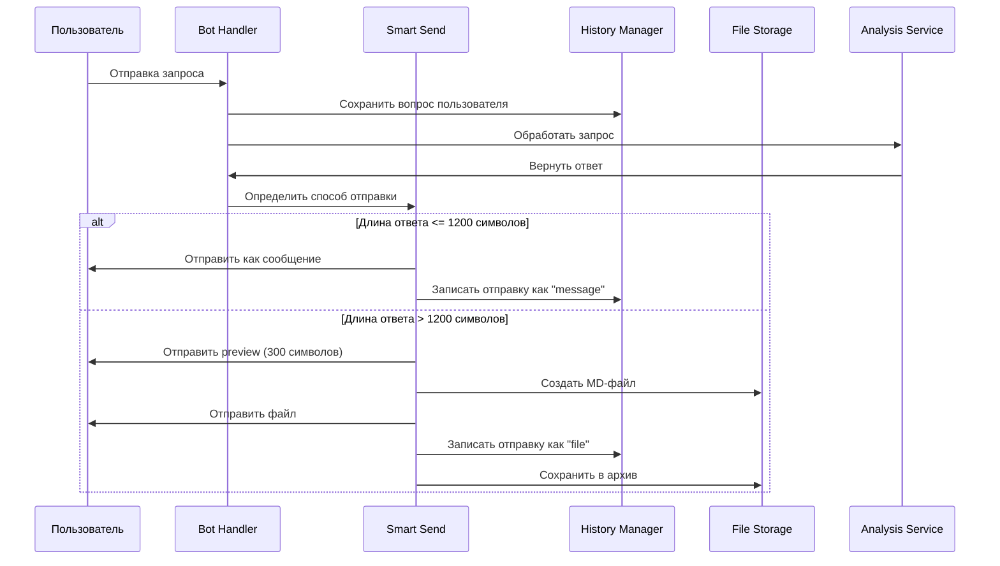
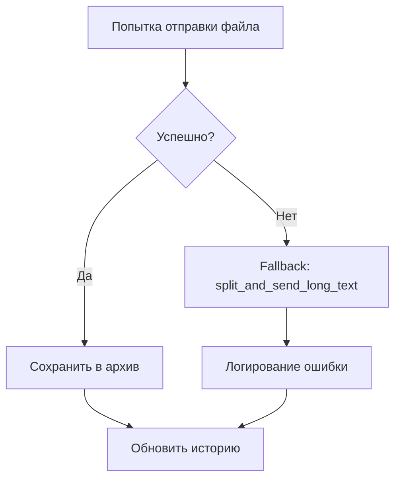
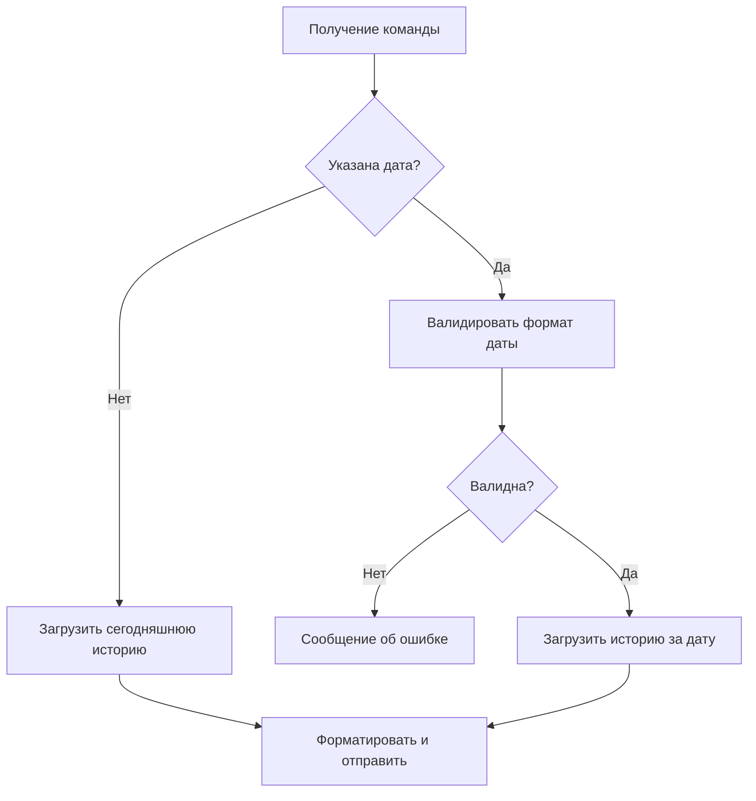
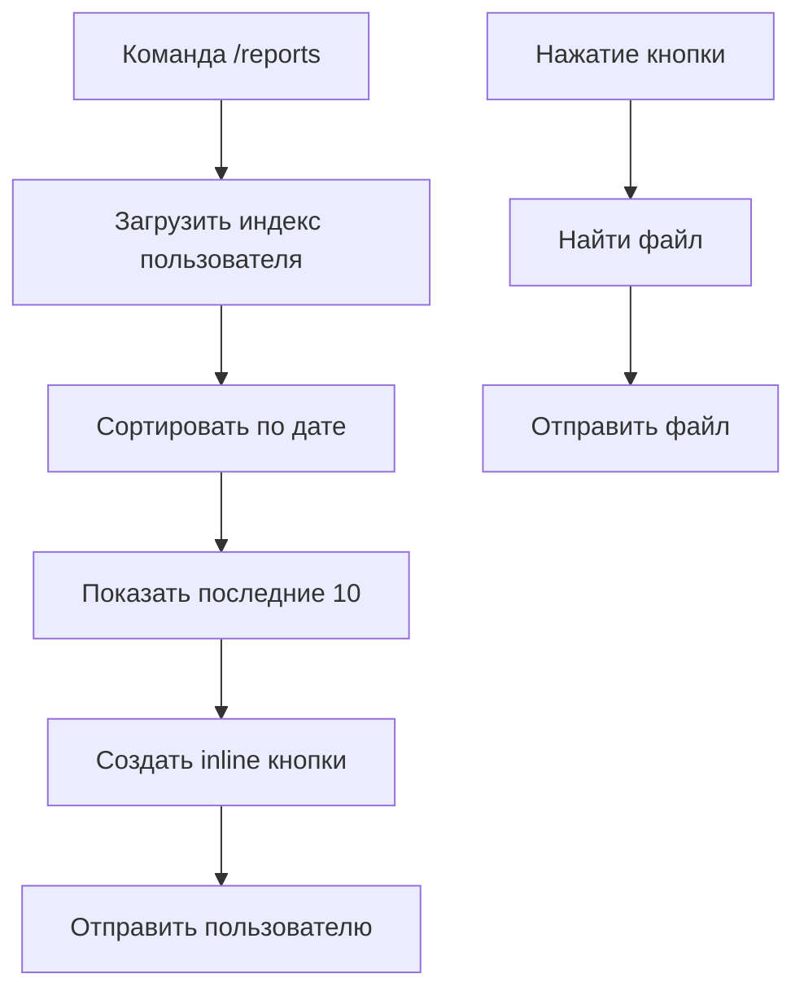
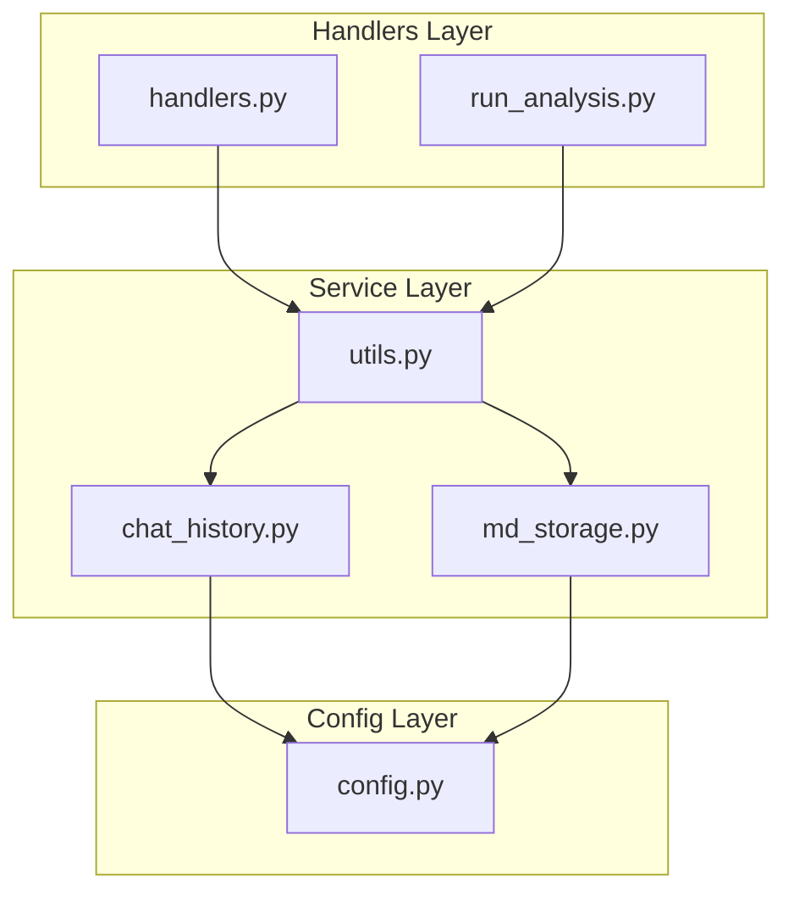

# Дизайн системы умной отправки сообщений с историей и хранением файлов

## Обзор

Данный дизайн определяет архитектуру и стратегию реализации системы умной отправки ответов Telegram бота VoxPersona с автоматическим выбором формата доставки (текстовое сообщение или MD-файл), ведением истории чатов и архивированием отчетов. Система решает проблему ограничений Telegram на размер сообщений, обеспечивает персистентность данных взаимодействий и создает основу для аналитики использования.

### Стратегические цели

- **Адаптивная доставка контента**: Автоматический выбор оптимального способа доставки длинных ответов
- **Полная история взаимодействий**: Централизованное хранение всех диалогов для анализа и восстановления контекста
- **Архивирование отчетов**: Постоянное хранение сгенерированных отчетов для последующего доступа
- **Улучшение пользовательского опыта**: Предоставление preview для больших документов и управление файлами

## Архитектура системы

### Компонентная архитектура



### Поток обработки сообщений



## Основные компоненты

### 1. Система умной отправки (Smart Send Service)

#### Логика принятия решений

| Условие | Действие | Метаданные |
|---------|----------|------------|
| len(text) ≤ 1200 | Отправка как сообщение | sent_as: "message" |
| len(text) > 1200 | Отправка как MD-файл | sent_as: "file", file_path |

#### Структура MD-файла

```
# Отчет VoxPersona
**Дата:** DD.MM.YYYY HH:MM
**Пользователь:** @username (ID: 123456)
**Запрос:** [текст запроса пользователя]
**Тип поиска:** [быстрый/глубокий]

---

[полный ответ бота]
```

#### Стратегия обработки ошибок



### 2. Система истории чатов (Chat History System)

#### Структура хранения

```
chat_history/
├── user_123456/
│   ├── 2025-10-02.json
│   ├── 2025-10-03.json
│   └── ...
├── user_789012/
│   └── ...
└── index.json
```

#### Модель данных дневного файла

| Поле | Тип | Описание |
|------|-----|----------|
| user_id | number | Идентификатор пользователя |
| username | string | Имя пользователя |
| date | string | Дата в формате YYYY-MM-DD |
| messages | array | Массив сообщений |
| stats | object | Статистика за день |

#### Модель сообщения

| Поле | Тип | Описание |
|------|-----|----------|
| timestamp | string | ISO 8601 timestamp |
| message_id | number | ID сообщения Telegram |
| type | enum | "user_question" \| "bot_answer" |
| text | string | Содержимое сообщения |
| tokens | number | Количество токенов |
| sent_as | enum | "message" \| "file" (только для bot_answer) |
| file_path | string | Путь к файлу (если sent_as = "file") |
| search_type | enum | "fast" \| "deep" (только для bot_answer) |

### 3. Архив MD-отчетов (MD Reports Archive)

#### Структура хранения

```
md_reports/
├── user_123456/
│   ├── voxpersona_20251002_143520.md
│   └── ...
├── user_789012/
│   └── ...
└── index.json
```

#### Модель индекса файлов

| Поле | Тип | Описание |
|------|-----|----------|
| file_path | string | Относительный путь к файлу |
| user_id | number | ID пользователя |
| username | string | Имя пользователя |
| timestamp | string | Время создания |
| question | string | Исходный вопрос |
| size_bytes | number | Размер файла |
| tokens | number | Количество токенов |
| search_type | enum | Тип поиска |

## Интеграция с существующей системой

### Точки интеграции

#### В run_analysis.py (строки 142, 188)

**Текущий код:**
```python
split_and_send_long_text(chat_id=chat_id, app=app, text=formatted_response, parse_mode=ParseMode.MARKDOWN)
```

**Новый код:**
```python
smart_send_text(
    text=formatted_response, 
    chat_id=chat_id, 
    app=app, 
    username=get_username_from_chat(chat_id),
    question=text,
    search_type="fast" if not deep_search else "deep",
    parse_mode=ParseMode.MARKDOWN
)
```

#### В handlers.py

Добавление обработчиков для новых команд:
- `/history [дата]` - просмотр истории
- `/stats` - статистика пользователя  
- `/reports` - список сохраненных отчетов

### Архитектурные решения

#### Асинхронность операций


#### Стратегия именования файлов

- **Формат**: `voxpersona_YYYYMMDD_HHMMSS.md`
- **Обоснование**: Хронологическая сортировка, уникальность, читаемость

## Управление конфигурацией

### Переменные окружения

| Переменная | Значение по умолчанию | Описание |
|------------|----------------------|----------|
| TELEGRAM_MESSAGE_THRESHOLD | 1200 | Пороговое значение для отправки файлом |
| CHAT_HISTORY_DIR | /home/voxpersona_user/VoxPersona/chat_history | Директория истории |
| MD_REPORTS_DIR | /home/voxpersona_user/VoxPersona/md_reports | Директория отчетов |

### Константы конфигурации

```python
# src/config.py
TELEGRAM_MESSAGE_THRESHOLD = int(os.getenv("TELEGRAM_MESSAGE_THRESHOLD", "1200"))
CHAT_HISTORY_DIR = os.getenv("CHAT_HISTORY_DIR", "/home/voxpersona_user/VoxPersona/chat_history")
MD_REPORTS_DIR = os.getenv("MD_REPORTS_DIR", "/home/voxpersona_user/VoxPersona/md_reports")
```

## Безопасность и производительность

### Меры безопасности

#### Валидация путей
- Проверка на path traversal атаки
- Ограничение доступа только к собственным директориям пользователей
- Валидация размеров файлов перед записью

#### Права доступа
- Изоляция данных пользователей
- Проверка авторизации перед доступом к истории
- Логирование всех операций доступа к файлам

### Оптимизация производительности

#### Кэширование
- Кэширование index.json в памяти
- Lazy loading директорий пользователей
- Batch операции для записи истории

#### Асинхронные операции
- Неблокирующая запись в JSON
- Фоновое обновление индексов
- Параллельная обработка файловых операций

## Пользовательские команды

### Команда `/history [дата]`

#### Логика работы



#### Формат ответа

```
📊 История за 02.10.2025

🤔 Вопросы: 3
🤖 Ответы: 3
⚡ Быстрых поисков: 2
🔍 Глубоких поисков: 1
📝 Токенов использовано: 1,250

[Последние 5 сообщений...]
```

### Команда `/stats`

#### Статистические метрики

| Метрика | Источник | Описание |
|---------|----------|----------|
| Всего вопросов | История чатов | Сумма user_question |
| Всего ответов | История чатов | Сумма bot_answer |
| Быстрых поисков | История чатов | Фильтр search_type = "fast" |
| Глубоких поисков | История чатов | Фильтр search_type = "deep" |
| Всего токенов | История чатов | Сумма поля tokens |
| Сохраненных файлов | Индекс отчетов | Количество записей |

### Команда `/reports`

#### Интерфейс управления файлами



## Модульная архитектура

### Новые модули

#### src/chat_history.py
- `save_message_to_history()` - сохранение сообщений
- `get_user_history()` - получение истории
- `get_user_stats()` - статистика пользователя
- `ensure_user_directory()` - создание директорий

#### src/md_storage.py
- `save_md_report()` - сохранение отчета
- `get_user_reports()` - список отчетов пользователя
- `get_report_stats()` - общая статистика
- `update_reports_index()` - обновление индекса

#### src/utils.py (дополнения)
- `smart_send_text()` - умная отправка
- `get_username_from_chat()` - получение имени пользователя
- `create_preview_text()` - создание превью

### Диаграмма зависимостей



## Стратегия тестирования

### Модульные тесты

#### test_smart_send.py
- Тестирование пороговых значений (1199, 1200, 1201 символов)
- Проверка генерации MD-файлов
- Валидация preview текста
- Тестирование fallback механизма

#### test_history.py  
- Создание и чтение файлов истории
- Корректность структуры JSON
- Обновление статистики
- Ротация файлов по дням

#### test_md_storage.py
- Сохранение отчетов
- Обновление индекса
- Проверка путей файлов
- Валидация метаданных

### Интеграционные тесты
- Полный цикл: вопрос → ответ → сохранение
- Тестирование команд с реальными данными
- Проверка асинхронных операций
- Тестирование обработки ошибок

## Планы развития

### Фаза 1: Базовая функциональность (1 час)
- Реализация smart_send_text()
- Интеграция в run_analysis.py
- Базовое тестирование

### Фаза 2: Система истории (2 часа)
- Модуль chat_history.py
- Сохранение сообщений
- JSON структуры и индексы

### Фаза 3: Архив отчетов (1 час)
- Модуль md_storage.py
- Постоянное хранение файлов
- Система индексации

### Фаза 4: Пользовательские команды (2 часа)
- Реализация /history, /stats, /reports
- UI для управления файлами
- Полное тестирование

### Фаза 5: Оптимизация и документация (1 час)
- Производительность
- Логирование
- Обновление документации

## Критерии готовности

### Функциональные требования
- ✅ Автоматический выбор формата отправки
- ✅ Генерация и отправка MD-файлов с preview
- ✅ Сохранение полной истории чатов
- ✅ Архивирование всех отчетов
- ✅ Работоспособность пользовательских команд

### Нефункциональные требования  
- ✅ Fallback при ошибках отправки файлов
- ✅ Асинхронная запись без блокировки бота
- ✅ Полное логирование операций
- ✅ Безопасность данных пользователей
- ✅ Покрытие тестами > 80%
