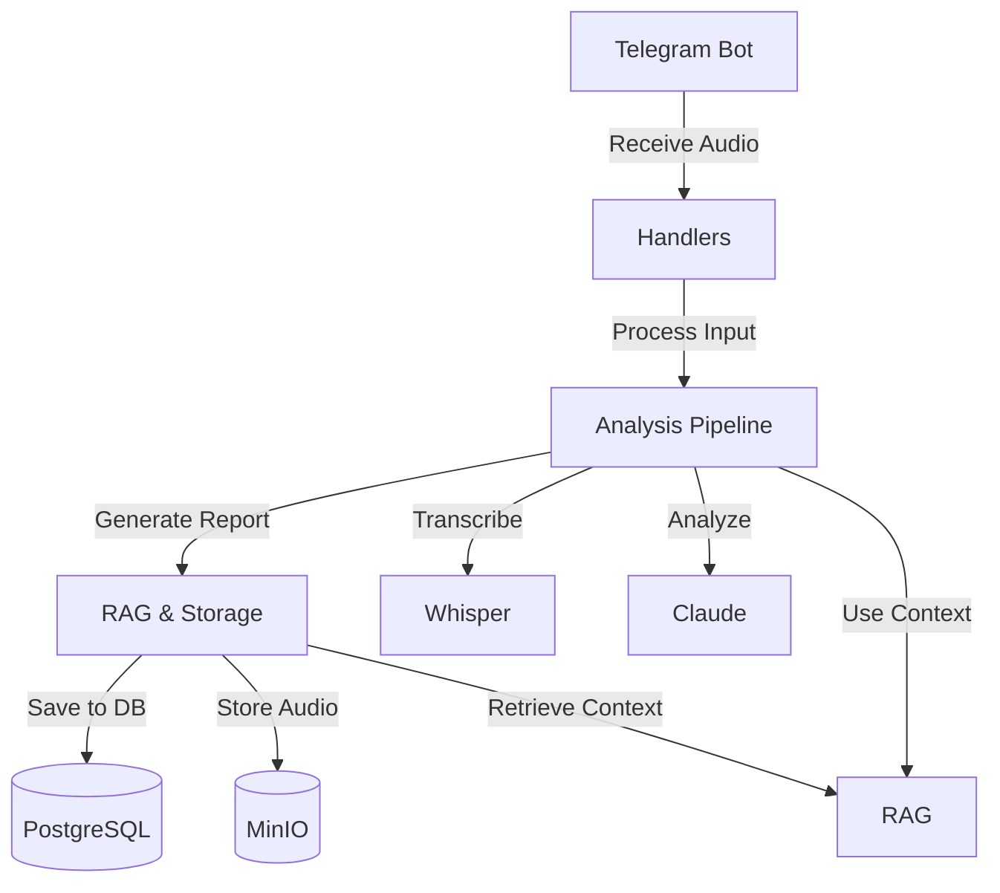
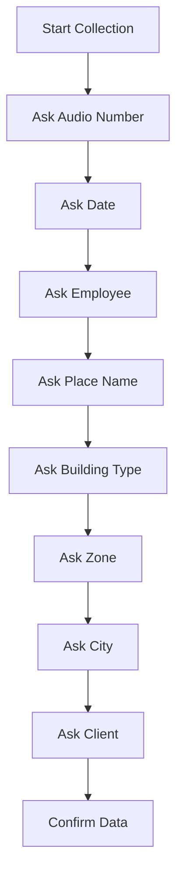
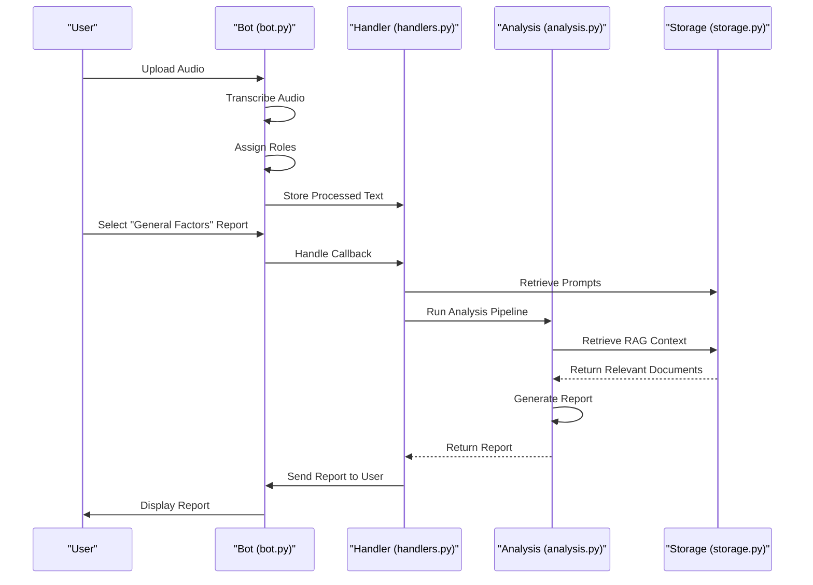
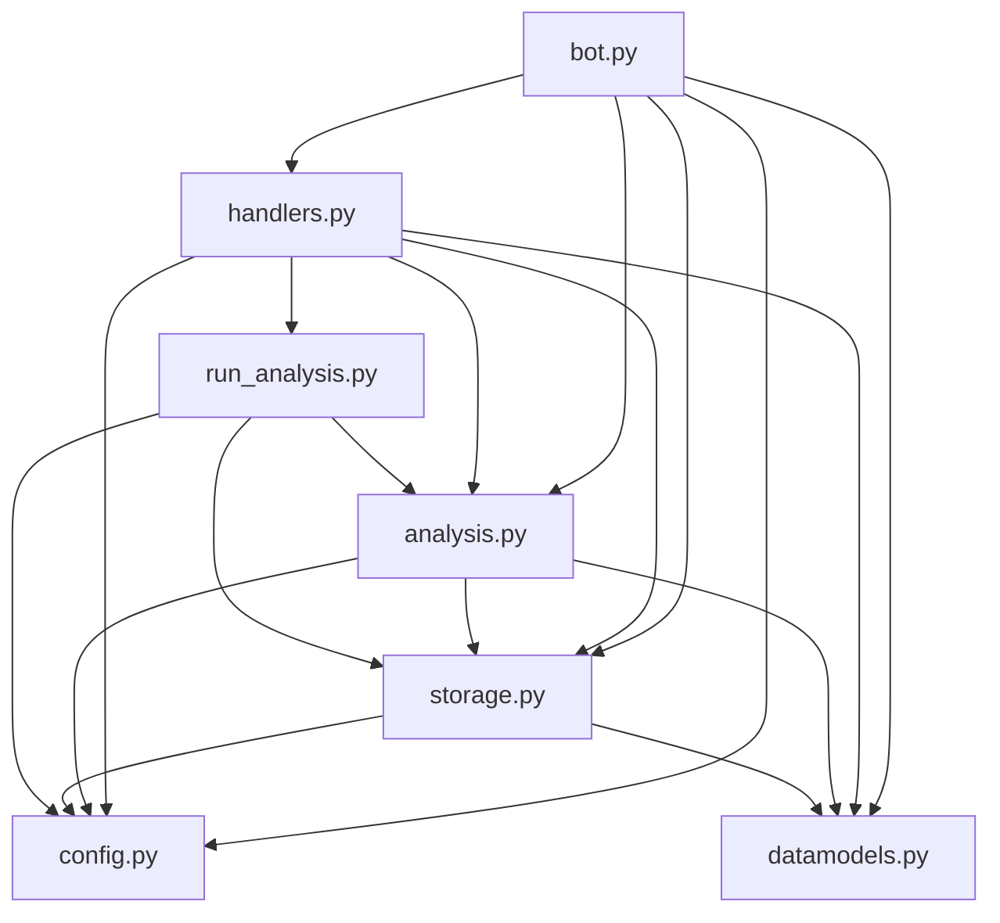

# API Reference

<cite>
**Referenced Files in This Document**   
- [bot.py](file://src/bot.py)
- [handlers.py](file://src/handlers.py)
- [analysis.py](file://src/analysis.py)
- [storage.py](file://src/storage.py)
- [run_analysis.py](file://src/run_analysis.py)
- [config.py](file://src/config.py)
- [datamodels.py](file://src/datamodels.py)
- [main.py](file://src/main.py)
</cite>

## Table of Contents
1. [Introduction](#introduction)
2. [Project Structure](#project-structure)
3. [Core Components](#core-components)
4. [Architecture Overview](#architecture-overview)
5. [Detailed Component Analysis](#detailed-component-analysis)
6. [Dependency Analysis](#dependency-analysis)
7. [Performance Considerations](#performance-considerations)
8. [Troubleshooting Guide](#troubleshooting-guide)
9. [Conclusion](#conclusion)

## Introduction
This document provides a comprehensive API reference for the internal module interfaces within the VoxPersona application. The system is a Telegram bot designed to process audio interviews and design audits, transcribe them, analyze content using LLMs, and generate structured reports. The documentation focuses on the core modules: `bot.py` for Telegram interaction, `handlers.py` for user input processing, `analysis.py` for the analysis pipeline, and `storage.py` for RAG operations and database interactions. The integration between these modules, error handling, and asynchronous patterns are detailed to provide a clear understanding of the system's functionality.

## Project Structure
The project follows a modular structure with distinct directories for prompts, configuration, and source code. The `src` directory contains the core application logic, while the `prompts` and `prompts-by-scenario` directories store prompt templates used during analysis. The application uses Pyrogram for Telegram integration, LangChain for RAG operations, and PostgreSQL for persistent storage.

```mermaid
graph TD
src[Source Code]
prompts[Prompts]
prompts_by_scenario[Prompts by Scenario]
src --> bot[bot.py]
src --> handlers[handlers.py]
src --> analysis[analysis.py]
src --> storage[storage.py]
src --> run_analysis[run_analysis.py]
src --> config[config.py]
src --> datamodels[datamodels.py]
src --> main[main.py]
prompts --> design_audit[design_audit_methodology.txt]
prompts --> health_center[health_center_audit_compliance.txt]
prompts --> hotel[hotel_audit_compliance.txt]
prompts --> interview_employee[interview_employee_performance.txt]
prompts --> interview_factors[interview_factors_restaurant.txt]
prompts --> quality_links[quality_decision_links.txt]
prompts --> restaurant[restaurant_audit_compliance.txt]
prompts --> structured_health[structured_health_center_audit.txt]
prompts --> structured_hotel[structured_hotel_audit.txt]
prompts --> structured_restaurant[structured_restaurant_audit.txt]
prompts_by_scenario --> assign_roles[assign_roles]
prompts_by_scenario --> design[design]
prompts_by_scenario --> interview[interview]
prompts_by_scenario --> sql_prompts[sql_prompts]
```



**Diagram sources**
- [bot.py](file://src/bot.py)
- [handlers.py](file://src/handlers.py)
- [analysis.py](file://src/analysis.py)
- [storage.py](file://src/storage.py)

**Section sources**
- [bot.py](file://src/bot.py)
- [handlers.py](file://src/handlers.py)
- [analysis.py](file://src/analysis.py)
- [storage.py](file://src/storage.py)

## Core Components
The VoxPersona application consists of several interconnected components that handle Telegram bot functionality, user input processing, audio transcription, content analysis, and data storage. The core components include the Telegram bot initialization in `bot.py`, the handler functions in `handlers.py` that process user inputs, the analysis pipeline in `analysis.py` that generates reports, and the RAG operations in `storage.py` that manage vector search and retrieval. These components work together to provide a seamless experience for users to upload audio files, transcribe them, and generate detailed analysis reports.

**Section sources**
- [bot.py](file://src/bot.py#L1-L670)
- [handlers.py](file://src/handlers.py#L1-L799)
- [analysis.py](file://src/analysis.py#L1-L490)
- [storage.py](file://src/storage.py#L1-L309)

## Architecture Overview
The VoxPersona application follows a layered architecture with clear separation of concerns. The Telegram bot serves as the user interface, receiving audio files and commands from users. The handlers process these inputs, managing user state and orchestrating the analysis workflow. The analysis module contains the core logic for transcription, role assignment, and report generation using LLMs. The storage module handles RAG operations, database interactions, and file management. The system uses asynchronous patterns for long-running operations and implements error handling throughout the pipeline.



**Diagram sources**
- [bot.py](file://src/bot.py#L1-L670)
- [handlers.py](file://src/handlers.py#L1-L799)
- [analysis.py](file://src/analysis.py#L1-L490)
- [storage.py](file://src/storage.py#L1-L309)

## Detailed Component Analysis

### bot.py: Telegram Bot Initialization and Command Handling
The `bot.py` module initializes the Telegram bot using Pyrogram and defines command handlers for `/start` and message processing. It manages user authentication, processes audio messages, and provides a menu-driven interface for report generation.

#### Telegram Bot Initialization
The bot is initialized with credentials loaded from environment variables. It uses Pyrogram's Client to connect to the Telegram API and sets up global state for tracking processed texts, user states, and authorized users.

```python
app = Client(
    "voxpersona_bot",
    api_id=int(API_ID),
    api_hash=API_HASH,
    bot_token=TELEGRAM_BOT_TOKEN
)
```

The bot uses global dictionaries to maintain state across user sessions:
- `processed_texts`: Stores transcribed and processed text for each user
- `user_states`: Tracks the current state of user interactions
- `authorized_users`: Maintains a set of authorized user IDs

#### Command Handlers
The `/start` command handler checks if the user is authorized and sends the main menu if they are. If not, it prompts for a password.

```python
@app.on_message(filters.command("start"))
def cmd_start(client, message: Message):
    c_id = message.chat.id
    if c_id not in authorized_users:
        app.send_message(c_id, "Вы не авторизованы. Введите пароль:")
    else:
        send_main_menu(c_id)
```

The authentication handler processes text messages from unauthorized users, checking if they provide the correct password (hardcoded as "1243" in this implementation).

#### Message Event Processing
The bot processes voice and audio messages by downloading the file, transcribing it using Whisper, and assigning roles to speakers in the conversation. It uses a spinner animation to provide feedback during long-running operations.

```python
@app.on_message(filters.voice | filters.audio)
def handle_audio_msg(client, message: Message):
    # Download audio
    downloaded = app.download_media(message, file_name=path_)
    # Transcribe audio
    raw_ = transcribe_audio(downloaded)
    # Assign roles
    roles_ = assign_roles(raw_)
    processed_texts[c_id] = roles_
```

The module also handles document uploads for storage and processes callback queries from inline keyboards to navigate menus and trigger report generation.

**Section sources**
- [bot.py](file://src/bot.py#L1-L670)

### handlers.py: User Input Processing
The `handlers.py` module contains functions that process user inputs and manage the interaction flow. It handles text messages from authorized users, processes file uploads, and manages callback queries.

#### Public Functions for Input Processing
The `handle_authorized_text` function is the main entry point for processing text messages from authorized users. It uses the user's current state to determine the appropriate action, such as collecting interview details or handling dialog mode.

```python
def handle_authorized_text(app: Client, user_states: dict[int, dict], message: Message):
    c_id = message.chat.id
    text_ = message.text.strip()
    st = user_states.get(c_id)
    
    if not check_state(st, c_id, app):
        send_main_menu(c_id, app)
        return
```

The module includes specialized functions for collecting different types of data:
- `ask_audio_number`: Collects the audio file number
- `ask_date`: Collects the date of the interview/audit
- `ask_employee`: Collects the employee's name
- `ask_place_name`: Collects the name of the establishment
- `ask_building_type`: Collects the type of building (hotel, restaurant, etc.)

#### Parameter and Return Types
These functions typically follow the same pattern:
- **Parameters**: 
  - `data`: Dictionary to store collected data
  - `text`: User input text
  - `state`: User state dictionary
  - `chat_id`: Telegram chat ID
  - `app`: Pyrogram client instance
- **Return**: None (modifies state and data in place)

#### Invocation Relationships
The functions are invoked in a sequence based on the user's current step in the interaction flow. The state machine pattern is used to guide users through the data collection process.



**Section sources**
- [handlers.py](file://src/handlers.py#L1-L799)

### analysis.py: Analysis Pipeline Functions
The `analysis.py` module contains the core analysis pipeline functions that process transcribed text and generate reports. It handles transcription, role assignment, and report generation using LLMs.

#### Analysis Pipeline Functions
The main analysis function is `analyze_methodology`, which processes text through a series of prompts. It supports sequential processing where the output of one prompt becomes the input to the next.

```python
def analyze_methodology(text: str, prompt_list: list[tuple[str, int]]) -> str:
    current_response = None
    for prompt, _ in prompt_list:
        if current_response is None:
            messages = [{"role": "user", "content": f"{prompt}\n\n{text}"}]
            current_response = send_msg_to_model(messages=messages)
        else:
            combined_prompt = f"{prompt}\n\nТекст:{current_response}"
            messages = [{"role": "user", "content": combined_prompt}]
            current_response = send_msg_to_model(messages=messages)
    return current_response
```

#### Input Expectations
The analysis functions expect:
- **Transcribed text**: Raw or role-assigned text from audio processing
- **Scenario type**: "interview" or "design" to determine the analysis approach
- **Prompt list**: A list of prompts to apply in sequence

#### Output Formats
The functions return:
- **String**: The final analysis result as a formatted text report
- **Structured data**: For JSON prompts, the output is a JSON string that can be parsed

The module also includes specialized functions for different analysis types:
- `transcribe_audio_raw`: Transcribes audio files using Whisper
- `assign_roles`: Assigns roles to speakers in a conversation
- `classify_query`: Classifies user queries for dialog mode
- `generate_db_answer`: Generates answers using RAG retrieval

**Section sources**
- [analysis.py](file://src/analysis.py#L1-L490)

### storage.py: RAG Operations
The `storage.py` module handles RAG (Retrieval-Augmented Generation) operations, including embedding storage, retrieval methods, and vector search parameters.

#### Embedding Storage
The `create_db_in_memory` function creates a FAISS vector store from markdown text. It splits the text into chunks, generates embeddings using a SentenceTransformer model, and creates an in-memory vector database.

```python
def create_db_in_memory(markdown_text: str):
    chunks = split_markdown_text(markdown_text)
    chunks_documents = [Document(page_content=chunk) for chunk in chunks]
    model = get_embedding_model()
    embedding = CustomSentenceTransformerEmbeddings(model)
    db_index = FAISS.from_documents(documents=chunks_documents, embedding=embedding)
    return db_index
```

#### Retrieval Methods
The module provides several retrieval methods:
- `build_reports_grouped`: Retrieves reports from the database grouped by transcription ID
- `generate_db_answer`: Retrieves relevant documents and generates an answer using an LLM

```python
def generate_db_answer(query: str, db_index, k: int = 15, verbose: bool = True):
    similar_documents = db_index.similarity_search(query, k=k)
    message_content = re.sub(r'\n{2}', ' ', '\n '.join(
        [f'Отчет № {i+1}:\n' + doc.page_content
         for i, doc in enumerate(similar_documents)]))
    messages = [{"role": "user", "content": f'Вопрос пользователя: {query}'}]
    response = send_msg_to_model(messages=messages, system=f'{system_prompt} {message_content}')
    return response
```

#### Vector Search Parameters
The retrieval methods accept parameters to control the search:
- `k`: Number of documents to retrieve (default: 15)
- `verbose`: Whether to log detailed information about the retrieval process
- `model`: LLM model to use for answer generation

The module also includes functions for saving and loading RAG indices to/from disk, allowing for persistence between application restarts.

**Section sources**
- [storage.py](file://src/storage.py#L1-L309)

### Module Interactions
The modules interact in a coordinated workflow to process user requests and generate analysis reports. When a user uploads an audio file, the bot module handles the initial processing, then invokes handlers to manage the interaction flow. The analysis module processes the content, using RAG operations from the storage module to retrieve relevant context.

#### Example Interaction Flow
When a user requests a "General Factors" report for an interview, the following sequence occurs:



The `run_analysis_with_spinner` function in `run_analysis.py` orchestrates this process, showing a loading animation while the analysis runs and handling errors appropriately.

#### Error Propagation
Error handling is implemented throughout the system:
- **Bot module**: Catches transcription and analysis errors, displaying user-friendly messages
- **Handlers module**: Validates user input and state, recovering from invalid states
- **Analysis module**: Handles LLM API errors with retry logic and rate limiting
- **Storage module**: Manages database connection errors and file I/O exceptions

The system uses try-except blocks to catch specific exceptions like `OpenAIPermissionError` and general exceptions, logging detailed error information while providing concise messages to users.

#### Async/Await Usage Patterns
The application uses asynchronous patterns for long-running operations:
- **Spinner animations**: Run in separate threads to avoid blocking the main event loop
- **LLM calls**: Use async/await for API requests to Claude
- **File operations**: Handle downloads and uploads asynchronously

The `run_deep_search` function in `run_analysis.py` demonstrates advanced async usage, using `asyncio` and `aiohttp` to make parallel requests to multiple API keys while respecting rate limits.

**Section sources**
- [bot.py](file://src/bot.py#L1-L670)
- [handlers.py](file://src/handlers.py#L1-L799)
- [analysis.py](file://src/analysis.py#L1-L490)
- [storage.py](file://src/storage.py#L1-L309)
- [run_analysis.py](file://src/run_analysis.py#L1-L343)

## Dependency Analysis
The VoxPersona application has a well-defined dependency structure with clear relationships between modules. The main dependencies flow from the Telegram interface through the processing layers to the analysis and storage components.



The dependency graph shows that `config.py` and `datamodels.py` are foundational modules used by all other components. The `bot.py` module has the most dependencies as it serves as the integration point for the entire system. The `handlers.py` module depends on both the analysis and storage modules to process user requests, while the `run_analysis.py` module orchestrates the analysis workflow by coordinating between the analysis and storage components.

**Diagram sources**
- [bot.py](file://src/bot.py#L1-L670)
- [handlers.py](file://src/handlers.py#L1-L799)
- [analysis.py](file://src/analysis.py#L1-L490)
- [storage.py](file://src/storage.py#L1-L309)
- [run_analysis.py](file://src/run_analysis.py#L1-L343)
- [config.py](file://src/config.py#L1-L93)
- [datamodels.py](file://src/datamodels.py#L1-L71)

**Section sources**
- [bot.py](file://src/bot.py#L1-L670)
- [handlers.py](file://src/handlers.py#L1-L799)
- [analysis.py](file://src/analysis.py#L1-L490)
- [storage.py](file://src/storage.py#L1-L309)
- [run_analysis.py](file://src/run_analysis.py#L1-L343)

## Performance Considerations
The VoxPersona application implements several performance optimizations to handle large audio files and complex analysis tasks efficiently.

### Audio Processing
The system processes large audio files by splitting them into chunks of 24MB to avoid API size limits. This allows processing of files up to 2GB in size, which is the Telegram bot limit.

```python
CHUNK_SIZE = 24 * 1024 * 1024  # 24 MB
```

For long-running operations like transcription and analysis, the application uses spinner animations to provide user feedback. These run in separate threads to prevent blocking the main event loop.

### Rate Limiting and Parallel Processing
The analysis module implements sophisticated rate limiting to handle multiple API keys efficiently. The `extract_from_chunk_parallel` function distributes work across multiple API keys, respecting both token and request rate limits.

```python
token_limits_per_min = [80000, 20000, 20000, 20000, 20000, 20000, 20000]
req_limits_per_min = [2000, 50, 50, 50, 50, 50, 50]
```

The system calculates delays based on both token usage and request frequency, ensuring compliance with API rate limits while maximizing throughput.

### Caching and Persistence
The application uses RAG index persistence to avoid regenerating vector databases on each startup. The `rag_persistence.py` module saves and loads FAISS indices from disk, significantly reducing startup time.

```python
def save_rag_indices(rags: dict) -> None:
    for name, index in rags.items():
        if not hasattr(index, "save_local"):
            continue
        path = os.path.join(RAG_INDEX_DIR, safe_filename(name))
        shutil.rmtree(path, ignore_errors=True)
        index.save_local(path)
```

A periodic save task runs every 15 minutes to ensure RAG indices are regularly persisted.

**Section sources**
- [bot.py](file://src/bot.py#L1-L670)
- [analysis.py](file://src/analysis.py#L1-L490)
- [rag_persistence.py](file://src/rag_persistence.py#L1-L36)

## Troubleshooting Guide
This section addresses common issues that may occur when using or developing the VoxPersona application.

### Authentication Issues
If users cannot authenticate with the bot, verify that:
- The password in `handle_auth_text` matches what users are entering
- The `authorized_users` set is properly maintained
- The bot has the necessary permissions in the Telegram group or channel

### Audio Processing Failures
When audio processing fails, check:
- The audio file size is under 2GB
- The Whisper API key is valid and has sufficient quota
- The audio format is supported (OGG, MP3, WAV, etc.)
- The server has sufficient disk space for temporary files

### Analysis and LLM Errors
For analysis failures:
- Verify the Claude API keys are valid and have sufficient quota
- Check that prompt files exist in the prompts directory
- Ensure the database connection is working for prompt retrieval
- Confirm that the RAG indices are properly loaded

### RAG and Database Issues
If RAG operations fail:
- Verify the PostgreSQL database is accessible
- Check that the `build_reports_grouped` SQL query returns results
- Ensure the FAISS indices are properly saved and loaded
- Confirm the embedding model is correctly configured

### Configuration Problems
Common configuration issues include:
- Missing environment variables in `.env` file
- Incorrect API endpoints in configuration
- Mismatched database credentials between test and production modes
- Incorrect paths for storage directories

**Section sources**
- [bot.py](file://src/bot.py#L1-L670)
- [handlers.py](file://src/handlers.py#L1-L799)
- [analysis.py](file://src/analysis.py#L1-L490)
- [storage.py](file://src/storage.py#L1-L309)
- [config.py](file://src/config.py#L1-L93)

## Conclusion
The VoxPersona application provides a comprehensive solution for processing audio interviews and design audits, generating structured reports through a sophisticated analysis pipeline. The system's modular architecture separates concerns effectively, with clear interfaces between components. The integration of Telegram bot functionality, audio processing, LLM analysis, and RAG operations creates a powerful tool for qualitative data analysis. The documentation covers the key modules and their interactions, providing a solid foundation for understanding and extending the system. Future improvements could include enhanced error reporting, improved user interface, and expanded analysis capabilities.