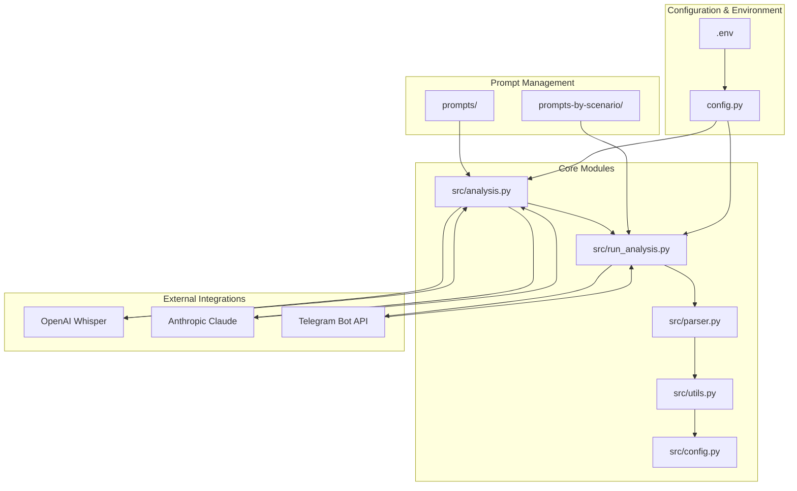
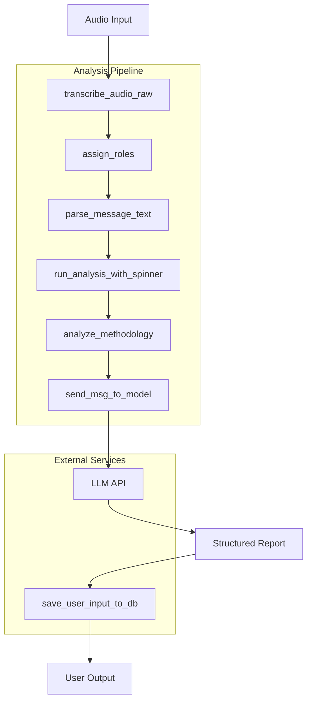
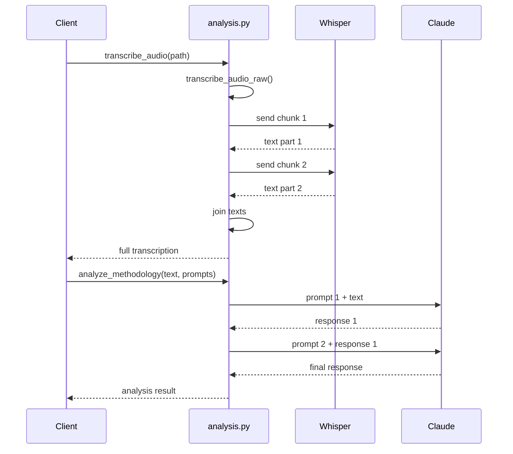
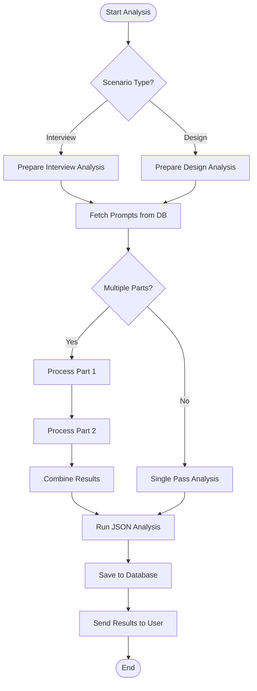
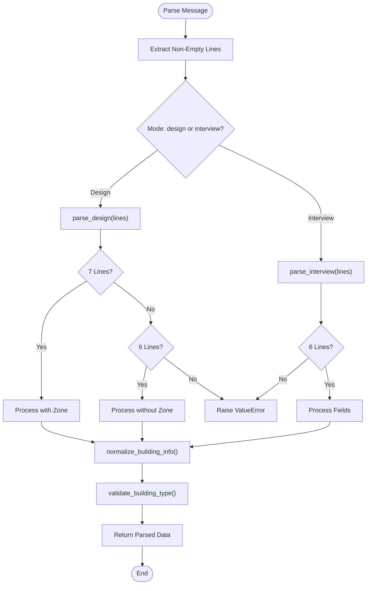
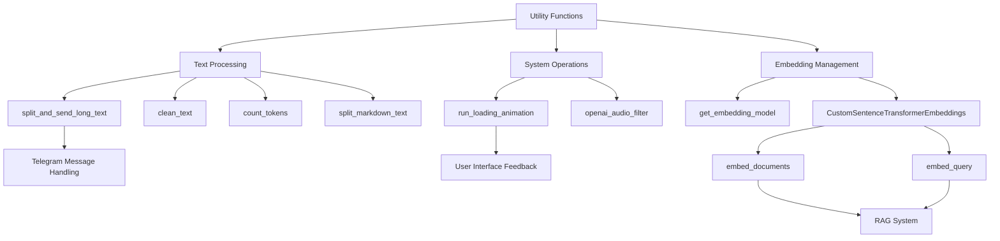
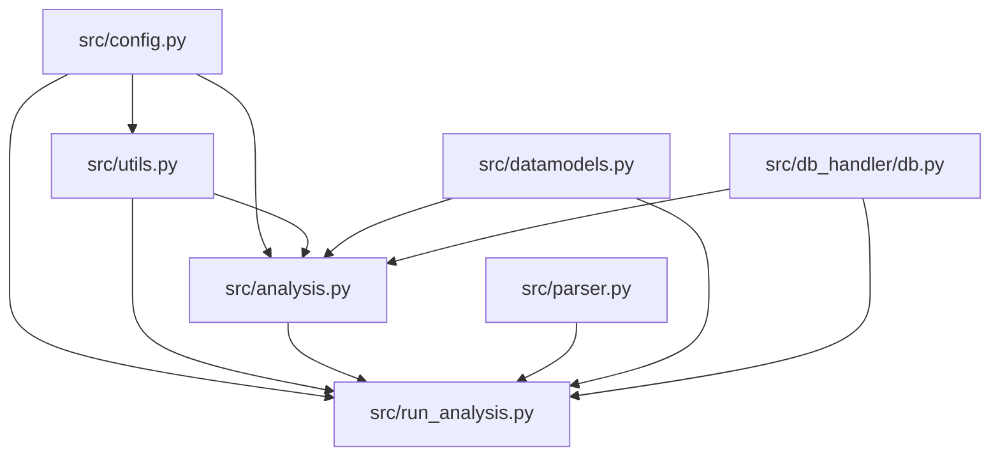

# Analysis Engine API

<cite>
**Referenced Files in This Document**   
- [analysis.py](file://src/analysis.py)
- [run_analysis.py](file://src/run_analysis.py)
- [parser.py](file://src/parser.py)
- [utils.py](file://src/utils.py)
- [config.py](file://src/config.py)
</cite>

## Table of Contents
1. [Introduction](#introduction)
2. [Project Structure](#project-structure)
3. [Core Components](#core-components)
4. [Architecture Overview](#architecture-overview)
5. [Detailed Component Analysis](#detailed-component-analysis)
6. [Dependency Analysis](#dependency-analysis)
7. [Performance Considerations](#performance-considerations)
8. [Troubleshooting Guide](#troubleshooting-guide)
9. [Conclusion](#conclusion)

## Introduction
The Analysis Engine API is a core component of the VoxPersona platform, an AI-powered voice analysis system designed to process audio recordings, generate transcriptions, and produce structured analytical reports. This documentation provides a comprehensive overview of the analysis pipeline, focusing on key modules such as `analysis.py`, `run_analysis.py`, `parser.py`, and `utils.py`. The system leverages advanced language models (LLMs) like Claude 3.5 Sonnet and Whisper for transcription and deep content analysis, supporting multiple scenarios including design audits and employee interviews. The engine orchestrates a multi-step workflow involving audio processing, text parsing, context retrieval, LLM prompting, and result aggregation, enabling automated generation of detailed JSON-formatted reports.

## Project Structure
The project follows a modular structure with distinct directories for prompts, source code, and configuration files. The `src/` directory contains all core Python modules responsible for audio processing, analysis, and system orchestration. Prompt templates are organized under `prompts/` and `prompts-by-scenario/`, enabling scenario-specific analysis workflows. Configuration and environment settings are managed through `.env` files and `config.py`. The system integrates with external services via API keys for OpenAI, Anthropic, and Telegram, facilitating transcription, LLM inference, and user interaction.

**Diagram sources**
- [src/analysis.py](file://src/analysis.py)
- [src/run_analysis.py](file://src/run_analysis.py)
- [src/parser.py](file://src/parser.py)
- [src/utils.py](file://src/utils.py)
- [src/config.py](file://src/config.py)

**Section sources**
- [src/analysis.py](file://src/analysis.py)
- [src/run_analysis.py](file://src/run_analysis.py)
- [src/parser.py](file://src/parser.py)
- [src/utils.py](file://src/utils.py)
- [src/config.py](file://src/config.py)

## Core Components
The analysis engine consists of four primary components: `analysis.py` handles LLM interactions and text generation, `run_analysis.py` orchestrates the end-to-end analysis pipeline, `parser.py` processes and normalizes input metadata, and `utils.py` provides shared utilities for text manipulation and system operations. These components work in concert to transform raw audio inputs into structured analytical outputs. The system supports two main analysis scenarios—design audits and employee interviews—each with specialized prompt templates and processing logic. Key functionality includes audio transcription, role assignment in dialogues, context-aware prompting, and multi-stage report generation with both qualitative and quantitative outputs.

**Section sources**
- [src/analysis.py](file://src/analysis.py)
- [src/run_analysis.py](file://src/run_analysis.py)
- [src/parser.py](file://src/parser.py)
- [src/utils.py](file://src/utils.py)

## Architecture Overview
The analysis engine follows a layered architecture with clear separation between data processing, business logic, and orchestration layers. Audio input is first transcribed using OpenAI's Whisper model, then processed through a series of analysis stages coordinated by `run_analysis.py`. The system uses a RAG (Retrieval-Augmented Generation) approach to incorporate contextual knowledge from previous reports. Analysis workflows are defined by prompt sequences stored in the database and organized by scenario, report type, and building type. The architecture supports both synchronous and asynchronous processing modes, with rate limiting mechanisms to manage API usage across multiple Anthropic API keys. Results are aggregated and formatted for presentation to users via the Telegram interface.

**Diagram sources**
- [src/analysis.py](file://src/analysis.py)
- [src/run_analysis.py](file://src/run_analysis.py)
- [src/parser.py](file://src/parser.py)

## Detailed Component Analysis

### analysis.py Analysis
The `analysis.py` module serves as the primary interface to large language models, providing functions for transcription, text analysis, and database querying. It implements both synchronous and asynchronous methods for sending messages to the Anthropic API, with built-in rate limiting and retry logic. The module handles audio transcription by splitting files into 3-minute chunks and processing them sequentially through Whisper. For analysis tasks, it supports sequential prompt chaining where the output of one prompt becomes the input to the next, enabling multi-step reasoning workflows.

#### For API/Service Components:

**Diagram sources**
- [src/analysis.py](file://src/analysis.py#L0-L132)

**Section sources**
- [src/analysis.py](file://src/analysis.py#L0-L491)

### run_analysis.py Analysis
The `run_analysis.py` module orchestrates the complete analysis workflow, managing the sequence of operations from user input to final report generation. It initializes RAG (Retrieval-Augmented Generation) systems for different analysis scenarios and coordinates between fast search (vector similarity) and deep search (chunked processing) modes. The module implements a multi-pass analysis strategy where initial processing generates qualitative insights, followed by a quantitative analysis pass that produces structured JSON output. It also manages user interface elements like loading animations and menu navigation through the Telegram bot.

#### For Complex Logic Components:

**Diagram sources**
- [src/run_analysis.py](file://src/run_analysis.py#L248-L338)

**Section sources**
- [src/run_analysis.py](file://src/run_analysis.py#L0-L344)

### parser.py Analysis
The `parser.py` module handles the extraction and normalization of metadata from user inputs. It processes structured text messages containing information about audio recordings, including file numbers, dates, employee names, location details, and building types. The parser normalizes building type names by removing prepositions and converting declined forms to their base forms (e.g., "отеле" → "отель"). It also handles zone information, particularly for locations described as being "при" (at) another facility. The module includes specialized parsing functions for different analysis scenarios ("design" and "interview") and performs validation of building types through integration with the validators module.

#### For Complex Logic Components:

**Diagram sources**
- [src/parser.py](file://src/parser.py#L0-L175)

**Section sources**
- [src/parser.py](file://src/parser.py#L0-L175)

### utils.py Analysis
The `utils.py` module provides shared utility functions used across the analysis pipeline. It includes text processing utilities for splitting long messages, cleaning text from formatting characters, and counting tokens for LLM API calls. The module implements a loading animation system that displays spinner characters during processing delays. It also contains a custom embedding model wrapper for the SentenceTransformer library, enabling semantic search capabilities. The `grouped_reports_to_string` function formats database query results into a structured text format with chunk delimiters, which is used as context for LLM prompts in the RAG system.

#### For Complex Logic Components:

**Diagram sources**
- [src/utils.py](file://src/utils.py#L0-L105)

**Section sources**
- [src/utils.py](file://src/utils.py#L0-L105)

## Dependency Analysis
The analysis engine components exhibit a clear dependency hierarchy with `analysis.py` serving as a foundational module used by higher-level orchestrators. The `run_analysis.py` module depends on both `analysis.py` for LLM interactions and `parser.py` for input processing, while `utils.py` provides cross-cutting utilities to all components. Configuration values from `config.py` are consumed by all modules, particularly for API keys and model settings. The system demonstrates loose coupling between components through well-defined function interfaces, with data passed primarily via function parameters and return values rather than shared global state. Circular dependencies are avoided, and external service dependencies are abstracted behind wrapper functions.

**Diagram sources**
- [src/analysis.py](file://src/analysis.py)
- [src/run_analysis.py](file://src/run_analysis.py)
- [src/parser.py](file://src/parser.py)
- [src/utils.py](file://src/utils.py)
- [src/config.py](file://src/config.py)

**Section sources**
- [src/analysis.py](file://src/analysis.py)
- [src/run_analysis.py](file://src/run_analysis.py)
- [src/parser.py](file://src/parser.py)
- [src/utils.py](file://src/utils.py)
- [src/config.py](file://src/config.py)

## Performance Considerations
The analysis engine implements several performance optimizations to handle large audio files and high-volume LLM interactions. Audio transcription is performed in 3-minute chunks to manage memory usage and API request sizes. The system employs parallel processing with multiple Anthropic API keys to increase throughput while respecting rate limits on tokens per minute and requests per minute. A token counting mechanism using tiktoken helps prevent exceeding model context windows. For database operations, the system uses in-memory FAISS indices for fast vector similarity searches, reducing latency for context retrieval. The loading animation system provides user feedback during processing delays, improving perceived performance.

## Troubleshooting Guide
The system includes comprehensive error handling for common failure scenarios. Failed LLM calls due to rate limiting are handled with exponential backoff retries in the `send_msg_to_model` function. Malformed inputs trigger descriptive `ValueError` exceptions with context about the expected format. Audio processing errors are caught and logged, with fallback to empty string responses to prevent workflow interruption. The system validates API key availability at startup and checks message size before processing to avoid exceeding service limits. When errors occur during analysis, the system logs detailed exception traces and sends user-friendly error messages through the Telegram interface, while ensuring cleanup of temporary resources like loading messages and temporary files.

**Section sources**
- [src/analysis.py](file://src/analysis.py#L35-L72)
- [src/analysis.py](file://src/analysis.py#L102-L132)
- [src/run_analysis.py](file://src/run_analysis.py#L248-L275)
- [src/run_analysis.py](file://src/run_analysis.py#L303-L338)

## Conclusion
The Analysis Engine API provides a robust framework for transforming voice recordings into structured analytical insights. By combining speech-to-text technology with advanced language models and a well-orchestrated processing pipeline, the system automates complex analysis workflows for both design audits and employee interviews. The modular architecture enables easy extension with new analysis scenarios and prompt templates, while the RAG system allows incorporation of institutional knowledge into generated reports. The implementation demonstrates effective use of rate limiting, error handling, and user feedback mechanisms to create a reliable and user-friendly experience. Future enhancements could include support for additional audio formats, improved multilingual processing, and more sophisticated report aggregation techniques.