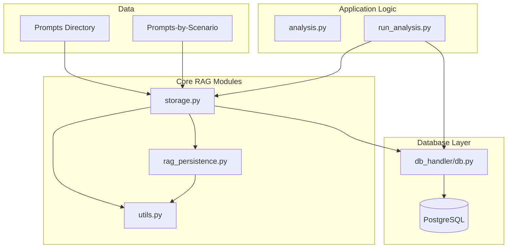
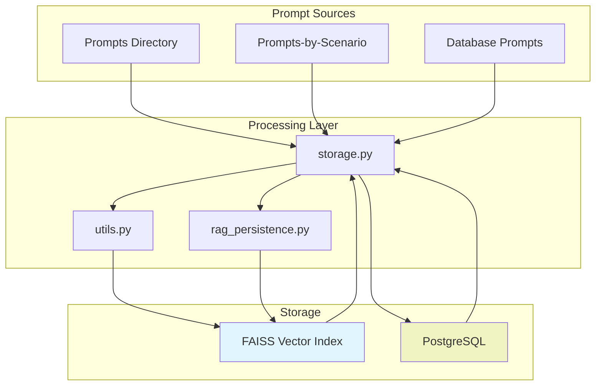
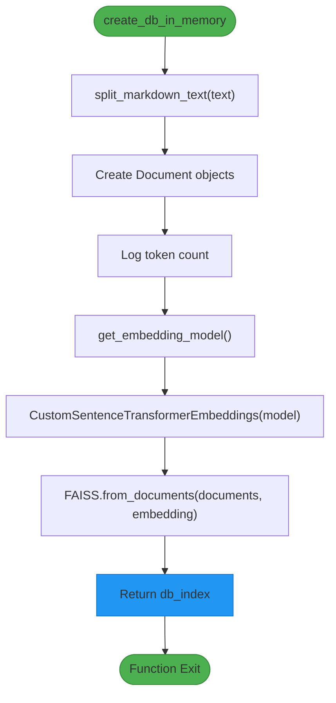
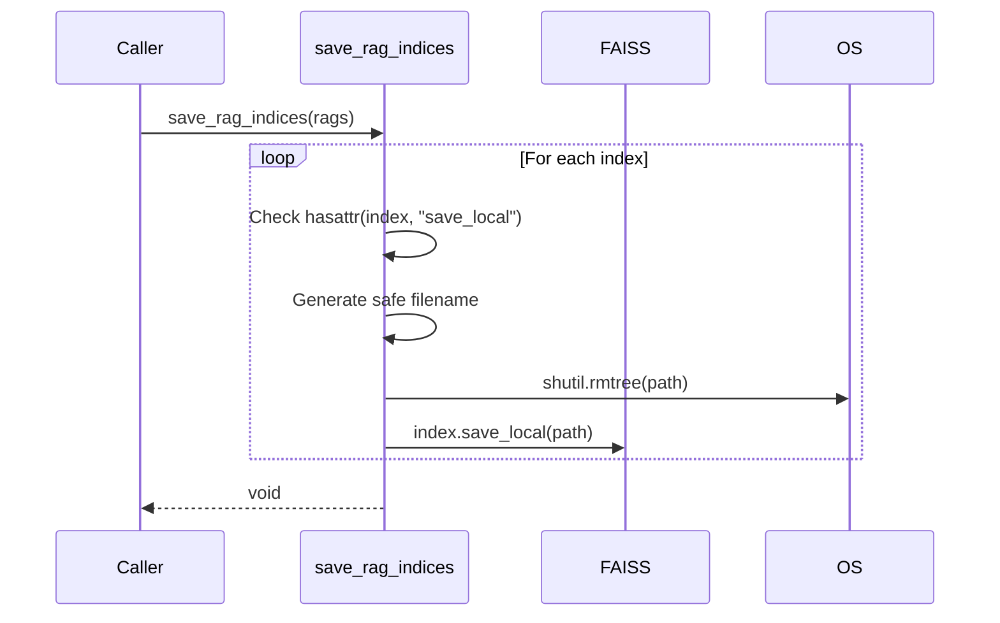
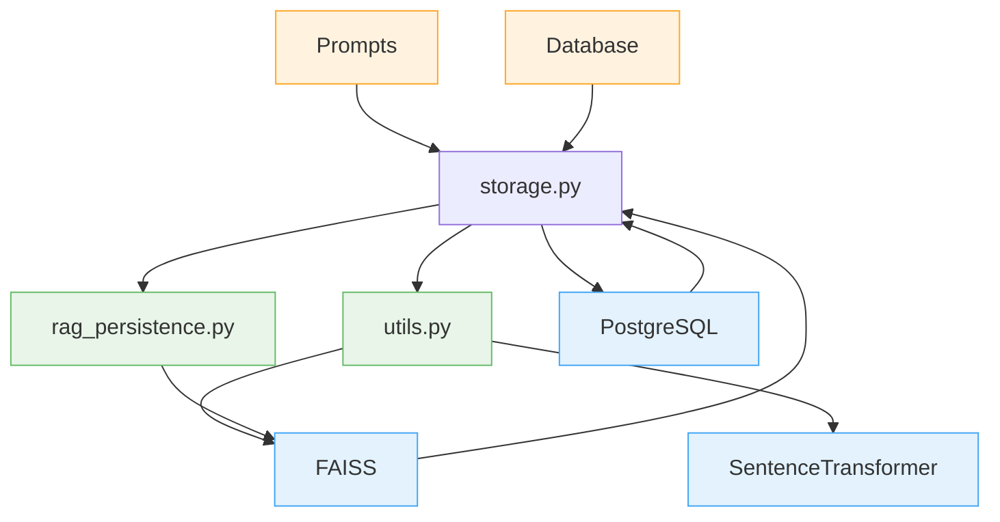

# RAG Storage API

<cite>
**Referenced Files in This Document**   
- [src/storage.py](file://src/storage.py#L1-L310)
- [src/rag_persistence.py](file://src/rag_persistence.py#L1-L37)
- [src/db_handler/db.py](file://src/db_handler/db.py#L1-L399)
- [src/utils.py](file://src/utils.py#L1-L106)
</cite>

## Table of Contents
1. [Introduction](#introduction)
2. [Project Structure](#project-structure)
3. [Core Components](#core-components)
4. [Architecture Overview](#architecture-overview)
5. [Detailed Component Analysis](#detailed-component-analysis)
6. [Dependency Analysis](#dependency-analysis)
7. [Performance Considerations](#performance-considerations)

## Introduction
This document provides comprehensive API documentation for the Retrieval-Augmented Generation (RAG) storage system used in the VoxPersona project. The system enables semantic retrieval of contextual prompts based on business type (hotel, restaurant, spa) and analysis scenario (design, interview). It leverages FAISS for vector indexing, SentenceTransformers for embedding generation, and PostgreSQL for persistent metadata storage. This documentation details the core storage mechanisms, vector database lifecycle, prompt retrieval logic, and integration points across key modules.

## Project Structure
The project is organized into modular components with clear separation of concerns. The RAG functionality is primarily located in the `src` directory, with supporting data in `prompts` and `prompts-by-scenario`. The system uses a layered architecture combining vector search, relational persistence, and application logic.



**Diagram sources**
- [src/storage.py](file://src/storage.py#L1-L310)
- [src/rag_persistence.py](file://src/rag_persistence.py#L1-L37)
- [src/db_handler/db.py](file://src/db_handler/db.py#L1-L399)

**Section sources**
- [src/storage.py](file://src/storage.py#L1-L310)
- [src/rag_persistence.py](file://src/rag_persistence.py#L1-L37)

## Core Components
The RAG storage system consists of three primary components: in-memory vector database creation (`create_db_in_memory`), disk-based index persistence (`save_rag_indices`, `load_rag_indices`), and integration with PostgreSQL for metadata and prompt storage. The system retrieves prompts based on scenario, business type, and report type, then converts them into searchable embeddings. The workflow begins with prompt loading from either flat files or the database, followed by text chunking, embedding generation using SentenceTransformers, and FAISS index construction.

**Section sources**
- [src/storage.py](file://src/storage.py#L1-L310)
- [src/rag_persistence.py](file://src/rag_persistence.py#L1-L37)
- [src/utils.py](file://src/utils.py#L1-L106)

## Architecture Overview
The RAG storage architecture follows a hybrid persistence model combining ephemeral vector search with durable relational storage. During analysis, relevant prompts are retrieved from the database or file system, converted into embeddings, and indexed in a FAISS vector store. This index can be persisted to disk for reuse or kept in memory for single-session use. The system integrates with PostgreSQL via `db_handler/db.py` to store audit results, transcriptions, and user navigation paths (user_road), enabling traceability between generated content and source prompts.



**Diagram sources**
- [src/storage.py](file://src/storage.py#L1-L310)
- [src/rag_persistence.py](file://src/rag_persistence.py#L1-L37)
- [src/db_handler/db.py](file://src/db_handler/db.py#L1-L399)

## Detailed Component Analysis

### storage.py Analysis
The `storage.py` module contains core functions for RAG operations, including vector database creation, user input persistence, and report grouping.

#### create_db_in_memory Function
This function creates an in-memory FAISS vector database from markdown text. It splits the input into chunks, generates embeddings using a SentenceTransformer model, and constructs a searchable index.



**Diagram sources**
- [src/storage.py](file://src/storage.py#L45-L95)
- [src/utils.py](file://src/utils.py#L50-L55)

**Section sources**
- [src/storage.py](file://src/storage.py#L45-L95)

#### store_embeddings (via create_db_in_memory)
Although not explicitly named `store_embeddings`, the `create_db_in_memory` function serves this purpose by creating a vector database from text chunks.

**:Parameters:**
- `markdown_text`: str - Input markdown content to be embedded

**:Return Type:**
- FAISS - In-memory vector index

**:Internal Workflow:**
1. Text is split into chunks using `split_markdown_text` with default 800/100 chunk/overlap size
2. Chunks are converted to LangChain Document objects
3. Token count is estimated (words × 1.5)
4. SentenceTransformer model is loaded via `get_embedding_model`
5. Custom embeddings wrapper is created
6. FAISS index is built using `from_documents`

**:Example Usage:**
```python
index = create_db_in_memory("# Audit Methodology\nThis section covers...")
```

#### retrieve_context (via build_reports_grouped)
The `build_reports_grouped` function retrieves contextual audit reports from the database, serving as a retrieval mechanism for historical analysis.

**:Parameters:**
- `scenario_name`: str - 'Design' or 'Interview'
- `report_type`: str | None - Optional filter for specific report type

**:Return Type:**
- dict[int, list[str]] - Mapping of transcription_id to list of formatted report strings

**:Internal Workflow:**
1. Executes SQL query `_SQL` to fetch audit data joined with metadata
2. Groups results by transcription_id
3. For each record, creates a JSON header and appends cleaned audit text
4. Returns grouped dictionary

**:Example Usage:**
```python
context = build_reports_grouped("Interview", "General Factors")
```

**Section sources**
- [src/storage.py](file://src/storage.py#L200-L250)

#### create_vector_db (via create_db_in_memory)
The `create_db_in_memory` function effectively serves as `create_vector_db`, creating a FAISS vector store from input text.

**:Parameters:**
- `markdown_text`: str - Source content for vectorization

**:Return Type:**
- FAISS - Configured vector database instance

**:Configuration:**
- Embedding Model: all-MiniLM-L6-v2 (CPU)
- Chunk Size: 800 tokens
- Overlap: 100 tokens
- Separator Priority: ["\n\n", "\n", " ", ""]

**:Performance Notes:**
- Token estimation uses 1.5× word count
- Index is created in memory only (no automatic disk persistence)
- Logging provides chunk and token statistics

**Section sources**
- [src/storage.py](file://src/storage.py#L45-L95)

### rag_persistence.py Analysis
This module manages the lifecycle of FAISS indices, providing save and load functionality to disk.

#### save_rag_indices Function
Persists multiple FAISS indices to the filesystem using safe filenames.



**:Parameters:**
- `rags`: dict - Dictionary of {name: FAISS index} pairs

**:Implementation:**
- Skips indices without `save_local` method
- Uses `safe_filename` for filesystem compatibility
- Removes existing directory before saving
- Calls native FAISS `save_local` method

**Diagram sources**
- [src/rag_persistence.py](file://src/rag_persistence.py#L10-L18)

#### load_rag_indices Function
Loads previously saved FAISS indices from disk into memory.

**:Return Type:**
- dict - {filename: FAISS index} mapping

**:Implementation:**
- Retrieves embedding model via `get_embedding_model`
- Wraps model in `CustomSentenceTransformerEmbeddings`
- Iterates through RAG_INDEX_DIR subdirectories
- Attempts to load each as FAISS index
- Continues on failure (no exception propagation)

**:Configuration:**
- Base Directory: Configured via `RAG_INDEX_DIR` in config.py
- Embedding Model: Must match saving configuration

**Section sources**
- [src/rag_persistence.py](file://src/rag_persistence.py#L20-L37)

### db_handler/db.py Analysis
This module provides the database interface for persistent storage of prompts, audits, and metadata.

#### Prompt Retrieval Workflow
The system retrieves prompts based on business context through `fetch_prompts_for_scenario_reporttype_building`.

**:Parameters:**
- `scenario_name`: str - e.g., "Interview"
- `report_type_desc`: str - e.g., "General Factors"
- `building_type`: str - e.g., "hotel"

**:Return Type:**
- list[tuple] - (prompt_text, run_part, is_json_prompt)

**:Database Flow:**
1. Joins scenario → report_type → buildings_report_type → buildings
2. Joins with prompts_buildings → prompts
3. Filters by input parameters
4. Orders by run_part (execution sequence)

**:Example SQL:**
```sql
SELECT p.prompt, p.run_part, p.is_json_prompt
FROM scenario s
JOIN report_type rt ON s.scenario_id = rt.scenario_id
JOIN buildings_report_type brt ON rt.report_type_id = brt.report_type_id
JOIN buildings b ON brt.building_id = b.building_id
JOIN prompts_buildings pb ON pb.building_id = brt.building_id 
    AND pb.report_type_id = brt.report_type_id
JOIN prompts p ON p.prompt_id = pb.prompt_id
WHERE s.scenario_name = %s 
    AND rt.report_type_desc = %s 
    AND b.building_type = %s
ORDER BY p.run_part;
```

**:Integration with File System:**
When database prompts are unavailable, the system falls back to files in `prompts/` and `prompts-by-scenario/` directories, with Russian filenames safely mapped via `safe_filename`.

**Section sources**
- [src/db_handler/db.py](file://src/db_handler/db.py#L300-L350)

## Dependency Analysis
The RAG storage system has well-defined dependencies between components, forming a cohesive pipeline from prompt retrieval to vector search.



**Diagram sources**
- [src/storage.py](file://src/storage.py#L1-L310)
- [src/rag_persistence.py](file://src/rag_persistence.py#L1-L37)
- [src/utils.py](file://src/utils.py#L1-L106)
- [src/db_handler/db.py](file://src/db_handler/db.py#L1-L399)

## Performance Considerations
The RAG storage system includes several performance optimizations and considerations:

**:Indexing Strategies:**
- Text is split into 800-token chunks with 100-token overlap
- Chunking prioritizes paragraph breaks ("\n\n") and line breaks ("\n")
- Token counting uses word count × 1.5 estimation
- In-memory indexing avoids disk I/O during analysis

**:Search Configuration:**
- No explicit similarity threshold is set (defaults to FAISS configuration)
- Search uses exact embedding matches via SentenceTransformer
- Model: all-MiniLM-L6-v2 optimized for CPU inference

**:Large Dataset Considerations:**
- `build_reports_grouped` loads all matching records into memory
- No pagination or streaming for large result sets
- FAISS indices can be persisted to disk via `rag_persistence.py`
- Memory usage scales with number of chunks and embedding dimension

**:Cache Management:**
- No explicit caching layer
- `rag_persistence.py` provides disk-based persistence as cache alternative
- Database query results are not cached at application level
- Embedding model is cached globally in `utils.py`

**:Optimization Opportunities:**
1. Implement result pagination for `build_reports_grouped`
2. Add LRU cache for frequent prompt retrievals
3. Use approximate search parameters for faster retrieval
4. Implement incremental indexing for large prompt sets
5. Add similarity threshold filtering in retrieval functions