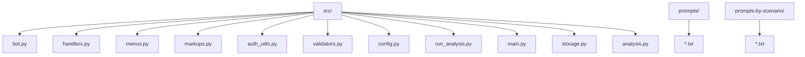
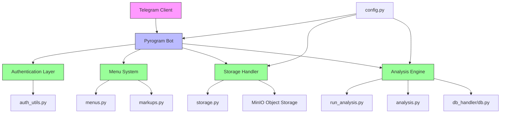
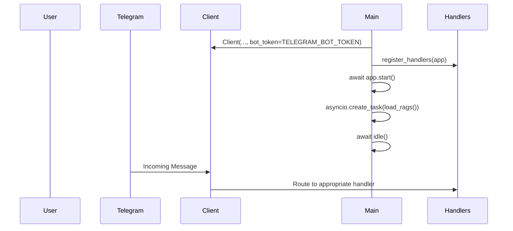
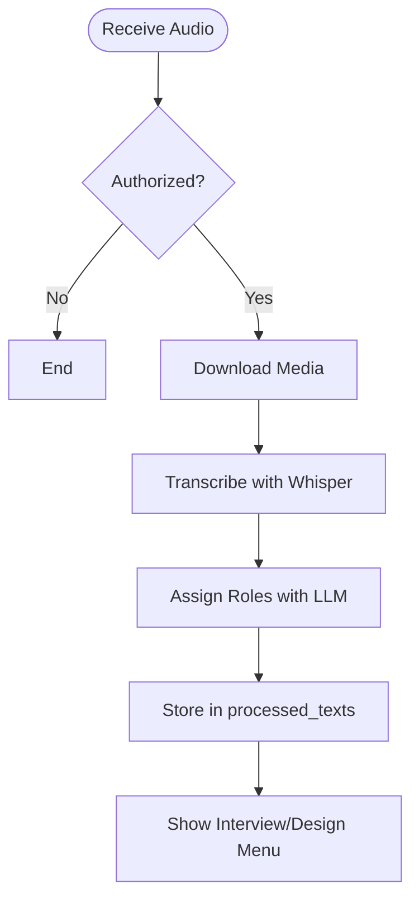
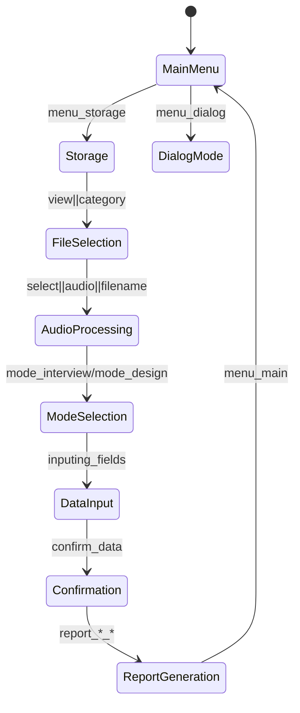
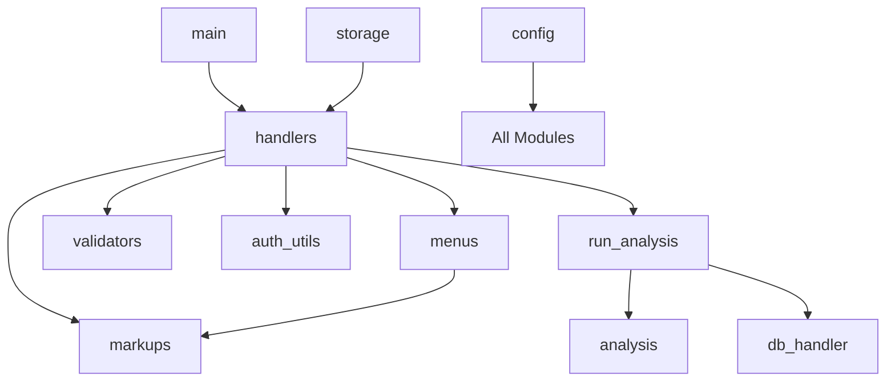

# Telegram Bot API

<cite>
**Referenced Files in This Document**   
- [bot.py](file://src/bot.py)
- [handlers.py](file://src/handlers.py)
- [menus.py](file://src/menus.py)
- [markups.py](file://src/markups.py)
- [auth_utils.py](file://src/auth_utils.py)
- [validators.py](file://src/validators.py)
- [config.py](file://src/config.py)
- [run_analysis.py](file://src/run_analysis.py)
- [main.py](file://src/main.py)
</cite>

## Table of Contents
1. [Introduction](#introduction)
2. [Project Structure](#project-structure)
3. [Core Components](#core-components)
4. [Architecture Overview](#architecture-overview)
5. [Detailed Component Analysis](#detailed-component-analysis)
6. [Dependency Analysis](#dependency-analysis)
7. [Performance Considerations](#performance-considerations)
8. [Troubleshooting Guide](#troubleshooting-guide)
9. [Conclusion](#conclusion)

## Introduction
The VoxPersona Telegram Bot is a voice and document processing interface that transcribes audio, assigns speaker roles, and generates structured analytical reports using large language models (LLMs). The system supports two primary modes: Interview and Design, each with specific report types. It integrates with OpenAI's Whisper for transcription and VSEGPT (Claude-based) for analysis. The bot enforces user authentication, manages user sessions, and provides interactive menu navigation via Telegram's callback interface.

## Project Structure
The project follows a modular structure with distinct directories for prompts, scenario-specific configurations, and core source code. The `src` directory contains all functional modules, including the Telegram bot interface, analysis logic, storage utilities, and configuration.



**Diagram sources**
- [bot.py](file://src/bot.py#L1-L670)
- [handlers.py](file://src/handlers.py#L1-L799)
- [config.py](file://src/config.py#L1-L93)

**Section sources**
- [bot.py](file://src/bot.py#L1-L670)
- [config.py](file://src/config.py#L1-L93)

## Core Components
The core components of the Telegram Bot API include the Pyrogram client initialization, command handlers, message processors, menu system, authentication mechanism, and analysis pipeline. The bot processes voice messages, transcribes them using Whisper, assigns speaker roles using an LLM, and enables users to generate structured reports based on predefined templates.

**Section sources**
- [bot.py](file://src/bot.py#L1-L670)
- [handlers.py](file://src/handlers.py#L1-L799)

## Architecture Overview
The system architecture is event-driven, built on Pyrogram's asynchronous framework. It follows a layered pattern with separation between interface (Telegram), business logic (analysis), data storage (MinIO, DB), and configuration.



**Diagram sources**
- [bot.py](file://src/bot.py#L1-L670)
- [handlers.py](file://src/handlers.py#L1-L799)
- [config.py](file://src/config.py#L1-L93)

## Detailed Component Analysis

### Bot Initialization and Client Setup
The Telegram bot is initialized using Pyrogram's `Client` class with credentials loaded from environment variables. The event loop is managed through Pyrogram's built-in `idle()` mechanism, with async support enhanced by `nest_asyncio`.



**Diagram sources**
- [main.py](file://src/main.py#L1-L95)
- [bot.py](file://src/bot.py#L1-L670)

**Section sources**
- [main.py](file://src/main.py#L1-L95)
- [bot.py](file://src/bot.py#L1-L670)

### Command Handlers: /start and /help
The `/start` command triggers authentication. Unauthorized users are prompted for a password. Upon successful entry, they gain access to the main menu. The `/help` command displays information about report structures and system capabilities.

```python
@app.on_message(filters.command("start"))
def cmd_start(client, message: Message):
    c_id = message.chat.id
    if c_id not in authorized_users:
        app.send_message(c_id, "Вы не авторизованы. Введите пароль:")
    else:
        send_main_menu(c_id)
```

The help menu is dynamically generated and includes structured information about interview and design report types.

**Section sources**
- [bot.py](file://src/bot.py#L300-L308)
- [markups.py](file://src/markups.py#L94-L132)

### Message Routing and Audio Processing
Voice and audio messages are processed through a dedicated handler that downloads the media, transcribes it using Whisper, assigns speaker roles via an LLM, and stores the processed text for further analysis.



The handler uses threading for spinner animation during long-running operations and ensures cleanup of temporary files.

**Diagram sources**
- [bot.py](file://src/bot.py#L310-L390)
- [handlers.py](file://src/handlers.py#L200-L300)

**Section sources**
- [bot.py](file://src/bot.py#L310-L390)
- [handlers.py](file://src/handlers.py#L200-L300)

### User State Management and Session Tracking
User interactions are tracked using the `user_states` dictionary, which maintains context across messages. Each user session stores:
- Current interaction mode (interview/design)
- Data collection step
- Collected metadata (employee name, date, building type, etc.)

```python
user_states: dict[int, dict] = {}
# Example structure:
# {
#   123456: {
#     "mode": "interview",
#     "step": "ask_employee",
#     "data": {"audio_number": 1, "date": "2025-01-01"}
#   }
# }
```

State transitions occur as users provide input, with validation at each step.

**Section sources**
- [config.py](file://src/config.py#L80-L83)
- [handlers.py](file://src/handlers.py#L50-L150)

### Menu System and Dynamic Menu Generation
The menu system uses Telegram's `CallbackQuery` interface to provide interactive navigation. Menus are dynamically generated based on user context and stored file availability.

```python
def main_menu_markup():
    return InlineKeyboardMarkup([
        [InlineKeyboardButton("📁 Storage", callback_data="menu_storage")],
        [InlineKeyboardButton("Dialog Mode", callback_data="menu_dialog")],
        [InlineKeyboardButton("❓ Help", callback_data="menu_help")]
    ])
```

Menus are registered and tracked to allow cleanup of previous messages, preventing clutter.

**Section sources**
- [menus.py](file://src/menus.py#L1-L93)
- [markups.py](file://src/markups.py#L1-L132)

### Reply Keyboard Layouts and Interaction Flows
Reply keyboards are defined in `markups.py` and include:
- Main navigation
- Report selection
- Data confirmation
- Field editing

The interaction flow follows a wizard pattern:
1. Select mode (Interview/Design)
2. Upload or select audio
3. Enter metadata
4. Confirm data
5. Generate report



**Diagram sources**
- [markups.py](file://src/markups.py#L1-L132)
- [handlers.py](file://src/handlers.py#L150-L200)

### Async Message Handling and Error Recovery
Long-running operations (transcription, analysis) use threading with spinner animation. Errors are caught and reported to users without crashing the bot.

```python
def run_loading_animation(chat_id: int, msg_id: int, stop_event: threading.Event):
    idx = 0
    while not stop_event.is_set():
        sp = spinner_chars[idx % len(spinner_chars)]
        try:
            app.edit_message_text(chat_id, msg_id, f"⏳ Processing... {sp}")
        except:
            pass
        idx += 1
        time.sleep(0.5)
```

The `run_analysis_with_spinner` function encapsulates this pattern, providing consistent UX during processing.

**Section sources**
- [bot.py](file://src/bot.py#L150-L180)
- [run_analysis.py](file://src/run_analysis.py#L200-L343)

### Authentication and Input Validation
Authentication uses a simple password mechanism stored in environment variables. Input validation is performed at multiple levels:

```python
def handle_unauthorized_user(authorized_users: set, message: Message, app: Client):
    if message.text.strip() == PASSWORD:
        authorize_user(authorized_users, message.chat.id, app)
    else:
        request_password(message.chat.id, app)
```

Validators ensure:
- Correct date format (YYYY-MM-DD)
- Valid building types
- Authorized access
- Proper file detection

```python
def validate_date_format(date_str: str) -> bool:
    pattern = r"^\d{4}-\d{2}-\d{2}$"
    return bool(re.match(pattern, date_str))
```

**Section sources**
- [auth_utils.py](file://src/auth_utils.py#L1-L17)
- [validators.py](file://src/validators.py#L1-L49)

## Dependency Analysis
The system has a clear dependency hierarchy with minimal circular references.



The `config.py` module is imported by nearly all components for shared state and settings. The `handlers.py` file acts as the central router, depending on most other modules.

**Diagram sources**
- [main.py](file://src/main.py#L1-L95)
- [handlers.py](file://src/handlers.py#L1-L799)

**Section sources**
- [main.py](file://src/main.py#L1-L95)
- [handlers.py](file://src/handlers.py#L1-L799)

## Performance Considerations
The system handles large audio files (up to 2GB) by:
- Streaming downloads
- Chunked transcription for files >24MB
- Background processing with spinner feedback
- Temporary file cleanup

LLM analysis uses prompt batching and JSON output formatting for structured data extraction. The RAG system preloads indices for faster retrieval.

For optimal performance:
- Ensure sufficient disk space for temporary audio files
- Use fast storage for MinIO buckets
- Maintain stable API keys for Whisper and VSEGPT
- Monitor memory usage during concurrent sessions

## Troubleshooting Guide
Common issues and solutions:

**Authentication Failure**
- Symptom: "Вы не авторизованы" despite correct password
- Solution: Verify `PASSWORD` in `.env` matches input

**Transcription Errors**
- Symptom: "Whisper недоступен"
- Solution: Check `OPENAI_API_KEY` validity and region access

**File Processing Failures**
- Symptom: "Файл не найден" in storage
- Solution: Verify file exists in correct subdirectory under `STORAGE_DIRS`

**Analysis Timeouts**
- Symptom: Spinner runs indefinitely
- Solution: Check VSEGPT API key and network connectivity

**Menu Navigation Issues**
- Symptom: Buttons don't respond
- Solution: Bot may have crashed; check logs for exceptions

**Section sources**
- [bot.py](file://src/bot.py#L300-L670)
- [handlers.py](file://src/handlers.py#L1-L799)
- [run_analysis.py](file://src/run_analysis.py#L1-L343)

## Conclusion
The VoxPersona Telegram Bot provides a robust interface for voice-based data analysis with structured reporting capabilities. Its modular design separates concerns effectively, enabling maintainable code and clear extension points. The system demonstrates effective use of Pyrogram's event model, proper state management, and resilient error handling. Key strengths include dynamic menu generation, comprehensive input validation, and seamless integration with LLM services for automated analysis.