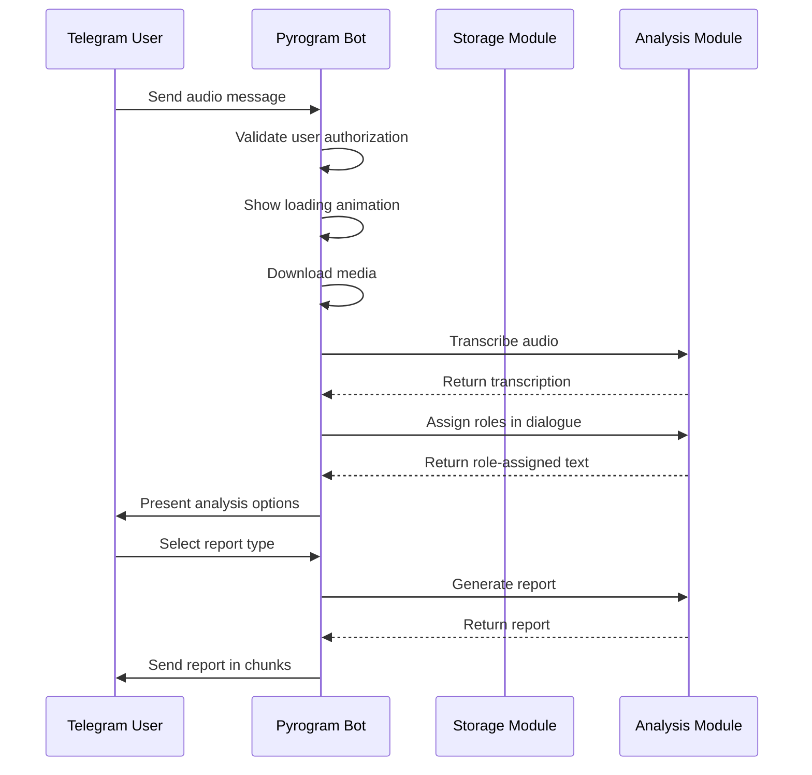
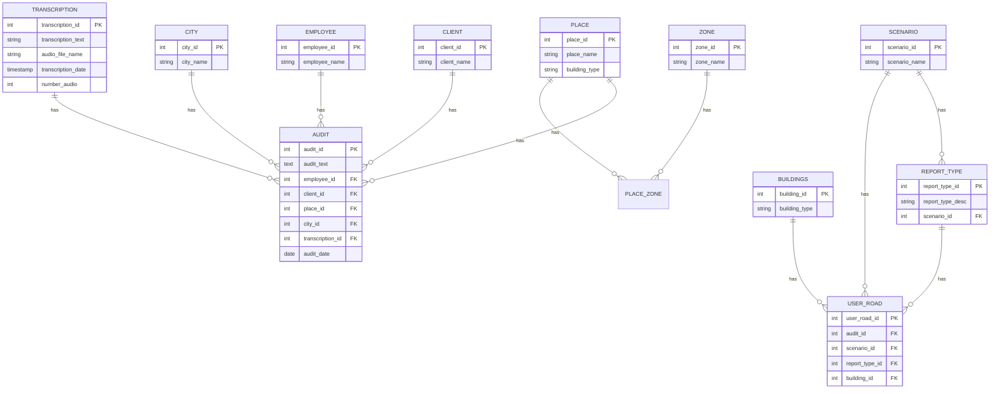
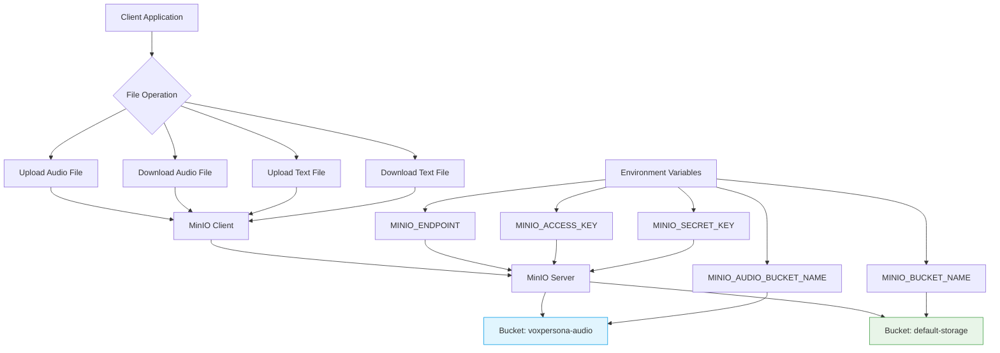
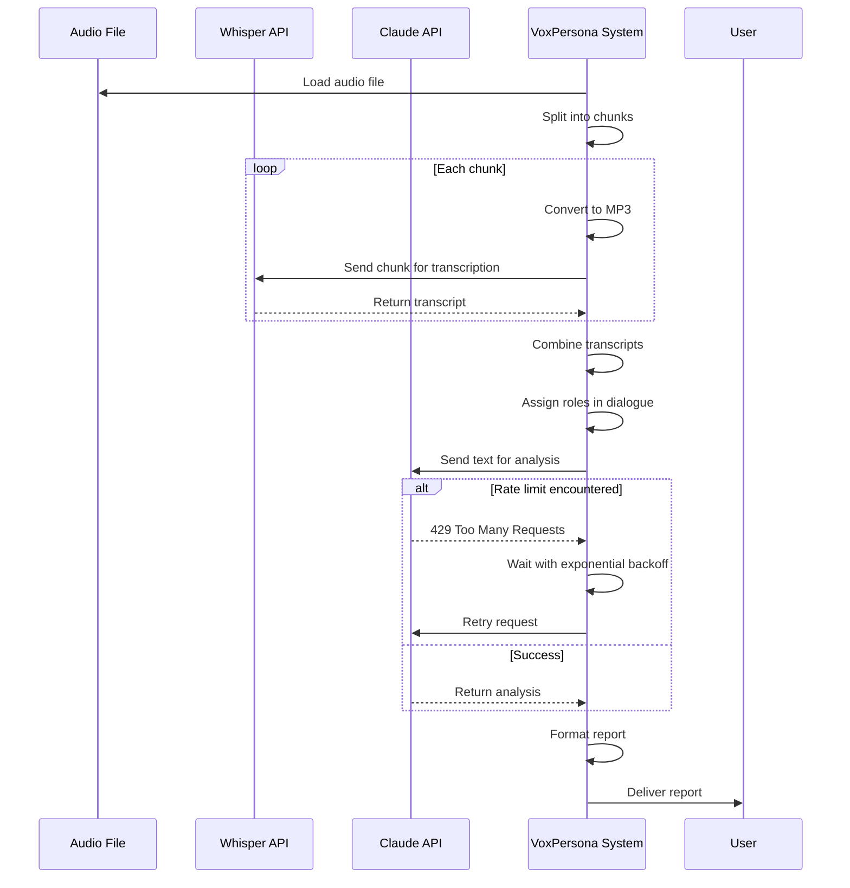

# API and Service Integration

<cite>
**Referenced Files in This Document**   
- [config.py](file://src/config.py)
- [bot.py](file://src/bot.py)
- [db.py](file://src/db_handler/db.py)
- [storage.py](file://src/storage.py)
- [analysis.py](file://src/analysis.py)
- [handlers.py](file://src/handlers.py)
- [docker-compose.yml](file://docker-compose.yml)
</cite>

## Table of Contents
1. [Introduction](#introduction)
2. [Telegram Bot Integration](#telegram-bot-integration)
3. [PostgreSQL Database Integration](#postgresql-database-integration)
4. [MinIO Object Storage Integration](#minio-object-storage-integration)
5. [OpenAI and Anthropic API Integration](#openai-and-anthropic-api-integration)
6. [Security and Error Handling](#security-and-error-handling)
7. [Conclusion](#conclusion)

## Introduction
VoxPersona is a comprehensive system designed for processing audio interviews and audits, transforming them into structured reports through advanced AI analysis. The system integrates multiple external services to achieve its functionality, including Telegram for user interaction, PostgreSQL for data persistence, MinIO for object storage, and AI services from OpenAI and Anthropic for transcription and analysis. This document details the integration patterns, configuration, and usage of these external services within the VoxPersona application. The architecture follows a modular design where each integration is encapsulated in dedicated modules, ensuring separation of concerns and maintainability.

## Telegram Bot Integration
The Telegram Bot integration in VoxPersona is implemented using Pyrogram, a modern Python library for Telegram's MTProto API. The bot serves as the primary user interface, handling audio messages, documents, and interactive menu commands. Authentication is configured through environment variables that store the Telegram Bot Token, API ID, and API Hash, which are loaded at runtime from the configuration system.

The bot client is initialized with these credentials and runs as a long-lived application instance. Message handling is implemented through Pyrogram's event-driven architecture, with specific filters for voice messages, audio files, documents, and callback queries from inline keyboards. When a user sends an audio message, the bot downloads the media, processes it through the transcription pipeline, and presents analysis options via interactive menus.

Interactive functionality is provided through inline keyboard markups that allow users to navigate between different analysis modes (Interview and Design), access stored files, and generate various types of reports. The bot maintains user state through dictionaries that track active menus, processed texts, and authorization status. A spinner animation provides visual feedback during processing operations, enhancing the user experience.

**Diagram sources**
- [bot.py](file://src/bot.py#L70-L113)
- [bot.py](file://src/bot.py#L300-L350)
- [analysis.py](file://src/analysis.py#L400-L450)

**Section sources**
- [bot.py](file://src/bot.py#L0-L670)
- [config.py](file://src/config.py#L38-L70)
- [handlers.py](file://src/handlers.py#L0-L45)

## PostgreSQL Database Integration
The PostgreSQL integration in VoxPersona is implemented using psycopg2, a PostgreSQL adapter for Python. The database serves as the primary data persistence layer, storing audit records, transcriptions, user configurations, and metadata about clients, employees, and locations. The integration is configured through environment variables that define the database connection parameters, with support for both production and test environments through a RUN_MODE configuration flag.

Connection management is handled through a connection pooling pattern implemented with the `get_db_connection()` function, which creates new connections as needed. The integration uses a decorator pattern with `@db_transaction` to ensure that database operations are performed within proper transaction contexts, with automatic commit or rollback based on operation success. This pattern simplifies error handling and ensures data consistency across related operations.

The database module provides a comprehensive set of functions for CRUD operations on various entities, following a "get or create" pattern that ensures referential integrity while minimizing duplicate entries. For example, `get_or_create_client()` checks if a client already exists by name before creating a new record, returning the appropriate client_id in either case. More complex operations like `save_user_road()` orchestrate multiple related database operations within a single transaction, ensuring that the relationships between audits, scenarios, report types, and buildings are properly maintained.

**Diagram sources**
- [db.py](file://src/db_handler/db.py#L0-L399)
- [docker-compose.yml](file://docker-compose.yml#L45-L68)

**Section sources**
- [db.py](file://src/db_handler/db.py#L0-L399)
- [config.py](file://src/config.py#L38-L70)
- [storage.py](file://src/storage.py#L0-L310)

## MinIO Object Storage Integration
The MinIO object storage integration in VoxPersona provides durable storage for audio files and text documents. MinIO is configured as an S3-compatible object storage service, allowing the application to store and retrieve files using standard object storage patterns. The integration is configured through environment variables that specify the MinIO endpoint, access key, secret key, and bucket names for different types of content.

The application creates two primary buckets: one for general storage (MINIO_BUCKET_NAME) and another specifically for audio files (MINIO_AUDIO_BUCKET_NAME). During initialization, the application checks for the existence of these buckets and creates them if they don't exist, ensuring that the storage infrastructure is properly set up before any file operations occur.

File operations are implemented through the MinIO Python client, which provides methods for uploading, downloading, and managing objects in the buckets. The integration includes error handling for common S3 errors, such as network issues or permission problems, ensuring that the application can gracefully handle storage-related failures. The storage module also provides utility functions for safely handling filenames, including transliteration of Cyrillic characters and sanitization of special characters to ensure compatibility with filesystems and URLs.

**Diagram sources**
- [handlers.py](file://src/handlers.py#L40-L85)
- [config.py](file://src/config.py#L50-L55)
- [docker-compose.yml](file://docker-compose.yml#L35-L37)

**Section sources**
- [handlers.py](file://src/handlers.py#L40-L85)
- [storage.py](file://src/storage.py#L0-L310)
- [config.py](file://src/config.py#L50-L55)

## OpenAI and Anthropic API Integration
The OpenAI and Anthropic API integration in VoxPersona enables advanced AI-powered processing of audio and text content. The system uses OpenAI's Whisper model for audio transcription and Anthropic's Claude models for text analysis and report generation. API authentication is managed through environment variables that store multiple API keys, allowing the system to distribute requests across different accounts to manage rate limits and costs.

The transcription functionality is implemented in the `transcribe_audio_raw()` function, which handles audio files of any size by splitting them into chunks that comply with API size limits. Each chunk is converted to MP3 format and sent to the Whisper API for transcription. The results are then combined to produce a complete transcript. This approach ensures that even large audio files can be processed reliably without exceeding API constraints.

For text analysis, the system uses Anthropic's API through the `send_msg_to_model()` function, which implements robust error handling and retry logic for rate limiting. When a rate limit error occurs, the function implements exponential backoff, waiting progressively longer between retry attempts. The system also supports parallel processing of text chunks across multiple API keys, allowing it to maximize throughput while respecting individual account rate limits. This is particularly important for the `extract_from_chunk_parallel()` function, which processes large documents by distributing chunks across multiple models with different token and request rate limits.

**Diagram sources**
- [analysis.py](file://src/analysis.py#L0-L490)
- [config.py](file://src/config.py#L10-L20)
- [bot.py](file://src/bot.py#L200-L250)

**Section sources**
- [analysis.py](file://src/analysis.py#L0-L490)
- [config.py](file://src/config.py#L10-L20)
- [bot.py](file://src/bot.py#L200-L250)

## Security and Error Handling
VoxPersona implements comprehensive security and error handling practices to ensure reliable operation and protect sensitive data. API key management follows the principle of least privilege, with keys stored exclusively in environment variables and never hardcoded in the source code. The configuration system uses dotenv to load these keys at runtime, preventing accidental exposure in version control systems.

Authentication is implemented at multiple levels: Telegram user authorization through a password mechanism, API authentication for external services, and database connection security through encrypted credentials. The system validates that all required API keys are present at startup, failing fast if any are missing, which prevents partial or insecure operation.

Error handling is implemented throughout the codebase with specific strategies for different types of failures. Network-related errors, particularly from external APIs, are handled with retry mechanisms that use exponential backoff to avoid overwhelming services during temporary outages. The system logs detailed error information for debugging while presenting user-friendly messages to end users. For critical operations like database transactions, the system uses try-except blocks to ensure that failures do not leave the data in an inconsistent state.

Rate limiting is proactively managed for AI service APIs, with the system distributing requests across multiple API keys to maximize available quotas. The parallel processing functions monitor token and request rates, introducing delays as needed to stay within service limits. This approach ensures reliable service even under heavy load while minimizing costs.

## Conclusion
VoxPersona demonstrates a robust integration of multiple external services to create a comprehensive audio analysis and reporting system. The architecture effectively separates concerns, with dedicated modules for each integration point, making the system maintainable and extensible. The use of environment variables for configuration allows for easy deployment across different environments, while the error handling and retry mechanisms ensure reliable operation despite network and service dependencies. The system's design balances functionality with security, protecting API keys and user data while providing a seamless user experience through the Telegram interface. Future enhancements could include more sophisticated load balancing across AI service providers, enhanced monitoring of integration health, and additional storage backends for improved redundancy.