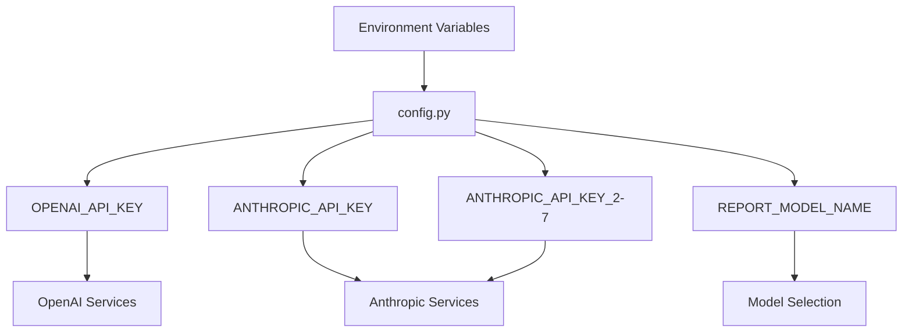

# LLM API Integration (OpenAI/Anthropic)

<cite>
**Referenced Files in This Document**   
- [config.py](file://src/config.py)
- [analysis.py](file://src/analysis.py)
- [run_analysis.py](file://src/run_analysis.py)
- [utils.py](file://src/utils.py)
- [docker-compose.yml](file://docker-compose.yml)
</cite>

## Table of Contents
1. [Introduction](#introduction)
2. [API Key Management and Configuration](#api-key-management-and-configuration)
3. [Analysis Workflow Integration](#analysis-workflow-integration)
4. [Request Formatting and Prompt Templating](#request-formatting-and-prompt-templating)
5. [Token Management with tiktoken](#token-management-with-tiktoken)
6. [Rate Limiting and Retry Logic](#rate-limiting-and-retry-logic)
7. [Error Handling and Failure Recovery](#error-handling-and-failure-recovery)
8. [Cost Optimization and Model Selection](#cost-optimization-and-model-selection)
9. [Response Validation and Quality Assurance](#response-validation-and-quality-assurance)
10. [Troubleshooting Common Issues](#troubleshooting-common-issues)

## Introduction
VoxPersona integrates external Large Language Model (LLM) services from OpenAI and Anthropic to power its transcription and structured report generation capabilities. This documentation details the architecture and implementation of LLM API integration, focusing on secure API key management, analysis workflow orchestration, request formatting, rate limiting compliance, and error handling strategies. The system processes audio interviews and audit data through a multi-stage pipeline that leverages both OpenAI's Whisper for transcription and Anthropic's Claude models for sophisticated text analysis and structured report generation.

## API Key Management and Configuration

VoxPersona implements a secure and flexible API key management system through environment variables and configuration files. The system supports multiple API keys for load balancing and redundancy across Anthropic's services.

The primary configuration is handled in `config.py`, which loads API credentials from environment variables using the `python-dotenv` package. This approach ensures that sensitive credentials are never hardcoded in the source code and can be securely managed through deployment environments.



**Diagram sources**
- [config.py](file://src/config.py#L1-L93)
- [docker-compose.yml](file://docker-compose.yml#L1-L37)

The system utilizes seven distinct Anthropic API keys (ANTHROPIC_API_KEY through ANTHROPIC_API_KEY_7), enabling parallel processing and load distribution across multiple authentication credentials. This design provides both rate limit headroom and failover capabilities. The configuration also includes OpenAI credentials for Whisper-based transcription services.

All API keys are validated at startup to ensure essential services are available:

```python
if not all([OPENAI_API_KEY, ANTHROPIC_API_KEY, TELEGRAM_BOT_TOKEN, API_ID, API_HASH]):
    raise ValueError("Not all required keys are defined!")
```

This comprehensive key management approach allows for seamless integration with external LLM providers while maintaining security best practices through environment-based credential storage.

**Section sources**
- [config.py](file://src/config.py#L1-L93)
- [docker-compose.yml](file://docker-compose.yml#L1-L37)

## Analysis Workflow Integration

The LLM integration is orchestrated through a sophisticated workflow that connects configuration, analysis, and execution components. The system processes data through a pipeline that begins with audio transcription and progresses through multiple stages of structured analysis.

The core integration occurs in `run_analysis.py`, which coordinates the analysis workflow by injecting API keys from the configuration into the analysis functions. The system uses multiple Anthropic API keys to distribute processing load:

```python
api_keys = [ANTHROPIC_API_KEY, ANTHROPIC_API_KEY_2, ANTHROPIC_API_KEY_3, 
           ANTHROPIC_API_KEY_4, ANTHROPIC_API_KEY_5, ANTHROPIC_API_KEY_6, 
           ANTHROPIC_API_KEY_7]
```

The workflow follows a two-pass approach for comprehensive analysis:
1. **Initial Analysis Pass**: Processes raw text through a series of prompts to generate preliminary insights
2. **Structured Analysis Pass**: Takes the initial results and formats them into structured JSON output

This two-stage process is implemented in `run_analysis_with_spinner`, which manages the user experience with loading animations while executing the analysis in background threads. The function retrieves prompts from the database based on scenario, report type, and building type, then executes them in sequence or parallel depending on the requirements.

For complex analyses like "Common Decision Factors," the system implements a three-phase approach:
- First pass with Part 1 prompts
- Second pass with Part 2 prompts  
- Final pass with JSON-formatted prompts to structure the combined results

This workflow design ensures that complex analyses are broken down into manageable steps while maintaining context between stages.

**Section sources**
- [run_analysis.py](file://src/run_analysis.py#L1-L343)
- [analysis.py](file://src/analysis.py#L1-L490)

## Request Formatting and Prompt Templating

VoxPersona employs a sophisticated prompt templating system that organizes prompts by scenario, report type, and building type. The system uses a hierarchical directory structure in the `prompts-by-scenario` folder to organize prompts for different use cases.

The request formatting process involves several key components:

1. **Prompt Retrieval**: Prompts are fetched from the database using `fetch_prompt_by_name` based on the analysis scenario
2. **Template Composition**: The system combines prompts with input text using structured formatting
3. **JSON Mode Usage**: For structured output generation, JSON-formatted prompts are used in a final processing pass

The system supports different prompt types through a tagging system:
- **JSON Prompts**: Used for structured output generation
- **Part-based Prompts**: Divided into sequential processing stages (Part 1, Part 2, etc.)
- **Scenario-specific Prompts**: Tailored for specific analysis types (Interview, Design, etc.)

When formatting requests, the system constructs messages with a consistent structure:

```python
messages = [
    {
        "role": "user",
        "content": [
            {
                "type": "text",
                "text": f"{prompt}\n\nDocument:\n{chunk}\n\n{text}"
            }
        ]
    }
]
```

This structure ensures that both the prompt instructions and the source material are clearly delineated for the LLM. The system also supports multi-stage analysis where the output of one prompt becomes the input for the next, enabling complex reasoning chains.

**Section sources**
- [analysis.py](file://src/analysis.py#L1-L490)
- [run_analysis.py](file://src/run_analysis.py#L1-L343)
- [db_handler/fill_prompts_table.py](file://src/db_handler/fill_prompts_table.py#L1-L213)

## Token Management with tiktoken

VoxPersona implements comprehensive token management using OpenAI's `tiktoken` library to ensure compliance with model token limits and optimize processing efficiency.

The token counting functionality is centralized in `utils.py` with the `count_tokens` function:

```python
def count_tokens(text: str) -> int:
    return len(ENC.encode(text)) + 10
```

The encoding is initialized in `config.py` based on the configured report model:

```python
try:
    ENC = tiktoken.encoding_for_model(REPORT_MODEL_NAME)
except KeyError:
    ENC = tiktoken.get_encoding("cl100k_base")
```

This approach ensures accurate token counting specific to the model being used, falling back to a default encoding if the model-specific encoder is not available.

The system uses token counting for several critical purposes:

1. **Rate Limit Compliance**: Token counts are used to calculate appropriate delays between requests to stay within TPM (Tokens Per Minute) limits
2. **Input Validation**: Ensures that requests do not exceed the model's maximum token capacity
3. **Cost Estimation**: Provides visibility into processing costs based on token usage
4. **Chunking Decisions**: Informs how text should be divided into processable chunks

The token management system is integrated throughout the analysis pipeline, with token counts being calculated for each processing chunk to ensure rate limit compliance and prevent API errors due to oversized requests.

**Section sources**
- [config.py](file://src/config.py#L1-L93)
- [utils.py](file://src/utils.py#L1-L105)

## Rate Limiting and Retry Logic

VoxPersona implements a sophisticated rate limiting system that manages both RPM (Requests Per Minute) and TPM (Tokens Per Minute) limits across multiple API keys. The system uses a combination of synchronous and asynchronous processing with built-in delays to ensure compliance with API rate limits.

The rate limiting strategy is implemented in `extract_from_chunk_parallel` and `extract_from_chunk_parallel_async` functions, which process text chunks across multiple models with controlled timing:

```mermaid
flowchart TD
A[Start Processing Chunk] --> B[Calculate Token Count]
B --> C[Calculate Token Delay]
C --> D[Calculate Request Delay]
D --> E[Compute Maximum Delay]
E --> F[Apply Delay: max(token_delay, request_delay)]
F --> G[Send API Request]
G --> H[Process Response]
H --> I[Next Chunk]
```

**Diagram sources**
- [analysis.py](file://src/analysis.py#L229-L369)

The system defines specific rate limits for different API keys:

- **Primary Model**: 80,000 tokens/minute, 2,000 requests/minute
- **Secondary Models**: 20,000 tokens/minute, 50 requests/minute

These limits are converted to per-second rates for precise delay calculation:

```python
token_rates = [tl/60.0 for tl in token_limits_per_min]
req_rates = [rl/60.0 for rl in req_limits_per_min]
```

For asynchronous operations, the system uses `BoundedSemaphore` to ensure that only one request is processed at a time per API key, preventing race conditions and ensuring rate limit compliance.

The retry logic is implemented in `send_msg_to_model_async` with exponential backoff for rate limit errors (HTTP 429 and 529):

```python
elif response.status in [429, 529]:
    logging.warning(f"[{err}] Received status {response.status}, waiting {backoff}s before retry...")
    await asyncio.sleep(backoff)
    backoff *= 2
```

This approach ensures that the system gracefully handles rate limiting by progressively increasing wait times between retries, reducing load on the API during periods of high demand.

**Section sources**
- [analysis.py](file://src/analysis.py#L197-L369)

## Error Handling and Failure Recovery

VoxPersona implements comprehensive error handling and failure recovery mechanisms to ensure robust operation despite API failures, timeouts, and other common issues.

The system employs a multi-layered error handling strategy:

### Synchronous Error Handling
The `send_msg_to_model` function handles rate limit errors with exponential backoff:

```python
except RateLimitError as e:
    if backoff > 16:
        logging.exception(f"Rate limit persists after backoff: {e}")
        raise
    logging.warning(f"Rate limit hit, waiting {backoff}s before retry...")
    time.sleep(backoff)
    backoff *= 2
```

### Asynchronous Error Handling
The `send_msg_to_model_async` function handles various HTTP status codes and network exceptions:

```python
if response.status == 200:
    result = await response.json()
    return result["content"][0]["text"]
elif response.status in [429, 529]:
    # Rate limit handling
else:
    # Other error handling
```

### Comprehensive Exception Handling
The system captures and logs various types of errors:
- **Rate Limit Errors**: 429 Too Many Requests, 529 Service Overloaded
- **Authentication Errors**: 401 Unauthorized, 403 Forbidden
- **Server Errors**: 5xx status codes
- **Network Exceptions**: Connection errors, timeouts
- **Parsing Errors**: JSON decoding failures

The error handling is integrated throughout the analysis pipeline, with specific error messages returned to users when appropriate. For example, in `run_analysis_pass`, the system handles `OpenAIPermissionError` and other exceptions, providing user-friendly error messages while logging detailed information for debugging.

The system also implements a fallback mechanism by using multiple API keys, allowing it to continue processing even if one API key encounters issues. This redundancy ensures high availability and reliability of the analysis services.

**Section sources**
- [analysis.py](file://src/analysis.py#L197-L490)
- [run_analysis.py](file://src/run_analysis.py#L1-L343)

## Cost Optimization and Model Selection

VoxPersona implements several strategies for cost optimization and efficient model selection to balance performance, accuracy, and operational expenses.

### Model Version Selection
The system uses a configurable model selection approach through the `REPORT_MODEL_NAME` environment variable:

```python
REPORT_MODEL_NAME = os.getenv("REPORT_MODEL_NAME")
```

This allows for easy switching between different model versions (e.g., claude-3-7-sonnet-20250219) without code changes, enabling optimization based on cost-performance tradeoffs.

### Load Distribution
The system optimizes costs by distributing work across multiple API keys with different rate limits:

- **High-Capacity Model**: 80k tokens/minute for bulk processing
- **Standard Models**: 20k tokens/minute for specialized tasks

This tiered approach ensures that high-volume processing uses the most cost-effective resources while maintaining capacity for specialized analyses.

### Parallel Processing
The system maximizes efficiency through parallel processing with multiple API keys:

```python
threads = []
for m in range(len(api_keys)):
    if not q.empty():
        t = threading.Thread(target=worker, args=(m,), daemon=True)
        threads.append(t)
        t.start()
```

This parallelization reduces overall processing time and improves resource utilization, effectively lowering the cost per analysis.

### Chunking Strategy
The system optimizes token usage through intelligent text chunking, ensuring that each API call is as efficient as possible while maintaining context. The chunking process balances the need for comprehensive analysis with the cost implications of processing large amounts of text.

These cost optimization strategies ensure that VoxPersona delivers high-quality analysis while maintaining economic efficiency in its use of external LLM services.

**Section sources**
- [config.py](file://src/config.py#L1-L93)
- [analysis.py](file://src/analysis.py#L1-L490)

## Response Validation and Quality Assurance

VoxPersona implements a comprehensive response validation system to ensure the quality and reliability of LLM-generated outputs.

### Structured Output Validation
The system uses a two-pass validation approach:
1. **Initial Analysis**: Generates preliminary insights from raw text
2. **Structured Validation**: Processes results through JSON-formatted prompts to ensure consistent output format

For classification tasks, the system implements specific validation logic:

```python
def classify_report_type(text: str, prompt_name: str) -> int:
    classification_result = send_msg_to_model(system=classification_prompt, 
                                            messages=[{"role": "user", "content": text}], 
                                            max_tokens=1000)
    try:
        for char in classification_result:
            if char.isdigit():
                subcategory = int(char)
                return subcategory
    except ValueError:
        logging.error(f"Error converting response to number: {e}")
        return None
```

### Content Validation
The system validates responses through several mechanisms:
- **JSON Parsing**: Attempts to parse structured responses to ensure validity
- **Digit Extraction**: For classification tasks, extracts numeric codes from responses
- **Error Flag Detection**: Identifies responses that contain error indicators

### Quality Assurance Workflows
The system implements quality assurance through:
- **Sequential Prompting**: Using the output of one prompt as input to the next, creating a chain of reasoning
- **Cross-Validation**: Comparing results from different analysis paths
- **Aggregation**: Combining multiple partial results into comprehensive reports

The `aggregate_citations` function demonstrates this approach by combining multiple citation results into a cohesive response, ensuring that the final output is comprehensive and well-supported by the source material.

These validation and quality assurance mechanisms ensure that the system produces reliable, consistent, and accurate analysis results.

**Section sources**
- [analysis.py](file://src/analysis.py#L1-L490)
- [run_analysis.py](file://src/run_analysis.py#L1-L343)

## Troubleshooting Common Issues

This section provides guidance for diagnosing and resolving common issues that may occur during LLM integration and analysis workflows.

### Malformed Responses
**Symptoms**: Invalid JSON, incomplete output, parsing errors
**Solutions**:
- Verify prompt templates for proper JSON formatting requirements
- Check token limits to ensure responses are not truncated
- Implement response sanitization in `clean_text` function
- Use structured prompts with clear output format instructions

### Content Filtering
**Symptoms**: Empty responses, filtered content, unexpected omissions
**Solutions**:
- Review prompt content for potentially sensitive topics
- Implement content pre-screening in `auto_detect_category`
- Use alternative phrasing in prompts to avoid triggering filters
- Monitor API responses for content policy violations

### Latency Problems
**Symptoms**: Slow response times, timeout errors, delayed processing
**Solutions**:
- Optimize token counting and delay calculations in rate limiting
- Adjust `chunk_length_ms` in transcription processing
- Monitor and tune `token_rates` and `req_rates` parameters
- Ensure proper configuration of `token_delay` and `req_delay` values

### Authentication Failures
**Symptoms**: 401/403 errors, authentication exceptions
**Solutions**:
- Verify API keys in environment variables
- Check key formatting and encoding
- Validate key permissions with the LLM provider
- Test individual API keys for functionality

### Rate Limit Exceeded
**Symptoms**: 429 errors, processing stalls, retry loops
**Solutions**:
- Review and adjust rate limit configuration parameters
- Distribute load across multiple API keys
- Implement more aggressive backoff strategies
- Monitor token usage and adjust chunk sizes

### Transcription Issues
**Symptoms**: Poor transcription quality, audio processing errors
**Solutions**:
- Verify Whisper model configuration
- Check audio file format compatibility
- Ensure proper chunking of long audio files
- Validate audio quality and sampling rates

By following these troubleshooting guidelines, administrators can effectively diagnose and resolve common issues in the LLM integration pipeline.

**Section sources**
- [analysis.py](file://src/analysis.py#L1-L490)
- [config.py](file://src/config.py#L1-L93)
- [run_analysis.py](file://src/run_analysis.py#L1-L343)
- [utils.py](file://src/utils.py#L1-L105)