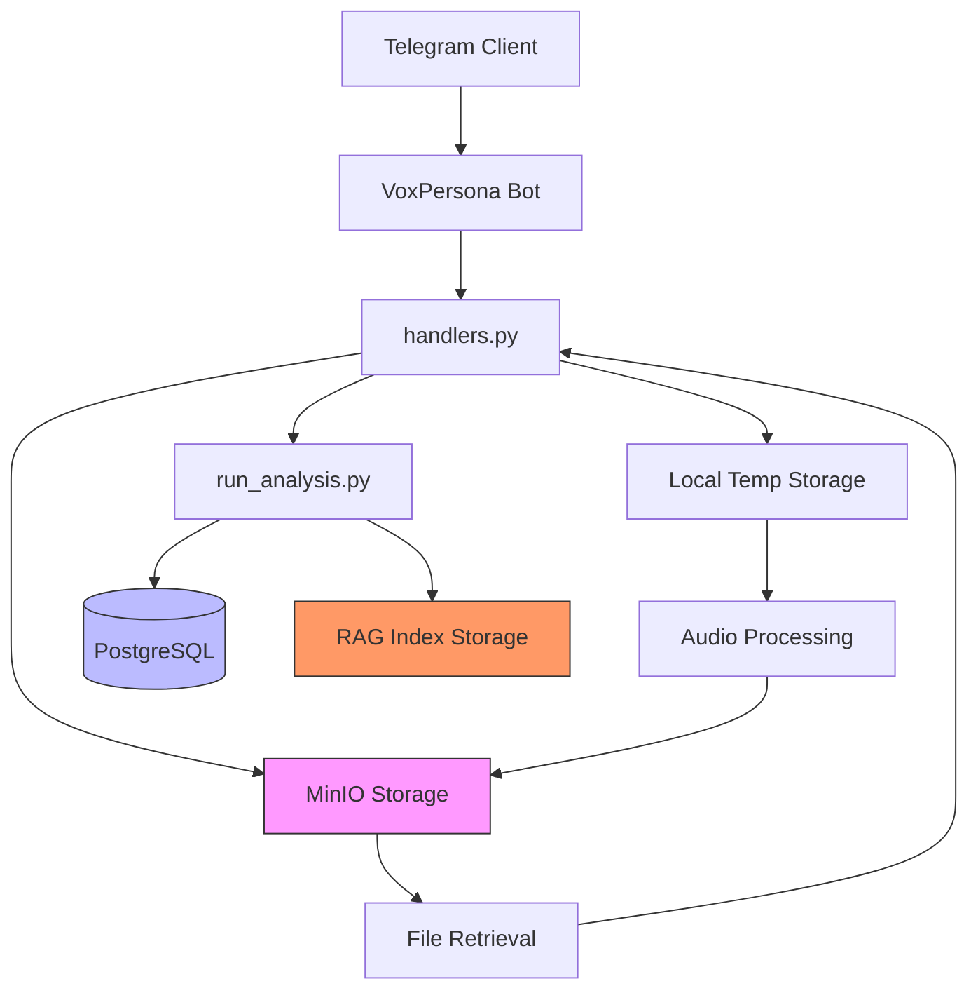
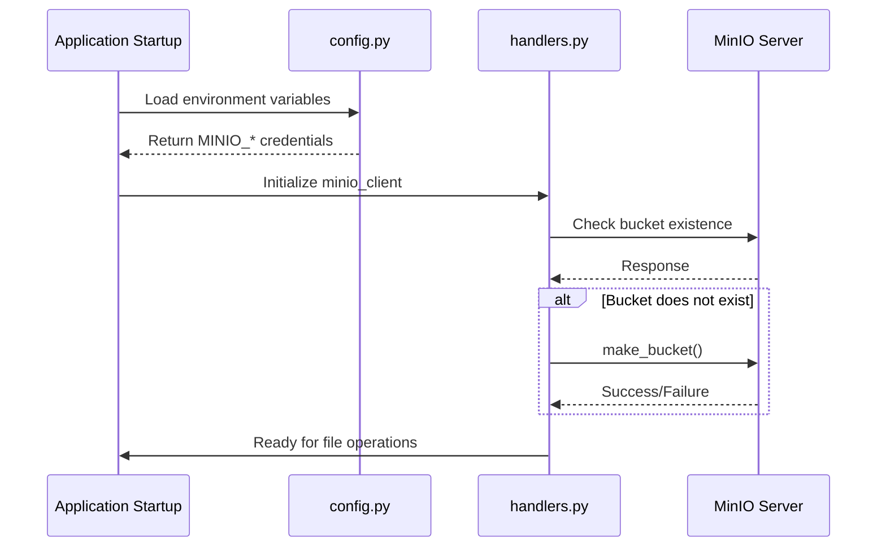
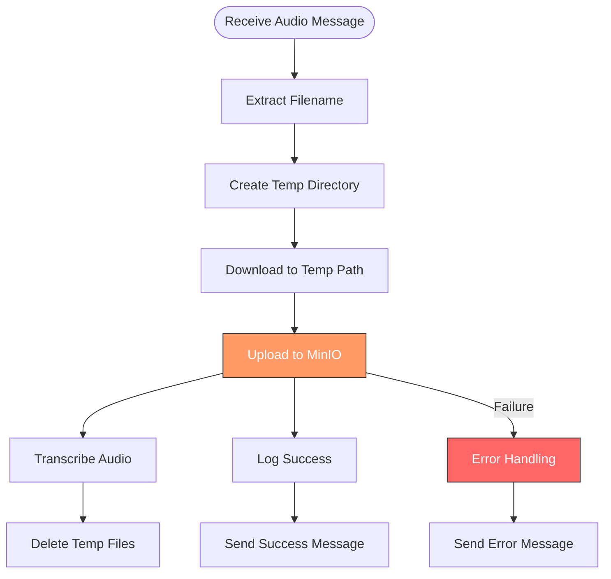
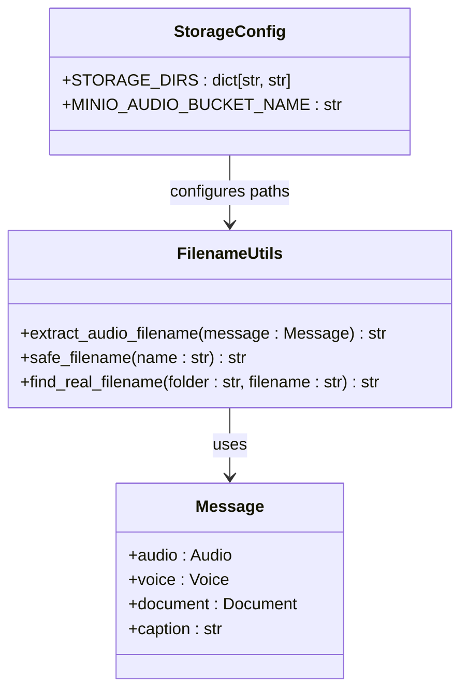
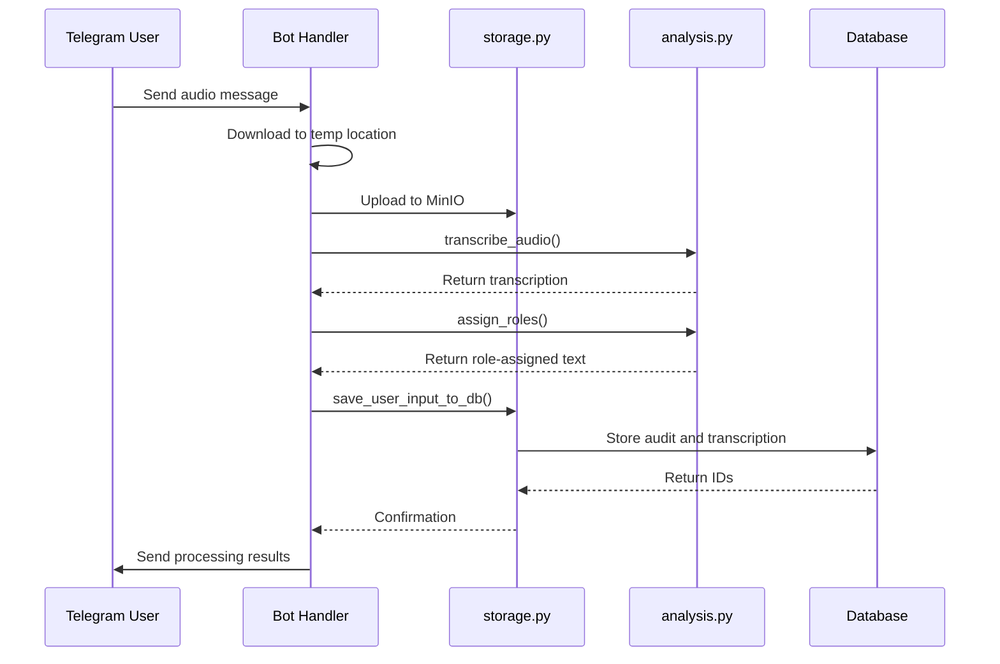
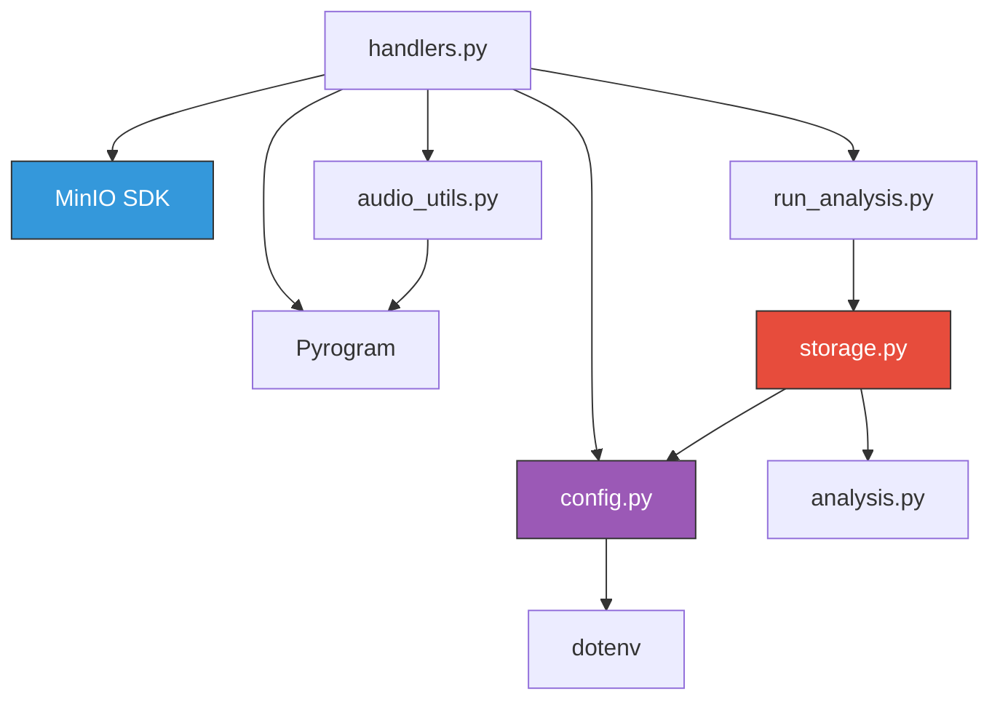

# MinIO Object Storage Integration

<cite>
**Referenced Files in This Document**   
- [storage.py](file://src/storage.py)
- [config.py](file://src/config.py)
- [handlers.py](file://src/handlers.py)
- [audio_utils.py](file://src/audio_utils.py)
- [run_analysis.py](file://src/run_analysis.py)
</cite>

## Table of Contents
1. [Introduction](#introduction)
2. [Project Structure](#project-structure)
3. [Core Components](#core-components)
4. [Architecture Overview](#architecture-overview)
5. [Detailed Component Analysis](#detailed-component-analysis)
6. [Dependency Analysis](#dependency-analysis)
7. [Performance Considerations](#performance-considerations)
8. [Troubleshooting Guide](#troubleshooting-guide)
9. [Conclusion](#conclusion)

## Introduction
This document provides comprehensive documentation for the MinIO object storage integration within the VoxPersona application. It details how audio files and processed text outputs are managed through the storage system, including upload and retrieval workflows, bucket management, object naming conventions, and metadata handling. The integration leverages MinIO as an S3-compatible storage backend to persistently store audio recordings and analysis results. Configuration of MinIO credentials and endpoint settings is handled via environment variables accessed through `config.py`. The system integrates with `audio_utils.py` for temporary file handling during processing and with `run_analysis.py` for storing final analysis outputs. This documentation also covers error handling, retry mechanisms, security considerations such as encryption in transit and access control, and performance optimization strategies for handling large audio files.

## Project Structure

```mermaid
graph TD
subgraph "Source Modules"
A[handlers.py] --> B[storage.py]
A --> C[audio_utils.py]
A --> D[config.py]
E[run_analysis.py] --> B
E --> F[analysis.py]
end
subgraph "Configuration & Environment"
G[config.py] --> H[.env]
G --> I[docker-compose.yml]
end
subgraph "Storage Backend"
J[MinIO] < --> A
J < --> B
end
```

**Diagram sources**
- [handlers.py](file://src/handlers.py#L40-L85)
- [config.py](file://src/config.py#L1-L93)
- [storage.py](file://src/storage.py#L1-L309)

**Section sources**
- [src](file://src)
- [docker-compose.yml](file://docker-compose.yml)

## Core Components

The core components involved in MinIO integration include:
- **MinIO Client Initialization**: Configured in `handlers.py` using credentials from `config.py`
- **Audio File Upload**: Handled in `handlers.py` when processing voice/audio messages
- **Persistent Storage Management**: Implemented in `storage.py` with directory mapping via `STORAGE_DIRS`
- **Configuration Layer**: Centralized in `config.py` with environment-based bucket naming
- **Analysis Result Persistence**: Managed through `run_analysis.py` and `storage.py`

These components work together to ensure reliable storage and retrieval of audio and text data across different processing stages.

**Section sources**
- [storage.py](file://src/storage.py#L1-L309)
- [config.py](file://src/config.py#L1-L93)
- [handlers.py](file://src/handlers.py#L40-L85)

## Architecture Overview



**Diagram sources**
- [handlers.py](file://src/handlers.py#L40-L85)
- [storage.py](file://src/storage.py#L1-L309)
- [run_analysis.py](file://src/run_analysis.py#L1-L343)

## Detailed Component Analysis

### MinIO Client Initialization and Bucket Management

The MinIO client is initialized in `handlers.py` using configuration values from `config.py`. The system creates two buckets during startup: one general-purpose bucket and a dedicated audio bucket.



**Diagram sources**
- [handlers.py](file://src/handlers.py#L40-L85)
- [config.py](file://src/config.py#L1-L93)

### Audio File Upload Workflow

When a user sends an audio message, the system follows a structured upload process that includes temporary local storage, transcription, and permanent storage in MinIO.



**Diagram sources**
- [handlers.py](file://src/handlers.py#L608-L707)
- [audio_utils.py](file://src/audio_utils.py#L1-L49)

### Object Naming Conventions and Metadata Handling

The system uses consistent naming conventions for stored objects, particularly for audio files. Filenames are sanitized to ensure compatibility with filesystem and S3 requirements.



**Diagram sources**
- [audio_utils.py](file://src/audio_utils.py#L1-L49)
- [storage.py](file://src/storage.py#L1-L309)
- [config.py](file://src/config.py#L1-L93)

### Integration with Audio Processing and Analysis

The storage system integrates tightly with audio processing and analysis workflows, ensuring seamless transition from raw audio to processed text and stored results.



**Diagram sources**
- [handlers.py](file://src/handlers.py#L608-L707)
- [run_analysis.py](file://src/run_analysis.py#L1-L343)
- [storage.py](file://src/storage.py#L1-L309)

## Dependency Analysis



**Diagram sources**
- [handlers.py](file://src/handlers.py#L1-L85)
- [config.py](file://src/config.py#L1-L93)
- [storage.py](file://src/storage.py#L1-L309)

**Section sources**
- [handlers.py](file://src/handlers.py#L1-L85)
- [config.py](file://src/config.py#L1-L93)
- [storage.py](file://src/storage.py#L1-L309)

## Performance Considerations

The system handles large audio files through chunked processing and temporary file management. Audio files are processed in segments to avoid memory issues, and temporary files are cleaned up after processing. The use of MinIO allows for scalable storage of audio files without impacting application performance. For very large files, the system could be enhanced with multipart upload support and client-side encryption for improved security and performance. Monitoring storage usage can be achieved through MinIO's built-in metrics and logging.

**Section sources**
- [audio_utils.py](file://src/audio_utils.py#L1-L49)
- [handlers.py](file://src/handlers.py#L608-L707)

## Troubleshooting Guide

Common issues and their solutions:

- **Bucket Creation Failure**: Ensure MinIO endpoint is reachable and credentials are correct. Check network connectivity and firewall settings.
- **File Upload Errors**: Verify that the bucket exists and the client has write permissions. Check file size limits and disk space.
- **Authentication Failures**: Confirm that `MINIO_ACCESS_KEY` and `MINIO_SECRET_KEY` match the MinIO server configuration.
- **Missing Environment Variables**: Ensure all required variables are set in the `.env` file or environment.
- **Audio Processing Failures**: Check Whisper API availability and ensure temporary directories are writable.

Error handling is implemented throughout the codebase with appropriate logging and user feedback mechanisms.

**Section sources**
- [handlers.py](file://src/handlers.py#L664-L681)
- [config.py](file://src/config.py#L1-L93)
- [storage.py](file://src/storage.py#L1-L309)

## Conclusion

The MinIO object storage integration in VoxPersona provides a robust solution for managing audio files and processed text outputs. By leveraging MinIO's S3-compatible interface, the system achieves reliable, scalable storage with proper error handling and security considerations. The architecture separates temporary processing from persistent storage, ensuring data integrity throughout the workflow. Configuration through environment variables enables easy deployment across different environments. Future enhancements could include client-side encryption, multipart uploads for large files, and more sophisticated lifecycle management policies.