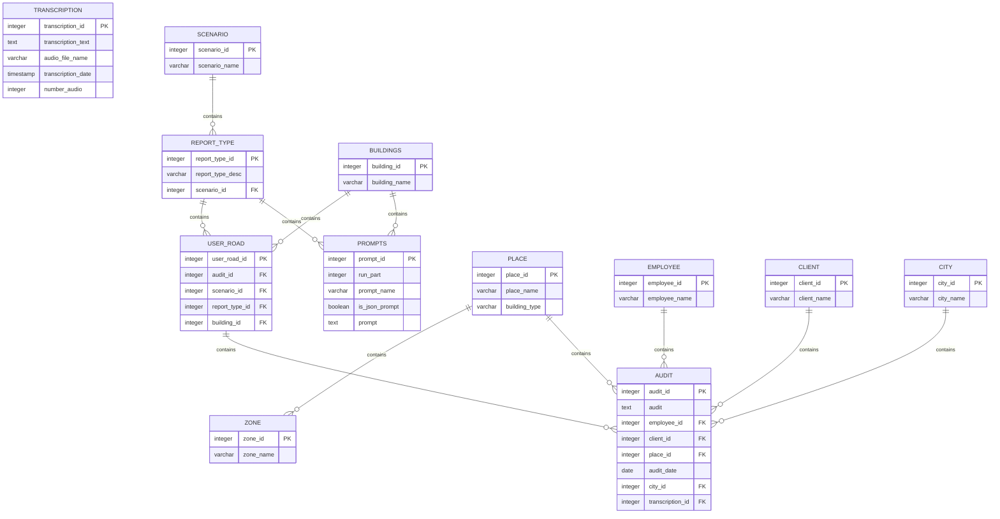

# PostgreSQL Database Integration

<cite>
**Referenced Files in This Document**   
- [config.py](file://src/config.py)
- [db.py](file://src/db_handler/db.py)
- [fill_prompts_table.py](file://src/db_handler/fill_prompts_table.py)
- [run_analysis.py](file://src/run_analysis.py)
- [datamodels.py](file://src/datamodels.py)
- [step_2_sql_request.txt](file://prompts-by-scenario/sql_prompts/part2/step_2_sql_request.txt)
</cite>

## Table of Contents
1. [Introduction](#introduction)
2. [Database Connection Setup](#database-connection-setup)
3. [Connection Management Patterns](#connection-management-patterns)
4. [Schema Design and Table Structures](#schema-design-and-table-structures)
5. [Key Query Examples](#key-query-examples)
6. [Query Performance Optimization](#query-performance-optimization)
7. [Database Migration and Maintenance](#database-migration-and-maintenance)
8. [Common Issues and Solutions](#common-issues-and-solutions)
9. [Conclusion](#conclusion)

## Introduction
This document provides comprehensive documentation for the PostgreSQL integration in VoxPersona using psycopg2. It covers the database connection setup, connection management patterns, schema design, key queries, performance optimization, migration strategies, and common issue resolution. The system is designed to store and analyze transcriptions, audit reports, user states, and prompts for various scenarios including design audits and employee interviews across different establishment types such as hotels, restaurants, and health centers.

## Database Connection Setup

The database connection in VoxPersona is configured through environment variables managed in the config.py file. The system supports both production and test environments through a RUN_MODE flag that determines which set of database credentials to use.

The connection configuration is stored in the DB_CONFIG dictionary, which contains the following parameters:
- dbname: Database name
- user: Database username
- password: Database password
- host: Database host address
- port: Database port number

The configuration dynamically selects between test and production database settings based on the RUN_MODE environment variable. When RUN_MODE is set to "TEST", the system uses test database credentials; otherwise, it uses production credentials. This allows for seamless switching between environments without code changes.

The database configuration is imported by the db.py module, which handles all database operations. The connection parameters are passed directly to psycopg2.connect() to establish database connections.

**Section sources**
- [config.py](file://src/config.py#L45-L65)
- [db.py](file://src/db_handler/db.py#L5)

## Connection Management Patterns

VoxPersona implements a robust connection management system using Python decorators and context managers to ensure proper transaction handling and resource cleanup.

### Transaction Management with Decorators

The system uses a @db_transaction decorator to manage database transactions. This decorator handles connection acquisition, cursor creation, and transaction commit/rollback operations. The decorator accepts a commit parameter (defaulting to True) that determines whether to commit the transaction upon successful completion.


**Diagram sources**
- [db.py](file://src/db_handler/db.py#L7-L35)

The get_db_connection() function creates a new psycopg2 connection using the DB_CONFIG parameters. This function is called within the transaction decorator to establish database connections for each operation.

### Error Handling and Recovery

The system implements comprehensive error handling for database operations. Functions include validation of input IDs before executing queries, with explicit error messages logged when invalid IDs are detected. The validate_ids() function checks the existence of building_id and report_type_id in their respective tables before proceeding with operations.

Transaction rollback is handled automatically by the context manager when exceptions occur within the decorated function. The system uses try-except blocks with proper logging to capture and report database errors, allowing for easier debugging and monitoring.

**Section sources**
- [db.py](file://src/db_handler/db.py#L7-L399)

## Schema Design and Table Structures

The database schema in VoxPersona is designed to support the storage and retrieval of audit data, transcriptions, user states, and analysis prompts across multiple scenarios and establishment types.

### Core Tables



**Diagram sources**
- [db.py](file://src/db_handler/db.py#L52-L97)
- [step_2_sql_request.txt](file://prompts-by-scenario/sql_prompts/part2/step_2_sql_request.txt#L52-L97)

### Table Descriptions

**user_road**: Stores the user's analysis path, linking audits to specific scenarios, report types, and building types. This table serves as a central junction for connecting analysis context with audit data.

**audit**: Contains the main audit records with the audit text, references to employees, clients, places, and associated transcriptions. This is the primary table for storing analysis results.

**transcription**: Stores transcribed audio content with metadata including the audio file name, transcription date, and sequence number.

**prompts**: Contains the analysis prompts used for different scenarios and report types. The table includes fields for prompt text, execution order (run_part), prompt name, and whether the prompt generates JSON output.

**scenario**: Defines the main analysis scenarios (e.g., "Design", "Interview") that categorize the type of audit being conducted.

**report_type**: Specifies the types of reports that can be generated within each scenario, such as "Assessment of the audit methodology" or "Compliance with the audit program".

**buildings**: Stores the types of establishments that can be audited, including hotels, restaurants, and health centers.

**place**: Records specific establishments visited by users, with references to their building type.

**employee**: Stores information about employees involved in audits.

**client**: Contains client information from interviews.

**city**: Tracks the cities where audits take place.

**zone**: Defines specific areas within establishments that are inspected during audits.

**Section sources**
- [db.py](file://src/db_handler/db.py#L52-L97)
- [step_2_sql_request.txt](file://prompts-by-scenario/sql_prompts/part2/step_2_sql_request.txt#L52-L97)

## Key Query Examples

### Prompt Retrieval Queries

The system provides functions to retrieve prompts based on scenario, report type, and building type. The fetch_prompts_for_scenario_reporttype_building() function executes a complex JOIN query to retrieve prompts associated with specific combinations of these parameters.


**Diagram sources**
- [db.py](file://src/db_handler/db.py#L345-L375)

### Data Insertion Patterns

The system implements upsert patterns (insert or select existing) for various entities to prevent duplicate entries. For example, the get_or_create_employee() function first attempts to find an existing employee by name, and only inserts a new record if none is found.

```python
[SPEC SYMBOL](file://src/db_handler/db.py#L38-L51)
```

Similar patterns are used for clients, places, cities, and zones, ensuring data consistency across the application.

### Dynamic Query Execution

The send_generated_query() function allows for the execution of arbitrary SQL queries generated by AI models. This function executes the provided query and returns the results, with proper error handling for invalid queries.

```python
[SPEC SYMBOL](file://src/db_handler/db.py#L385-L398)
```

**Section sources**
- [db.py](file://src/db_handler/db.py#L38-L51)
- [db.py](file://src/db_handler/db.py#L385-L398)
- [run_analysis.py](file://src/run_analysis.py#L215-L245)

## Query Performance Optimization

### Indexing Strategy

Based on the query patterns observed in the codebase, the following indexes should be created to optimize performance:

1. **Composite indexes on foreign key relationships**:
   - (scenario_name) on scenario table
   - (report_type_desc, scenario_id) on report_type table
   - (building_name) on buildings table
   - (place_name, building_type) on place table

2. **Indexes on frequently queried columns**:
   - transcription_text on transcription table (potentially as a full-text index)
   - employee_name on employee table
   - client_name on client table

3. **Composite indexes for common JOIN patterns**:
   - (scenario_id, report_type_id, building_id) on user_road table
   - (audit_date, place_id) on audit table for time-based queries

### Query Optimization Techniques

The system employs several query optimization techniques:

**Parameterized Queries**: All database queries use parameterized statements to prevent SQL injection and improve query plan caching.

**Efficient JOINs**: The fetch_prompts_for_scenario_reporttype_building() function uses a series of JOINs to retrieve prompts based on scenario, report type, and building type, minimizing the number of database round-trips.

**Selective Column Retrieval**: Queries retrieve only the necessary columns rather than using SELECT *, reducing data transfer overhead.

**Batch Operations**: The fill_prompts_table.py script processes multiple prompts in a single transaction, reducing transaction overhead.

### Connection Pooling Considerations

While the current implementation does not explicitly use connection pooling, the transaction decorator pattern is compatible with connection pooling solutions. Implementing a connection pool would improve performance under high load by reusing database connections rather than creating new ones for each operation.

**Section sources**
- [db.py](file://src/db_handler/db.py#L345-L375)
- [fill_prompts_table.py](file://src/db_handler/fill_prompts_table.py#L145-L227)

## Database Migration and Maintenance

### Schema Initialization

The fill_prompts_table.py script serves as a data migration tool that populates the database with prompts from the file system. The script recursively processes the prompts-by-scenario directory structure, creating database records for scenarios, report types, buildings, and prompts.

The migration process follows these steps:
1. Read the directory structure containing prompts
2. Create or retrieve scenario records
3. Create or retrieve report type records
4. Create or retrieve building records
5. Create prompt records with appropriate relationships


**Diagram sources**
- [fill_prompts_table.py](file://src/db_handler/fill_prompts_table.py#L145-L227)

### Backup Procedures

The documentation does not specify backup procedures, but given the critical nature of audit data, the following backup strategy is recommended:

1. **Regular automated backups**: Daily full backups with hourly incremental backups
2. **Offsite storage**: Store backups in a separate geographic location
3. **Backup verification**: Regularly test backup restoration
4. **Point-in-time recovery**: Enable WAL archiving for precise recovery

### Monitoring Query Performance

The system includes basic logging of database operations, but additional monitoring would enhance performance management:

1. **Query execution time tracking**: Log slow queries for optimization
2. **Connection monitoring**: Track active connections and identify potential leaks
3. **Index usage analysis**: Monitor which indexes are being used and optimize accordingly
4. **Deadlock detection**: Implement monitoring for deadlock occurrences

**Section sources**
- [fill_prompts_table.py](file://src/db_handler/fill_prompts_table.py#L145-L227)

## Common Issues and Solutions

### Connection Leaks

**Issue**: The current implementation does not explicitly handle connection pooling, which could lead to connection leaks under high load.

**Solution**: 
1. Implement connection pooling using psycopg2's built-in pooling or an external library like SQLAlchemy
2. Ensure all connections are properly closed in exception handlers
3. Set connection timeouts to automatically close idle connections

```python
[SPEC SYMBOL](file://src/db_handler/db.py#L7-L35)
```

### Serialization Failures

**Issue**: Concurrent transactions modifying the same data could result in serialization failures.

**Solution**:
1. Implement retry logic for transactions that fail due to serialization issues
2. Use appropriate transaction isolation levels
3. Minimize transaction duration by reducing the amount of work performed within transactions

### Deadlock Handling

**Issue**: The system's use of multiple JOINs and foreign key relationships could lead to deadlocks in high-concurrency scenarios.

**Solution**:
1. Ensure consistent ordering of table access across transactions
2. Implement deadlock detection and recovery mechanisms
3. Use shorter transactions to reduce the window for deadlocks

### Data Consistency Issues

**Issue**: The upsert patterns (get_or_create) could potentially create race conditions in high-concurrency environments.

**Solution**:
1. Use database-level constraints to prevent duplicate entries
2. Implement unique indexes on columns that should be unique
3. Use SELECT FOR UPDATE in transaction blocks when checking for existing records

### Error Recovery

The system implements several error recovery mechanisms:
- Transaction rollback on exceptions
- Input validation before database operations
- Comprehensive logging for debugging
- Graceful degradation when database operations fail

Additional improvements could include:
- Circuit breaker pattern for database operations
- Retry mechanisms with exponential backoff
- Fallback data sources or cached data

**Section sources**
- [db.py](file://src/db_handler/db.py#L7-L399)

## Conclusion
The PostgreSQL integration in VoxPersona provides a robust foundation for storing and analyzing audit data across multiple scenarios and establishment types. The system effectively uses psycopg2 to manage database connections, implements proper transaction handling through decorators, and maintains a well-structured schema that supports the application's requirements.

Key strengths include the flexible prompt management system, comprehensive error handling, and efficient query patterns. Areas for improvement include implementing connection pooling for better performance under load, enhancing monitoring capabilities, and strengthening concurrency control mechanisms.

The database design effectively supports the application's core functionality while allowing for future expansion. By following the best practices outlined in this documentation, the system can maintain high performance, reliability, and data integrity as it continues to evolve.