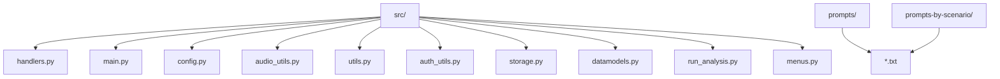
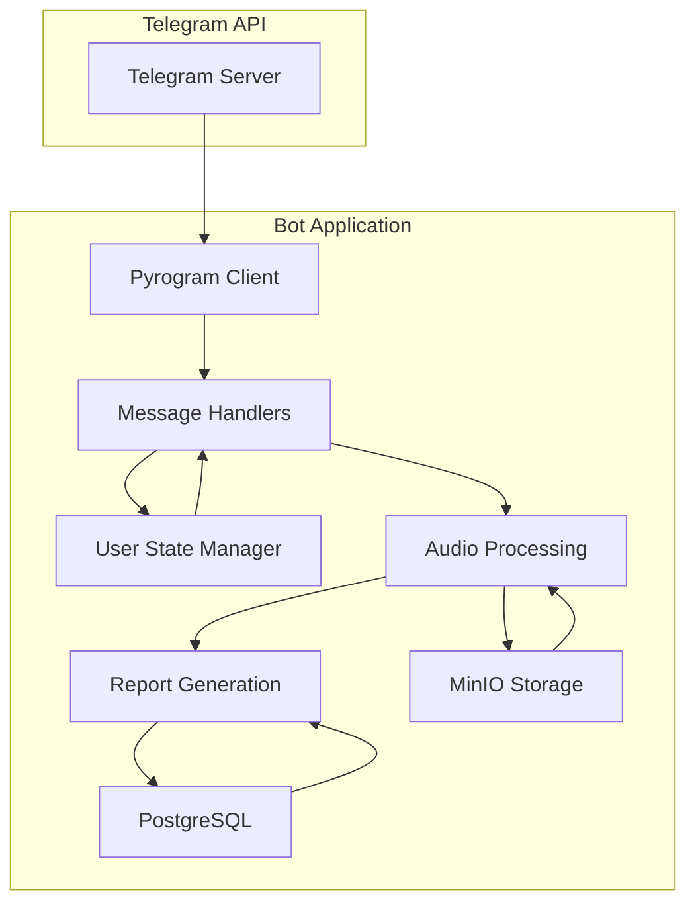
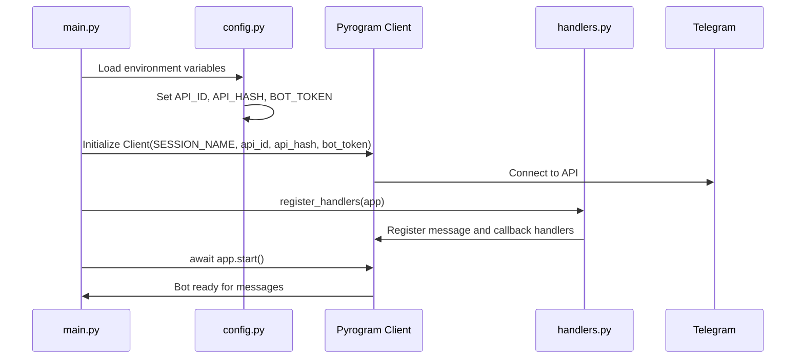
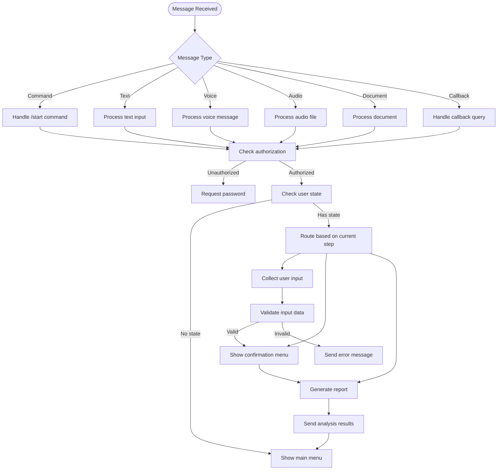
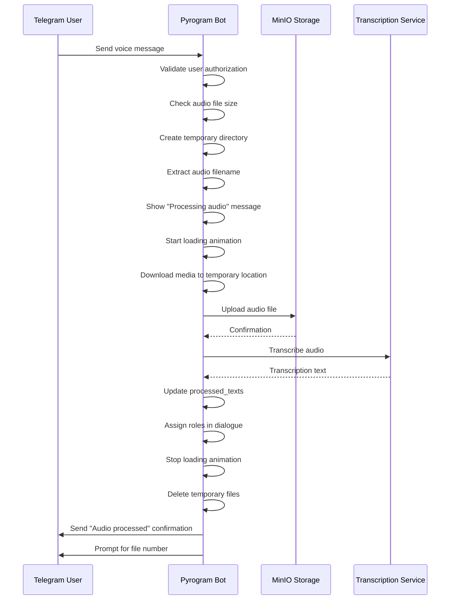
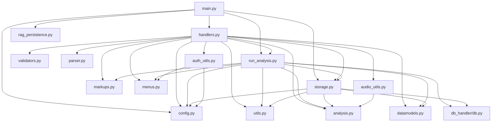

# Telegram Bot API Integration

<cite>
**Referenced Files in This Document**   
- [main.py](file://src/main.py)
- [config.py](file://src/config.py)
- [handlers.py](file://src/handlers.py)
- [audio_utils.py](file://src/audio_utils.py)
- [utils.py](file://src/utils.py)
- [auth_utils.py](file://src/auth_utils.py)
- [storage.py](file://src/storage.py)
- [datamodels.py](file://src/datamodels.py)
- [run_analysis.py](file://src/run_analysis.py)
- [menus.py](file://src/menus.py)
</cite>

## Table of Contents
1. [Introduction](#introduction)
2. [Project Structure](#project-structure)
3. [Core Components](#core-components)
4. [Architecture Overview](#architecture-overview)
5. [Detailed Component Analysis](#detailed-component-analysis)
6. [Dependency Analysis](#dependency-analysis)
7. [Performance Considerations](#performance-considerations)
8. [Troubleshooting Guide](#troubleshooting-guide)
9. [Conclusion](#conclusion)

## Introduction
This document provides comprehensive documentation for the Telegram Bot API integration using Pyrogram in the VoxPersona application. The system enables voice message processing, user state management, and automated report generation through a sophisticated message handling architecture. The bot leverages Pyrogram's capabilities to handle various message types, manage user sessions, and integrate with audio processing pipelines. This documentation covers the initialization process, message handling workflows, media processing, error handling, and best practices for maintaining reliable bot operations.

## Project Structure

The VoxPersona project follows a modular structure with clear separation of concerns. The core bot functionality resides in the `src` directory, which contains specialized modules for different aspects of the application.

**Diagram sources**
- [main.py](file://src/main.py#L1-L95)
- [config.py](file://src/config.py#L1-L93)

**Section sources**
- [main.py](file://src/main.py#L1-L95)
- [config.py](file://src/config.py#L1-L93)

## Core Components

The core components of the Telegram bot integration include the bot initialization in `main.py`, configuration management in `config.py`, and message handling in `handlers.py`. The system uses Pyrogram as the primary interface for Telegram API interactions, enabling asynchronous message processing and event-driven architecture. Key components include the bot client initialization, user state management, audio processing pipeline, and report generation system. The architecture supports both direct message handling and callback query processing for interactive menus.

**Section sources**
- [main.py](file://src/main.py#L1-L95)
- [handlers.py](file://src/handlers.py#L1-L799)
- [config.py](file://src/config.py#L1-L93)

## Architecture Overview

The VoxPersona bot follows a layered architecture with clear separation between the Telegram interface, business logic, and data processing components. The system initializes a Pyrogram client that connects to Telegram's API using credentials from environment variables. Upon receiving messages, the bot routes them through a series of handlers that process different message types (text, voice, documents) and manage user interactions through state tracking. Audio messages are processed through a pipeline that includes downloading, transcription, and analysis. The architecture supports concurrent user sessions and maintains state information for multi-step interactions.

**Diagram sources**
- [main.py](file://src/main.py#L1-L95)
- [handlers.py](file://src/handlers.py#L1-L799)

## Detailed Component Analysis

### Bot Initialization and Configuration

The bot initialization process begins in `main.py` where a Pyrogram Client instance is created with configuration parameters from `config.py`. The configuration system uses environment variables to store sensitive information such as API credentials, enabling secure deployment across different environments. The system supports both production and test modes, automatically selecting appropriate configuration values based on the RUN_MODE environment variable.

**Diagram sources**
- [main.py](file://src/main.py#L1-L95)
- [config.py](file://src/config.py#L1-L93)

**Section sources**
- [main.py](file://src/main.py#L1-L95)
- [config.py](file://src/config.py#L1-L93)

### Message Handling Architecture

The message handling system in `handlers.py` implements a comprehensive state machine for managing user interactions. The architecture supports multiple message types including text, voice, audio files, and documents. User state is tracked through the `user_states` dictionary, which maintains context for multi-step workflows such as report generation. The system uses callback queries to handle interactive menu selections and implements a sophisticated routing mechanism for different user actions.

**Diagram sources**
- [handlers.py](file://src/handlers.py#L1-L799)

**Section sources**
- [handlers.py](file://src/handlers.py#L1-L799)

### Audio Processing Pipeline

The audio processing pipeline handles voice messages and audio files through a series of coordinated steps. When a user sends a voice message, the system downloads the file to a temporary location, uploads it to MinIO storage, transcribes the audio using Whisper, and processes the resulting text. The pipeline includes error handling for various failure scenarios and implements resource cleanup to prevent disk space exhaustion.

**Diagram sources**
- [handlers.py](file://src/handlers.py#L1-L799)
- [audio_utils.py](file://src/audio_utils.py#L1-L49)
- [storage.py](file://src/storage.py#L1-L309)

**Section sources**
- [handlers.py](file://src/handlers.py#L1-L799)
- [audio_utils.py](file://src/audio_utils.py#L1-L49)

## Dependency Analysis

The VoxPersona bot has a well-defined dependency structure with clear relationships between components. The main.py module depends on config.py for configuration values and handlers.py for message handling functionality. The handlers.py module depends on multiple utility modules for specific tasks such as authentication, storage, and analysis. The system uses environment variables for configuration, making it easy to manage credentials across different deployment environments.

**Diagram sources**
- [main.py](file://src/main.py#L1-L95)
- [handlers.py](file://src/handlers.py#L1-L799)
- [config.py](file://src/config.py#L1-L93)

**Section sources**
- [main.py](file://src/main.py#L1-L95)
- [handlers.py](file://src/handlers.py#L1-L799)

## Performance Considerations

The VoxPersona bot implements several performance optimizations to handle concurrent users and large media files efficiently. The system uses asynchronous programming with asyncio to handle multiple operations concurrently without blocking the main event loop. For long-running operations such as audio transcription, the bot uses threading to prevent interface freezing while maintaining responsiveness. The periodic_save_rags function runs as a background task, ensuring that RAG model state is preserved without impacting message processing performance.

The bot also implements resource management strategies to prevent memory leaks and disk space exhaustion. Temporary files and directories are automatically cleaned up after processing, and the system validates file sizes before downloading to prevent denial-of-service attacks through large file uploads. The use of MinIO for persistent storage allows the bot to handle large audio files without consuming local disk space.

## Troubleshooting Guide

### Common Issues and Solutions

**Message Delivery Failures**
- **Symptom**: Messages not being received or processed
- **Solution**: Check bot token validity and API credentials in environment variables. Verify network connectivity and Telegram API status. Ensure the bot has necessary permissions in the chat.

**Session Timeouts**
- **Symptom**: Users being logged out unexpectedly
- **Solution**: Verify that the SESSION_NAME is consistent across restarts. Check that the session file is being persisted correctly in the deployment environment.

**Media Download Errors**
- **Symptom**: Audio files failing to download or process
- **Solution**: Verify that the temporary directory has sufficient disk space and write permissions. Check that the MinIO storage is accessible and has sufficient capacity. Ensure the audio file size is within the 2GB limit.

**Authentication Failures**
- **Symptom**: Users unable to authenticate with correct password
- **Solution**: Verify that the PASSWORD environment variable is set correctly. Check that the password comparison is case-sensitive and matches the expected value.

**RAG Model Initialization Issues**
- **Symptom**: RAG models failing to load or save
- **Solution**: Verify that the RAG_INDEX_DIR directory exists and is writable. Check that the expected RAG model files are present in the directory. Ensure the safe_filename function correctly maps file names to model names.

**Callback Query Errors**
- **Symptom**: Interactive menus not responding to button presses
- **Solution**: Verify that callback handlers are properly registered. Check that callback data format matches expected patterns. Ensure the bot has permission to edit messages.

**Section sources**
- [main.py](file://src/main.py#L1-L95)
- [handlers.py](file://src/handlers.py#L1-L799)
- [config.py](file://src/config.py#L1-L93)

## Conclusion

The Telegram Bot API integration in VoxPersona demonstrates a robust implementation of Pyrogram for building a sophisticated voice-enabled application. The system effectively handles user authentication, message processing, and state management while integrating with external services for audio transcription and data storage. The modular architecture allows for easy maintenance and extension of functionality. By following best practices for error handling, resource management, and performance optimization, the bot provides a reliable user experience even under heavy load. The comprehensive logging and error handling system enables effective troubleshooting and monitoring of bot operations.