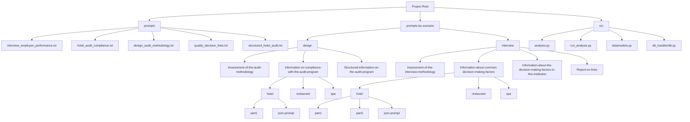
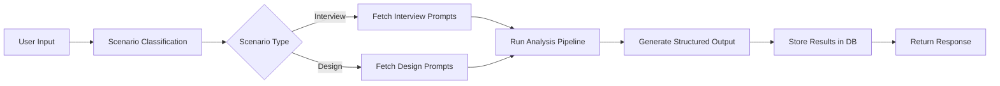
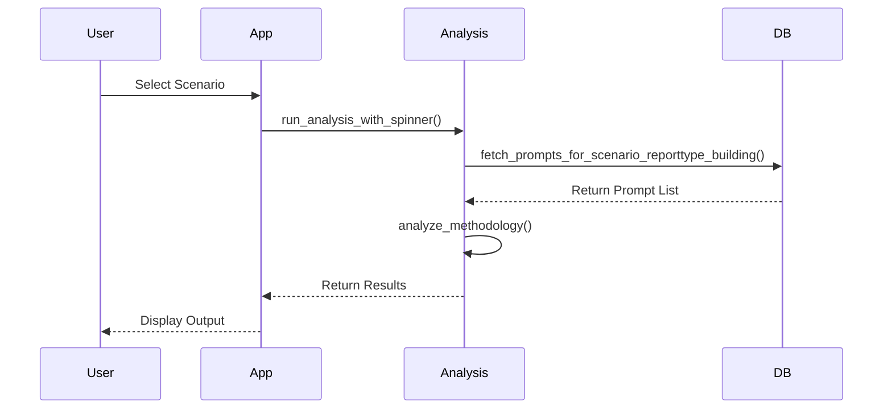
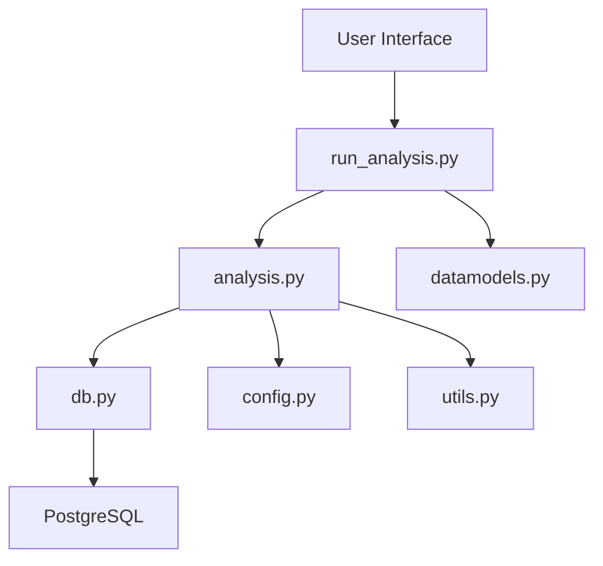

# Analysis Scenarios

<cite>
**Referenced Files in This Document**   
- [interview_employee_performance.txt](file://prompts/interview_employee_performance.txt)
- [hotel_audit_compliance.txt](file://prompts/hotel_audit_compliance.txt)
- [design_audit_methodology.txt](file://prompts/design_audit_methodology.txt)
- [quality_decision_links.txt](file://prompts/quality_decision_links.txt)
- [structured_hotel_audit.txt](file://prompts/structured_hotel_audit.txt)
- [аудит отеля.txt](file://prompts-by-scenario/design/Information-on-compliance-with-the-audit-program/hotel/part1/аудит отеля.txt)
- [Дизайн. Соответствие программе аудита. Отель. Json.txt](file://prompts-by-scenario/design/Information-on-compliance-with-the-audit-program/hotel/json-prompt/Дизайн. Соответствие программе аудита. Отель. Json.txt)
- [Интервью. Общие факторы отель. Json.txt](file://prompts-by-scenario/interview/Information-about-common-decision-making-factors/hotel/json-prompt/Интервью. Общие факторы отель. Json.txt)
- [analysis.py](file://src/analysis.py)
- [run_analysis.py](file://src/run_analysis.py)
- [datamodels.py](file://src/datamodels.py)
- [db.py](file://src/db_handler/db.py)
</cite>

## Table of Contents
1. [Introduction](#introduction)
2. [Project Structure](#project-structure)
3. [Core Components](#core-components)
4. [Architecture Overview](#architecture-overview)
5. [Detailed Component Analysis](#detailed-component-analysis)
6. [Dependency Analysis](#dependency-analysis)
7. [Performance Considerations](#performance-considerations)
8. [Troubleshooting Guide](#troubleshooting-guide)
9. [Conclusion](#conclusion)

## Introduction
This document provides a comprehensive analysis of the **Analysis Scenarios** feature within the VoxPersona system, designed to enable domain-specific evaluation across hospitality sectors. The system supports two primary scenario types: **Interview Analysis** and **Design Audit Analysis**, each tailored to assess different aspects of service quality and operational effectiveness in hotels, restaurants, and health centers (spas). This documentation details the structure, functionality, and implementation of these scenarios, including prompt organization, pipeline execution, and extensibility mechanisms.

## Project Structure
The project is organized into three main directories: `prompts`, `prompts-by-scenario`, and `src`. The `prompts` directory contains flat, general-purpose prompt files, while `prompts-by-scenario` uses a hierarchical structure to organize prompts by scenario, report type, business type, and format (JSON/plain text). The `src` directory houses the core application logic.



**Diagram sources**
- [prompts/](file://prompts/)
- [prompts-by-scenario/](file://prompts-by-scenario/)
- [src/](file://src/)

**Section sources**
- [prompts/](file://prompts/)
- [prompts-by-scenario/](file://prompts-by-scenario/)
- [src/](file://src/)

## Core Components
The system's core functionality revolves around two primary analysis scenarios: **Interview Analysis** and **Design Audit Analysis**. Each scenario is implemented through a series of structured prompts and processing pipelines that guide the evaluation process.

### Interview Analysis
This scenario evaluates employee performance and decision-making factors during client interviews. It includes sub-scenarios for assessing:
- **Employee Performance**: Evaluates question clarity, empathy, structured conversation, and active listening.
- **Decision-Making Factors**: Identifies common and institution-specific factors influencing client choices.

### Design Audit Analysis
This scenario evaluates compliance with audit methodology, design quality, and reporting structure. Sub-scenarios include:
- **Audit Methodology Assessment**: Evaluates adherence to established audit procedures.
- **Compliance with Audit Program**: Assesses completeness and depth of audit coverage.
- **Structured Audit Reporting**: Generates standardized reports with quantitative evaluations.

**Section sources**
- [interview_employee_performance.txt](file://prompts/interview_employee_performance.txt)
- [hotel_audit_compliance.txt](file://prompts/hotel_audit_compliance.txt)

## Architecture Overview
The system architecture follows a modular design with clear separation between data, logic, and presentation layers. The analysis pipeline is driven by scenario selection, which determines the prompt sequence and processing flow.



**Diagram sources**
- [run_analysis.py](file://src/run_analysis.py)
- [analysis.py](file://src/analysis.py)

## Detailed Component Analysis

### Prompt Organization and Structure
The system supports two prompt organization strategies: flat and hierarchical.

#### Flat Structure (prompts/)
This directory contains general-purpose prompt files with descriptive names:
- `interview_employee_performance.txt`: Evaluates interviewer skills
- `hotel_audit_compliance.txt`: Assesses hotel design audit quality
- `design_audit_methodology.txt`: Evaluates audit methodology adherence
- `quality_decision_links.txt`: Analyzes decision-making patterns
- `structured_hotel_audit.txt`: Generates structured audit reports

These prompts are used for general analysis tasks and are referenced directly by name in the application logic.

#### Hierarchical Structure (prompts-by-scenario/)
This directory uses a nested structure to organize prompts by:
1. **Scenario** (`design`, `interview`)
2. **Report Type** (e.g., `Information-on-compliance-with-the-audit-program`)
3. **Business Type** (`hotel`, `restaurant`, `spa`)
4. **Format/Part** (`part1`, `part2`, `json-prompt`)

This structure enables precise targeting of domain-specific analysis requirements and supports complex, multi-stage analysis workflows.

**Section sources**
- [prompts/](file://prompts/)
- [prompts-by-scenario/](file://prompts-by-scenario/)

### Analysis Pipeline and Prompt Injection
The analysis pipeline is orchestrated through the `run_analysis.py` module, which manages the execution flow based on user-selected scenarios.

#### Scenario Selection and Prompt Fetching
When a user selects an analysis scenario, the system:
1. Classifies the query using `classify_query()`
2. Maps the scenario to appropriate report types using `REPORT_MAPPING`
3. Retrieves relevant prompts from the database via `fetch_prompts_for_scenario_reporttype_building()`



**Diagram sources**
- [run_analysis.py](file://src/run_analysis.py)
- [db.py](file://src/db_handler/db.py)

#### Multi-Stage Analysis Processing
For complex scenarios like "Information-about-common-decision-making-factors", the system executes multiple analysis passes:
1. **First Pass**: Analyzes mentioned factors using `part1` prompts
2. **Second Pass**: Analyzes unmentioned factors using `part2` prompts  
3. **Final Pass**: Aggregates results and generates JSON output using `json-prompt`

This staged approach enables comprehensive analysis of both explicit and implicit information in the source data.

**Section sources**
- [run_analysis.py](file://src/run_analysis.py)
- [analysis.py](file://src/analysis.py)

### Example: Hotel Audit Compliance Analysis
The hotel audit compliance scenario demonstrates the hierarchical prompt structure and multi-stage processing:

#### Primary Analysis Prompt
The main analysis is conducted using `аудит отеля.txt`, which evaluates:
- **Completeness of Coverage**: Percentage assessment of all aspects of the hotel zone
- **Methodology Compliance**: Evaluation against audit methodology in visual inspection, information gathering, and reporting
- **Recommendation Quality**: Assessment of proposed improvements and emotional scenario development

#### JSON Extraction Prompt
The results are processed through `Дизайн. Соответствие программе аудита. Отель. Json.txt`, which extracts quantitative metrics:
```json
{
  "оценка_соответствия_методологии_визуальный_осмотр": 85,
  "оценка_соответствия_методологии_сбор_информации": 70,
  "оценка_соответствия_методологии_формирование_отчета": 90,
  "общая_оценка_соответствия_методологии": 81.67,
  "итоговая_оценка_качества_аудита": 85
}
```

**Section sources**
- [аудит отеля.txt](file://prompts-by-scenario/design/Information-on-compliance-with-the-audit-program/hotel/part1/аудит отеля.txt)
- [Дизайн. Соответствие программе аудита. Отель. Json.txt](file://prompts-by-scenario/design/Information-on-compliance-with-the-audit-program/hotel/json-prompt/Дизайн. Соответствие программе аудита. Отель. Json.txt)

### Example: Interview Decision-Making Factors Analysis
This scenario analyzes client decision factors across hospitality businesses:

#### Data Collection Structure
The analysis uses separate prompts for:
- **Mentioned Factors**: `общ факторы отель 1.txt` identifies factors discussed by the client
- **Unmentioned Factors**: `общ факторы неизуч факторы отель.txt` identifies factors not discussed
- **Quantitative Aggregation**: `Интервью. Общие факторы отель. Json.txt` compiles statistics

#### Output Structure
The JSON output provides a comprehensive breakdown:
```json
{
  "упомянутые_факторы": {
    "локационные_факторы": 3,
    "дизайн_и_архитектура": 5,
    "сервис": 4,
    "технологические_факторы": 2,
    "безопасность": 1,
    "маркетинг_и_коммуникации": 3,
    "экономические_факторы": 2,
    "прочие_факторы": 0,
    "общее_количество": 20
  },
  "неупомянутые_факторы": {
    "локационные_факторы": 2,
    "дизайн_и_архитектура": 1,
    "сервис": 3,
    "технологические_факторы": 4,
    "безопасность": 2,
    "маркетинг_и_коммуникации": 1,
    "экономические_факторы": 3,
    "общее_количество": 16
  }
}
```

**Section sources**
- [Интервью. Общие факторы отель. Json.txt](file://prompts-by-scenario/interview/Information-about-common-decision-making-factors/hotel/json-prompt/Интервью. Общие факторы отель. Json.txt)

## Dependency Analysis
The system components are interconnected through a well-defined dependency structure:



Key dependencies include:
- **run_analysis.py**: Orchestrates the analysis workflow and user interaction
- **analysis.py**: Contains core analysis functions and model interaction logic
- **db.py**: Manages database operations and prompt retrieval
- **datamodels.py**: Defines mapping between scenario names, report types, and business logic

**Diagram sources**
- [run_analysis.py](file://src/run_analysis.py)
- [analysis.py](file://src/analysis.py)
- [db.py](file://src/db_handler/db.py)
- [datamodels.py](file://src/datamodels.py)

**Section sources**
- [run_analysis.py](file://src/run_analysis.py)
- [analysis.py](file://src/analysis.py)
- [db.py](file://src/db_handler/db.py)
- [datamodels.py](file://src/datamodels.py)

## Performance Considerations
The system implements several performance optimization strategies:

### Parallel Processing
The `extract_from_chunk_parallel()` function enables concurrent processing of multiple text chunks using multiple API keys, improving throughput and reducing latency.

### Rate Limit Management
The system incorporates rate limiting logic to respect API constraints:
- Token-based throttling according to model capabilities
- Request-per-minute (RPM) limits for different API tiers
- Exponential backoff for rate limit handling

### Caching Strategy
The RAG (Retrieval-Augmented Generation) system initializes with `init_rags()`, pre-loading frequently accessed data to minimize database queries during analysis.

## Troubleshooting Guide
Common issues and their resolutions:

### Prompt Not Found
**Symptom**: "Данные из таблицы prompt не найдены" error
**Cause**: Missing prompt in database or incorrect prompt name
**Solution**: Verify prompt exists in `prompts` table and name matches exactly

### Database Connection Issues
**Symptom**: "Failed to insert audit record" error
**Cause**: Invalid database configuration or connection failure
**Solution**: Check `DB_CONFIG` in `config.py` and verify database accessibility

### API Rate Limiting
**Symptom**: "Rate limit hit" warnings
**Cause**: Exceeding API provider limits
**Solution**: Ensure multiple API keys are configured and verify rate limit settings in `extract_from_chunk_parallel()`

**Section sources**
- [db.py](file://src/db_handler/db.py)
- [analysis.py](file://src/analysis.py)
- [run_analysis.py](file://src/run_analysis.py)

## Conclusion
The Analysis Scenarios feature provides a robust framework for domain-specific evaluation in the hospitality sector. By supporting both flat and hierarchical prompt structures, the system accommodates simple and complex analysis workflows. The separation of concerns between scenario types, business domains, and output formats enables flexible extension and maintenance. The integration of quantitative JSON extraction alongside qualitative analysis ensures comprehensive insights that support data-driven decision making. Future enhancements could include automated versioning of prompts and improved consistency management across similar scenarios.