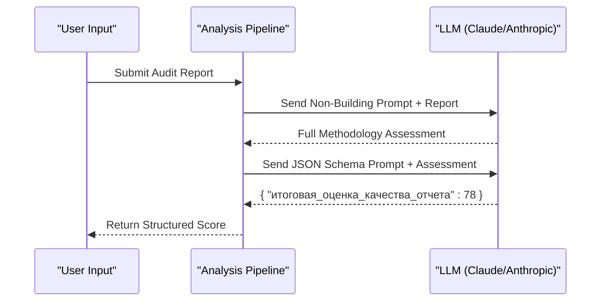

# Assessment of Audit Methodology

<cite>
**Referenced Files in This Document**   
- [src/analysis.py](file://src/analysis.py#L21-L63)
- [prompts-by-scenario/design/Assessment-of-the-audit-methodology/non-building/оценка методологии аудита.txt](file://prompts-by-scenario/design/Assessment-of-the-audit-methodology/non-building/оценка методологии аудита.txt)
- [prompts-by-scenario/design/Assessment-of-the-audit-methodology/json-prompt/Дизайн.Оценка методологии аудита. Json.txt](file://prompts-by-scenario/design/Assessment-of-the-audit-methodology/json-prompt/Дизайн.Оценка методологии аудита. Json.txt)
</cite>

## Table of Contents
1. [Introduction](#introduction)
2. [Two-Part Prompt Structure](#two-part-prompt-structure)
3. [Core Evaluation Criteria](#core-evaluation-criteria)
4. [Integration with Analysis Pipeline](#integration-with-analysis-pipeline)
5. [Domain-Specific Examples](#domain-specific-examples)
6. [Configuration and Customization](#configuration-and-customization)
7. [Troubleshooting Common Issues](#troubleshooting-common-issues)
8. [Conclusion](#conclusion)

## Introduction

The **Assessment of Audit Methodology** sub-feature is designed to evaluate the quality, completeness, and methodological rigor of audit reports in hospitality environments such as hotels, restaurants, and spas. This system ensures that audit procedures adhere to a standardized framework by combining natural language instructions with structured JSON schema validation. The evaluation process is automated through a two-part prompt system: a **non-building prompt** for qualitative analysis and a **JSON schema prompt** for enforcing consistent, machine-readable output.

This document details how the system analyzes audit methodology using domain-specific criteria, integrates with the core analysis pipeline, and supports customization for new venue types.

**Section sources**
- [prompts-by-scenario/design/Assessment-of-the-audit-methodology/non-building/оценка методологии аудита.txt](file://prompts-by-scenario/design/Assessment-of-the-audit-methodology/non-building/оценка методологии аудита.txt#L1-L162)

## Two-Part Prompt Structure

The system uses a dual-component prompt architecture to ensure both depth and consistency in its evaluations:

### 1. Non-Building Prompt (Natural Language Instruction)
Located at `prompts-by-scenario/design/Assessment-of-the-audit-methodology/non-building/оценка методологии аудита.txt`, this file contains detailed natural language instructions for assessing audit methodology. It defines six key evaluation dimensions:
- Compliance with fundamental principles
- Analytical sequence (observation → perception → analysis → recommendations)
- Coverage completeness
- Key element analysis
- Report structure adherence
- Zone-specific methodology compliance

The prompt explicitly distinguishes between **justified subjective judgments** (supported by specific observations) and **unjustified subjective judgments** (emotional or vague statements), requiring the model to classify each accordingly.

### 2. JSON Schema Prompt (Structured Output Enforcement)
Located at `prompts-by-scenario/design/Assessment-of-the-audit-methodology/json-prompt/Дизайн.Оценка методологии аудита. Json.txt`, this file defines a JSON schema that extracts only the final numerical score from the full analysis. The schema requires:
- Extraction of the "final report quality score" expressed as a percentage
- Return of only the numeric value without the % symbol
- Output in strict JSON format: `{ "итоговая_оценка_качества_отчета": <number_or_null> }`
- Return `null` if no score is found

This ensures downstream systems can reliably parse and aggregate results.

```mermaid
flowchart TD
A["Audit Report Text"] --> B["Non-Building Prompt\n(Natural Language Analysis)"]
B --> C["Full Methodology Assessment\n(With Justifications, Ratings, Feedback)"]
C --> D["JSON Schema Prompt\n(Structured Data Extraction)"]
D --> E["{ \"итоговая_оценка_качества_отчета\": 85 }"]
E --> F["Automated Processing\n& Reporting Systems"]
```

**Diagram sources**
- [prompts-by-scenario/design/Assessment-of-the-audit-methodology/non-building/оценка методологии аудита.txt](file://prompts-by-scenario/design/Assessment-of-the-audit-methodology/non-building/оценка методологии аудита.txt)
- [prompts-by-scenario/design/Assessment-of-the-audit-methodology/json-prompt/Дизайн.Оценка методологии аудита. Json.txt](file://prompts-by-scenario/design/Assessment-of-the-audit-methodology/json-prompt/Дизайн.Оценка методологии аудита. Json.txt)

**Section sources**
- [prompts-by-scenario/design/Assessment-of-the-audit-methodology/non-building/оценка методологии аудита.txt](file://prompts-by-scenario/design/Assessment-of-the-audit-methodology/non-building/оценка методологии аудита.txt#L1-L162)
- [prompts-by-scenario/design/Assessment-of-the-audit-methodology/json-prompt/Дизайн.Оценка методологии аудита. Json.txt](file://prompts-by-scenario/design/Assessment-of-the-audit-methodology/json-prompt/Дизайн.Оценка методологии аудита. Json.txt#L1-L25)

## Core Evaluation Criteria

The system evaluates audit methodology across six standardized criteria, each scored on a 0–100% scale:

### 1. Compliance with Fundamental Principles
Evaluates whether the audit demonstrates:
- Holistic spatial perception
- Interconnectedness of design elements
- Multi-factor zoning
- Justified repetition of interrelated elements

Example justification: *"The report repeatedly mentions lighting across zones but fails to explain how these elements interact."*

### 2. Analytical Sequence
Checks adherence to the required workflow:
- Observation → Perception → Analysis → Recommendations
- Dual-aspect evaluation (perceptual + functional)
- Avoidance of unsupported recommendations

Penalty example: *"Recommendation to change furniture layout lacks prior analysis of traffic flow or user behavior."*

### 3. Coverage Completeness
Verifies inclusion of:
- Conceptual vision
- Emotional impressions
- Current condition analysis
- Social context
- Guest expectations
- Improvement recommendations

### 4. Key Element Analysis
Assesses depth in analyzing:
- Space and zoning
- Lighting
- Materials and finishes
- Furniture groupings
- Navigation
- Decorative elements

Each element must be evaluated based on relevance to the zone (e.g., decor not required in technical rooms).

### 5. Report Structure
Validates presence of:
- List of positive aspects
- List of negative aspects
- Specific, justified recommendations
- Suggestions to enhance strengths

### 6. Zone-Specific Methodology Compliance
Ensures evaluations are contextually appropriate:
- Facade: no furniture analysis required
- Technical rooms: no decorative elements expected
- Entrance area: no sleeping areas to assess

Scores are averaged to produce the **Final Report Quality Score**.

**Section sources**
- [prompts-by-scenario/design/Assessment-of-the-audit-methodology/non-building/оценка методологии аудита.txt](file://prompts-by-scenario/design/Assessment-of-the-audit-methodology/non-building/оценка методологии аудита.txt#L1-L162)

## Integration with Analysis Pipeline

The assessment process is orchestrated in `src/analysis.py` via the `analyze_methodology()` function, which implements a sequential multi-prompt execution pattern.

### Function: `analyze_methodology(text: str, prompt_list: list[tuple[str, int]]) -> str`
This function processes a list of prompts in order, feeding the output of one prompt as input to the next. It supports chained reasoning where:
1. The first prompt receives the raw audit text
2. Subsequent prompts receive the previous model response
3. Final output is returned after all prompts are processed

```python
def analyze_methodology(text: str, prompt_list: list[tuple[str, int]]) -> str:
    current_response = None
    for prompt, _ in prompt_list:
        if current_response is None:
            messages = [{"role": "user", "content": f"{prompt}\n\nAudit Document:\n{text}"}]
            current_response = send_msg_to_model(messages=messages)
        else:
            combined_prompt = f"{prompt}\n\nText:{current_response}"
            messages = [{"role": "user", "content": combined_prompt}]
            current_response = send_msg_to_model(messages=messages)
    return current_response
```

### Execution Flow


The `send_msg_to_model()` function handles API communication with rate limiting and retry logic for robustness.

**Diagram sources**
- [src/analysis.py](file://src/analysis.py#L21-L63)

**Section sources**
- [src/analysis.py](file://src/analysis.py#L21-L63)

## Domain-Specific Examples

### Hotel Audit Example
- **Scope Coverage**: Must include guest journey mapping, room typology analysis, public space flow
- **Common Gaps**: Missing staff interaction observations, lack of accessibility assessment
- **Evaluation Focus**: Consistency between lobby, corridors, and guest rooms

### Restaurant Audit Example
- **Scope Coverage**: Service workflow, kitchen visibility, acoustics, table spacing
- **Common Gaps**: No analysis of kitchen exhaust impact on ambiance
- **Evaluation Focus**: Balance between aesthetic appeal and operational efficiency

### Spa (Health Center) Audit Example
- **Scope Coverage**: Privacy zoning, sensory transitions, hydrotherapy integration
- **Common Gaps**: Inadequate evaluation of material slip resistance
- **Evaluation Focus**: Emotional progression from entrance to treatment rooms

Each domain applies the same six criteria but weights them differently based on operational priorities.

**Section sources**
- [prompts-by-scenario/design/Assessment-of-the-audit-methodology/non-building/оценка методологии аудита.txt](file://prompts-by-scenario/design/Assessment-of-the-audit-methodology/non-building/оценка методологии аудита.txt#L1-L162)

## Configuration and Customization

### Adding New Venue Types
To extend support to new venue types (e.g., coworking spaces, retail stores):
1. Create a new directory under `prompts-by-scenario/design/Assessment-of-the-audit-methodology/`
2. Copy and adapt the non-building and JSON prompt templates
3. Customize evaluation criteria in the `.txt` files
4. Register the prompt name in the database via `db_handler/fill_prompts_table.py`

### Modifying Evaluation Criteria
Edit the `оценка методологии аудита.txt` file to:
- Adjust weightings of evaluation dimensions
- Add new sub-criteria
- Refine examples of justified vs. unjustified judgments
- Update zone-specific rules

### Updating Output Schema
Modify the `Дизайн.Оценка методологии аудита. Json.txt` file to:
- Change the output key name
- Add additional extracted fields
- Enforce different data types (e.g., string, boolean)

Ensure any schema changes are reflected in consuming services.

**Section sources**
- [prompts-by-scenario/design/Assessment-of-the-audit-methodology/non-building/оценка методологии аудита.txt](file://prompts-by-scenario/design/Assessment-of-the-audit-methodology/non-building/оценка методологии аудита.txt)
- [prompts-by-scenario/design/Assessment-of-the-audit-methodology/json-prompt/Дизайн.Оценка методологии аудита. Json.txt](file://prompts-by-scenario/design/Assessment-of-the-audit-methodology/json-prompt/Дизайн.Оценка методологии аудита. Json.txt)

## Troubleshooting Common Issues

### Issue 1: Incomplete Methodology Descriptions
**Symptoms**: Low scores in "Coverage Completeness" or "Key Element Analysis"  
**Causes**: Missing sections in the original audit report  
**Solutions**:
- Pre-validate input reports for required sections
- Use the `Structured-information-on-the-audit-program` prompts to extract and organize fragmented data
- Implement fallback scoring that adjusts weightings when certain sections are absent

### Issue 2: Schema Validation Failures
**Symptoms**: `null` output despite visible score in text  
**Causes**: Mismatch between expected format and actual text (e.g., "Score: 80%" vs. "Z% = 80")  
**Solutions**:
- Normalize input text before JSON extraction
- Update the JSON prompt to recognize alternative phrasings
- Add preprocessing step to extract percentages using regex

### Issue 3: Rate Limiting in API Calls
**Symptoms**: "Ошибка Claude" errors during high-volume processing  
**Solutions**:
- Use `extract_from_chunk_parallel()` for asynchronous processing
- Distribute load across multiple API keys
- Implement token-based throttling aligned with model limits

### Issue 4: Misclassified Subjective Judgments
**Symptoms**: Incorrect labeling of justified/unjustified statements  
**Solutions**:
- Enhance prompt with more examples
- Add intermediate validation step
- Use sentiment + justification detection as a two-step process

**Section sources**
- [src/analysis.py](file://src/analysis.py#L21-L63)
- [prompts-by-scenario/design/Assessment-of-the-audit-methodology/non-building/оценка методологии аудита.txt](file://prompts-by-scenario/design/Assessment-of-the-audit-methodology/non-building/оценка методологии аудита.txt)

## Conclusion

The **Assessment of Audit Methodology** system provides a robust, standardized framework for evaluating the quality of design audits in hospitality environments. By combining natural language reasoning with structured data extraction, it ensures both depth and consistency in its evaluations. The integration with the core analysis pipeline enables automated, scalable assessment across diverse venue types.

Key strengths include:
- Clear separation between qualitative analysis and quantitative scoring
- Support for domain-specific customization
- Resilient integration with LLM APIs
- Actionable feedback for audit improvement

Future enhancements could include dynamic weighting based on venue type, integration with visual analysis tools, and real-time feedback during audit creation.