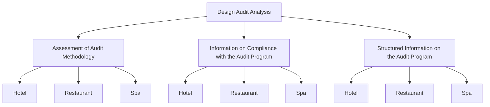
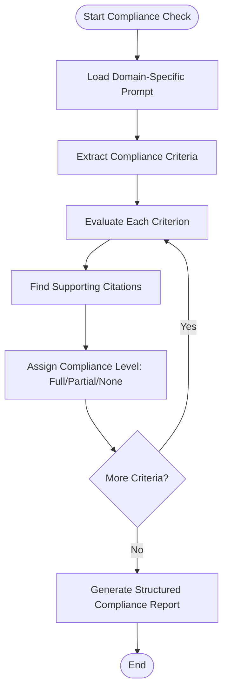
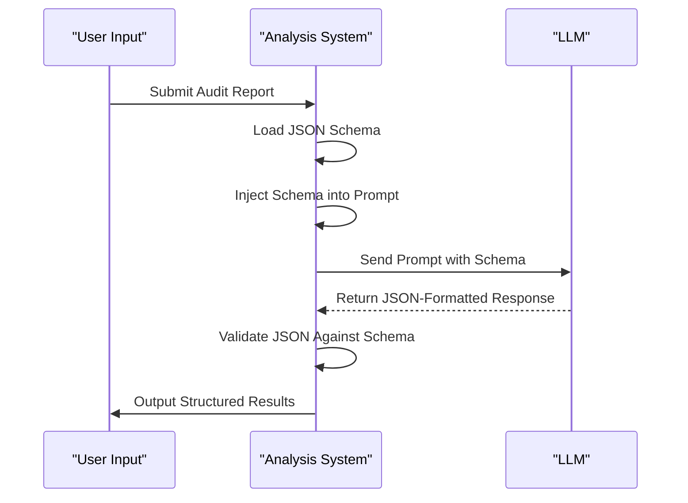
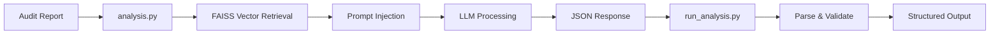

# Design Audit Analysis

<cite>
**Referenced Files in This Document**   
- [design_audit_methodology.txt](file://prompts/design_audit_methodology.txt)
- [hotel_audit_compliance.txt](file://prompts/hotel_audit_compliance.txt)
- [restaurant_audit_compliance.txt](file://prompts/restaurant_audit_compliance.txt)
- [health_center_audit_compliance.txt](file://prompts/health_center_audit_compliance.txt)
- [structured_hotel_audit.txt](file://prompts/structured_hotel_audit.txt)
- [structured_restaurant_audit.txt](file://prompts/structured_restaurant_audit.txt)
- [structured_health_center_audit.txt](file://prompts/structured_health_center_audit.txt)
- [Дизайн.Оценка методологии аудита. Json.txt](file://prompts-by-scenario/design/Assessment-of-the-audit-methodology/json-prompt/Дизайн.Оценка методологии аудита. Json.txt)
- [Дизайн. Соответствие программе аудита. Отель. Json.txt](file://prompts-by-scenario/design/Information-on-compliance-with-the-audit-program/hotel/json-prompt/Дизайн. Соответствие программе аудита. Отель. Json.txt)
- [Дизайн. Соответствие программе аудита. Ресторан. Json.txt](file://prompts-by-scenario/design/Information-on-compliance-with-the-audit-program/restaurant/json-prompt/Дизайн. Соответствие программе аудита. Ресторан. Json.txt)
- [Дизайн. Соответствие программе аудита. СПА. Json.txt](file://prompts-by-scenario/design/Information-on-compliance-with-the-audit-program/spa/json-prompt/Дизайн. Соответствие программе аудита. СПА. Json.txt)
- [Дизайн. Структ отчет отель. Подсчет пунктов информации. json.txt](file://prompts-by-scenario/design/Structured-information-on-the-audit-program/hotel/json-prompt/Дизайн. Структ отчет отель. Подсчет пунктов информации. json.txt)
- [Дизайн. Структ отчет ресторан. Подсчет пунктов информации. json.txt](file://prompts-by-scenario/design/Structured-information-on-the-audit-program/restaurant/json-prompt/Дизайн. Структ отчет ресторан. Подсчет пунктов информации. json.txt)
- [Дизайн. Структ отчет спа. Подсчет пунктов информации. json.txt](file://prompts-by-scenario/design/Structured-information-on-the-audit-program/spa/json-prompt/Дизайн. Структ отчет спа. Подсчет пунктов информации. json.txt)
- [analysis.py](file://src/analysis.py)
- [run_analysis.py](file://src/run_analysis.py)
- [step_2_sql_request.txt](file://prompts-by-scenario/sql_prompts/part2/step_2_sql_request.txt)
</cite>

## Table of Contents
1. [Introduction](#introduction)
2. [Design Audit Sub-Scenarios Overview](#design-audit-sub-scenarios-overview)
3. [Assessment of Audit Methodology](#assessment-of-audit-methodology)
4. [Information on Compliance with the Audit Program](#information-on-compliance-with-the-audit-program)
5. [Structured Information on the Audit Program](#structured-information-on-the-audit-program)
6. [Domain-Specific Prompt Structures](#domain-specific-prompt-structures)
7. [JSON Schema Enforcement and Output Consistency](#json-schema-enforcement-and-output-consistency)
8. [Analysis Pipeline: Data Processing Workflow](#analysis-pipeline-data-processing-workflow)
9. [Configuration and Extensibility](#configuration-and-extensibility)
10. [Troubleshooting Common Failures](#troubleshooting-common-failures)

## Introduction

The Design Audit Analysis feature is a specialized system for evaluating architectural and operational compliance in hospitality venues, including hotels, restaurants, and spas (health centers). It leverages structured prompting, domain-specific methodologies, and LLM-based analysis to assess the quality and completeness of design audits. The system ensures consistent, machine-readable outputs through JSON schema enforcement and supports downstream processing for decision-making.

This document details the three core sub-scenarios of the design audit: Assessment of Audit Methodology, Information on Compliance with the Audit Program, and Structured Information on the Audit Program. It explains how each is implemented with variations for different venue types, the role of JSON prompts in output formatting, and the processing pipeline in `analysis.py` and `run_analysis.py`. Configuration options and troubleshooting guidance are also provided.

**Section sources**
- [design_audit_methodology.txt](file://prompts/design_audit_methodology.txt#L0-L64)
- [step_2_sql_request.txt](file://prompts-by-scenario/sql_prompts/part2/step_2_sql_request.txt#L156-L194)

## Design Audit Sub-Scenarios Overview

The Design Audit Analysis system is structured around three primary sub-scenarios, each serving a distinct analytical purpose:

1. **Assessment of Audit Methodology**: Evaluates the quality and adherence of a design audit to standardized methodology.
2. **Information on Compliance with the Audit Program**: Checks whether specific audit criteria were met in the report.
3. **Structured Information on the Audit Program**: Extracts and organizes key findings into a standardized format.

These sub-scenarios are implemented with domain-specific variations for hotels, restaurants, and spas, ensuring relevance to the unique design and operational characteristics of each venue type.

**Diagram sources**
- [design_audit_methodology.txt](file://prompts/design_audit_methodology.txt#L0-L64)
- [hotel_audit_compliance.txt](file://prompts/hotel_audit_compliance.txt#L0-L10)
- [structured_hotel_audit.txt](file://prompts/structured_hotel_audit.txt#L0-L10)

## Assessment of Audit Methodology

This sub-scenario evaluates the overall quality of a design audit by assessing its adherence to a standardized methodology. The system determines whether the audit provides a comprehensive, contextually relevant, and actionable assessment of the venue's design.

Key evaluation criteria include:
- **Contextuality**: Whether the audit considers the venue's brand, target audience, and overall design concept.
- **Completeness**: Coverage of all relevant design zones (e.g., lobby, reception, corridors, rooms, restaurant, bar).
- **Analytical Depth**: Quality of observations, identification of critical issues, and proposed solutions.
- **Output Integrity**: Coherence and clarity of conclusions.

The assessment follows a 10-point scoring system:
- **9–10**: Exceptional audit with comprehensive coverage and actionable insights.
- **7–8**: Good audit with minor gaps.
- **5–6**: Satisfactory but incomplete.
- **Below 5**: Poor quality, lacking key elements.

The system also provides recommendations for improving the audit methodology and evaluates the practical value of the audit for management decision-making.

**Section sources**
- [design_audit_methodology.txt](file://prompts/design_audit_methodology.txt#L0-L64)

## Information on Compliance with the Audit Program

This sub-scenario checks whether the audit report complies with predefined methodological requirements. It performs a checklist-style evaluation across key sections of the audit, verifying whether each criterion was fully, partially, or not met.

For each venue type, the system uses a tailored compliance prompt:
- **Hotels**: Focuses on spatial zones like lobby, reception, corridors, rooms, and special areas.
- **Restaurants**: Emphasizes dining experience, kitchen visibility, and service flow.
- **Spas (Health Centers)**: Prioritizes wellness, relaxation, and therapeutic environment.

The output includes direct citations from the audit report to support each compliance judgment, ensuring transparency and traceability.

Example compliance criteria for hotels:
- **Contextual Alignment**: Is the design consistent with the hotel's brand and target audience?
- **Functional Layout**: Does the spatial arrangement support efficient guest flow?
- **Aesthetic Cohesion**: Are materials, colors, and lighting harmonized?

**Diagram sources**
- [hotel_audit_compliance.txt](file://prompts/hotel_audit_compliance.txt#L0-L10)
- [restaurant_audit_compliance.txt](file://prompts/restaurant_audit_compliance.txt#L0-L10)
- [health_center_audit_compliance.txt](file://prompts/health_center_audit_compliance.txt#L0-L10)

**Section sources**
- [hotel_audit_compliance.txt](file://prompts/hotel_audit_compliance.txt#L0-L10)
- [restaurant_audit_compliance.txt](file://prompts/restaurant_audit_compliance.txt#L0-L10)
- [health_center_audit_compliance.txt](file://prompts/health_center_audit_compliance.txt#L0-L10)

## Structured Information on the Audit Program

This sub-scenario extracts and organizes key information from the audit report into a standardized, structured format. It ensures that critical findings are consistently represented for downstream analysis and reporting.

The structured output includes:
- **Audit Metadata**: Venue name, location, date, auditor.
- **Design Zones Analyzed**: List of spaces evaluated (e.g., lobby, restaurant, spa).
- **Key Findings**: Summary of major observations and issues.
- **Recommendations**: Actionable design improvements.
- **Compliance Summary**: High-level assessment of methodology adherence.

The process is implemented in multiple parts for complex venues:
- **Part 1**: Initial extraction of basic information and zone identification.
- **Part 2**: Detailed analysis of each zone’s design elements.
- **Part 3**: Synthesis of findings and recommendations (hotels only).

This multi-part approach allows for modular processing and scalability across different venue complexities.

**Section sources**
- [structured_hotel_audit.txt](file://prompts/structured_hotel_audit.txt#L0-L10)
- [structured_restaurant_audit.txt](file://prompts/structured_restaurant_audit.txt#L0-L10)
- [structured_health_center_audit.txt](file://prompts/structured_health_center_audit.txt#L0-L10)

## Domain-Specific Prompt Structures

The system uses specialized prompt templates for each venue type and sub-scenario, ensuring domain-appropriate evaluation criteria and language.

### Hotel-Specific Prompts
- **Methodology Assessment**: Evaluates architectural coherence, guest flow, and brand alignment.
- **Compliance Check**: Verifies coverage of key zones (lobby, rooms, corridors).
- **Structured Reporting**: Organizes findings by spatial hierarchy.

### Restaurant-Specific Prompts
- **Methodology Assessment**: Focuses on ambiance, seating comfort, and service efficiency.
- **Compliance Check**: Validates analysis of lighting, acoustics, and kitchen integration.
- **Structured Reporting**: Highlights customer experience elements.

### Spa (Health Center)-Specific Prompts
- **Methodology Assessment**: Emphasizes tranquility, privacy, and therapeutic design.
- **Compliance Check**: Confirms evaluation of relaxation zones, treatment rooms, and wellness features.
- **Structured Reporting**: Prioritizes sensory and emotional impact.

Each prompt is divided into logical parts to manage complexity and improve LLM performance. For example, the hotel structured audit uses three parts: initial data extraction, detailed zone analysis, and final synthesis.

**Section sources**
- [structured_hotel_audit.txt](file://prompts/structured_hotel_audit.txt#L0-L10)
- [structured_restaurant_audit.txt](file://prompts/structured_restaurant_audit.txt#L0-L10)
- [structured_health_center_audit.txt](file://prompts/structured_health_center_audit.txt#L0-L10)

## JSON Schema Enforcement and Output Consistency

To ensure machine-readable and consistent outputs, the system enforces strict JSON schema definitions via dedicated JSON prompt files. These schemas define the exact structure, data types, and required fields for each sub-scenario and venue type.

Key JSON schema files:
- **Assessment of Audit Methodology**:
  - `Дизайн.Оценка методологии аудита. Json.txt`: Defines score, justification, and recommendations.
- **Compliance with Audit Program**:
  - `Дизайн. Соответствие программе аудита. Отель. Json.txt`: Hotel compliance schema.
  - `Дизайн. Соответствие программе аудита. Ресторан. Json.txt`: Restaurant compliance schema.
  - `Дизайн. Соответствие программе аудита. СПА. Json.txt`: Spa compliance schema.
- **Structured Audit Information**:
  - `Дизайн. Структ отчет отель. Подсчет пунктов информации. json.txt`: Hotel structured report.
  - `Дизайн. Структ отчет ресторан. Подсчет пунктов информации. json.txt`: Restaurant structured report.
  - `Дизайн. Структ отчет спа. Подсчет пунктов информации. json.txt`: Spa structured report.

These JSON prompts are injected into the LLM request to constrain the output format, enabling reliable parsing in downstream systems.

**Diagram sources**
- [Дизайн.Оценка методологии аудита. Json.txt](file://prompts-by-scenario/design/Assessment-of-the-audit-methodology/json-prompt/Дизайн.Оценка методологии аудита. Json.txt)
- [Дизайн. Соответствие программе аудита. Отель. Json.txt](file://prompts-by-scenario/design/Information-on-compliance-with-the-audit-program/hotel/json-prompt/Дизайн. Соответствие программе аудита. Отель. Json.txt)

**Section sources**
- [Дизайн.Оценка методологии аудита. Json.txt](file://prompts-by-scenario/design/Assessment-of-the-audit-methodology/json-prompt/Дизайн.Оценка методологии аудита. Json.txt)
- [Дизайн. Соответствие программе аудита. Отель. Json.txt](file://prompts-by-scenario/design/Information-on-compliance-with-the-audit-program/hotel/json-prompt/Дизайн. Соответствие программе аудита. Отель. Json.txt)

## Analysis Pipeline: Data Processing Workflow

The audit analysis pipeline is implemented in `src/analysis.py` and `src/run_analysis.py`, orchestrating the flow from input to structured output.

### Key Processing Stages:
1. **Input Ingestion**: Accepts raw audit reports (text, PDF, etc.).
2. **Vector Retrieval**: Uses FAISS to retrieve relevant methodological guidelines based on the venue type and sub-scenario.
3. **Prompt Construction**: Combines the audit content with the appropriate prompt template and JSON schema.
4. **LLM Inference**: Sends the constructed prompt to the LLM for analysis.
5. **Response Parsing**: Extracts and validates the JSON output.
6. **Output Delivery**: Returns structured results to the user or downstream system.

The `run_analysis.py` script serves as the entry point, coordinating these stages and handling error conditions.

**Diagram sources**
- [analysis.py](file://src/analysis.py)
- [run_analysis.py](file://src/run_analysis.py)

**Section sources**
- [analysis.py](file://src/analysis.py)
- [run_analysis.py](file://src/run_analysis.py)

## Configuration and Extensibility

The system supports configuration of audit criteria and extension to new venue types through modular prompt design.

### Configuration Options:
- **Adjust Scoring Weights**: Modify the importance of different criteria in the methodology assessment.
- **Custom Compliance Rules**: Add or remove checklist items for compliance checks.
- **Output Field Mapping**: Customize which data fields are included in structured reports.

### Extending to New Venue Types:
1. Create new prompt files in `prompts/` and `prompts-by-scenario/design/`.
2. Define domain-specific evaluation criteria.
3. Develop a corresponding JSON schema.
4. Register the new type in the routing logic (e.g., `step_2_sql_request.txt`).

This modular design allows the system to adapt to new hospitality segments, such as co-working spaces or boutique lodges, without altering core logic.

**Section sources**
- [step_2_sql_request.txt](file://prompts-by-scenario/sql_prompts/part2/step_2_sql_request.txt#L156-L194)

## Troubleshooting Common Failures

### Malformed JSON Responses
**Symptoms**: Parsing errors, invalid JSON syntax.
**Causes**: LLM deviation from schema, prompt injection failure.
**Solutions**:
- Retry with stricter prompt formatting.
- Implement JSON repair heuristics.
- Log and analyze failure patterns for prompt refinement.

### Missing Compliance Sections
**Symptoms**: Incomplete checklist, null values for criteria.
**Causes**: Audit report lacks information, prompt misalignment.
**Solutions**:
- Verify input completeness.
- Adjust prompt to explicitly request missing sections.
- Use default "not addressed" values with clear labeling.

### Low Scoring Despite Good Design
**Symptoms**: High-quality audits receive low methodology scores.
**Causes**: Criteria mismatch, outdated methodology.
**Solutions**:
- Review and update audit methodology prompts.
- Calibrate scoring rubric.
- Add context-aware weighting.

### FAISS Retrieval Failures
**Symptoms**: Incorrect methodological guidelines retrieved.
**Causes**: Poor vector similarity, insufficient training data.
**Solutions**:
- Reindex FAISS database with updated embeddings.
- Improve metadata tagging for venue types.
- Implement fallback to default methodology.

**Section sources**
- [analysis.py](file://src/analysis.py)
- [run_analysis.py](file://src/run_analysis.py)
- [design_audit_methodology.txt](file://prompts/design_audit_methodology.txt#L0-L64)