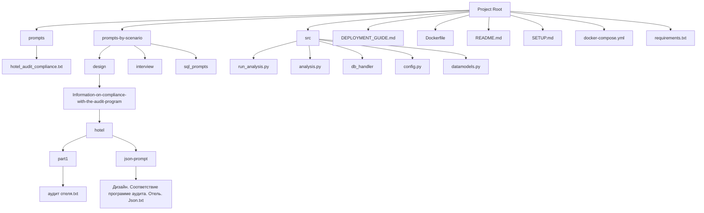
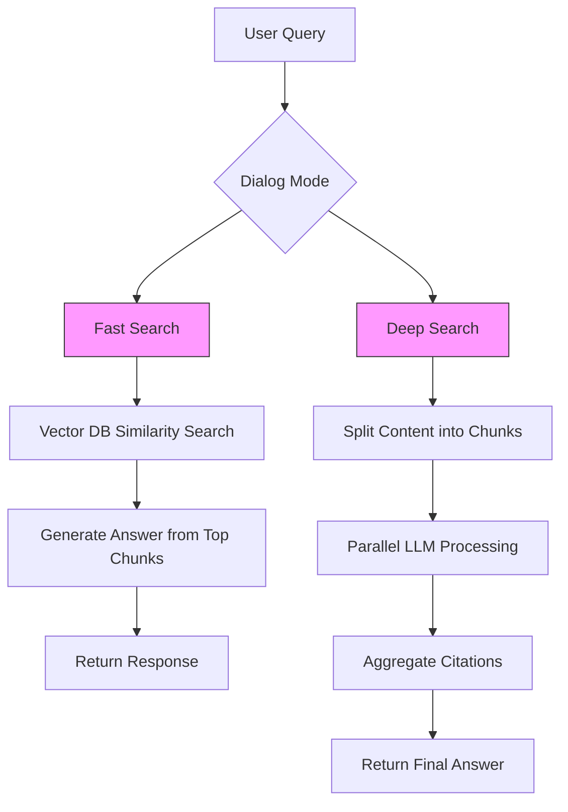
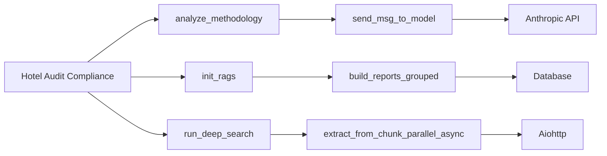
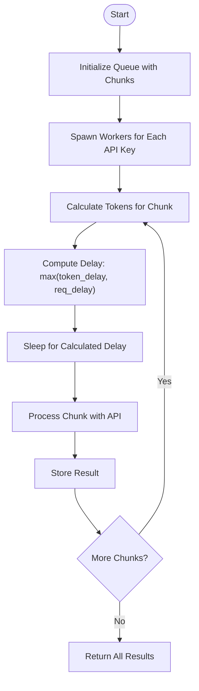

# Hotel Audit Compliance

<cite>
**Referenced Files in This Document**   
- [аудит отеля.txt](file://prompts-by-scenario/design/Information-on-compliance-with-the-audit-program/hotel/part1/аудит отеля.txt)
- [Дизайн. Соответствие программе аудита. Отель. Json.txt](file://prompts-by-scenario/design/Information-on-compliance-with-the-audit-program/hotel/json-prompt/Дизайн. Соответствие программе аудита. Отель. Json.txt)
- [run_analysis.py](file://src/run_analysis.py)
- [analysis.py](file://src/analysis.py)
</cite>

## Table of Contents
1. [Introduction](#introduction)
2. [Project Structure](#project-structure)
3. [Core Components](#core-components)
4. [Architecture Overview](#architecture-overview)
5. [Detailed Component Analysis](#detailed-component-analysis)
6. [Dependency Analysis](#dependency-analysis)
7. [Performance Considerations](#performance-considerations)
8. [Troubleshooting Guide](#troubleshooting-guide)
9. [Conclusion](#conclusion)

## Introduction

The Hotel Audit Compliance sub-feature is a specialized module designed to evaluate adherence to hospitality design and operational standards in hotel environments. It leverages structured prompt engineering, JSON schema validation, and Retrieval-Augmented Generation (RAG) to ensure consistent, evidence-based audit assessments. This system enables deep semantic analysis of audit reports, quantifies compliance levels, and generates actionable insights for hotel management. The integration of business-specific criteria—such as visual inspection protocols, staff interview analysis, and documentation review—with automated validation ensures high-quality, standardized outputs across diverse audit scenarios.

## Project Structure

The project follows a modular, scenario-driven architecture with distinct directories for prompts, source code, and configuration files. Prompts are organized by use case (e.g., design audits, employee interviews) and further segmented by building type (hotel, restaurant, spa). The source code resides in the `src` directory and includes modules for analysis, RAG integration, database handling, and utility functions.



**Diagram sources**
- [аудит отеля.txt](file://prompts-by-scenario/design/Information-on-compliance-with-the-audit-program/hotel/part1/аудит отеля.txt)
- [Дизайн. Соответствие программе аудита. Отель. Json.txt](file://prompts-by-scenario/design/Information-on-compliance-with-the-audit-program/hotel/json-prompt/Дизайн. Соответствие программе аудита. Отель. Json.txt)
- [run_analysis.py](file://src/run_analysis.py)
- [analysis.py](file://src/analysis.py)

**Section sources**
- [аудит отеля.txt](file://prompts-by-scenario/design/Information-on-compliance-with-the-audit-program/hotel/part1/аудит отеля.txt)
- [run_analysis.py](file://src/run_analysis.py)

## Core Components

The core functionality of the Hotel Audit Compliance system revolves around three key components: prompt-based analysis, structured data extraction, and RAG-powered context retrieval. The system uses a chain-of-thought reasoning approach where audit reports are processed through a sequence of prompts to evaluate completeness, methodology adherence, and recommendation quality.

The `analyze_methodology` function in `analysis.py` orchestrates the sequential execution of prompts, where the output of one prompt serves as input to the next. This enables multi-stage analysis, such as first evaluating visual inspection coverage, then assessing supplementary information collection, and finally generating an overall compliance score.

```python
def analyze_methodology(text: str, prompt_list: list[tuple[str, int]]) -> str:
    current_response = None
    for prompt, _ in prompt_list:
        if current_response is None:
            messages = [{"role": "user", "content": f"{prompt}\n\n{text}"}]
            current_response = send_msg_to_model(messages=messages)
        else:
            combined_prompt = f"{prompt}\n\nТекст:{current_response}"
            messages = [{"role": "user", "content": combined_prompt}]
            current_response = send_msg_to_model(messages=messages)
    return current_response
```

**Section sources**
- [analysis.py](file://src/analysis.py#L15-L30)

## Architecture Overview

The system architecture integrates prompt engineering with RAG to enable both deep and fast analysis modes. The RAG pipeline retrieves relevant audit reports from a knowledge base, which are then analyzed using domain-specific prompts. The architecture supports two primary workflows: fast search (vector similarity-based retrieval) and deep search (parallel LLM processing with aggregation).



**Diagram sources**
- [run_analysis.py](file://src/run_analysis.py#L100-L200)
- [analysis.py](file://src/analysis.py#L200-L300)

## Detailed Component Analysis

### Hotel Audit Compliance Prompt Analysis

The `аудит отеля.txt` prompt defines a comprehensive evaluation framework for hotel design audits. It requires the auditor to assess multiple dimensions including visual inspection, supplementary information gathering, and reporting quality. Each dimension is evaluated on a percentage scale with detailed justification.

Key evaluation criteria include:
- **Visual Inspection Coverage**: Assesses whether all required elements (e.g., lobby, reception, corridors) were examined
- **Supplementary Information**: Evaluates use of staff interviews, guest reviews, and design documentation
- **Report Quality**: Checks for alignment with hotel concept, problem checklists, and emotional scenario recommendations

The prompt enforces methodological consistency by requiring percentage-based scoring for each criterion, ensuring quantitative comparability across audits.

**Section sources**
- [аудит отеля.txt](file://prompts-by-scenario/design/Information-on-compliance-with-the-audit-program/hotel/part1/аудит отеля.txt#L1-L92)

### JSON Schema for Structured Output

The `Дизайн. Соответствие программе аудита. Отель. Json.txt` file defines a JSON schema for extracting quantitative compliance metrics from audit reports. This schema ensures structured, machine-readable output that can be used for automated processing and dashboard integration.

```json
{
  "оценка_соответствия_методологии_визуальный_осмотр": 85,
  "оценка_соответствия_методологии_сбор_информации": 70,
  "оценка_соответствия_методологии_формирование_отчета": 90,
  "общая_оценка_соответствия_методологии": 81.67,
  "итоговая_оценка_качества_аудита": 85
}
```

The schema extracts five key metrics:
- Visual inspection methodology compliance
- Information gathering methodology compliance
- Report formation methodology compliance
- Overall methodology compliance (average)
- Final audit quality score

This structured output enables trend analysis, performance benchmarking, and automated alerting for compliance issues.

**Section sources**
- [Дизайн. Соответствие программе аудита. Отель. Json.txt](file://prompts-by-scenario/design/Information-on-compliance-with-the-audit-program/hotel/json-prompt/Дизайн. Соответствие программе аудита. Отель. Json.txt#L1-L35)

### RAG Integration in run_analysis.py

The `run_analysis.py` module implements the RAG pipeline that powers both fast and deep search capabilities. The `init_rags` function initializes multiple knowledge bases for different audit scenarios, including design and interview categories.

```python
def init_rags(existing_rags: dict | None = None) -> dict:
    rags = existing_rags.copy() if existing_rags else {}
    rag_configs = [
        ("Интервью", None, None),
        ("Дизайн", None, None),
        ("Дизайн", "Соответствие программе аудита", None),
        # ... additional configurations
    ]
    for config in rag_configs:
        scenario_name, report_type, _ = config
        rag_name = report_type if report_type else scenario_name
        if rag_name in rags:
            continue
        content = build_reports_grouped(scenario_name=scenario_name, report_type=report_type)
        content_str = grouped_reports_to_string(content)
        if rag_name == "Интервью" or rag_name == "Дизайн":
            rag_db = create_db_in_memory(content_str)
            rags[rag_name] = rag_db
        else:
            rags[rag_name] = content_str
    return rags
```

The `run_deep_search` function processes audit content in parallel using multiple API keys to handle rate limiting and improve throughput. It splits content into chunks, processes them concurrently, and aggregates results into a final response.

**Section sources**
- [run_analysis.py](file://src/run_analysis.py#L1-L343)

## Dependency Analysis

The system exhibits a layered dependency structure where higher-level components depend on lower-level utilities. The primary dependencies are:



Key dependency chains:
- Audit analysis depends on `analyze_methodology` which in turn depends on LLM API calls
- RAG initialization depends on report grouping and database functions
- Deep search depends on asynchronous processing and HTTP client libraries

The system uses multiple Anthropic API keys to distribute load and avoid rate limits, demonstrating a resilient architecture for high-volume processing.

**Diagram sources**
- [run_analysis.py](file://src/run_analysis.py#L1-L343)
- [analysis.py](file://src/analysis.py#L1-L490)

**Section sources**
- [run_analysis.py](file://src/run_analysis.py#L1-L343)
- [analysis.py](file://src/analysis.py#L1-L490)

## Performance Considerations

The system incorporates several performance optimization strategies:
- **Parallel Processing**: Uses `extract_from_chunk_parallel_async` to process multiple audit chunks concurrently
- **Rate Limit Management**: Implements exponential backoff and token-based throttling to respect API limits
- **Caching**: Initializes RAG databases in memory to avoid repeated computation
- **Chunking**: Splits large documents into manageable pieces for efficient processing

The asynchronous implementation in `extract_from_chunk_parallel_async` uses a queue-based worker model with per-API-key rate limiting based on both requests per minute (RPM) and tokens per minute (TPM). This ensures optimal utilization of available API capacity while avoiding throttling.



**Diagram sources**
- [analysis.py](file://src/analysis.py#L300-L400)

## Troubleshooting Guide

Common issues and resolution strategies:

**Incomplete Evidence Reporting**
- **Symptom**: Missing percentage scores in JSON output
- **Cause**: Source audit report lacks required quantitative assessments
- **Resolution**: Refine the audit prompt to enforce mandatory scoring; augment context with examples of properly scored reports

**Misclassification of Compliance Levels**
- **Symptom**: Inconsistent scoring across similar audits
- **Cause**: Ambiguous criteria in the evaluation prompt
- **Resolution**: Clarify scoring rubrics in the prompt; add reference examples; implement cross-validation with multiple evaluators

**RAG Retrieval Failures**
- **Symptom**: "Nothing found" responses despite relevant content
- **Cause**: Vector database not properly initialized or indexed
- **Resolution**: Verify `init_rags` execution; check content formatting in `build_reports_grouped`; validate embedding model performance

**API Rate Limiting**
- **Symptom**: Frequent 429 errors
- **Cause**: Excessive request volume
- **Resolution**: Ensure proper token/request rate calculation in `extract_from_chunk_parallel_async`; verify API key availability; adjust concurrency levels

**Section sources**
- [run_analysis.py](file://src/run_analysis.py#L1-L343)
- [analysis.py](file://src/analysis.py#L1-L490)

## Conclusion

The Hotel Audit Compliance system represents a sophisticated integration of prompt engineering, structured data validation, and RAG-based knowledge retrieval. By combining business-specific evaluation criteria with automated processing pipelines, it ensures consistent, evidence-based audit assessments that are both human-readable and machine-processable. The architecture supports scalability through parallel processing and rate limit management, while the modular design allows for easy extension to new compliance domains. Future enhancements could include real-time dashboard integration, predictive compliance scoring, and automated recommendation generation based on historical audit data.