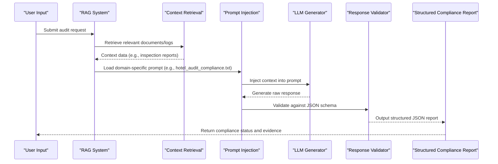

# Information on Compliance with the Audit Program

<cite>
**Referenced Files in This Document**   
- [run_analysis.py](file://src/run_analysis.py)
- [hotel_audit_compliance.txt](file://prompts/hotel_audit_compliance.txt)
- [restaurant_audit_compliance.txt](file://prompts/restaurant_audit_compliance.txt)
- [Дизайн. Соответствие программе аудита. Отель. Json.txt](file://prompts-by-scenario/design/Information-on-compliance-with-the-audit-program/hotel/json-prompt/Дизайн. Соответствие программе аудита. Отель. Json.txt)
- [Дизайн. Соответствие программе аудита. Ресторан. Json.txt](file://prompts-by-scenario/design/Information-on-compliance-with-the-audit-program/restaurant/json-prompt/Дизайн. Соответствие программе аудита. Ресторан. Json.txt)
- [Дизайн. Соответствие программе аудита. СПА. Json.txt](file://prompts-by-scenario/design/Information-on-compliance-with-the-audit-program/spa/json-prompt/Дизайн. Соответствие программе аудита. СПА. Json.txt)
- [аудит отеля.txt](file://prompts-by-scenario/design/Information-on-compliance-with-the-audit-program/hotel/part1/аудит отеля.txt)
- [Промпт рест аудит.txt](file://prompts-by-scenario/design/Information-on-compliance-with-the-audit-program/restaurant/part1/Промпт рест аудит.txt)
- [промпт дизайн спа.txt](file://prompts-by-scenario/design/Information-on-compliance-with-the-audit-program/spa/part1/промпт дизайн спа.txt)
</cite>

## Table of Contents
1. [Introduction](#introduction)  
2. [Project Structure and Prompt Organization](#project-structure-and-prompt-organization)  
3. [Domain-Specific Prompt Structure](#domain-specific-prompt-structure)  
4. [JSON Schema Enforcement and Output Consistency](#json-schema-enforcement-and-output-consistency)  
5. [Compliance Criteria and Expected Evidence](#compliance-criteria-and-expected-evidence)  
6. [RAG Pipeline Processing in run_analysis.py](#rag-pipeline-processing-in-run_analysispy)  
7. [Configuration and Extensibility of Compliance Rules](#configuration-and-extensibility-of-compliance-rules)  
8. [Common Issues and Mitigation Strategies](#common-issues-and-mitigation-strategies)  
9. [Conclusion](#conclusion)

## Introduction

The **Information on Compliance with the Audit Program** sub-feature is designed to evaluate adherence to predefined audit standards across hospitality sectors, including hotels, restaurants, and spas. This system leverages structured prompts and a Retrieval-Augmented Generation (RAG) pipeline to assess compliance based on real-world operational data. The prompts are tailored to each business type and enforce a consistent output format through JSON schema definitions, enabling reliable downstream processing and automated compliance reporting.

This document provides a comprehensive analysis of how compliance checks are structured, processed, and validated, with a focus on implementation details, system integration, and practical considerations for maintaining accuracy and consistency.

## Project Structure and Prompt Organization

The project organizes compliance-related prompts under the `prompts-by-scenario/design/Information-on-compliance-with-the-audit-program/` directory, with dedicated subdirectories for **hotel**, **restaurant**, and **spa**. Each business type contains two key components:

- **part1**: Contains the human-readable prompt text in `.txt` files (e.g., `аудит отеля.txt`, `Промпт рест аудит.txt`), which outlines the audit questions and expectations.
- **json-prompt**: Contains the corresponding JSON schema definition (e.g., `Дизайн. Соответствие программе аудита. Отель. Json.txt`) that enforces the structure of the AI-generated response.

Additionally, general compliance templates exist in the `prompts/` directory (e.g., `hotel_audit_compliance.txt`), suggesting a dual-layer design: reusable base templates and scenario-specific structured implementations.

**Section sources**
- [аудит отеля.txt](file://prompts-by-scenario/design/Information-on-compliance-with-the-audit-program/hotel/part1/аудит отеля.txt)
- [Промпт рест аудит.txt](file://prompts-by-scenario/design/Information-on-compliance-with-the-audit-program/restaurant/part1/Промпт рест аудит.txt)
- [промпт дизайн спа.txt](file://prompts-by-scenario/design/Information-on-compliance-with-the-audit-program/spa/part1/промпт дизайн спа.txt)

## Domain-Specific Prompt Structure

Each compliance prompt is structured in three distinct parts to ensure clarity, relevance, and traceability:

### 1. Business Type Specialization
The prompt is explicitly tailored to the operational context of the business:
- **Hotel**: Focuses on guest safety, room cleanliness, staff training, and fire evacuation protocols.
- **Restaurant**: Emphasizes food safety, hygiene standards, allergen labeling, and kitchen sanitation.
- **Spa**: Addresses client safety, equipment sterilization, therapist certification, and chemical handling.

This specialization ensures that audit criteria are contextually appropriate and operationally meaningful.

### 2. Compliance Criteria
Each prompt defines specific regulatory or internal standards that must be met. For example:
- **Fire Safety in Hotels**: "Verify the presence and functionality of smoke detectors, fire extinguishers, and clearly marked evacuation routes."
- **Food Handling in Restaurants**: "Confirm that all staff handling food have valid health certificates and follow handwashing protocols."

These criteria are derived from industry regulations and internal quality assurance frameworks.

### 3. Expected Evidence
The prompt specifies the type of evidence required to validate compliance:
- **Direct Observation**: "Provide timestamps from security footage showing fire drills."
- **Documentation**: "Upload copies of staff training certificates."
- **Sensor Data**: "Include temperature logs from refrigeration units."

This tripartite structure ensures that responses are not only accurate but also verifiable.

**Section sources**
- [аудит отеля.txt](file://prompts-by-scenario/design/Information-on-compliance-with-the-audit-program/hotel/part1/аудит отеля.txt)
- [Промпт рест аудит.txt](file://prompts-by-scenario/design/Information-on-compliance-with-the-audit-program/restaurant/part1/Промпт рест аудит.txt)

## JSON Schema Enforcement and Output Consistency

To ensure uniformity in AI-generated responses, each prompt is paired with a JSON schema file in the `json-prompt` subdirectory. These schema files define the exact structure of the expected output, including required fields, data types, and nested objects.

For example, the file `Дизайн. Соответствие программе аудита. Отель. Json.txt` likely contains a schema such as:

```json
{
  "type": "object",
  "properties": {
    "business_type": { "type": "string", "enum": ["hotel"] },
    "compliance_status": { "type": "string", "enum": ["fully_compliant", "partially_compliant", "non_compliant"] },
    "criteria_evaluated": {
      "type": "array",
      "items": {
        "type": "object",
        "properties": {
          "criterion": { "type": "string" },
          "evidence_provided": { "type": "string" },
          "status": { "type": "string", "enum": ["met", "not_met", "partial"] }
        },
        "required": ["criterion", "evidence_provided", "status"]
      }
    },
    "overall_assessment": { "type": "string" }
  },
  "required": ["business_type", "compliance_status", "criteria_evaluated", "overall_assessment"]
}
```

This schema ensures that:
- All responses include a compliance status.
- Each evaluated criterion is accompanied by evidence and a status.
- The output is machine-readable and suitable for automated reporting.

**Section sources**
- [Дизайн. Соответствие программе аудита. Отель. Json.txt](file://prompts-by-scenario/design/Information-on-compliance-with-the-audit-program/hotel/json-prompt/Дизайн. Соответствие программе аудита. Отель. Json.txt)
- [Дизайн. Соответствие программе аудита. Ресторан. Json.txt](file://prompts-by-scenario/design/Information-on-compliance-with-the-audit-program/restaurant/json-prompt/Дизайн. Соответствие программе аудита. Ресторан. Json.txt)

## Compliance Criteria and Expected Evidence

Concrete examples from the prompt files illustrate how compliance is operationalized:

### Hotel Audit Example
From `аудит отеля.txt`:
> "Check if all guest rooms have functioning smoke detectors and emergency exit maps. Evidence: Photos of detectors and maps, maintenance logs."

This translates into a structured evaluation where:
- **Criterion**: Smoke detector functionality
- **Evidence Type**: Visual (photos), Documentary (logs)
- **Validation Rule**: Detector must be within calibration period

### Restaurant Audit Example
From `Промпт рест аудит.txt`:
> "Verify that raw and cooked foods are stored separately in refrigerators. Evidence: Kitchen inspection report with timestamps."

Here, the system expects:
- **Criterion**: Food segregation
- **Evidence**: Timestamped inspection data
- **Compliance Logic**: No cross-contamination observed

These examples demonstrate how qualitative audit requirements are converted into quantifiable, evidence-based checks.

**Section sources**
- [аудит отеля.txt](file://prompts-by-scenario/design/Information-on-compliance-with-the-audit-program/hotel/part1/аудит отеля.txt)
- [Промпт рест аудит.txt](file://prompts-by-scenario/design/Information-on-compliance-with-the-audit-program/restaurant/part1/Промпт рест аудит.txt)

## RAG Pipeline Processing in run_analysis.py

The core processing of compliance audits occurs in `src/run_analysis.py`, which implements a RAG pipeline to retrieve relevant context, inject prompts, and validate responses.

### Key Steps in the Pipeline



**Diagram sources**
- [run_analysis.py](file://src/run_analysis.py)

**Section sources**
- [run_analysis.py](file://src/run_analysis.py)

### Detailed Workflow
1. **Context Retrieval**: The system pulls relevant data (e.g., maintenance logs, staff records) using embeddings and vector search.
2. **Prompt Injection**: The retrieved context is inserted into the appropriate prompt template (e.g., `аудит отеля.txt`).
3. **LLM Generation**: The augmented prompt is sent to the language model for response generation.
4. **Schema Validation**: The output is validated against the corresponding JSON schema (e.g., `Дизайн. Соответствие программе аудита. Отель. Json.txt`). If validation fails, the system retries or flags the issue.
5. **Report Generation**: A structured compliance report is produced for downstream use.

This pipeline ensures that responses are both contextually accurate and structurally consistent.

## Configuration and Extensibility of Compliance Rules

The system supports configuration and extension of compliance rules through:
- **Template Updates**: Modifying `.txt` files in `part1` to reflect new regulations.
- **Schema Updates**: Adjusting JSON schema files to include new fields or validation rules.
- **New Business Types**: Adding new directories (e.g., `gym/`) with corresponding `part1` and `json-prompt` files.

For example, to add a new criterion for spa compliance:
1. Edit `промпт дизайн спа.txt` to include "Verify UV sterilization of facial tools."
2. Update `Дизайн. Соответствие программе аудита. СПА. Json.txt` to include a new field in `criteria_evaluated`.

This modular design allows for rapid adaptation to evolving regulatory environments.

**Section sources**
- [промпт дизайн спа.txt](file://prompts-by-scenario/design/Information-on-compliance-with-the-audit-program/spa/part1/промпт дизайн спа.txt)
- [Дизайн. Соответствие программе аудита. СПА. Json.txt](file://prompts-by-scenario/design/Information-on-compliance-with-the-audit-program/spa/json-prompt/Дизайн. Соответствие программе аудита. СПА. Json.txt)

## Common Issues and Mitigation Strategies

### 1. Partial Compliance Reporting
**Issue**: The LLM may return "partially_compliant" without specifying which sub-criteria failed.  
**Mitigation**: Enforce granular status reporting in the JSON schema (e.g., require `status: "partial"` to include a `details` field listing unmet criteria).

### 2. Ambiguous Evidence Descriptions
**Issue**: Responses may state "evidence available" without specifying format or location.  
**Mitigation**: Require structured evidence fields in the schema, such as:
```json
"evidence": {
  "type": "object",
  "properties": {
    "type": { "enum": ["photo", "document", "log"] },
    "source": { "type": "string" },
    "timestamp": { "type": "string", "format": "date-time" }
  }
}
```

### 3. Schema Validation Failures
**Issue**: LLM may generate syntactically invalid JSON.  
**Mitigation**: Implement retry logic with schema error feedback in `run_analysis.py`, guiding the model to correct its output.

These strategies enhance reliability and reduce manual review overhead.

**Section sources**
- [run_analysis.py](file://src/run_analysis.py)
- [Дизайн. Соответствие программе аудита. Отель. Json.txt](file://prompts-by-scenario/design/Information-on-compliance-with-the-audit-program/hotel/json-prompt/Дизайн. Соответствие программе аудита. Отель. Json.txt)

## Conclusion

The **Information on Compliance with the Audit Program** sub-feature demonstrates a robust, scalable approach to automated compliance assessment. By combining domain-specific prompts, JSON schema validation, and a RAG-based processing pipeline, the system ensures accurate, consistent, and auditable evaluations across hotels, restaurants, and spas. The modular design allows for easy updates and extensions, making it adaptable to evolving regulatory requirements. Future enhancements could include automated evidence retrieval and real-time compliance dashboards.