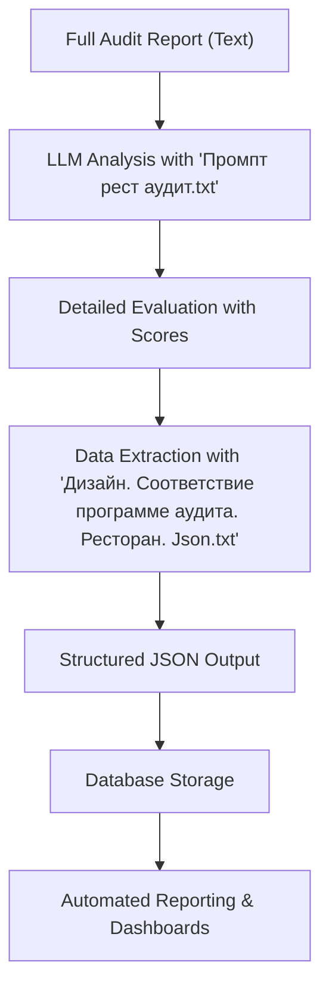

# Restaurant Audit Compliance

<cite>
**Referenced Files in This Document**   
- [Промпт рест аудит.txt](file://prompts-by-scenario/design/Information-on-compliance-with-the-audit-program/restaurant/part1/Промпт рест аудит.txt)
- [Дизайн. Соответствие программе аудита. Ресторан. Json.txt](file://prompts-by-scenario/design/Information-on-compliance-with-the-audit-program/restaurant/json-prompt/Дизайн. Соответствие программе аудита. Ресторан. Json.txt)
- [restaurant_audit_compliance.txt](file://prompts/restaurant_audit_compliance.txt)
- [run_analysis.py](file://src/run_analysis.py)
</cite>

## Table of Contents
1. [Introduction](#introduction)
2. [Core Prompt Structure for Restaurant Audit Compliance](#core-prompt-structure-for-restaurant-audit-compliance)
3. [Alignment with JSON Schema for Structured Output](#alignment-with-json-schema-for-structured-output)
4. [Automated Scoring and Reporting Mechanism](#automated-scoring-and-reporting-mechanism)
5. [RAG System Integration in run_analysis.py](#rag-system-integration-in-run_analysispy)
6. [Customization of Compliance Criteria](#customization-of-compliance-criteria)
7. [Handling Ambiguity and Missing Documentation](#handling-ambiguity-and-missing-documentation)
8. [Conclusion](#conclusion)

## Introduction
The Restaurant Audit Compliance sub-feature is designed to evaluate adherence to design, operational, and experiential standards within restaurant environments. While the system does not directly assess hygiene, food safety, or staff training, it evaluates the quality and completeness of design audits that may indirectly influence compliance with broader service standards. The framework leverages specialized prompts and a Retrieval-Augmented Generation (RAG) system to analyze audit reports, extract structured data, and generate consistent, quantifiable assessments. This document details the architecture, workflow, and customization capabilities of the restaurant audit compliance module.

**Section sources**
- [Промпт рест аудит.txt](file://prompts-by-scenario/design/Information-on-compliance-with-the-audit-program/restaurant/part1/Промпт рест аудит.txt)
- [run_analysis.py](file://src/run_analysis.py)

## Core Prompt Structure for Restaurant Audit Compliance

The core of the restaurant audit evaluation lies in the prompt file **Промпт рест аудит.txt**, which defines a specialized expert role for assessing restaurant design audits. The prompt instructs the Large Language Model (LLM) to perform a deep semantic analysis of a restaurant design audit report based on a predefined methodology.

The analysis is structured around several key principles:

1. **Zone Identification**: The prompt requires the LLM to identify and evaluate specific functional zones of the restaurant, such as the exterior and entrance group, layout, stylistic solutions, lighting design, furniture and equipment, and details and accents. Each zone (e.g., bar counter, dining hall, open kitchen, VIP area) must be assessed in the context of the overall design concept.

2. **Comprehensive Zone Evaluation**: For each zone, the LLM must assess:
   - *Comprehensiveness*: The extent to which all aspects of the zone are covered.
   - *Depth of Analysis*: The level of detail and substance in the evaluation.
   - *Logical Structure*: The coherence and sequence of the assessment.
   - *Contextuality*: The consideration of the zone's relationship to the restaurant's overall concept, brand, and target audience.
   - A percentage score (0–100%) with justification is required for each of these aspects.

3. **Methodology Compliance Check**: The prompt mandates a detailed check against a five-part audit methodology:
   - *Preparatory Analysis*: Evaluation of brand concept, location context, and defined assessment criteria.
   - *Design Solutions Audit*: Assessment of exterior, layout, style, lighting, furniture, and decorative details.
   - *Atmosphere Evaluation*: Analysis of visual perception, acoustic comfort, and tactile experience.
   - *Report Formation*: Review of concept alignment, recommendations, and visualizations.
   - *Audit Methodology*: Verification of data capture tools and data processing quality.
   - A percentage score (0–100%) with justification is required for each section.

4. **Recommendation Quality Assessment**: The LLM evaluates the proposed recommendations for their concreteness, feasibility, alignment with the restaurant's concept, potential effectiveness, and inclusion of visualizations.

5. **Final Scoring and Conclusion**: The final audit quality score (Z%) is calculated as the average of the overall methodology compliance score (X%) and the overall recommendation quality score (Y%). The conclusion must summarize the audit's strengths, gaps, and practical value.

This structured prompt ensures that the LLM's output is thorough, consistent, and directly aligned with the organization's audit standards.

**Section sources**
- [Промпт рест аудит.txt](file://prompts-by-scenario/design/Information-on-compliance-with-the-audit-program/restaurant/part1/Промпт рест аудит.txt)

## Alignment with JSON Schema for Structured Output

To enable automated processing, the system uses a secondary prompt, **Дизайн. Соответствие программе аудита. Ресторан. Json.txt**, which is designed to extract quantitative data from the LLM's initial analysis. This prompt acts as a specialized data extraction tool.

The prompt instructs the LLM to parse the full audit evaluation and extract only the numerical percentage scores for the following key metrics:
- `оценка_соответствия_методологии_подготовительный_анализ`: Score for preparatory analysis.
- `оценка_соответствия_методологии_аудит_дизайн_решений`: Score for design solutions audit.
- `оценка_соответствия_методологии_оценка_атмосферы`: Score for atmosphere evaluation.
- `оценка_соответствия_методологии_формирование_отчета`: Score for report formation.
- `оценка_соответствия_методологии_методика_проведения`: Score for audit methodology.
- `общая_оценка_соответствия_методологии`: Overall methodology compliance score.
- `итоговая_оценка_качества_аудита`: Final audit quality score.

The output is strictly formatted as a JSON object. If a score is missing from the input text, the corresponding field is set to `null`. This ensures that the final output is machine-readable and can be seamlessly integrated into databases or reporting dashboards.



**Diagram sources**
- [Промпт рест аудит.txt](file://prompts-by-scenario/design/Information-on-compliance-with-the-audit-program/restaurant/part1/Промпт рест аудит.txt)
- [Дизайн. Соответствие программе аудита. Ресторан. Json.txt](file://prompts-by-scenario/design/Information-on-compliance-with-the-audit-program/restaurant/json-prompt/Дизайн. Соответствие программе аудита. Ресторан. Json.txt)

**Section sources**
- [Дизайн. Соответствие программе аудита. Ресторан. Json.txt](file://prompts-by-scenario/design/Information-on-compliance-with-the-audit-program/restaurant/json-prompt/Дизайн. Соответствие программе аудита. Ресторан. Json.txt)

## Automated Scoring and Reporting Mechanism

The structured JSON output enables a fully automated scoring and reporting workflow. The process is as follows:

1. **Initial Analysis**: The primary prompt generates a comprehensive textual evaluation of the audit report, including all qualitative insights and quantitative scores.
2. **Data Extraction**: The JSON-specific prompt is applied to the initial output, isolating the seven key percentage scores.
3. **Storage and Aggregation**: The extracted JSON data is stored in a PostgreSQL database. This allows for easy aggregation and comparison across multiple audits, locations, and time periods.
4. **Reporting**: The structured data can be used to generate automated reports, performance dashboards, and trend analyses. For example, managers can track the average "Final Audit Quality Score" for restaurants in a specific region or identify common weaknesses in "Atmosphere Evaluation" across a chain.

This mechanism transforms a qualitative expert review into actionable, quantifiable business intelligence.

**Section sources**
- [Дизайн. Соответствие программе аудита. Ресторан. Json.txt](file://prompts-by-scenario/design/Information-on-compliance-with-the-audit-program/restaurant/json-prompt/Дизайн. Соответствие программе аудита. Ресторан. Json.txt)
- [run_analysis.py](file://src/run_analysis.py)

## RAG System Integration in run_analysis.py

The `run_analysis.py` script orchestrates the entire analysis workflow and integrates the RAG system for context retrieval. The script initializes a set of RAG databases for different scenarios and report types.

```python
def init_rags(existing_rags: dict | None = None) -> dict:
    rags = existing_rags.copy() if existing_rags else {}
    rag_configs = [
        ("Интервью", None, None),
        ("Дизайн", None, None),
        ("Интервью", "Оценка методологии интервью", None),
        ("Интервью", "Отчет о связках", None),
        ("Интервью", "Общие факторы", None),
        ("Интервью", "Факторы в этом заведении", None),
        ("Дизайн", "Оценка методологии аудита", None),
        ("Дизайн", "Соответствие программе аудита", None),
        ("Дизайн", "Структурированный отчет аудита", None),
    ]
    # ... rest of the function
```

The key configuration for restaurant audit compliance is the entry `("Дизайн", "Соответствие программе аудита", None)`. This creates a RAG database named "Соответствие программе аудита" (Compliance with the Audit Program) under the "Дизайн" (Design) scenario. This RAG database is populated with content from `build_reports_grouped`, which retrieves relevant audit reports and transcriptions.

When a user requests a "Restaurant Audit Compliance" analysis, the system uses this RAG database to retrieve restaurant-specific regulations, past audit findings, and other contextual information. This retrieved context is then injected into the LLM prompt, ensuring that the analysis is grounded in the specific operational and regulatory environment of the restaurant being audited. This integration allows the system to provide highly relevant and accurate assessments.

**Section sources**
- [run_analysis.py](file://src/run_analysis.py)

## Customization of Compliance Criteria

While the core prompts are in Russian, the system's architecture allows for customization of compliance criteria for different cuisines or regional regulations. This can be achieved through the following methods:

1. **RAG Content Customization**: The most effective way is to populate the RAG database with region- or cuisine-specific guidelines. For example, a RAG database for a Japanese restaurant chain in California could include local health codes, cultural design principles, and brand-specific standards. The LLM will then use this context when applying the general audit methodology.
2. **Prompt Versioning**: New prompt files can be created in the `prompts-by-scenario` directory, such as `restaurant_audit_compliance_japanese.txt` or `restaurant_audit_compliance_california.txt`. These prompts can include specific criteria relevant to the cuisine or region while maintaining the same overall structure.
3. **Dynamic Prompt Selection**: The `run_analysis.py` script already uses a mapping system (`mapping_report_type_names`, `mapping_building_names`) to select the appropriate prompts. This system can be extended to include cuisine or region as a selection parameter, dynamically loading the most relevant prompt and RAG context.

This flexibility ensures that the audit framework remains relevant and effective across diverse operational contexts.

**Section sources**
- [run_analysis.py](file://src/run_analysis.py)
- [Промпт рест аудит.txt](file://prompts-by-scenario/design/Information-on-compliance-with-the-audit-program/restaurant/part1/Промпт рест аудит.txt)

## Handling Ambiguity and Missing Documentation

The system faces challenges when audit reports are ambiguous or lack necessary documentation. The current design includes several mitigation techniques:

1. **Multi-Stage Analysis**: The two-step process (full analysis followed by JSON extraction) acts as a form of validation. If the initial analysis is ambiguous, the JSON extraction step will likely return `null` values, flagging the report for manual review.
2. **Enhanced Context Injection via RAG**: By retrieving