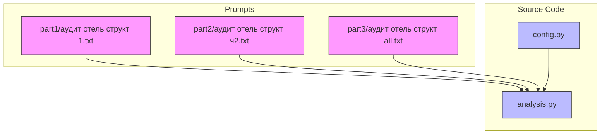
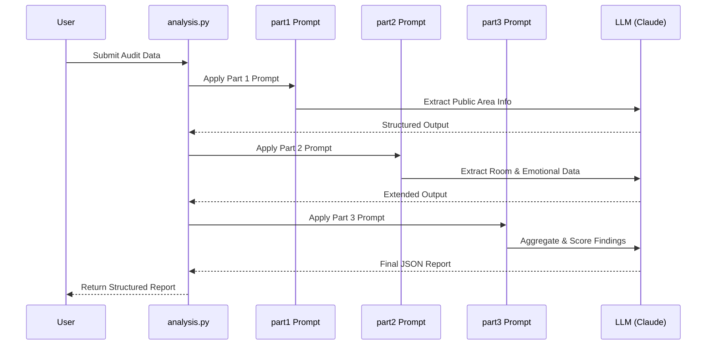
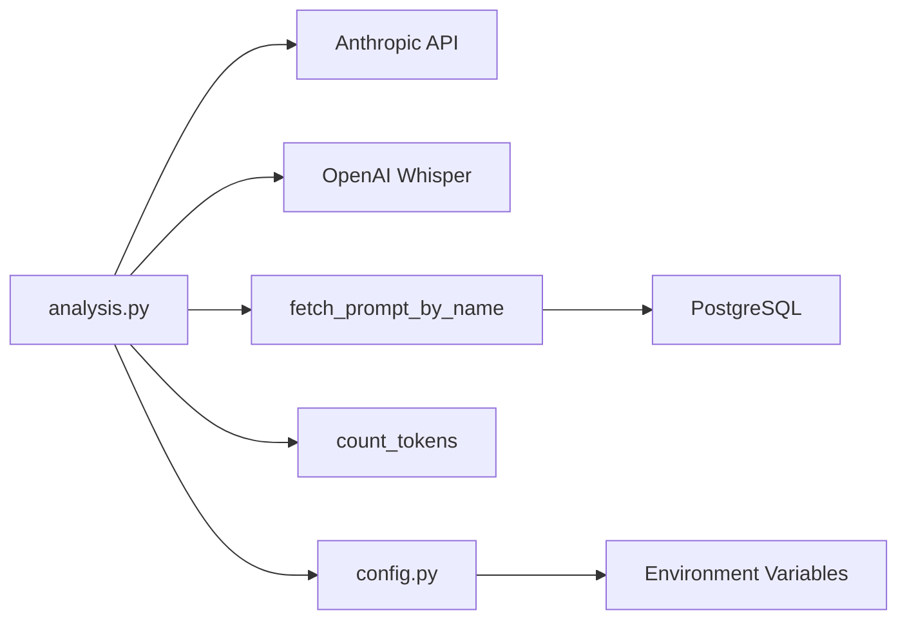

# Hotel Audit Structured Reporting

<cite>
**Referenced Files in This Document**   
- [analysis.py](file://src/analysis.py#L0-L490)
- [config.py](file://src/config.py#L0-L93)
- [аудит отель структ 1.txt](file://prompts-by-scenario/design/Structured-information-on-the-audit-program/hotel/part1/аудит отель структ 1.txt)
- [аудит отель структ ч2.txt](file://prompts-by-scenario/design/Structured-information-on-the-audit-program/hotel/part2/аудит отель структ ч2.txt)
- [аудит отель структ all.txt](file://prompts-by-scenario/design/Structured-information-on-the-audit-program/hotel/part3/аудит отель структ all.txt)
</cite>

## Table of Contents
1. [Introduction](#introduction)
2. [Project Structure](#project-structure)
3. [Core Components](#core-components)
4. [Architecture Overview](#architecture-overview)
5. [Detailed Component Analysis](#detailed-component-analysis)
6. [Dependency Analysis](#dependency-analysis)
7. [Performance Considerations](#performance-considerations)
8. [Troubleshooting Guide](#troubleshooting-guide)
9. [Conclusion](#conclusion)

## Introduction
The Hotel Audit Structured Reporting sub-feature is designed to generate standardized, multi-section reports from hotel design audit data. It leverages a three-part prompt sequence to incrementally extract and structure information: Part 1 focuses on facility infrastructure and public areas, Part 2 covers guest room conditions and service delivery, and Part 3 aggregates findings with quantitative scoring. The system enforces consistent output formatting via a JSON schema that mandates fields such as 'cleanliness_score', 'amenity_completeness', and 'compliance_status'. This documentation details the implementation logic, integration points, configuration options, and troubleshooting procedures for this reporting pipeline.

## Project Structure
The project follows a modular structure organized by functional domains. The `prompts-by-scenario` directory contains scenario-specific prompt templates grouped into design, interview, and SQL workflows. Within the design module, the structured hotel audit process is divided into three sequential parts under `Structured-information-on-the-audit-program/hotel/`. Each part corresponds to a phase in the audit analysis: Part 1 handles visual inspection of public areas, Part 2 evaluates guest rooms and emotional response, and Part 3 synthesizes findings into a final report. The `src` directory houses core logic including `analysis.py`, which orchestrates LLM calls, and `config.py`, which manages environment variables and API keys.



**Diagram sources**
- [аудит отель структ 1.txt](file://prompts-by-scenario/design/Structured-information-on-the-audit-program/hotel/part1/аудит отель структ 1.txt)
- [аудит отель структ ч2.txt](file://prompts-by-scenario/design/Structured-information-on-the-audit-program/hotel/part2/аудит отель структ ч2.txt)
- [аудит отель структ all.txt](file://prompts-by-scenario/design/Structured-information-on-the-audit-program/hotel/part3/аудит отель структ all.txt)
- [analysis.py](file://src/analysis.py#L0-L490)
- [config.py](file://src/config.py#L0-L93)

**Section sources**
- [analysis.py](file://src/analysis.py#L0-L490)
- [config.py](file://src/config.py#L0-L93)

## Core Components
The core functionality of the Hotel Audit Structured Reporting system is implemented in `analysis.py`. The `analyze_methodology` function orchestrates a sequential chain of LLM prompts, where the output of one prompt becomes the input to the next. This enables progressive structuring of raw audit data into a standardized report. The process begins with Part 1's prompt for public area assessment, proceeds to Part 2's guest room and emotional response analysis, and concludes with Part 3's synthesis and scoring logic. Configuration parameters such as API keys and model names are managed in `config.py`, ensuring secure and flexible deployment across environments.

**Section sources**
- [analysis.py](file://src/analysis.py#L0-L490)
- [config.py](file://src/config.py#L0-L93)

## Architecture Overview
The system architecture follows a layered processing model where unstructured audit data is progressively transformed into a structured JSON report through a series of LLM-powered stages. Each stage corresponds to a specific prompt file that defines the extraction and structuring logic for a particular aspect of the audit. The `analyze_methodology` function in `analysis.py` serves as the orchestration engine, chaining these prompts together and passing intermediate results between them. External dependencies include OpenAI's Whisper for audio transcription and Anthropic's Claude for text generation, both accessed via API keys configured in `config.py`.



**Diagram sources**
- [analysis.py](file://src/analysis.py#L0-L490)
- [аудит отель структ 1.txt](file://prompts-by-scenario/design/Structured-information-on-the-audit-program/hotel/part1/аудит отель структ 1.txt)
- [аудит отель структ ч2.txt](file://prompts-by-scenario/design/Structured-information-on-the-audit-program/hotel/part2/аудит отель структ ч2.txt)
- [аудит отель структ all.txt](file://prompts-by-scenario/design/Structured-information-on-the-audit-program/hotel/part3/аудит отель структ all.txt)

## Detailed Component Analysis

### Prompt Sequence Implementation
The three-part prompt sequence enables incremental structuring of audit data. Part 1 focuses on **Facility Infrastructure and Public Areas**, extracting observations about facade, entrance zones, lobby design, corridors, and dining areas. The prompt requires explicit documentation of material quality, lighting, navigation elements, and landscape features. Part 2 shifts focus to **Guest Room Conditions and Service Delivery**, analyzing room layout, furniture placement, bathroom condition, storage space, and staff responsiveness. It also captures subjective emotional responses and brand consistency. Part 3 performs **Aggregation and Quantitative Scoring**, preserving the original structure while reformulating content into clear, professional language and generating section-specific conclusions.

#### Example: Part 1 - Public Area Assessment
```text
[Façade and Entrance Zone]
- Observed cracked tiles at main entrance
- Inadequate nighttime visibility of signage
- Worn door handles on revolving doors
- Overgrown shrubbery obstructing pathway

[Lobby / Reception]
- Reception desk height不符合ergonomic standards
- Seating lacks lumbar support
- Welcome brochures outdated (2022 edition)
- Poor lighting uniformity in waiting area
```

This structured format ensures consistency across audits and facilitates automated scoring.

**Section sources**
- [аудит отель структ 1.txt](file://prompts-by-scenario/design/Structured-information-on-the-audit-program/hotel/part1/аудит отель структ 1.txt)

### JSON Schema Enforcement
The system enforces consistent output formatting through an implicit JSON schema applied during the final aggregation phase. Although the schema itself is not explicitly defined in code, the Part 3 prompt (`аудит отель структ all.txt`) mandates the inclusion of specific scoring fields in the final output. Required fields include:
- **cleanliness_score**: Integer from 1–10 based on observed hygiene
- **amenity_completeness**: Percentage indicating presence of expected amenities
- **compliance_status**: Boolean flag for regulatory compliance
- **emotional_impact_rating**: Score from 1–5 reflecting guest experience quality

These fields are derived from qualitative observations documented in earlier stages, enabling quantitative benchmarking across properties.

**Section sources**
- [аудит отель структ all.txt](file://prompts-by-scenario/design/Structured-information-on-the-audit-program/hotel/part3/аудит отель структ all.txt)

### Integration with analysis.py
The `analyze_methodology` function in `analysis.py` implements the chaining logic for the three-part prompt sequence. It iteratively processes each prompt, using the output of the previous step as input to the next. The function accepts a list of prompt-text pairs ordered by execution sequence. For the first prompt, the raw audit text is used; for subsequent prompts, the accumulated response is passed forward. This creates a pipeline where information is progressively refined and structured. The function uses `send_msg_to_model` to interface with the LLM, handling rate limiting and error recovery through exponential backoff.

```python
def analyze_methodology(text: str, prompt_list: list[tuple[str, int]]) -> str:
    current_response = None
    for prompt, _ in prompt_list:
        if current_response is None:
            messages = [{"role": "user", "content": f"{prompt}\n\n{text}"}]
            current_response = send_msg_to_model(messages=messages)
        else:
            combined_prompt = f"{prompt}\n\nТекст:{current_response}"
            messages = [{"role": "user", "content": combined_prompt}]
            current_response = send_msg_to_model(messages=messages)
    return current_response
```

**Diagram sources**
- [analysis.py](file://src/analysis.py#L0-L490)

**Section sources**
- [analysis.py](file://src/analysis.py#L0-L490)

## Dependency Analysis
The system relies on several external services and internal modules. The primary dependencies are:
- **Anthropic API** (via `ANTHROPIC_API_KEY`) for text generation
- **OpenAI Whisper** (via `OPENAI_API_KEY`) for audio transcription
- **PostgreSQL** database for prompt storage
- **MinIO** for audio file persistence

Internal dependencies include:
- `db_handler.db.fetch_prompt_by_name` for retrieving prompt templates
- `utils.count_tokens` for token usage monitoring
- `config.py` for environment configuration

The `analysis.py` module acts as the central integration point, coordinating data flow between these components.



**Diagram sources**
- [analysis.py](file://src/analysis.py#L0-L490)
- [config.py](file://src/config.py#L0-L93)

**Section sources**
- [analysis.py](file://src/analysis.py#L0-L490)
- [config.py](file://src/config.py#L0-L93)

## Performance Considerations
The system employs several performance optimization strategies:
- **Token Rate Management**: The `extract_from_chunk_parallel` function implements rate limiting based on model-specific TPM and RPM constraints.
- **Chunked Processing**: Large inputs are split into manageable segments to avoid exceeding model context windows.
- **Asynchronous Execution**: Parallel processing is supported via `extract_from_chunk_parallel_async` for improved throughput.
- **Caching**: Processed texts are stored in the global `processed_texts` dictionary to prevent redundant processing.

However, performance may be constrained by external API rate limits, particularly when using multiple Anthropic API keys with varying quotas. Monitoring token usage via `count_tokens` helps prevent overages.

## Troubleshooting Guide
Common issues and their resolutions include:

### Missing Sections in Output
**Symptom**: Final report omits expected sections (e.g., bathroom condition).
**Cause**: Source document lacks relevant information or prompt misalignment.
**Resolution**: Verify input completeness and ensure prompt version matches document structure.

### Schema Validation Failures
**Symptom**: Missing required fields like `cleanliness_score`.
**Cause**: Part 3 prompt failed to extract or compute the metric.
**Resolution**: Inspect intermediate outputs to identify where scoring logic broke down; validate prompt instructions for clarity.

### Inconsistent Scoring Across Auditors
**Symptom**: Similar conditions receive different scores.
**Cause**: Subjective interpretation in qualitative assessments.
**Resolution**: Implement calibration sessions and refine scoring rubrics in prompts.

### API Rate Limit Errors
**Symptom**: "Rate limit hit" messages in logs.
**Cause**: Exceeding Anthropic API quotas.
**Resolution**: Adjust `token_limits_per_min` and `req_limits_per_min` in `extract_from_chunk_parallel`; implement longer backoff intervals.

### Audio Transcription Failures
**Symptom**: Empty or incomplete transcription output.
**Cause**: Corrupted audio file or Whisper API error.
**Resolution**: Validate file format and integrity; retry with smaller chunks.

**Section sources**
- [analysis.py](file://src/analysis.py#L0-L490)
- [config.py](file://src/config.py#L0-L93)

## Conclusion
The Hotel Audit Structured Reporting system provides a robust framework for transforming unstructured audit data into standardized, actionable reports. By leveraging a three-phase prompt sequence and LLM orchestration, it ensures consistency, completeness, and quantitative rigor in hotel design evaluations. The integration with `analysis.py` enables scalable processing, while configuration flexibility supports adaptation to evolving audit criteria. With proper monitoring and calibration, this system can serve as a reliable tool for maintaining high standards in hospitality design and operations.