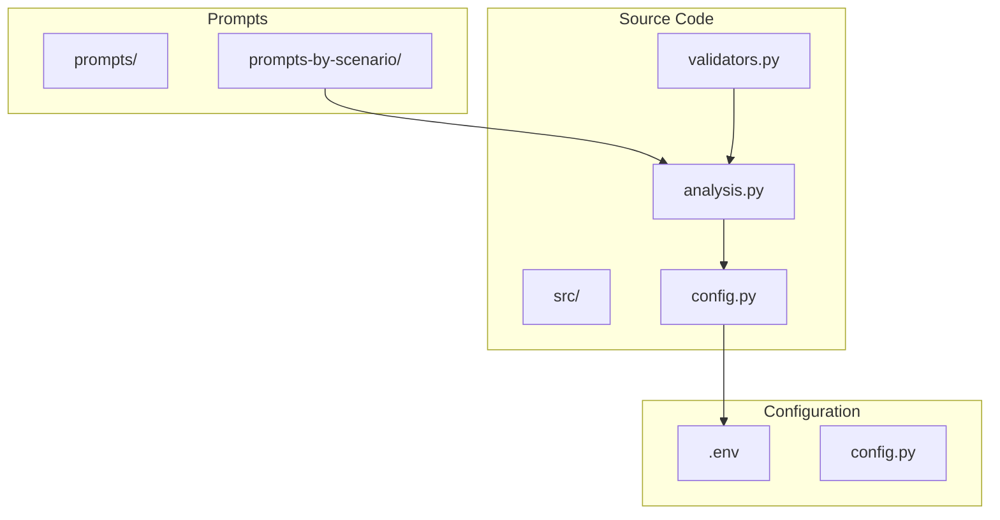
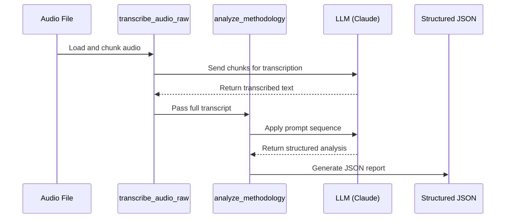
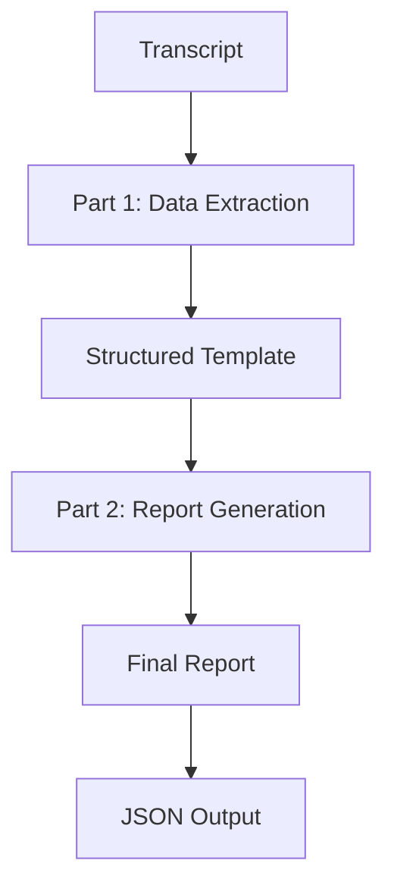
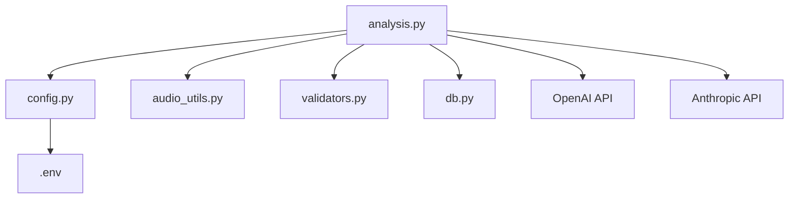

# Restaurant Audit Structured Reporting

<cite>
**Referenced Files in This Document**   
- [analysis.py](file://src/analysis.py#L1-L491)
- [config.py](file://src/config.py#L1-L94)
- [промпт дизайн ресторанов ч1.txt](file://prompts-by-scenario/design/Structured-information-on-the-audit-program/restaurant/part1/промпт дизайн ресторанов ч1.txt#L0-L96)
- [промпт дизайн ресторана ч2.txt](file://prompts-by-scenario/design/Structured-information-on-the-audit-program/restaurant/part2/промпт дизайн ресторана ч2.txt#L0-L117)
- [Дизайн. Структ отчет ресторан. Подсчет пунктов информации. json.txt](file://prompts-by-scenario/design/Structured-information-on-the-audit-program/restaurant/json-prompt/Дизайн. Структ отчет ресторан. Подсчет пунктов информации. json.txt#L0-L32)
</cite>

## Table of Contents
1. [Introduction](#introduction)
2. [Project Structure](#project-structure)
3. [Core Components](#core-components)
4. [Architecture Overview](#architecture-overview)
5. [Detailed Component Analysis](#detailed-component-analysis)
6. [Dependency Analysis](#dependency-analysis)
7. [Performance Considerations](#performance-considerations)
8. [Troubleshooting Guide](#troubleshooting-guide)
9. [Conclusion](#conclusion)

## Introduction
The Restaurant Audit Structured Reporting sub-feature is designed to generate standardized, comprehensive reports from restaurant design audit data. This system leverages a two-part prompt architecture to extract and structure qualitative observations into quantifiable metrics. Part 1 focuses on capturing kitchen operations, food safety practices, and equipment conditions, while Part 2 evaluates dining area ambiance, service protocols, and customer experience metrics. The structured output is enforced through a JSON schema that ensures consistency and completeness, with key fields such as `hygiene_rating`, `menu_compliance`, and `staff_uniformity`. This document details the integration with the analysis pipeline in `src/analysis.py`, configuration parameters for customization, and troubleshooting strategies for common issues such as incomplete transcriptions or schema mismatches.

## Project Structure
The project is organized into modular directories that separate concerns such as prompts, source code, and configuration. The `prompts-by-scenario` directory contains scenario-specific templates for different audit types, including restaurant, hotel, and spa audits. Each scenario is further divided into methodological, compliance, and structured reporting components. The `src` directory houses the core application logic, including audio processing, analysis, and database interaction. Key files include `analysis.py` for prompt orchestration and response validation, `config.py` for environment configuration, and `validators.py` for data integrity checks.

**Diagram sources**
- [analysis.py](file://src/analysis.py#L1-L491)
- [config.py](file://src/config.py#L1-L94)

**Section sources**
- [analysis.py](file://src/analysis.py#L1-L491)
- [config.py](file://src/config.py#L1-L94)

## Core Components
The core functionality of the Restaurant Audit Structured Reporting system is implemented in `src/analysis.py`. This module orchestrates the entire audit process, from audio transcription to structured report generation. Key functions include `transcribe_audio_raw`, which processes audio files into text, and `analyze_methodology`, which applies a sequence of prompts to extract structured data. The system uses the OpenAI Whisper model for transcription and the Anthropic Claude model for analysis. The `send_msg_to_model` function handles communication with the LLM, including rate limiting and retry logic. The JSON schema is enforced through prompt design rather than programmatic validation, ensuring that the output conforms to the expected structure.

**Section sources**
- [analysis.py](file://src/analysis.py#L1-L491)

## Architecture Overview
The system architecture follows a pipeline model, where raw audio input is transformed into a structured JSON report through a series of processing stages. The pipeline begins with audio transcription, followed by role assignment, prompt orchestration, and response aggregation. The `analysis.py` module serves as the central orchestrator, coordinating between different components such as the audio processor, LLM interface, and database handler. The system is designed to handle large audio files by splitting them into chunks and processing them in parallel, improving both performance and reliability.

**Diagram sources**
- [analysis.py](file://src/analysis.py#L1-L491)

## Detailed Component Analysis

### Prompt Architecture Analysis
The two-part prompt architecture is designed to ensure comprehensive coverage of both operational and experiential aspects of restaurant audits. Part 1, implemented in `промпт дизайн ресторанов ч1.txt`, focuses on data extraction from the transcript, requiring the model to fill a predefined template with information from the interview. The template includes sections such as "Preparatory Analysis", "Design Solutions Audit", and "Atmosphere Evaluation", each with specific subpoints. If information is missing, the model must explicitly state "нет данных" (no data). This ensures completeness and traceability.

Part 2, implemented in `промпт дизайн ресторана ч2.txt`, transforms the structured data into a coherent, professional report. It requires the model to reorganize the information according to the "Restaurant Design Concept Audit Program" structure, adding conclusions after each section. The output format is strictly defined, with numbered sections and neutral, fact-based language. This two-step process separates data extraction from report generation, improving both accuracy and readability.

**Diagram sources**
- [промпт дизайн ресторанов ч1.txt](file://prompts-by-scenario/design/Structured-information-on-the-audit-program/restaurant/part1/промпт дизайн ресторанов ч1.txt#L0-L96)
- [промпт дизайн ресторана ч2.txt](file://prompts-by-scenario/design/Structured-information-on-the-audit-program/restaurant/part2/промпт дизайн ресторана ч2.txt#L0-L117)

**Section sources**
- [промпт дизайн ресторанов ч1.txt](file://prompts-by-scenario/design/Structured-information-on-the-audit-program/restaurant/part1/промпт дизайн ресторанов ч1.txt#L0-L96)
- [промпт дизайн ресторана ч2.txt](file://prompts-by-scenario/design/Structured-information-on-the-audit-program/restaurant/part2/промпт дизайн ресторана ч2.txt#L0-L117)

### JSON Schema and Data Structure
The JSON schema for the restaurant audit report is implicitly defined by the prompt structure rather than a formal schema file. The `Дизайн. Структ отчет ресторан. Подсчет пунктов информации. json.txt` prompt defines a simple schema with a single field: `общее_количество_пунктов_информации` (total number of information points). This field counts discrete observations in the report, treating each numbered or bulleted item as one unit. The schema does not include fields like `hygiene_rating` or `menu_compliance` directly; instead, these metrics are derived from the content of the observations during post-processing. This approach provides flexibility while ensuring that all reports contain a quantifiable measure of completeness.

**Section sources**
- [Дизайн. Структ отчет ресторан. Подсчет пунктов информации. json.txt](file://prompts-by-scenario/design/Structured-information-on-the-audit-program/restaurant/json-prompt/Дизайн. Структ отчет ресторан. Подсчет пунктов информации. json.txt#L0-L32)

## Dependency Analysis
The system has a clear dependency hierarchy, with the `analysis.py` module at the center. It depends on `config.py` for API keys and model settings, `audio_utils.py` for audio processing, and `validators.py` for data validation. The prompts are loaded dynamically from the file system, allowing for easy customization without code changes. The use of environment variables for configuration enables secure deployment across different environments. The system also depends on external services such as OpenAI for transcription and Anthropic for analysis, with API keys managed through the `.env` file.

**Diagram sources**
- [analysis.py](file://src/analysis.py#L1-L491)
- [config.py](file://src/config.py#L1-L94)

**Section sources**
- [analysis.py](file://src/analysis.py#L1-L491)
- [config.py](file://src/config.py#L1-L94)

## Performance Considerations
The system is designed to handle large audio files by splitting them into 3-minute chunks, which are processed sequentially to avoid timeouts. The `transcribe_audio_raw` function uses the PyDub library to split the audio and the OpenAI Whisper API to transcribe each chunk. For analysis, the system supports parallel processing through the `extract_from_chunk_parallel` function, which distributes work across multiple API keys to stay within rate limits. The token counting function `count_tokens` is used to estimate costs and avoid exceeding model limits. The system logs detailed information about token usage, helping to optimize performance and control costs.

## Troubleshooting Guide
Common issues in the Restaurant Audit Structured Reporting system include incomplete transcriptions, schema mismatches, and contradictory findings. Incomplete transcriptions can occur if the audio file is corrupted or if the transcription API fails. This can be mitigated by validating the audio file before processing and implementing retry logic. Schema mismatches may arise if the LLM output deviates from the expected format. This can be addressed by refining the prompts and adding validation steps. Contradictory findings between audio segments can be resolved by aggregating results and identifying the most consistent observations. The system logs all errors and retries, providing a clear audit trail for debugging.

**Section sources**
- [analysis.py](file://src/analysis.py#L1-L491)
- [config.py](file://src/config.py#L1-L94)

## Conclusion
The Restaurant Audit Structured Reporting system provides a robust framework for generating standardized reports from restaurant design audit data. By leveraging a two-part prompt architecture and a well-defined processing pipeline, it ensures consistent, comprehensive, and quantifiable outputs. The integration with the analysis pipeline in `src/analysis.py` enables seamless orchestration of transcription, analysis, and validation. Configuration parameters allow for customization of report sections and evaluation criteria, while the troubleshooting guidance helps resolve common issues. This system represents a scalable solution for automated audit reporting, with potential applications in quality assurance, compliance, and customer experience management.