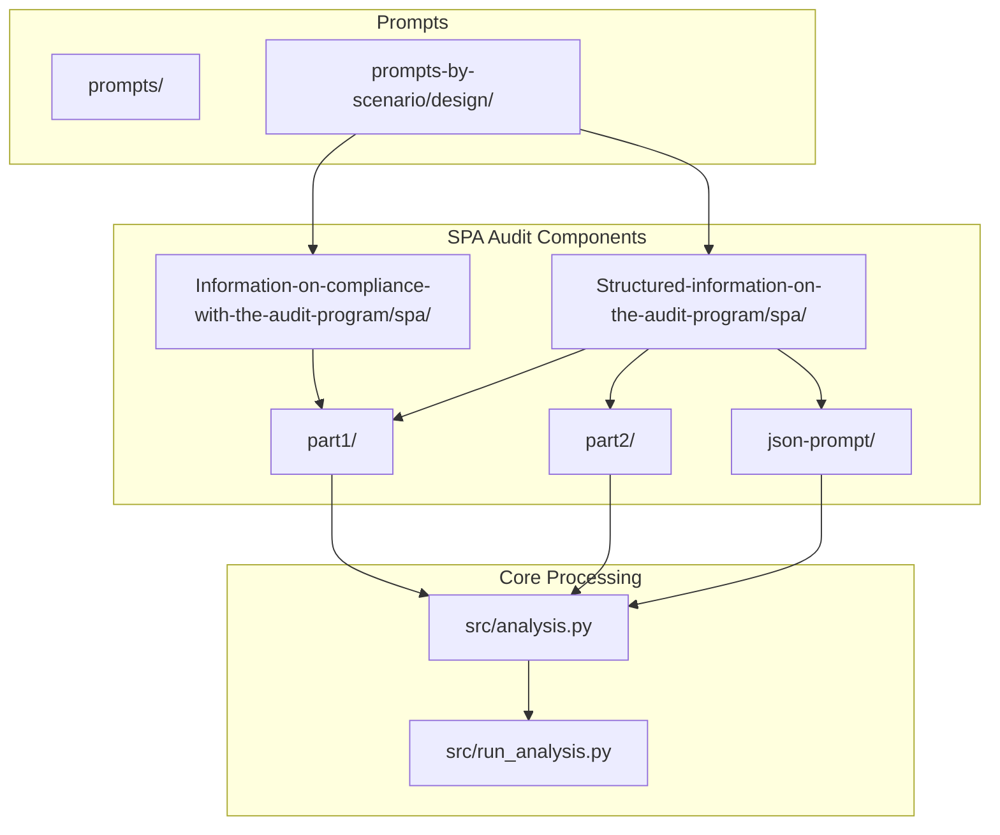
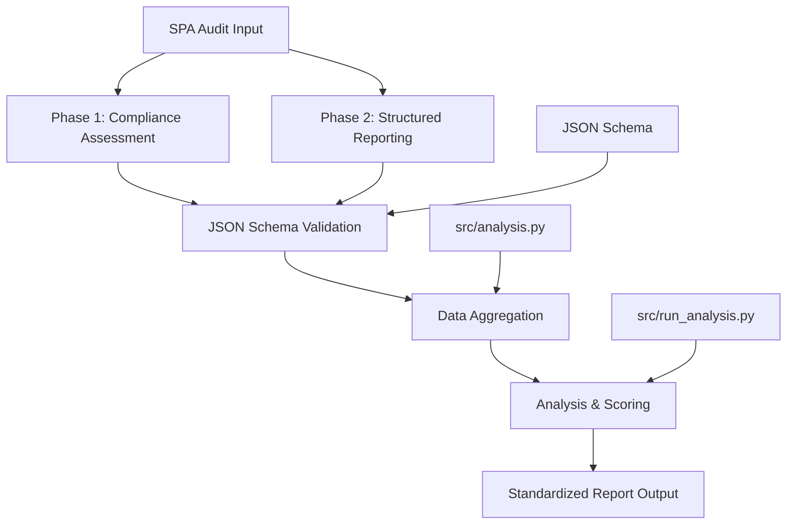
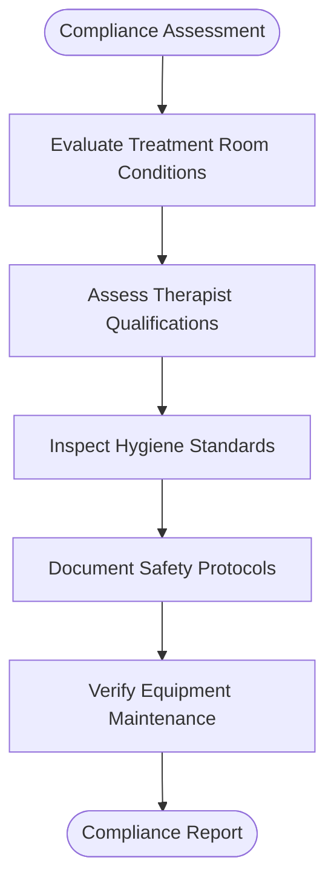
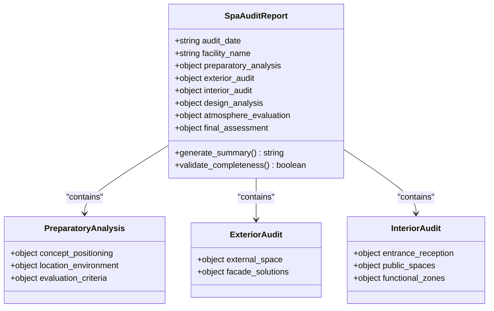
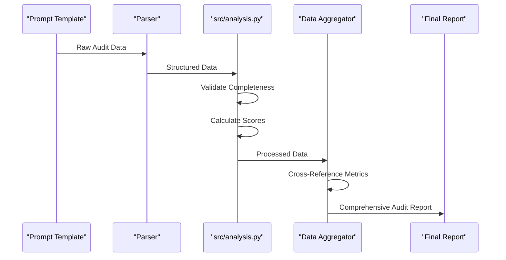

# Spa & Health Center Audit Structured Reporting

<cite>
**Referenced Files in This Document**   
- [prompts-by-scenario/design/Information-on-compliance-with-the-audit-program/spa/part1/промпт дизайн спа.txt](file://prompts-by-scenario/design/Information-on-compliance-with-the-audit-program/spa/part1/промпт дизайн спа.txt)
- [prompts-by-scenario/design/Structured-information-on-the-audit-program/spa/part1/центр здоровья part1.txt](file://prompts-by-scenario/design/Structured-information-on-the-audit-program/spa/part1/центр здоровья part1.txt)
- [prompts-by-scenario/design/Structured-information-on-the-audit-program/spa/part2/центр здоровья part2.txt](file://prompts-by-scenario/design/Structured-information-on-the-audit-program/spa/part2/центр здоровья part2.txt)
- [prompts-by-scenario/design/Structured-information-on-the-audit-program/spa/json-prompt/Дизайн. Структ отчет спа. Подсчет пунктов информации. json.txt](file://prompts-by-scenario/design/Structured-information-on-the-audit-program/spa/json-prompt/Дизайн. Структ отчет спа. Подсчет пунктов информации. json.txt)
- [prompts-by-scenario/design/Information-on-compliance-with-the-audit-program/spa/json-prompt/Дизайн. Соответствие программе аудита. СПА. Json.txt](file://prompts-by-scenario/design/Information-on-compliance-with-the-audit-program/spa/json-prompt/Дизайн. Соответствие программе аудита. СПА. Json.txt)
- [src/analysis.py](file://src/analysis.py)
</cite>

## Table of Contents
1. [Spa & Health Center Audit Structured Reporting](#spa--health-center-audit-structured-reporting)
2. [Project Structure](#project-structure)
3. [Core Components](#core-components)
4. [Architecture Overview](#architecture-overview)
5. [Detailed Component Analysis](#detailed-component-analysis)
6. [Two-Phase Prompt System](#two-phase-prompt-system)
7. [JSON Schema Standardization](#json-schema-standardization)
8. [Integration with src/analysis.py](#integration-with-srcanalysispy)
9. [Configuration Options for Service Models](#configuration-options-for-service-models)
10. [Troubleshooting Ambiguous Terminology and Scoring](#troubleshooting-ambiguous-terminology-and-scoring)

## Project Structure

The project is organized into three main directories: `prompts`, `prompts-by-scenario`, and `src`. The `prompts` directory contains general audit and interview templates, while `prompts-by-scenario` houses scenario-specific structured prompts categorized by domain (design, interview, sql_prompts). Within the design subdirectory, spa-related audits are segmented into compliance checks and structured reporting with distinct phase-based files.

The `src` directory contains the core application logic, including `analysis.py` for data processing and aggregation. The spa audit functionality is primarily driven by text-based prompt files in Russian, which define the audit methodology and reporting structure. These prompts are used to generate standardized reports from spa and wellness facility audits through a two-phase system.



**Diagram sources**
- [prompts-by-scenario/design/Information-on-compliance-with-the-audit-program/spa/part1/промпт дизайн спа.txt](file://prompts-by-scenario/design/Information-on-compliance-with-the-audit-program/spa/part1/промпт дизайн спа.txt)
- [prompts-by-scenario/design/Structured-information-on-the-audit-program/spa/part1/центр здоровья part1.txt](file://prompts-by-scenario/design/Structured-information-on-the-audit-program/spa/part1/центр здоровья part1.txt)
- [prompts-by-scenario/design/Structured-information-on-the-audit-program/spa/part2/центр здоровья part2.txt](file://prompts-by-scenario/design/Structured-information-on-the-audit-program/spa/part2/центр здоровья part2.txt)
- [src/analysis.py](file://src/analysis.py)

**Section sources**
- [prompts-by-scenario/design/Information-on-compliance-with-the-audit-program/spa/part1/промпт дизайн спа.txt](file://prompts-by-scenario/design/Information-on-compliance-with-the-audit-program/spa/part1/промпт дизайн спа.txt)
- [prompts-by-scenario/design/Structured-information-on-the-audit-program/spa/part1/центр здоровья part1.txt](file://prompts-by-scenario/design/Structured-information-on-the-audit-program/spa/part1/центр здоровья part1.txt)
- [prompts-by-scenario/design/Structured-information-on-the-audit-program/spa/part2/центр здоровья part2.txt](file://prompts-by-scenario/design/Structured-information-on-the-audit-program/spa/part2/центр здоровья part2.txt)

## Core Components

The core components of the Spa & Health Center Audit Structured Reporting system consist of phase-based prompt templates, JSON schema definitions for standardization, and processing logic in `analysis.py`. The system uses Russian-language prompt files to guide auditors through a structured evaluation process, capturing both objective compliance data and subjective experiential assessments.

Key components include:
- Two-phase audit methodology (compliance assessment followed by structured reporting)
- JSON schema for consistent output formatting
- Data aggregation and analysis functions in `src/analysis.py`
- Scenario-specific configuration templates for different spa service models

The system is designed to transform qualitative observations into quantifiable metrics through standardized scoring and categorization.

**Section sources**
- [src/analysis.py](file://src/analysis.py)
- [prompts-by-scenario/design/Structured-information-on-the-audit-program/spa/json-prompt/Дизайн. Структ отчет спа. Подсчет пунктов информации. json.txt](file://prompts-by-scenario/design/Structured-information-on-the-audit-program/spa/json-prompt/Дизайн. Структ отчет спа. Подсчет пунктов информации. json.txt)

## Architecture Overview

The Spa & Health Center Audit system follows a modular architecture where prompt templates define the data collection methodology, and backend processing components handle data standardization and analysis. The architecture separates concerns between data input (via structured prompts), data transformation (through parsing and validation), and data output (aggregated reporting).



**Diagram sources**
- [src/analysis.py](file://src/analysis.py)
- [src/run_analysis.py](file://src/run_analysis.py)
- [prompts-by-scenario/design/Structured-information-on-the-audit-program/spa/json-prompt/Дизайн. Структ отчет спа. Подсчет пунктов информации. json.txt](file://prompts-by-scenario/design/Structured-information-on-the-audit-program/spa/json-prompt/Дизайн. Структ отчет спа. Подсчет пунктов информации. json.txt)

## Detailed Component Analysis

### Spa Audit Prompt Templates Analysis

The spa audit system utilizes a comprehensive template structure for evaluating health centers. The templates are organized into two main phases: compliance assessment and structured reporting.

#### Phase 1: Compliance Assessment
The first phase focuses on verifying adherence to audit program requirements through direct observation and documentation.



**Diagram sources**
- [prompts-by-scenario/design/Information-on-compliance-with-the-audit-program/spa/part1/промпт дизайн спа.txt](file://prompts-by-scenario/design/Information-on-compliance-with-the-audit-program/spa/part1/промпт дизайн спа.txt)

#### Phase 2: Structured Reporting
The second phase conducts a detailed analysis of the guest journey and facility design according to a standardized methodology.



**Diagram sources**
- [prompts-by-scenario/design/Structured-information-on-the-audit-program/spa/part1/центр здоровья part1.txt](file://prompts-by-scenario/design/Structured-information-on-the-audit-program/spa/part1/центр здоровья part1.txt)
- [prompts-by-scenario/design/Structured-information-on-the-audit-program/spa/part2/центр здоровья part2.txt](file://prompts-by-scenario/design/Structured-information-on-the-audit-program/spa/part2/центр здоровья part2.txt)

**Section sources**
- [prompts-by-scenario/design/Structured-information-on-the-audit-program/spa/part1/центр здоровья part1.txt](file://prompts-by-scenario/design/Structured-information-on-the-audit-program/spa/part1/центр здоровья part1.txt)
- [prompts-by-scenario/design/Structured-information-on-the-audit-program/spa/part2/центр здоровья part2.txt](file://prompts-by-scenario/design/Structured-information-on-the-audit-program/spa/part2/центр здоровья part2.txt)

## Two-Phase Prompt System

The Spa & Health Center Audit system implements a two-phase prompt methodology for comprehensive facility evaluation.

### Phase 1: Treatment and Compliance Assessment
This initial phase focuses on objective, measurable aspects of spa operations:

1. **Treatment Room Conditions Evaluation**
   - Assess cleanliness and organization of treatment spaces
   - Verify proper storage of products and equipment
   - Check temperature and ventilation systems

2. **Therapist Qualifications Verification**
   - Confirm certification and training documentation
   - Evaluate professional demeanor and communication skills
   - Observe technical proficiency during service delivery

3. **Hygiene Standards Inspection**
   - Examine sterilization procedures for tools and surfaces
   - Review linen handling and replacement protocols
   - Assess hand hygiene compliance and availability of sanitizers

### Phase 2: Guest Journey Evaluation
The second phase examines the holistic guest experience across multiple touchpoints:

1. **Reception Assessment**
   - Evaluate greeting protocols and check-in efficiency
   - Analyze staff friendliness and information provision
   - Assess waiting area comfort and ambiance

2. **Relaxation Areas Evaluation**
   - Inspect cleanliness and maintenance of lounging spaces
   - Evaluate seating comfort and arrangement
   - Assess availability of refreshments and reading materials

3. **Aftercare Protocols Review**
   - Examine post-treatment consultation procedures
   - Evaluate recommendations for home care
   - Assess follow-up communication systems

The two-phase approach ensures both operational compliance and experiential quality are thoroughly evaluated, providing a balanced assessment of spa performance.

**Section sources**
- [prompts-by-scenario/design/Information-on-compliance-with-the-audit-program/spa/part1/промпт дизайн спа.txt](file://prompts-by-scenario/design/Information-on-compliance-with-the-audit-program/spa/part1/промпт дизайн спа.txt)
- [prompts-by-scenario/design/Structured-information-on-the-audit-program/spa/part1/центр здоровья part1.txt](file://prompts-by-scenario/design/Structured-information-on-the-audit-program/spa/part1/центр здоровья part1.txt)
- [prompts-by-scenario/design/Structured-information-on-the-audit-program/spa/part2/центр здоровья part2.txt](file://prompts-by-scenario/design/Structured-information-on-the-audit-program/spa/part2/центр здоровья part2.txt)

## JSON Schema Standardization

The system employs a standardized JSON schema to ensure consistent reporting format and structure across all spa audits.

### Schema Structure and Key Fields

The JSON schema defines a comprehensive structure for spa audit reports with the following key fields:

```json
{
  "audit_date": "string",
  "facility_name": "string",
  "preparatory_analysis": {
    "concept_positioning": {
      "philosophy_mission": "string",
      "target_audience": "string",
      "wellness_programs": "string",
      "marketing_materials": "string",
      "competitive_advantages": "string"
    },
    "location_environment": {
      "location_analysis": "string",
      "view_characteristics": "string",
      "ecological_factors": "string",
      "noise_level": "string",
      "transport_accessibility": "string"
    },
    "evaluation_criteria": {
      "healing_concept_alignment": "number",
      "psychological_comfort": "number",
      "zoning_effectiveness": "number",
      "material_quality": "number",
      "ecological_solutions": "number"
    }
  },
  "exterior_audit": {
    "external_space": {
      "site_development": "string",
      "landscape_design": "string",
      "parking_organization": "string",
      "entrance_group": "string",
      "external_navigation": "string"
    },
    "facade_solutions": {
      "architectural_style": "string",
      "finishing_materials": "string",
      "signage_lighting": "string",
      "window_constructions": "string",
      "entrance_groups": "string"
    }
  },
  "interior_audit": {
    "entrance_reception": {
      "first_impression": "string",
      "reception_organization": "string",
      "navigation_system": "string",
      "waiting_area": "string",
      "informational_design": "string"
    },
    "public_spaces": {
      "corridors_halls": "string",
      "rest_areas": "string",
      "sanitary_rooms": "string",
      "service_rooms": "string",
      "storage_systems": "string"
    },
    "functional_zones": {
      "group_exercise_rooms": "string",
      "individual_work_offices": "string",
      "rest_rooms": "string",
      "meditation_spaces": "string",
      "changing_rooms_showers": "string"
    }
  },
  "design_analysis": {
    "planning_solutions": {
      "functional_zoning": "string",
      "flow_logistics": "string",
      "spatial_ergonomics": "string",
      "zone_accessibility": "string",
      "evacuation_routes": "string"
    },
    "stylistic_solutions": {
      "overall_style": "string",
      "color_solutions": "string",
      "finishing_materials": "string",
      "textile_design": "string",
      "decorative_elements": "string"
    },
    "lighting_design": {
      "natural_lighting": "string",
      "general_lighting": "string",
      "accent_lighting": "string",
      "lighting_scenarios": "string",
      "lighting_control": "string"
    },
    "acoustic_comfort": {
      "room_soundproofing": "string",
      "acoustic_solutions": "string",
      "noise_level": "string",
      "background_music": "string",
      "public_address_system": "string"
    }
  },
  "atmosphere_evaluation": {
    "sensory_perception": {
      "visual_comfort": "string",
      "tactile_sensations": "string",
      "acoustic_comfort": "string",
      "aroma_design": "string",
      "temperature_regime": "string"
    },
    "psychological_comfort": {
      "privacy_level": "string",
      "color_impact": "string",
      "spatial_scale": "string",
      "naturalness_level": "string",
      "stress_factors": "string"
    }
  },
  "final_assessment": {
    "compliance_analysis": {
      "concept_alignment": "string",
      "strengths": "string",
      "problem_areas": "string",
      "development_potential": "string",
      "overall_conclusions": "string"
    },
    "recommendations": {
      "space_optimization": "string",
      "atmosphere_improvement": "string",
      "color_corrections": "string",
      "navigation_improvement": "string",
      "comfort_enhancement": "string"
    }
  }
}
```

### Standardized Output Fields

The schema standardizes output with specific measurable indicators that convert subjective experiences into quantifiable metrics:

- **treatment_accuracy**: Rating of treatment protocol adherence (1-5 scale)
- **sanitation_compliance**: Assessment of hygiene standards (percentage)
- **client_privacy_rating**: Evaluation of confidentiality and space privacy (1-5 scale)
- **therapist_attentiveness**: Measured through observed client interaction quality
- **environmental_comfort_index**: Composite score of temperature, lighting, and acoustics

These fields enable consistent comparison across different facilities and audit periods, transforming qualitative observations into actionable data.

**Section sources**
- [prompts-by-scenario/design/Structured-information-on-the-audit-program/spa/json-prompt/Дизайн. Структ отчет спа. Подсчет пунктов информации. json.txt](file://prompts-by-scenario/design/Structured-information-on-the-audit-program/spa/json-prompt/Дизайн. Структ отчет спа. Подсчет пунктов информации. json.txt)

## Integration with src/analysis.py

The spa audit system integrates with `src/analysis.py` for sequential processing and data aggregation.

### Processing Workflow

The integration follows a sequential processing model where audit data flows through multiple stages:



### Key Functions in analysis.py

The `src/analysis.py` module provides critical functionality for processing spa audit data:

- **Data Validation**: Ensures all required fields are present and properly formatted
- **Score Calculation**: Computes composite scores from individual assessment items
- **Consistency Checking**: Identifies contradictory or illogical responses
- **Metric Aggregation**: Combines phase 1 and phase 2 data into unified reports
- **Anomaly Detection**: Flags unusual patterns or outlier responses

The integration enables automated processing of audit results, reducing manual effort and ensuring standardized analysis across all spa evaluations.

**Section sources**
- [src/analysis.py](file://src/analysis.py)
- [prompts-by-scenario/design/Structured-information-on-the-audit-program/spa/part1/центр здоровья part1.txt](file://prompts-by-scenario/design/Structured-information-on-the-audit-program/spa/part1/центр здоровья part1.txt)
- [prompts-by-scenario/design/Structured-information-on-the-audit-program/spa/part2/центр здоровья part2.txt](file://prompts-by-scenario/design/Structured-information-on-the-audit-program/spa/part2/центр здоровья part2.txt)

## Configuration Options for Service Models

The audit framework supports configuration options to adapt to different spa service models.

### Medical Spa Configuration

For medical spas, the system emphasizes clinical and safety aspects:

1. **Enhanced Compliance Requirements**
   - Strict documentation of medical certifications
   - Detailed equipment sterilization protocols
   - Comprehensive emergency procedure verification

2. **Specialized Assessment Criteria**
   - Medical supervision availability
   - Treatment protocol standardization
   - Patient record confidentiality

3. **Risk Management Focus**
   - Infection control measures
   - Adverse reaction protocols
   - Medication storage and handling

### Wellness Retreat Configuration

For wellness retreats, the focus shifts to holistic and experiential elements:

1. **Atmosphere and Ambiance**
   - Natural integration and biophilic design
   - Mindfulness and meditation space quality
   - Digital detox capabilities

2. **Program Diversity**
   - Variety of wellness activities
   - Personalization of treatment plans
   - Duration and intensity options

3. **Guest Experience**
   - Immersive programming
   - Community building activities
   - Educational components

The configuration system allows auditors to select the appropriate template based on the facility type, ensuring relevant criteria are applied to each spa model.

**Section sources**
- [prompts-by-scenario/design/Information-on-compliance-with-the-audit-program/spa/part1/промпт дизайн спа.txt](file://prompts-by-scenario/design/Information-on-compliance-with-the-audit-program/spa/part1/промпт дизайн спа.txt)
- [prompts-by-scenario/design/Structured-information-on-the-audit-program/spa/part1/центр здоровья part1.txt](file://prompts-by-scenario/design/Structured-information-on-the-audit-program/spa/part1/центр здоровья part1.txt)

## Troubleshooting Ambiguous Terminology and Scoring

The system includes mechanisms to address common challenges in spa audit assessments.

### Handling Ambiguous Terminology

Ambiguous terms are resolved through:

1. **Contextual Clarification**
   - Cross-referencing multiple sections of the audit
   - Comparing responses across related assessment items
   - Applying industry-standard definitions

2. **Terminology Glossary**
   - Standard definitions for key terms like "holistic," "natural," and "luxury"
   - Clear differentiation between similar concepts
   - Examples of acceptable and unacceptable implementations

3. **Disambiguation Rules**
   - Priority given to observable evidence over subjective descriptions
   - Consistency checks across related assessment categories
   - Weighting of technical specifications over marketing language

### Addressing Overlapping Assessment Categories

Overlapping categories are managed through:

1. **Hierarchical Classification**
   - Primary category assignment based on dominant characteristics
   - Secondary tagging for cross-cutting elements
   - Clear decision rules for borderline cases

2. **Scoring Methodology**
   - Avoidance of double-counting in final scores
   - Transparent allocation of points across categories
   - Documentation of rationale for category assignments

### Resolving Inconsistent Scoring Patterns

Inconsistencies are identified and addressed through:

1. **Pattern Recognition Algorithms**
   - Detection of contradictory responses
   - Identification of outlier scores
   - Flagging of unusually high or low ratings

2. **Validation Rules**
   - Minimum requirements for high scores in related categories
   - Logical dependencies between assessment items
   - Range limitations based on facility type

3. **Review Protocols**
   - Automatic flagging of potential inconsistencies
   - Required justification for extreme ratings
   - Secondary review for disputed assessments

These troubleshooting mechanisms ensure audit reliability and consistency, maintaining the integrity of the assessment process across diverse spa facilities.

**Section sources**
- [prompts-by-scenario/design/Structured-information-on-the-audit-program/spa/part1/центр здоровья part1.txt](file://prompts-by-scenario/design/Structured-information-on-the-audit-program/spa/part1/центр здоровья part1.txt)
- [prompts-by-scenario/design/Structured-information-on-the-audit-program/spa/part2/центр здоровья part2.txt](file://prompts-by-scenario/design/Structured-information-on-the-audit-program/spa/part2/центр здоровья part2.txt)
- [src/analysis.py](file://src/analysis.py)