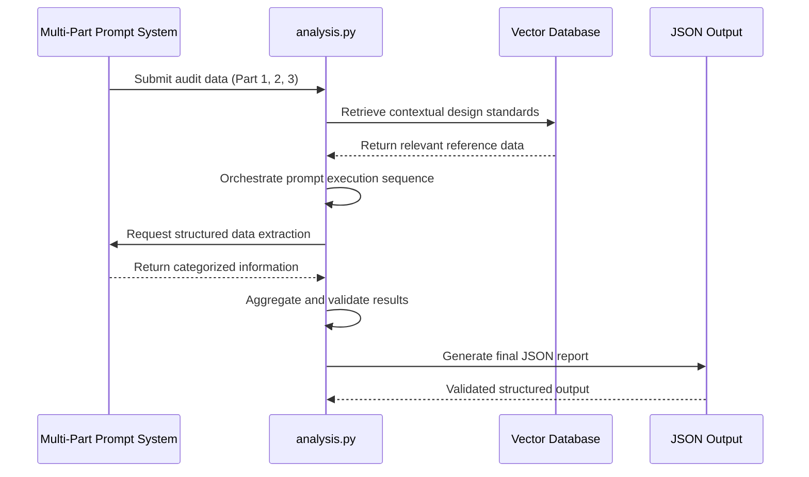

# Structured Information on the Audit Program

<cite>
**Referenced Files in This Document**   
- [Дизайн. Структ отчет отель. Подсчет пунктов информации. json.txt](file://prompts-by-scenario/design/Structured-information-on-the-audit-program/hotel/json-prompt/Дизайн. Структ отчет отель. Подсчет пунктов информации. json.txt)
- [аудит отель структ 1.txt](file://prompts-by-scenario/design/Structured-information-on-the-audit-program/hotel/part1/аудит отель структ 1.txt)
- [аудит отель структ ч2.txt](file://prompts-by-scenario/design/Structured-information-on-the-audit-program/hotel/part2/аудит отель структ ч2.txt)
- [аудит отель структ all.txt](file://prompts-by-scenario/design/Structured-information-on-the-audit-program/hotel/part3/аудит отель структ all.txt)
- [src/analysis.py](file://src/analysis.py)
</cite>

## Table of Contents
1. [Introduction](#introduction)
2. [Multi-Part Prompt Architecture](#multi-part-prompt-architecture)
3. [JSON Schema Enforcement](#json-schema-enforcement)
4. [Information Categorization and Quantification](#information-categorization-and-quantification)
5. [Integration with Analysis Pipeline](#integration-with-analysis-pipeline)
6. [Configuration Parameters](#configuration-parameters)
7. [Troubleshooting Guide](#troubleshooting-guide)

## Introduction
The Structured Information on the Audit Program is a sub-feature designed to generate standardized, comprehensive reports from audit data collected across hotels, restaurants, and spas. This system ensures consistency, depth, and analytical rigor by breaking down complex reporting tasks into a multi-part prompt architecture. Each stage processes specific aspects of the audit, preventing context overflow and enabling granular analysis. The output is strictly governed by JSON schema definitions to ensure compatibility with downstream data processing systems. This document details the architecture, functionality, integration points, and operational parameters of this system.

## Multi-Part Prompt Architecture
The audit reporting system employs a three-part sequential processing framework to manage complexity and maintain clarity in output generation.

### Part 1: On-Site Visual Inspection
This stage focuses on physical observations from the initial site visit, categorized by location zones:
- **Facade and Entrance Area**: Observations include exterior appearance, entry points, signage visibility at night, street furniture, lighting, material quality (cladding, glazing, doors), and landscaping.
- **Public Spaces**: 
  - *Lobby/Reception*: Notes on stylistic choices, ergonomic design, front desk layout, furniture comfort, and welcoming materials.
  - *Corridors and Elevator Halls*: Data on lighting, navigation aids, floor and wall materials, flooring condition, and inter-floor variations.
  - *Restaurant/Bar/Breakfast Area*: Information on furniture, lighting, decor, menu and table presentation, textiles, and staff uniforms.

**Section sources**
- [аудит отель структ 1.txt](file://prompts-by-scenario/design/Structured-information-on-the-audit-program/hotel/part1/аудит отель структ 1.txt#L1-L40)

### Part 2: Detailed Interior and Emotional Assessment
This phase expands into guest rooms, special zones, brand elements, and emotional impact:
- **Guest Rooms**: Analysis includes alignment with promotional materials, layout and furniture arrangement, workspace ergonomics, storage solutions, lighting, acoustic comfort, color schemes (walls, floors, textiles), in-room technical equipment, bathroom design, and in-room informational materials.
- **Special Zones (if applicable)**: Evaluation of spa, fitness, conference rooms, etc., including stylistic consistency, equipment condition, and specialized furniture and accessories.
- **Decorative Details and Brand Elements**: Review of logos, brand colors, art installations, small details (handles, frames, baseboards), decorative items, promotional materials, signage, and wayfinding systems.
- **Emotional Response**: Compilation of subjective impressions, positive/negative emotional reactions, alignment with stated concept, and overall atmosphere.
- **Additional Information Gathering**:
  - *Staff Interviews*: Staff-reported design issues and guest complaints related to design.
  - *Review Analysis*: Guest feedback from online platforms categorized by design-related complaints.
  - *Documentation Review*: Insights from the original design project documentation.
- **Report Formation and Recommendations**:
  - *Concept Alignment*: Assessment of adherence to brand concept and identification of strengths and problem areas.
  - *Problem Checklist*: Categorization of issues into urgent, medium-term, and long-term fixes.
  - *Criteria Evaluation*: Scoring of each zone against predefined criteria.
  - *Improvement Recommendations*: Specific design corrections, navigation improvements, and promotional material updates.
  - *Emotional Scenario Recommendations*: Desired ambiance, decor/lighting/color suggestions, and stylistic details.

**Section sources**
- [аудит отель структ ч2.txt](file://prompts-by-scenario/design/Structured-information-on-the-audit-program/hotel/part2/аудит отель структ ч2.txt#L1-L105)

### Part 3: Synthesis and Final Reporting
This final stage processes the structured outputs from Parts 1 and 2 to produce a consolidated, actionable report:
- Maintains original audit section structure.
- Rephrases content for clarity while preserving key information.
- Generates specific, fact-based conclusions after each subsection.
- Applies logical numbering to main information points, preserving original alphanumeric labels when present.
- Presents restructured content in the format:  
  [Section Number. Original Section Title]  
  Rephrased content with numbered key points  
  Conclusions for the section
- Final output groups all conclusions into four core blocks:
  - **Exterior Appearance and Style** (design, decor, emotional response)
  - **Comfort and Functionality** (layout, furniture, welcoming materials, bar)
  - **Technical Aspects** (floor, walls, lighting, ceiling, acoustics)
  - **Orientation and Identity** (navigation, branding, concept alignment)

**Section sources**
- [аудит отель структ all.txt](file://prompts-by-scenario/design/Structured-information-on-the-audit-program/hotel/part3/аудит отель структ all.txt#L1-L45)

## JSON Schema Enforcement
A dedicated JSON schema file governs the output format for the information counting phase, ensuring data consistency and machine readability.

```json
{
  "общее_количество_пунктов_информации": 0
}
```

This schema defines a single required field: `общее_количество_пунктов_информации` (total number of information points), which must be an integer. The system uses this schema to validate the output of the information counting process, guaranteeing that only properly formatted numerical results are accepted for downstream processing. This strict enforcement prevents data corruption and ensures compatibility with automated reporting pipelines.

**Section sources**
- [Дизайн. Структ отчет отель. Подсчет пунктов информации. json.txt](file://prompts-by-scenario/design/Structured-information-on-the-audit-program/hotel/json-prompt/Дизайн. Структ отчет отель. Подсчет пунктов информации. json.txt#L1-L32)

## Information Categorization and Quantification
The system categorizes audit information into distinct, analyzable domains:
- **Facility Conditions**: Physical state of materials, furniture, equipment, and infrastructure.
- **Staff Performance**: Observations related to employee conduct, uniform standards, and service delivery in designated areas.
- **Guest Experience Metrics**: Subjective and objective measures of comfort, convenience, emotional response, and satisfaction.

Each distinct observation or statement within these categories is quantified as one "information point." The counting methodology includes:
- Numbered or bulleted list items
- Individual paragraphs expressing a single idea
- Separate observations or statements
Excluded from counting are section headers, repeated information, and explanatory text lacking specific observations. This quantification enables objective reporting on the depth and scope of the audit findings.

## Integration with Analysis Pipeline
The structured audit process is orchestrated through the analysis pipeline in `src/analysis.py`.



**Diagram sources**
- [src/analysis.py](file://src/analysis.py#L1-L100)

**Section sources**
- [src/analysis.py](file://src/analysis.py#L1-L100)

The pipeline performs vector-based context retrieval to align audit findings with established design standards and brand guidelines. It manages the sequential execution of the multi-part prompts, ensuring data flows correctly from visual inspection to final synthesis. The system aggregates responses, applies schema validation, and produces a standardized output.

## Configuration Parameters
Key configuration parameters allow customization of report granularity and data fields:
- **report_granularity**: Controls the level of detail in the final report (e.g., "summary", "detailed", "comprehensive").
- **enable_emotional_analysis**: Boolean flag to include or exclude emotional response assessment.
- **zone_inclusion**: List of zones to be audited (e.g., ["lobby", "rooms", "spa", "restaurant"]).
- **brand_guidelines_path**: File path to the brand's design standards document for comparison.
- **output_schema**: Path to the JSON schema file used for output validation.
These parameters are adjustable to accommodate different venue types and audit objectives, ensuring the system remains flexible and scalable.

## Troubleshooting Guide
Common issues and their resolutions:

### Incomplete Reports
- **Cause**: Missing data in one of the prompt parts.
- **Solution**: Verify all prompt files (part1, part2, part3) are present and correctly formatted. Check for empty sections in the input audit document.

### Schema Validation Errors
- **Cause**: Output does not conform to the required JSON schema.
- **Solution**: Ensure the final output contains only the field `общее_количество_пунктов_информации` with an integer value. Validate against the schema file.

### Inconsistent Data Formatting Across Venue Types
- **Cause**: Different templates for hotels, restaurants, and spas may lead to structural discrepancies.
- **Solution**: Use the standardized JSON schema for all venue types. Normalize category names (e.g., "Public Spaces" instead of "Lobby" or "Dining Area") during the aggregation phase in `analysis.py`.

**Section sources**
- [src/analysis.py](file://src/analysis.py#L50-L80)
- [Дизайн. Структ отчет отель. Подсчет пунктов информации. json.txt](file://prompts-by-scenario/design/Structured-information-on-the-audit-program/hotel/json-prompt/Дизайн. Структ отчет отель. Подсчет пунктов информации. json.txt)