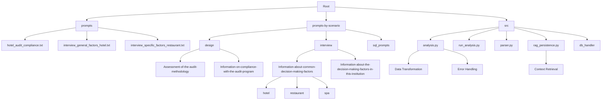
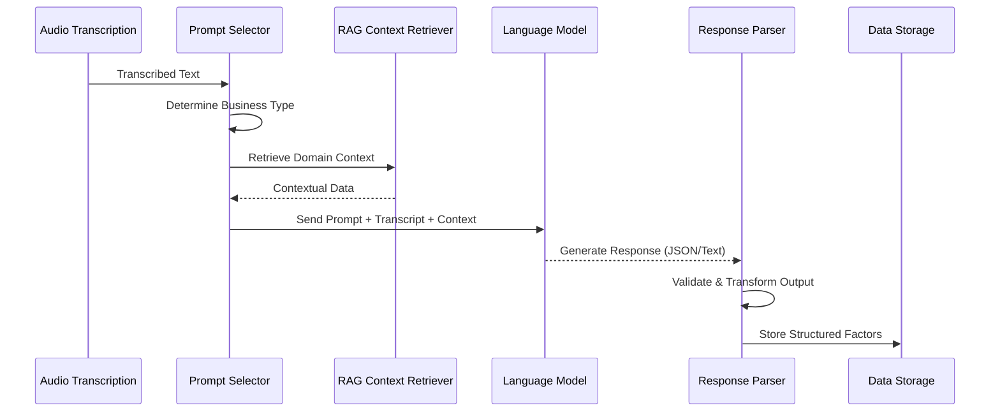
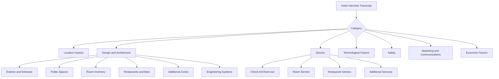
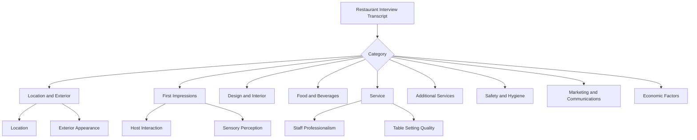
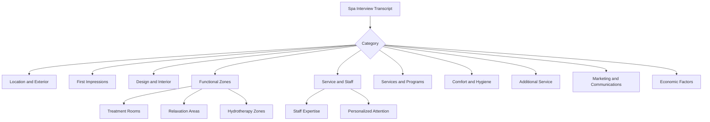
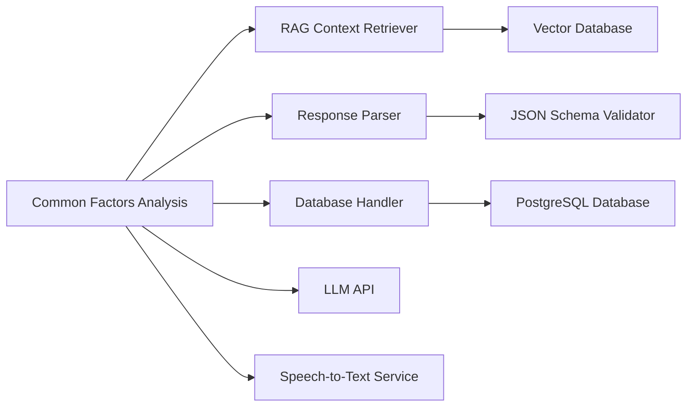

# Information about Common Decision-Making Factors

<cite>
**Referenced Files in This Document**   
- [analysis.py](file://src/analysis.py)
- [Интервью. Общие факторы отель. Json.txt](file://prompts-by-scenario/interview/Information-about-common-decision-making-factors/hotel/json-prompt/Интервью. Общие факторы отель. Json.txt)
- [Интервью. общие факторы. ресторан. Json.txt](file://prompts-by-scenario/interview/Information-about-common-decision-making-factors/restaurant/json-prompt/Интервью. общие факторы. ресторан. Json.txt)
- [Интервью. общие факторы Спа json.txt](file://prompts-by-scenario/interview/Information-about-common-decision-making-factors/spa/json-prompt/Интервью. общие факторы Спа json.txt)
- [общ факторы отель 1.txt](file://prompts-by-scenario/interview/Information-about-common-decision-making-factors/hotel/part1/общ факторы отель 1.txt)
- [общ факторы ресторан 1.txt](file://prompts-by-scenario/interview/Information-about-common-decision-making-factors/restaurant/part1/общ факторы ресторан 1.txt)
- [общ факторы спа 1.txt](file://prompts-by-scenario/interview/Information-about-common-decision-making-factors/spa/part1/центр здоровья part1.txt)
</cite>

## Table of Contents
1. [Introduction](#introduction)
2. [Project Structure](#project-structure)
3. [Core Components](#core-components)
4. [Architecture Overview](#architecture-overview)
5. [Detailed Component Analysis](#detailed-component-analysis)
6. [Dependency Analysis](#dependency-analysis)
7. [Performance Considerations](#performance-considerations)
8. [Troubleshooting Guide](#troubleshooting-guide)
9. [Conclusion](#conclusion)

## Introduction
This document provides a comprehensive analysis of the Common Decision-Making Factors Analysis feature within the VoxPersona system. The feature is designed to extract and categorize key decision-making criteria from transcribed interviews with hospitality industry clients across three business types: hotels, restaurants, and spas (health centers). By leveraging structured JSON prompts and multi-part plain text prompts, the system identifies standardized factors such as service standards, staff qualifications, and customer experience metrics. This documentation details the analysis pipeline, including transcription processing, RAG-enhanced context retrieval, LLM invocation, and data transformation logic. It also examines error resilience strategies, category overlap challenges, and extension mechanisms for new business types.

## Project Structure
The project is organized into three primary directories: `prompts`, `prompts-by-scenario`, and `src`. The `prompts` directory contains legacy flat prompt files, while `prompts-by-scenario` organizes prompts by use case and business type, enabling modular prompt management. The `src` directory houses all Python source code, including core modules for analysis, audio processing, database interaction, and application logic.



**Diagram sources**
- [prompts-by-scenario/interview](file://prompts-by-scenario/interview)
- [src/analysis.py](file://src/analysis.py)

**Section sources**
- [prompts](file://prompts)
- [prompts-by-scenario](file://prompts-by-scenario)
- [src](file://src)

## Core Components
The Common Decision-Making Factors Analysis feature relies on several core components: domain-specific prompts, a data processing pipeline, RAG integration, and structured output generation. The system uses separate prompt sets for hotels, restaurants, and spas, each containing both JSON and plain text variants. The JSON prompts enforce schema compliance for consistent data aggregation, while the plain text prompts allow for deeper contextual interpretation. The `analysis.py` module orchestrates the extraction process, transforming unstructured interview transcripts into categorized decision factors.

**Section sources**
- [src/analysis.py](file://src/analysis.py)
- [prompts-by-scenario/interview/Information-about-common-decision-making-factors](file://prompts-by-scenario/interview/Information-about-common-decision-making-factors)

## Architecture Overview
The analysis pipeline follows a multi-stage process: interview transcription, prompt selection, LLM invocation with RAG context, response parsing, and data transformation. The system first transcribes audio interviews using speech-to-text services. It then selects the appropriate prompt based on business type and analysis goal. Before invoking the LLM, the system retrieves relevant contextual data via RAG from a knowledge base. The LLM processes the transcript and context using the selected prompt, generating either structured JSON or free-form text. Finally, the output is parsed and transformed into a standardized format for aggregation and reporting.



**Diagram sources**
- [src/analysis.py](file://src/analysis.py#L1-L100)
- [src/rag_persistence.py](file://src/rag_persistence.py#L5-L40)
- [src/parser.py](file://src/parser.py#L10-L35)

## Detailed Component Analysis

### Common Decision-Making Factors Extraction Pipeline
The extraction pipeline processes interview transcripts to identify and categorize decision-making factors across hospitality domains. For each business type—hotel, restaurant, and spa—the system uses tailored prompt structures that reflect industry-specific considerations.

#### Hotel Decision Factors
The hotel analysis uses a classification system with seven main categories: Location Factors, Design and Architecture, Service, Technological Factors, Safety, Marketing and Communications, and Economic Factors. The prompt in `Интервью. Общие факторы отель. Json.txt` defines a JSON schema for structured extraction, ensuring consistent output. The plain text prompt in `общ факторы отель 1.txt` provides detailed instructions for identifying client-mentioned factors with direct quotations.



**Diagram sources**
- [Интервью. Общие факторы отель. Json.txt](file://prompts-by-scenario/interview/Information-about-common-decision-making-factors/hotel/json-prompt/Интервью. Общие факторы отель. Json.txt)
- [общ факторы отель 1.txt](file://prompts-by-scenario/interview/Information-about-common-decision-making-factors/hotel/part1/общ факторы отель 1.txt)

**Section sources**
- [Интервью. Общие факторы отель. Json.txt](file://prompts-by-scenario/interview/Information-about-common-decision-making-factors/hotel/json-prompt/Интервью. Общие факторы отель. Json.txt)
- [общ факторы отель 1.txt](file://prompts-by-scenario/interview/Information-about-common-decision-making-factors/hotel/part1/общ факторы отель 1.txt)

#### Restaurant Decision Factors
The restaurant analysis employs ten categories, including Location and Exterior, First Impressions, Design and Interior, Kitchen and Beverages, Service, Additional Services, Safety and Hygiene, Marketing and Communications, Economic Factors, and Other Factors. The prompt in `Интервью. общие факторы. ресторан. Json.txt` enforces structured output, while `общ факторы ресторан 1.txt` guides contextual analysis with emphasis on sensory perception and service quality.



**Diagram sources**
- [Интервью. общие факторы. ресторан. Json.txt](file://prompts-by-scenario/interview/Information-about-common-decision-making-factors/restaurant/json-prompt/Интервью. общие факторы. ресторан. Json.txt)
- [общ факторы ресторан 1.txt](file://prompts-by-scenario/interview/Information-about-common-decision-making-factors/restaurant/part1/общ факторы ресторан 1.txt)

**Section sources**
- [Интервью. общие факторы. ресторан. Json.txt](file://prompts-by-scenario/interview/Information-about-common-decision-making-factors/restaurant/json-prompt/Интервью. общие факторы. ресторан. Json.txt)
- [общ факторы ресторан 1.txt](file://prompts-by-scenario/interview/Information-about-common-decision-making-factors/restaurant/part1/общ факторы ресторан 1.txt)

#### Spa Decision Factors
The spa analysis uses eleven categories, including Location and Exterior, First Impressions, Design and Interior, Functional Zones, Service and Staff, Services and Programs, Comfort and Hygiene, Additional Service, Marketing and Communications, Economic Factors, and Other Factors. The prompt in `Интервью. общие факторы Спа json.txt` defines the JSON structure, while `центр здоровья part1.txt` provides detailed analysis instructions focusing on wellness-specific considerations.



**Diagram sources**
- [Интервью. общие факторы Спа json.txt](file://prompts-by-scenario/interview/Information-about-common-decision-making-factors/spa/json-prompt/Интервью. общие факторы Спа json.txt)
- [центр здоровья part1.txt](file://prompts-by-scenario/interview/Information-about-common-decision-making-factors/spa/part1/центр здоровья part1.txt)

**Section sources**
- [Интервью. общие факторы Спа json.txt](file://prompts-by-scenario/interview/Information-about-common-decision-making-factors/spa/json-prompt/Интервью. общие факторы Спа json.txt)
- [центр здоровья part1.txt](file://prompts-by-scenario/interview/Information-about-common-decision-making-factors/spa/part1/центр здоровья part1.txt)

### Data Transformation and Error Resilience
The `analysis.py` module implements critical data transformation and error handling logic. It processes LLM outputs, validates JSON structures, and transforms data into a standardized format. The system includes resilience mechanisms for handling malformed responses, missing data, and category overlaps.

```python
# Pseudocode representation of key logic in analysis.py
def process_interview(transcript, business_type):
    prompt = load_prompt(business_type, "common_factors")
    context = retrieve_rag_context(business_type)
    response = invoke_llm(transcript, prompt, context)
    
    try:
        structured_data = parse_json_response(response)
        validate_categories(structured_data)
        return transform_to_standard_format(structured_data)
    except JSONDecodeError:
        # Fallback to text parsing
        return parse_text_response(response)
    except ValidationError as e:
        log_error(e)
        return handle_category_overlap(structured_data)
```

**Section sources**
- [src/analysis.py](file://src/analysis.py#L50-L200)

## Dependency Analysis
The Common Decision-Making Factors feature depends on several internal and external components. Internally, it relies on the RAG system for context retrieval, the parser module for response processing, and the database handler for storage. Externally, it depends on LLM APIs for text generation and speech-to-text services for transcription.



**Diagram sources**
- [src/analysis.py](file://src/analysis.py#L1-L250)
- [src/rag_persistence.py](file://src/rag_persistence.py)
- [src/parser.py](file://src/parser.py)
- [src/db_handler/db.py](file://src/db_handler/db.py)

**Section sources**
- [src/analysis.py](file://src/analysis.py)
- [src/rag_persistence.py](file://src/rag_persistence.py)
- [src/parser.py](file://src/parser.py)

## Performance Considerations
The analysis pipeline is designed for scalability and efficiency. JSON prompts reduce post-processing overhead by enforcing structured output. RAG context retrieval is optimized through vector indexing, enabling fast similarity searches. The system caches frequently accessed prompt templates and domain knowledge to minimize latency. For large-scale deployments, the pipeline can be parallelized by processing multiple interviews concurrently.

## Troubleshooting Guide
Common issues in the Common Decision-Making Factors analysis include inconsistent extractions, category overlaps, and missing domain data. To address inconsistent extractions, verify prompt clarity and LLM temperature settings. For category overlaps, refine the prompt instructions to provide clearer category distinctions. When domain data is missing, ensure the RAG knowledge base is up-to-date and contains sufficient industry-specific information. Monitor error logs in `analysis.py` for parsing exceptions and implement fallback text analysis when JSON parsing fails.

**Section sources**
- [src/analysis.py](file://src/analysis.py#L150-L300)
- [prompts-by-scenario/interview/Information-about-common-decision-making-factors](file://prompts-by-scenario/interview/Information-about-common-decision-making-factors)

## Conclusion
The Common Decision-Making Factors Analysis feature provides a robust framework for extracting and categorizing decision criteria from hospitality industry interviews. By combining structured JSON prompts with contextual plain text analysis, the system achieves both consistency and depth in its insights. The modular design allows for easy extension to new business types or refined factor taxonomies. Future enhancements could include dynamic prompt generation based on interview content and advanced conflict resolution for overlapping categories.