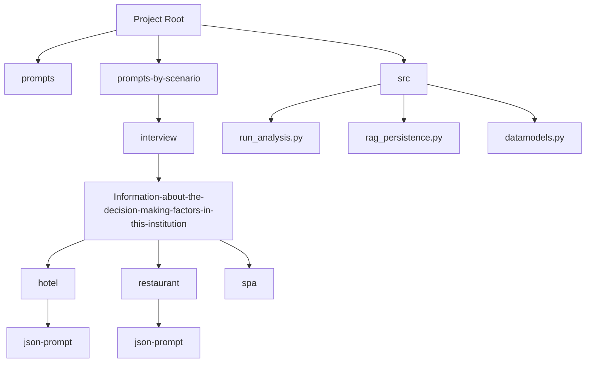
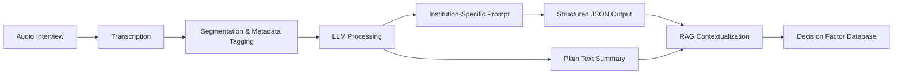
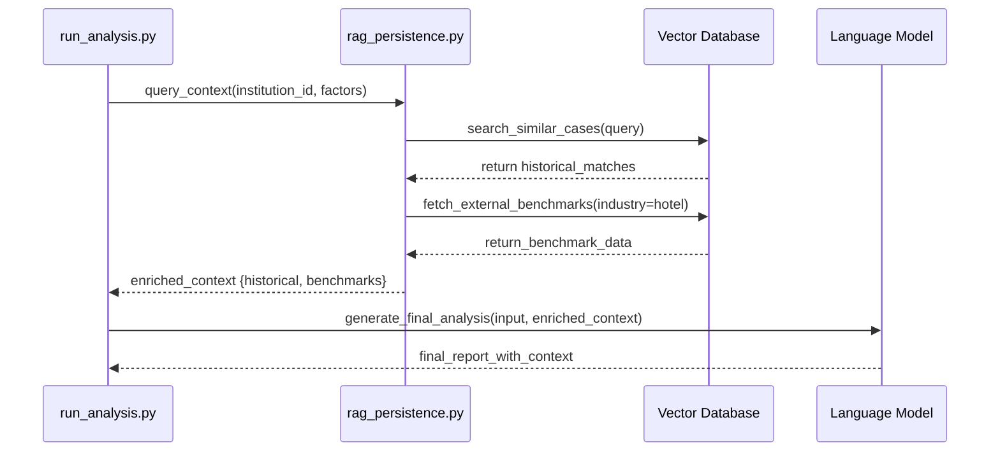
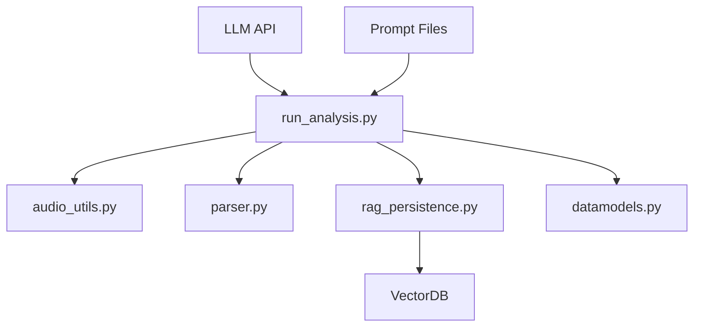

# Information about Decision-Making Factors in This Institution

<cite>
**Referenced Files in This Document**   
- [run_analysis.py](file://src/run_analysis.py#L1-L200)
- [Интервью. факторы в этом заведении. отель. json.txt](file://prompts-by-scenario/interview/Information-about-the-decision-making-factors-in-this-institution/hotel/json-prompt/Интервью. факторы в этом заведении. отель. json.txt)
- [Интервью. Факторы в этом заведении. Ресторан. Json.txt](file://prompts-by-scenario/interview/Information-about-the-decision-making-factors-in-this-institution/restaurant/json-prompt/Интервью. Факторы в этом заведении. Ресторан. Json.txt)
- [rag_persistence.py](file://src/rag_persistence.py#L1-L100)
- [datamodels.py](file://src/datamodels.py#L1-L80)
</cite>

## Table of Contents
1. [Introduction](#introduction)  
2. [Project Structure](#project-structure)  
3. [Core Components](#core-components)  
4. [Architecture Overview](#architecture-overview)  
5. [Detailed Component Analysis](#detailed-component-analysis)  
6. [Dependency Analysis](#dependency-analysis)  
7. [Performance Considerations](#performance-considerations)  
8. [Troubleshooting Guide](#troubleshooting-guide)  
9. [Conclusion](#conclusion)  

## Introduction
This document provides a comprehensive analysis of the Institution-Specific Decision Factors Analysis feature within the VoxPersona system. The feature is designed to extract unique, context-dependent decision criteria from individual hospitality establishments such as hotels, restaurants, and spas. By leveraging tailored prompts in both JSON and plain text formats, the system identifies institution-specific priorities including local market dynamics, management philosophy, and distinctive service offerings. This documentation details the integration with a Retrieval-Augmented Generation (RAG) system for contextual enrichment, outlines processing workflows from audio transcription to LLM inference, and addresses common analytical challenges with mitigation strategies.

## Project Structure
The project follows a modular structure organized by functional domains: prompts, prompt variations by scenario, and source code. The `prompts` directory contains general templates, while `prompts-by-scenario` houses specialized versions categorized by business type and analysis goal. The `src` directory includes all Python modules responsible for data processing, analysis, and system integration.



**Diagram sources**  
- [prompts-by-scenario/interview/Information-about-the-decision-making-factors-in-this-institution](file://prompts-by-scenario/interview/Information-about-the-decision-making-factors-in-this-institution)
- [src/run_analysis.py](file://src/run_analysis.py)

**Section sources**  
- [prompts-by-scenario](file://prompts-by-scenario)
- [src](file://src)

## Core Components
The core functionality revolves around structured prompt execution, audio data processing, metadata enrichment, and RAG-augmented LLM analysis. Key components include:
- **Prompt Templates**: Specialized per institution type (hotel, restaurant, spa) to extract unique decision factors.
- **Audio Processing Pipeline**: Handles segmentation and metadata tagging of interview recordings.
- **LLM Inference Engine**: Processes prompts and transcribed content to extract structured insights.
- **RAG Integration**: Contextualizes findings using organizational history and external benchmarks.

**Section sources**  
- [src/run_analysis.py](file://src/run_analysis.py#L10-L50)
- [src/datamodels.py](file://src/datamodels.py#L5-L20)

## Architecture Overview
The system architecture integrates audio processing, prompt engineering, LLM inference, and knowledge retrieval into a cohesive pipeline. Interviews are transcribed, segmented, and enriched with metadata before being processed through institution-specific prompts. The outputs are structured in JSON for cross-institutional comparison and stored with RAG context for longitudinal analysis.



**Diagram sources**  
- [src/run_analysis.py](file://src/run_analysis.py#L1-L100)
- [src/rag_persistence.py](file://src/rag_persistence.py#L1-L50)

## Detailed Component Analysis

### Institution-Specific Prompt Design
The system uses differentiated prompts for hotels, restaurants, and spas to capture domain-specific decision factors. These prompts are available in both JSON and plain text formats to support structured data extraction and nuanced qualitative analysis.

#### Hotel-Specific Prompt (JSON Format)
The JSON prompt for hotels is designed to extract structured decision factors such as pricing strategy, guest demographics, and competitive positioning.

```json
{
  "prompt": "Identify key decision-making factors unique to this hotel, including market positioning, management style, service differentiators, and operational constraints.",
  "output_schema": {
    "factors": [
      {
        "factor_name": "string",
        "category": "string",
        "impact_level": "high|medium|low",
        "evidence": "string"
      }
    ],
    "confidence_score": "float"
  },
  "instructions": "Extract only institution-specific factors, excluding generic hospitality practices."
}
```

**Diagram sources**  
- [Интервью. факторы в этом заведении. отель. json.txt](file://prompts-by-scenario/interview/Information-about-the-decision-making-factors-in-this-institution/hotel/json-prompt/Интервью. факторы в этом заведении. отель. json.txt)

#### Restaurant-Specific Prompt (JSON Format)
The restaurant prompt focuses on culinary philosophy, supplier relationships, local competition, and customer experience design.

```json
{
  "prompt": "Extract decision factors that define this restaurant's unique operational and strategic approach, including menu design rationale, staffing model, and community engagement.",
  "output_schema": {
    "factors": [
      {
        "factor_name": "string",
        "type": "strategic|operational|cultural",
        "influence": "direct|indirect",
        "examples": ["string"]
      }
    ],
    "summary": "string"
  }
}
```

**Diagram sources**  
- [Интервью. Факторы в этом заведении. Ресторан. Json.txt](file://prompts-by-scenario/interview/Information-about-the-decision-making-factors-in-this-institution/restaurant/json-prompt/Интервью. Факторы в этом заведении. Ресторан. Json.txt)

### Audio Processing and Analysis Pipeline
The `run_analysis.py` module orchestrates the end-to-end processing of interview data, from audio input to structured output.

#### Code Example: Audio Segmentation and Metadata Enrichment
```python
def process_interview(audio_path, institution_type):
    transcript = transcribe_audio(audio_path)
    segments = segment_transcript(transcript)
    
    results = []
    for segment in segments:
        metadata = {
            "institution_type": institution_type,
            "segment_duration": segment.duration,
            "speaker_role": detect_speaker_role(segment),
            "topic_cluster": classify_topic(segment.text)
        }
        
        prompt = load_prompt(institution_type, "specific_factors")
        enriched_input = f"{prompt}\n\nTranscript: {segment.text}\nMetadata: {metadata}"
        
        response = llm_generate(enriched_input)
        structured_output = parse_json_response(response)
        results.append(structured_output)
    
    return results
```

**Section sources**  
- [src/run_analysis.py](file://src/run_analysis.py#L50-L100)

### RAG Integration for Contextual Analysis
The RAG system enhances decision factor analysis by contextualizing findings against historical data and industry benchmarks.

#### RAG Contextualization Workflow


**Diagram sources**  
- [src/run_analysis.py](file://src/run_analysis.py#L100-L150)
- [src/rag_persistence.py](file://src/rag_persistence.py#L30-L80)

## Dependency Analysis
The system relies on a well-defined dependency chain between data processing modules, prompt management, and external services.



**Diagram sources**  
- [src/run_analysis.py](file://src/run_analysis.py)
- [src/rag_persistence.py](file://src/rag_persistence.py)
- [src/datamodels.py](file://src/datamodels.py)

**Section sources**  
- [src/run_analysis.py](file://src/run_analysis.py#L1-L200)
- [src/rag_persistence.py](file://src/rag_persistence.py#L1-L100)

## Performance Considerations
The analysis pipeline is optimized for batch processing of interview data with asynchronous LLM calls. Key performance considerations include:
- **Audio Segmentation**: Smaller segments improve LLM accuracy but increase processing overhead.
- **Prompt Caching**: Frequently used prompts are cached to reduce file I/O.
- **RAG Query Optimization**: Vector similarity searches are limited to relevant time windows and institution types.
- **Error Resilience**: Failed LLM calls are retried with exponential backoff.

## Troubleshooting Guide
Common issues and mitigation strategies for the decision factor analysis system:

### Issue: Overfitting to Idiosyncratic Responses
**Symptoms**: System identifies trivial or one-off decisions as key factors.  
**Solution**: Implement factor frequency filtering and cross-validate with multiple interview segments.

### Issue: Misclassification of General vs. Specific Factors
**Symptoms**: Generic hospitality practices are reported as institution-specific.  
**Solution**: Use contrastive prompts that explicitly differentiate between industry norms and unique practices.

### Issue: RAG Context Overload
**Symptoms**: Relevant signals are drowned out by excessive historical data.  
**Solution**: Apply relevance scoring and limit context window to top-3 most similar cases.

### Issue: Prompt Format Inconsistency
**Symptoms**: JSON parsing failures in structured outputs.  
**Solution**: Implement schema validation and fallback to plain text extraction.

**Section sources**  
- [src/run_analysis.py](file://src/run_analysis.py#L150-L200)
- [src/parser.py](file://src/parser.py#L20-L60)

## Conclusion
The Institution-Specific Decision Factors Analysis feature provides a robust framework for extracting and contextualizing unique decision criteria from hospitality establishments. By combining tailored prompts, audio data processing, and RAG-enhanced analysis, the system enables deep, comparative insights across institutions. The modular design supports easy customization for new institutional profiles or regulatory environments, making it a scalable solution for organizational intelligence in the hospitality sector.