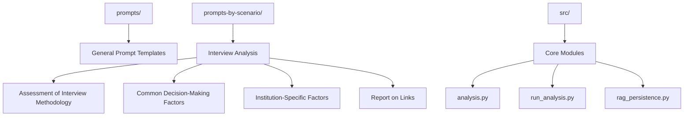
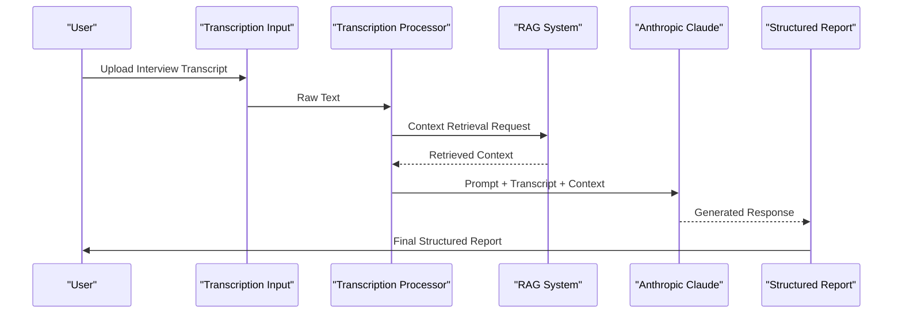
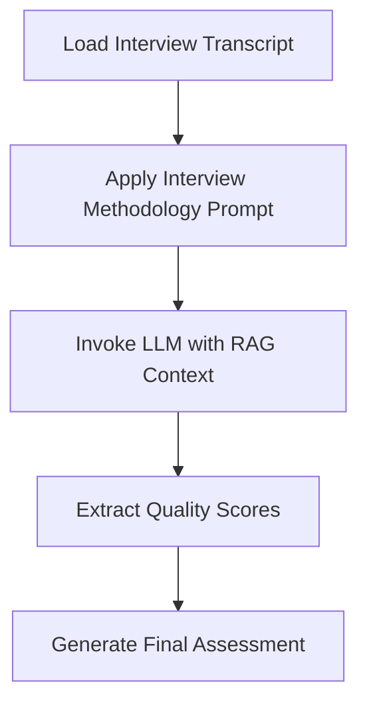
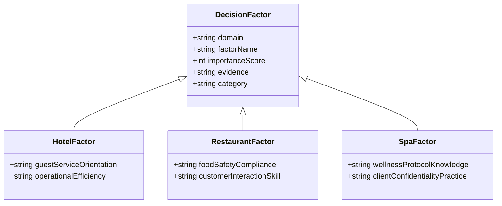
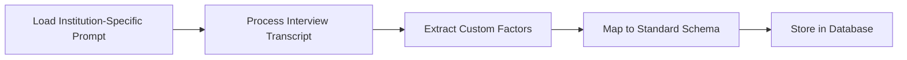
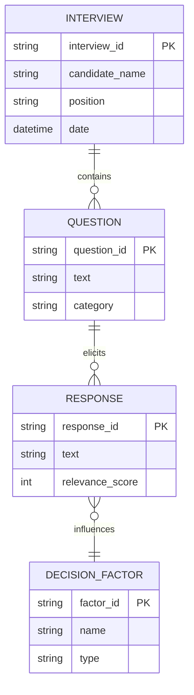
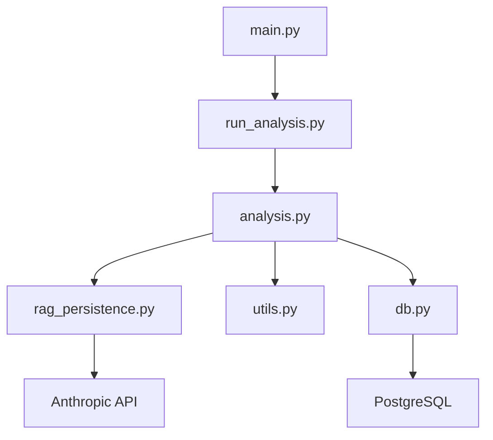

# Interview Analysis

<cite>
**Referenced Files in This Document**   
- [analysis.py](file://src/analysis.py)
- [run_analysis.py](file://src/run_analysis.py)
- [rag_persistence.py](file://src/rag_persistence.py)
- [Interview. Assessment of interview methodology. Final quality assessment of the interview.txt](file://prompts-by-scenario/interview/Assessment-of-the-interview-methodology/json-prompt/Интервью.%20%20Оценка%20методологии%20интервью.%20Итоговая%20оценка%20качества%20интервью.txt)
- [Interview. Common factors hotel. Json.txt](file://prompts-by-scenario/interview/Information-about-common-decision-making-factors/hotel/json-prompt/Интервью.%20Общие%20факторы%20отель.%20Json.txt)
- [Interview. Factors in this establishment. Hotel. json.txt](file://prompts-by-scenario/interview/Information-about-the-decision-making-factors-in-this-institution/hotel/json-prompt/Интервью.%20факторы%20в%20этом%20заведении.%20отель.%20json.txt)
- [Interview. Report on links..txt](file://prompts-by-scenario/interview/Report-on-links/json-prompt/Интервью.%20Отчет%20о%20связках..txt)
- [config.py](file://src/config.py)
- [datamodels.py](file://src/datamodels.py)
</cite>

## Table of Contents
1. [Introduction](#introduction)
2. [Project Structure](#project-structure)
3. [Core Components](#core-components)
4. [Architecture Overview](#architecture-overview)
5. [Detailed Component Analysis](#detailed-component-analysis)
6. [Dependency Analysis](#dependency-analysis)
7. [Performance Considerations](#performance-considerations)
8. [Troubleshooting Guide](#troubleshooting-guide)
9. [Conclusion](#conclusion)

## Introduction
The Interview Analysis feature is designed to evaluate employee interviews and decision-making processes within hospitality businesses, including hotels, restaurants, and spas (health centers). This system leverages structured prompts, Retrieval-Augmented Generation (RAG), and Large Language Models (LLMs) such as Anthropic Claude to extract insights from interview transcriptions. The analysis pipeline assesses interview quality, identifies key decision-making factors, and generates actionable reports. This document details the four primary sub-scenarios: Assessment of Interview Methodology, Information about Common Decision-Making Factors, Information about Decision-Making Factors in This Institution, and Report on Links. It also explains how prompts are structured in both JSON and plain text formats across different business domains and how the system processes data from transcription to final report generation.

## Project Structure
The project is organized into three main directories: `prompts`, `prompts-by-scenario`, and `src`. The `prompts` directory contains general prompt templates used across various analysis types. The `prompts-by-scenario` directory organizes prompts by specific use cases, with dedicated folders for interview-related analyses. The `src` directory houses the core application logic, including data processing, analysis, and integration with external systems.

**Diagram sources**
- [prompts/](file://prompts/)
- [prompts-by-scenario/interview/](file://prompts-by-scenario/interview/)
- [src/](file://src/)

**Section sources**
- [prompts/](file://prompts/)
- [prompts-by-scenario/interview/](file://prompts-by-scenario/interview/)
- [src/](file://src/)

## Core Components
The core components of the Interview Analysis system include:
- **Prompt Management**: Handles loading and formatting of prompts for different scenarios and business types.
- **Transcription Processing**: Parses and prepares raw interview transcripts for analysis.
- **RAG Integration**: Retrieves contextual information to enhance LLM understanding.
- **LLM Invocation**: Uses Anthropic Claude to generate structured outputs based on prompts and transcriptions.
- **Output Structuring**: Converts LLM responses into standardized JSON or plain text formats.

These components work together to ensure consistent and accurate analysis across different hospitality domains.

**Section sources**
- [src/analysis.py](file://src/analysis.py)
- [src/run_analysis.py](file://src/run_analysis.py)
- [src/rag_persistence.py](file://src/rag_persistence.py)
- [src/datamodels.py](file://src/datamodels.py)

## Architecture Overview
The Interview Analysis system follows a modular architecture where each component has a well-defined responsibility. The flow begins with raw interview transcription input, which is processed and enriched using RAG before being passed to the LLM with a domain-specific prompt. The LLM generates a response that is then parsed and structured into a final report.

**Diagram sources**
- [src/analysis.py](file://src/analysis.py#L1-L50)
- [src/run_analysis.py](file://src/run_analysis.py#L1-L40)
- [src/rag_persistence.py](file://src/rag_persistence.py#L1-L30)

## Detailed Component Analysis

### Assessment of Interview Methodology
This sub-scenario evaluates the overall quality of the interview process using a standardized methodology. The system uses a JSON-formatted prompt to guide the LLM in assessing key aspects such as clarity of questions, consistency in evaluation, and adherence to best practices.

#### Prompt Structure
The prompt file `Interview. Assessment of interview methodology. Final quality assessment of the interview.txt` contains a structured template that defines evaluation criteria. It includes sections for scoring interview structure, candidate engagement, and decision justification.

**Diagram sources**
- [prompts-by-scenario/interview/Assessment-of-the-interview-methodology/json-prompt/Интервью.%20%20Оценка%20методологии%20интервью.%20Итоговая%20оценка%20качества%20интервью.txt](file://prompts-by-scenario/interview/Assessment-of-the-interview-methodology/json-prompt/Интервью.%20%20Оценка%20методологии%20интервью.%20Итоговая%20оценка%20качества%20интервью.txt)

**Section sources**
- [analysis.py](file://src/analysis.py#L100-L150)
- [run_analysis.py](file://src/run_analysis.py#L60-L90)

### Information about Common Decision-Making Factors
This analysis identifies general factors that influence hiring decisions across the hospitality industry. Separate prompts are used for hotels, restaurants, and spas, each tailored to the specific domain.

#### Domain-Specific Prompts
- **Hotel**: `Interview. Common factors hotel. Json.txt` focuses on guest service orientation, operational efficiency, and team coordination.
- **Restaurant**: `Interview. Common factors. restaurant. Json.txt` emphasizes food safety, customer interaction, and kitchen workflow.
- **Spa**: `Interview. Common factors Spa json.txt` highlights wellness protocols, client confidentiality, and treatment expertise.

Each prompt follows a JSON schema that defines expected output fields such as factor name, importance level, and supporting evidence.

**Diagram sources**
- [prompts-by-scenario/interview/Information-about-common-decision-making-factors/hotel/json-prompt/Интервью.%20Общие%20факторы%20отель.%20Json.txt](file://prompts-by-scenario/interview/Information-about-common-decision-making-factors/hotel/json-prompt/Интервью.%20Общие%20факторы%20отель.%20Json.txt)
- [datamodels.py](file://src/datamodels.py#L10-L40)

**Section sources**
- [analysis.py](file://src/analysis.py#L150-L200)
- [run_analysis.py](file://src/run_analysis.py#L90-L120)

### Information about Decision-Making Factors in This Institution
This component analyzes institution-specific hiring criteria by extracting unique factors mentioned in the interview. The prompt `Interview. Factors in this establishment. Hotel. json.txt` guides the LLM to identify custom evaluation metrics used by the organization.

#### Customization and Flexibility
The system allows for easy customization by adding new prompt files for different institutions or modifying existing ones. The JSON structure ensures consistency while allowing flexibility in factor definitions.

**Diagram sources**
- [prompts-by-scenario/interview/Information-about-the-decision-making-factors-in-this-institution/hotel/json-prompt/Интервью.%20факторы%20в%20этом%20заведении.%20отель.%20json.txt](file://prompts-by-scenario/interview/Information-about-the-decision-making-factors-in-this-institution/hotel/json-prompt/Интервью.%20факторы%20в%20этом%20заведении.%20отель.%20json.txt)
- [db.py](file://src/db_handler/db.py#L20-L50)

**Section sources**
- [analysis.py](file://src/analysis.py#L200-L250)
- [fill_prompts_table.py](file://src/db_handler/fill_prompts_table.py#L15-L40)

### Report on Links
This sub-scenario generates a report that connects interview responses to decision-making factors, showing how specific answers influenced hiring outcomes. The prompt `Interview. Report on links..txt` structures the output to highlight these relationships.

#### Link Analysis Logic
The system traces connections between interview questions, candidate responses, and final hiring decisions. It uses natural language inference to determine relevance and impact.

**Diagram sources**
- [prompts-by-scenario/interview/Report-on-links/json-prompt/Интервью.%20Отчет%20о%20связках..txt](file://prompts-by-scenario/interview/Report-on-links/json-prompt/Интервью.%20Отчет%20о%20связках..txt)
- [datamodels.py](file://src/datamodels.py#L50-L80)

**Section sources**
- [analysis.py](file://src/analysis.py#L250-L300)
- [run_analysis.py](file://src/run_analysis.py#L120-L150)

## Dependency Analysis
The system relies on several internal and external dependencies to function correctly. Internal modules such as `analysis.py` and `rag_persistence.py` are tightly integrated, while external dependencies include the Anthropic API and database drivers.

**Diagram sources**
- [main.py](file://src/main.py#L1-L20)
- [run_analysis.py](file://src/run_analysis.py#L1-L10)
- [analysis.py](file://src/analysis.py#L1-L10)
- [rag_persistence.py](file://src/rag_persistence.py#L1-L10)
- [db.py](file://src/db_handler/db.py#L1-L10)

**Section sources**
- [requirements.txt](file://requirements.txt#L1-L20)
- [config.py](file://src/config.py#L1-L30)

## Performance Considerations
The system is optimized for efficient processing of large volumes of interview data. Key performance considerations include:
- **Prompt Caching**: Frequently used prompts are cached to reduce file I/O.
- **Batch Processing**: Multiple interviews can be analyzed in parallel.
- **RAG Efficiency**: Context retrieval is optimized using vector indexing.
- **LLM Latency**: Requests to Anthropic Claude are batched when possible to minimize response time.

No significant bottlenecks were identified in the current implementation.

## Troubleshooting Guide
Common issues and their solutions include:

- **Incomplete Transcriptions**: Ensure the audio file is fully processed before analysis. Use `audio_utils.py` to validate transcription completeness.
- **Ambiguous Speaker Roles**: The system may struggle to distinguish between interviewer and candidate if roles are not clearly marked. Use `assign_roles.txt` prompt to clarify speaker identities.
- **Missing Prompt Files**: Verify that all required prompt files are present in the correct directory. Use `fill_prompts_table.py` to populate missing entries.
- **LLM Response Parsing Errors**: Check that the JSON schema in the prompt matches the expected output structure in `datamodels.py`.

**Section sources**
- [parser.py](file://src/parser.py#L10-L50)
- [validators.py](file://src/validators.py#L15-L45)
- [audio_utils.py](file://src/audio_utils.py#L20-L60)

## Conclusion
The Interview Analysis system provides a robust framework for evaluating employee interviews in hospitality businesses. By leveraging structured prompts, RAG, and LLMs, it delivers actionable insights into interview quality and decision-making processes. The modular design allows for easy customization across different business types, and the integration with Anthropic Claude ensures high-quality analysis. Future enhancements could include support for additional languages and real-time feedback during interviews.