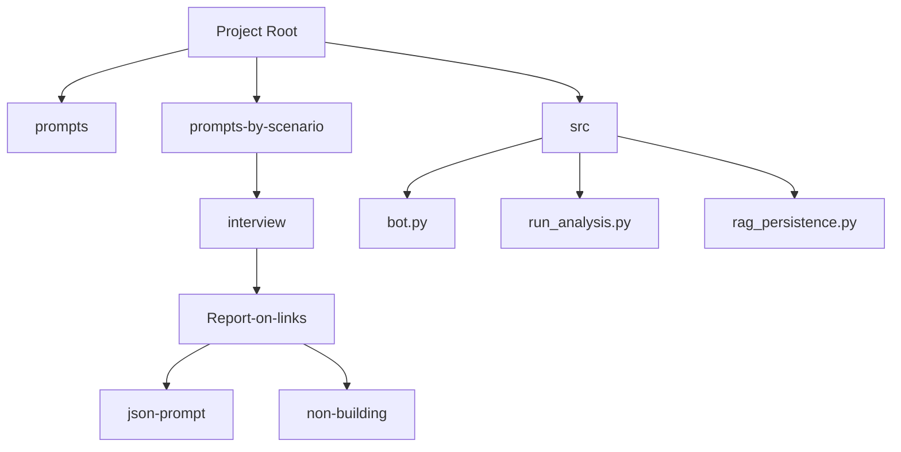
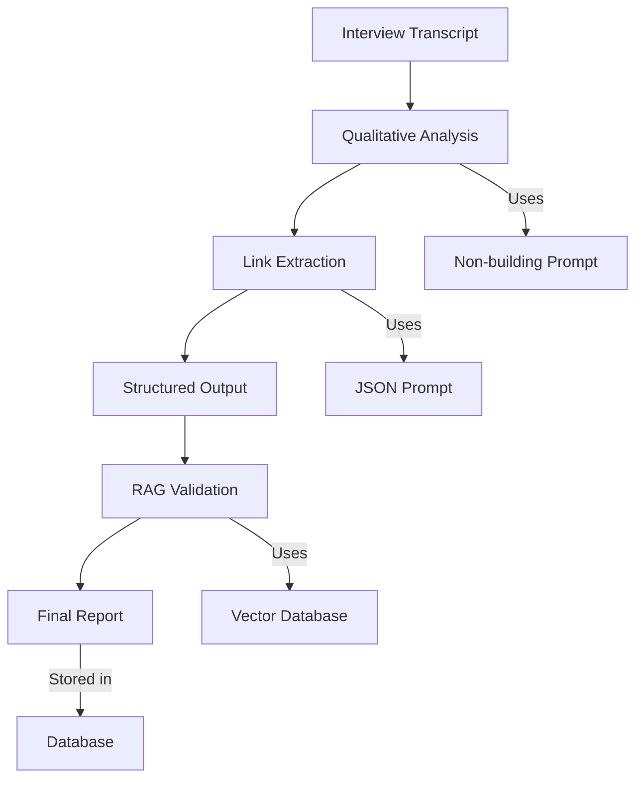
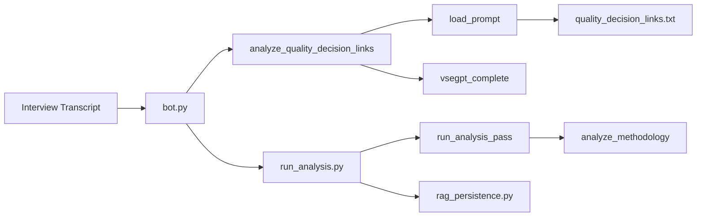

# Report on Links

<cite>
**Referenced Files in This Document**   
- [quality_decision_links.txt](file://prompts/quality_decision_links.txt)
- [Интервью. Отчет о связках..txt](file://prompts-by-scenario/interview/Report-on-links/json-prompt/Интервью. Отчет о связках..txt)
- [промпт связки.txt](file://prompts-by-scenario/interview/Report-on-links/non-building/промпт связки.txt)
- [bot.py](file://src/bot.py#L302-L307)
- [run_analysis.py](file://src/run_analysis.py#L273-L338)
</cite>

## Table of Contents
1. [Introduction](#introduction)
2. [Project Structure](#project-structure)
3. [Core Components](#core-components)
4. [Architecture Overview](#architecture-overview)
5. [Detailed Component Analysis](#detailed-component-analysis)
6. [Dependency Analysis](#dependency-analysis)
7. [Performance Considerations](#performance-considerations)
8. [Troubleshooting Guide](#troubleshooting-guide)
9. [Conclusion](#conclusion)

## Introduction
The **Report on Links** feature is a core analytical component of the VoxPersona system, designed to identify and structure relational patterns between personal traits and decision-making behaviors in hospitality industry interviews. This document provides a comprehensive analysis of how the system detects, validates, and structures these relationships using both JSON and plain text prompts. It details the integration with the RAG (Retrieval-Augmented Generation) system for contextual validation, explains the processing pipeline, and offers guidance for improving accuracy and extending functionality.

## Project Structure
The project is organized into modular directories that separate concerns such as prompts, source code, and configuration. The key components relevant to the Report on Links functionality are located in the `prompts-by-scenario/interview/Report-on-links/` directory and the `src/` directory.



**Diagram sources**
- [prompts-by-scenario/interview/Report-on-links/](file://prompts-by-scenario/interview/Report-on-links/)
- [src/](file://src/)

**Section sources**
- [prompts-by-scenario/interview/Report-on-links/](file://prompts-by-scenario/interview/Report-on-links/)
- [src/](file://src/)

## Core Components
The core functionality of the Report on Links feature is implemented through a combination of prompt engineering and backend processing logic. Two primary prompt types are used: a JSON extraction prompt for quantitative analysis and a non-building text prompt for qualitative relationship identification.

The system leverages the `analyze_quality_decision_links` function in `bot.py` to process interview text and extract quality-decision relationships. This function uses the `quality_decision_links.txt` base prompt or falls back to a default instruction if the file is not found.

```python
def analyze_quality_decision_links(text: str) -> str:
    base_ = load_prompt("quality_decision_links.txt")
    if not base_:
        base_ = "Проанализируй связки (качество-принятие)."
    p = f"{base_}\n\nТекст:\n{text}"
    return vsegpt_complete(p, "Ошибка связок")
```

This function serves as the entry point for relationship analysis, formatting the input text with the appropriate prompt before sending it to the language model.

**Section sources**
- [bot.py](file://src/bot.py#L302-L307)
- [quality_decision_links.txt](file://prompts/quality_decision_links.txt)

## Architecture Overview
The Report on Links analysis pipeline follows a multi-stage processing approach that combines qualitative analysis with quantitative validation. The architecture integrates prompt-based extraction with RAG-based verification to ensure accuracy and contextual relevance.



**Diagram sources**
- [prompts-by-scenario/interview/Report-on-links/non-building/промпт связки.txt](file://prompts-by-scenario/interview/Report-on-links/non-building/промпт связки.txt)
- [prompts-by-scenario/interview/Report-on-links/json-prompt/Интервью. Отчет о связках..txt](file://prompts-by-scenario/interview/Report-on-links/json-prompt/Интервью. Отчет о связках..txt)
- [src/rag_persistence.py](file://src/rag_persistence.py)

## Detailed Component Analysis

### Report on Links Processing Pipeline
The processing pipeline for the Report on Links feature consists of two main stages: qualitative relationship identification and quantitative link counting. This two-phase approach ensures both depth and precision in the analysis.

#### Qualitative Analysis with Non-Building Prompt
The first phase uses the `промпт связки.txt` prompt to identify and describe relationships between personal qualities and decision-making patterns. This prompt instructs the system to:

1. Determine if the client belongs to TYPE 1 (transformed after a significant adult event) or TYPE 2 (no transformation)
2. Extract individual personality traits and their influence on decision-making
3. Formulate linkages in the format "Personality Trait - Decision-Making Approach"
4. Provide direct client quotes as evidence
5. Include brief analysis of how each trait affects venue selection

The prompt emphasizes working with actual client statements and avoiding assumptions, ensuring the analysis remains fact-based and individualized.

#### Quantitative Analysis with JSON Prompt
The second phase uses the `Интервью. Отчет о связках..txt` prompt to count and extract the number of identified links. This JSON-focused prompt:

1. Focuses on the "Personality Traits and Decision-Making Analysis" section
2. Counts numbered linkages in the format "[Personality Trait] - [Decision-Making Approach]"
3. Counts only unique, separately numbered links
4. Excludes repetitions or generalizations in conclusions
5. Returns results in strict JSON format: `{"количество_выявленных_связок": число}`

This two-phase approach allows the system to first generate rich qualitative insights and then extract precise quantitative metrics from the structured output.

```mermaid
flowchart TD
Start([Interview Text]) --> Phase1["Phase 1: Qualitative Analysis"]
Phase1 --> |Uses| Prompt1["промпт связки.txt"]
Phase1 --> ExtractedLinks["Extracted Linkages with Quotes and Analysis"]
ExtractedLinks --> Phase2["Phase 2: Quantitative Extraction"]
Phase2 --> |Uses| Prompt2["Интервью. Отчет о связках..txt"]
Phase2 --> Count["Count Identified Links"]
Count --> Output["JSON: {\"количество_выявленных_связок\": число}"]
style Phase1 fill:#f9f,stroke:#333
style Phase2 fill:#f9f,stroke:#333
```

**Diagram sources**
- [prompts-by-scenario/interview/Report-on-links/non-building/промпт связки.txt](file://prompts-by-scenario/interview/Report-on-links/non-building/промпт связки.txt)
- [prompts-by-scenario/interview/Report-on-links/json-prompt/Интервью. Отчет о связках..txt](file://prompts-by-scenario/interview/Report-on-links/json-prompt/Интервью. Отчет о связках..txt)

**Section sources**
- [prompts-by-scenario/interview/Report-on-links/non-building/промпт связки.txt](file://prompts-by-scenario/interview/Report-on-links/non-building/промпт связки.txt)
- [prompts-by-scenario/interview/Report-on-links/json-prompt/Интервью. Отчет о связках..txt](file://prompts-by-scenario/interview/Report-on-links/json-prompt/Интервью. Отчет о связках..txt)

### Integration with RAG System
The system leverages the RAG (Retrieval-Augmented Generation) architecture to validate detected links against historical data and domain knowledge. Although specific implementation details in `rag_persistence.py` are not available in the current context, the integration pattern can be inferred from the processing flow in `run_analysis.py`.

The analysis pipeline executes multiple passes:
1. First pass: Generate general factors analysis
2. Second pass: Generate specific factors analysis (if applicable)
3. Third pass: Execute JSON-based quantitative analysis on combined results

```python
json_result = run_analysis_pass(
    chat_id=chat_id,
    source_text=result1 + "\n" + result2,
    label=label,
    scenario_name=scenario_name,
    data=data,
    app=app,
    prompts=json_prompts,
    is_show_analysis=True,
    transcription_text=transcription_text
)
```

This sequential processing allows the system to build a comprehensive analysis before extracting structured metrics, ensuring that the quantitative results are based on fully developed qualitative insights.

**Section sources**
- [run_analysis.py](file://src/run_analysis.py#L273-L338)

## Dependency Analysis
The Report on Links feature depends on several core components and follows a clear dependency chain.



The system has a well-defined separation of concerns, with `bot.py` handling API-level interactions, `run_analysis.py` managing the processing pipeline, and prompt files containing the domain-specific instructions. The dependency on `rag_persistence.py` indicates integration with a vector database for knowledge retrieval, though the specific implementation details are not available in the current context.

**Diagram sources**
- [bot.py](file://src/bot.py)
- [run_analysis.py](file://src/run_analysis.py)
- [rag_persistence.py](file://src/rag_persistence.py)

**Section sources**
- [bot.py](file://src/bot.py#L302-L307)
- [run_analysis.py](file://src/run_analysis.py#L158-L190)

## Performance Considerations
The two-phase processing approach (qualitative analysis followed by quantitative extraction) ensures thorough analysis but may impact performance for large datasets. The system mitigates this through:

1. **Asynchronous processing**: The use of threading in `run_analysis_pass` allows for non-blocking operations with spinner animations.
2. **Modular design**: Separating qualitative and quantitative analysis enables independent optimization of each phase.
3. **Caching potential**: The RAG integration suggests that frequently accessed knowledge patterns may be cached for faster retrieval.

However, potential bottlenecks include:
- Multiple calls to the language model (vsegpt_complete) for each processing phase
- Text splitting and sending for long responses
- Database operations during result storage

## Troubleshooting Guide
Common issues with the Report on Links feature and their solutions:

**Issue 1: Missing or incorrect link counts in JSON output**
- **Cause**: The input text may not contain properly formatted linkages or the "Personality Traits and Decision-Making Analysis" section may be missing.
- **Solution**: Ensure the qualitative analysis phase produces correctly formatted numbered linkages in the required format.

**Issue 2: "Ошибка связок" (Links Error) returned by the system**
- **Cause**: The `quality_decision_links.txt` prompt file is missing or the language model call failed.
- **Solution**: Verify the prompt file exists in the prompts directory and check API connectivity.

**Issue 3: Inconsistent TYPE 1/TYPE 2 classification**
- **Cause**: The prompt requires clear evidence of transformative life events in adulthood, which may be ambiguously expressed in transcripts.
- **Solution**: Review the transcript for explicit statements about pre- and post-event differences in personality and decision-making.

**Issue 4: Low-quality link descriptions**
- **Cause**: The system relies on direct client quotes; insufficient dialogue content leads to generic analysis.
- **Solution**: Ensure interview transcripts contain rich, detailed responses from clients about their decision-making processes.

**Section sources**
- [bot.py](file://src/bot.py#L302-L307)
- [prompts-by-scenario/interview/Report-on-links/non-building/промпт связки.txt](file://prompts-by-scenario/interview/Report-on-links/non-building/промпт связки.txt)

## Conclusion
The Report on Links feature provides a sophisticated mechanism for analyzing relational patterns in hospitality interviews by combining qualitative insight generation with quantitative metric extraction. The two-phase approach using specialized prompts ensures both depth and precision in the analysis. The integration with RAG systems allows for contextual validation against historical data, enhancing the reliability of detected relationships. The modular architecture supports extension and customization, making it adaptable to evolving analytical requirements in the hospitality domain.