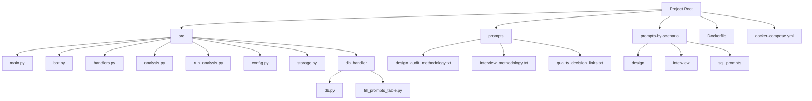
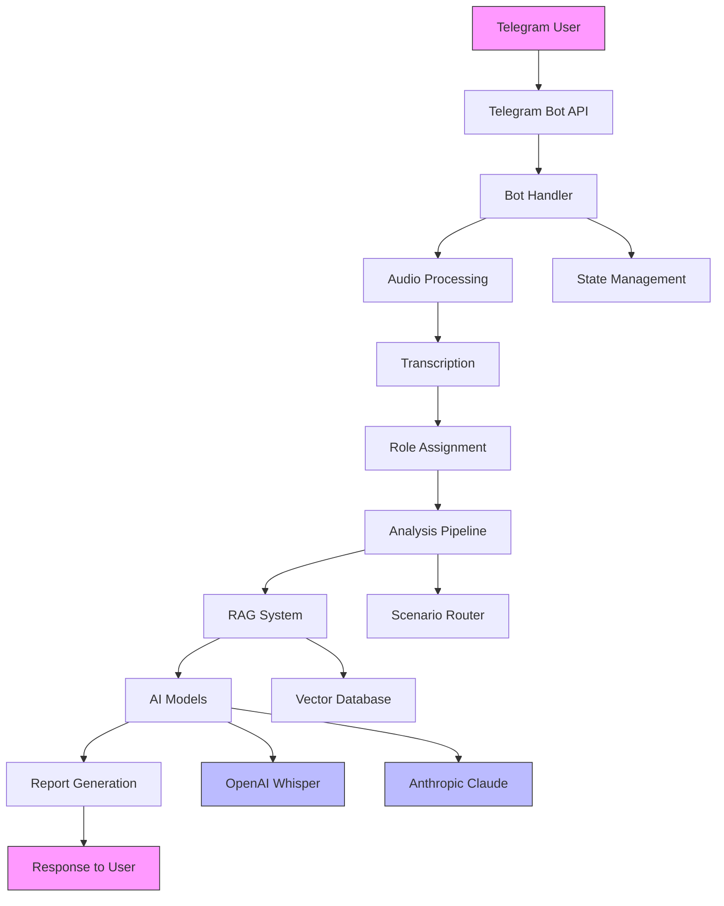
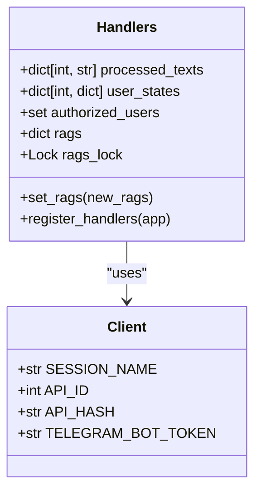
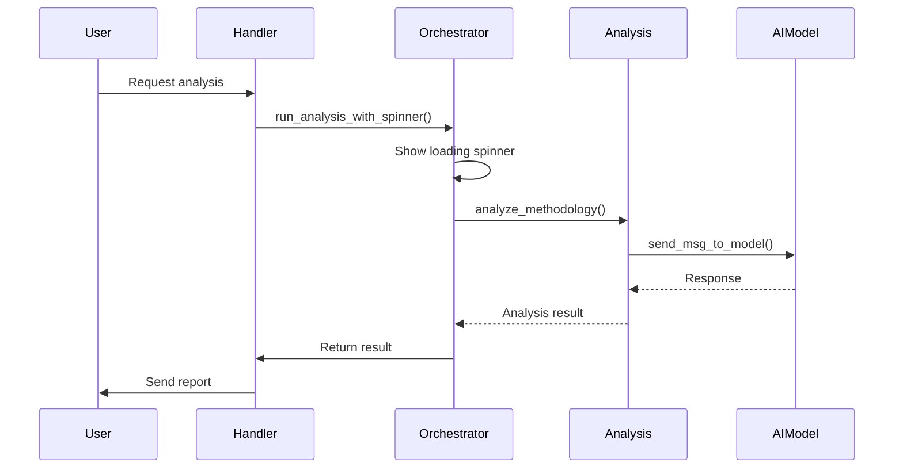
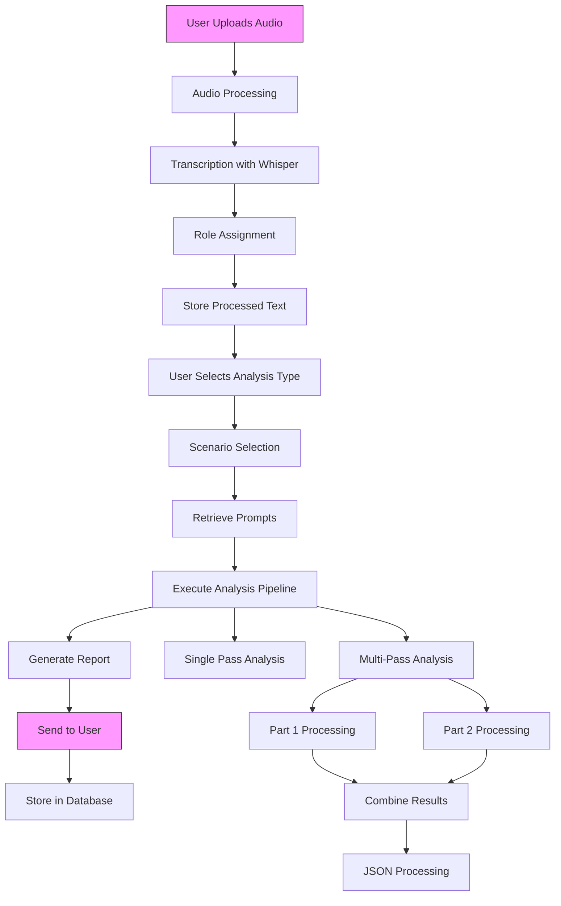
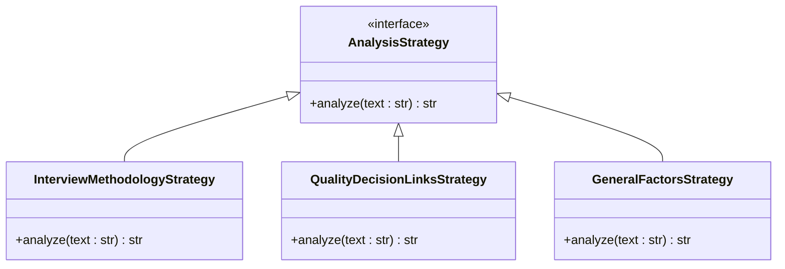
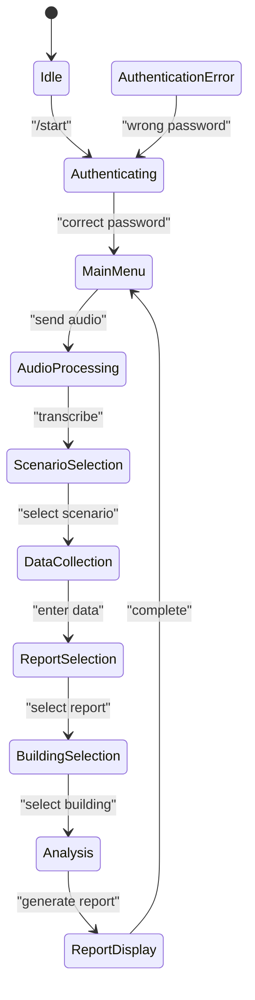
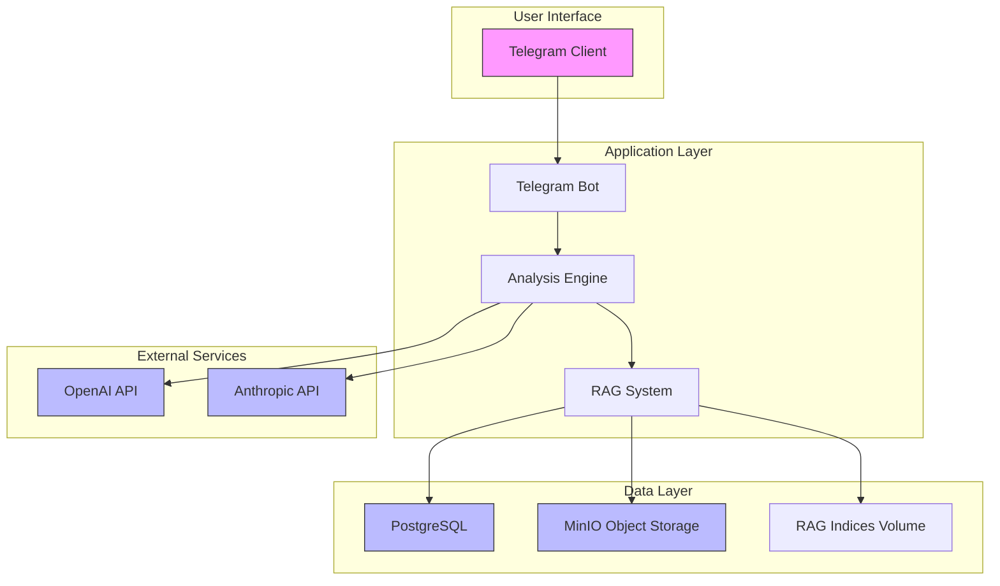

# Architecture and Design

<cite>
**Referenced Files in This Document**   
- [main.py](file://src/main.py)
- [bot.py](file://src/bot.py)
- [handlers.py](file://src/handlers.py)
- [analysis.py](file://src/analysis.py)
- [run_analysis.py](file://src/run_analysis.py)
- [config.py](file://src/config.py)
- [README.md](file://README.md)
- [Dockerfile](file://Dockerfile)
- [docker-compose.yml](file://docker-compose.yml)
</cite>

## Table of Contents
1. [Introduction](#introduction)
2. [Project Structure](#project-structure)
3. [Core Components](#core-components)
4. [Architecture Overview](#architecture-overview)
5. [Detailed Component Analysis](#detailed-component-analysis)
6. [Data Flow and Processing Pipeline](#data-flow-and-processing-pipeline)
7. [Design Patterns and System Architecture](#design-patterns-and-system-architecture)
8. [External Integrations and AI Services](#external-integrations-and-ai-services)
9. [State Management and User Interaction](#state-management-and-user-interaction)
10. [Persistence and RAG System](#persistence-and-rag-system)
11. [Deployment and Infrastructure](#deployment-and-infrastructure)
12. [Performance Considerations](#performance-considerations)
13. [Conclusion](#conclusion)

## Introduction

VoxPersona is an AI-powered voice analysis platform that transforms audio recordings into structured insights through advanced artificial intelligence. The system provides automatic transcription, content analysis, and generates detailed reports based on audio data. Built as a modular monolith, VoxPersona follows a clear separation of concerns using Handler, Repository, Singleton, and Strategy design patterns.

The application integrates with Telegram for user interaction, leveraging external AI APIs from OpenAI (Whisper for transcription) and Anthropic (Claude for analysis). The architecture is designed to handle multi-step workflows for different analysis scenarios, including audit methodology assessment, compliance checking, and structured reporting for various establishment types such as hotels, restaurants, and health centers.

This document provides a comprehensive architectural overview of the VoxPersona application, detailing its component responsibilities, data flow, design trade-offs, and infrastructure topology.

**Section sources**
- [README.md](file://README.md#L1-L50)

## Project Structure

The VoxPersona project follows a logical organization that separates concerns into distinct directories:

- **prompts/**: Contains system prompts for different analysis scenarios
- **prompts-by-scenario/**: Scenario-specific prompts organized by use case
- **src/**: Core application source code
- **Dockerfile**: Container configuration
- **docker-compose.yml**: Service orchestration
- **requirements.txt**: Python dependencies

The source code in the `src/` directory is organized into modular components, each with specific responsibilities:



**Diagram sources**
- [README.md](file://README.md#L20-L40)

## Core Components

The VoxPersona application consists of several core components that work together to process audio files and generate analytical reports:

- **main.py**: Entry point that initializes the application and starts the Telegram bot
- **bot.py**: Manages Telegram bot lifecycle and user interactions
- **handlers.py**: Routes user inputs and manages application state
- **analysis.py**: Orchestrates the AI pipeline for content analysis
- **run_analysis.py**: Executes multi-step analysis workflows
- **config.py**: Centralized configuration management

These components follow a modular monolith architecture with clear separation of concerns, allowing for maintainable code while avoiding the complexity of microservices.

**Section sources**
- [README.md](file://README.md#L40-L60)

## Architecture Overview

VoxPersona follows a modular monolith architecture with well-defined component boundaries. The system processes audio files through a pipeline that includes transcription, role assignment, and multi-stage analysis using AI models.



**Diagram sources**
- [README.md](file://README.md#L10-L20)
- [main.py](file://src/main.py#L1-L20)

## Detailed Component Analysis

### Main Entry Point (main.py)

The `main.py` file serves as the application entry point, responsible for initializing the Telegram client and starting the bot. It implements asynchronous initialization of RAG (Retrieval-Augmented Generation) models without blocking the bot startup.

```python
async def main():
    app = Client(
        SESSION_NAME,
        api_id=int(API_ID),
        api_hash=API_HASH,
        bot_token=TELEGRAM_BOT_TOKEN
    )

    handlers.register_handlers(app)

    await app.start()
    asyncio.create_task(load_rags())
    logging.info("Bot started. Waiting for messages...")
    await idle()
    await app.stop()
```

The main module also handles periodic saving of RAG indices to ensure persistence of learned models.

**Section sources**
- [main.py](file://src/main.py#L70-L95)

### Bot Handler (bot.py)

The `bot.py` file manages the Telegram bot lifecycle, handling user authentication, audio processing, and menu navigation. It implements a state machine pattern to manage user interactions through various analysis scenarios.

Key responsibilities include:
- User authentication via password
- Audio file processing and transcription
- Menu system for navigation
- Report generation workflow management

The bot uses spinner animations to provide feedback during processing and implements error handling for API failures.

**Section sources**
- [bot.py](file://src/bot.py#L1-L100)

### Request Handlers (handlers.py)

The `handlers.py` module implements the Handler pattern, routing user inputs and managing application state. It coordinates between the Telegram interface and business logic components.

Key features:
- Callback query handling for menu interactions
- State management for multi-step workflows
- Data validation and parsing
- Integration with analysis components

The handlers module uses a global `user_states` dictionary to maintain conversation context across user interactions.



**Diagram sources**
- [handlers.py](file://src/handlers.py#L1-L50)
- [config.py](file://src/config.py#L1-L20)

### Analysis Engine (analysis.py)

The `analysis.py` file contains the core analysis logic, implementing the Strategy pattern for different analysis methodologies. It provides functions for transcription, role assignment, and content analysis.

Key components:
- `transcribe_audio_raw()`: Processes audio files in chunks to handle large files
- `analyze_methodology()`: Executes sequential prompt processing for comprehensive analysis
- `send_msg_to_model()`: Manages communication with AI models with rate limiting
- `assign_roles()`: Identifies speaker roles in dialogues

The analysis engine supports both synchronous and asynchronous processing, with parallel execution capabilities for improved performance.

**Section sources**
- [analysis.py](file://src/analysis.py#L1-L100)

### Analysis Workflow Orchestrator (run_analysis.py)

The `run_analysis.py` module orchestrates multi-step analysis workflows, implementing the Strategy pattern for different report types. It manages the execution of analysis passes and coordinates between different processing stages.

Key functions:
- `run_analysis_with_spinner()`: Manages user feedback during analysis
- `run_analysis_pass()`: Executes a single analysis step with error handling
- `init_rags()`: Initializes the RAG system with scenario-specific knowledge bases
- `run_dialog_mode()`: Handles conversational queries using RAG

The orchestrator supports both fast search (vector similarity) and deep search (parallel chunk processing) modes for information retrieval.



**Diagram sources**
- [run_analysis.py](file://src/run_analysis.py#L1-L50)
- [analysis.py](file://src/analysis.py#L150-L200)

## Data Flow and Processing Pipeline

The data flow in VoxPersona follows a structured pipeline from audio upload to final report delivery:



The pipeline handles both voice messages and audio files, with support for various formats (MP3, WAV, M4A, OGG) up to 2GB in size. Audio files are processed in chunks to handle large files that exceed API size limits.

For interview scenarios, the system first assigns roles (client vs. employee) in the dialogue before analysis. The analysis phase retrieves scenario-specific prompts from the database and executes them in sequence, with the output of one prompt serving as input to the next.

**Diagram sources**
- [bot.py](file://src/bot.py#L300-L400)
- [analysis.py](file://src/analysis.py#L50-L100)
- [run_analysis.py](file://src/run_analysis.py#L150-L200)

## Design Patterns and System Architecture

VoxPersona implements several design patterns to ensure maintainability and scalability:

### Handler Pattern

The application uses a Handler pattern in `handlers.py` to manage Telegram callback queries and message routing. Each handler function processes a specific type of user interaction:

```python
def handle_report(chat_id: int, callback_data: str, app: Client):
    if callback_data in ["report_int_methodology", "report_int_links"]:
        preprocess_report_without_buildings(chat_id, callback_data, app)
    elif callback_data in ["report_int_general", "report_int_specific"]:
        preprocess_report_with_buildings(chat_id, callback_data, app)
```

This pattern allows for clean separation of concerns and easy addition of new report types.

### Repository Pattern

The `db_handler/db.py` module implements the Repository pattern, abstracting database operations for prompts and analysis results. This provides a clean interface between the application logic and data storage.

### Singleton Pattern

Global state is managed using the Singleton pattern through module-level variables in `config.py`:

```python
processed_texts: dict[int, str] = {}
user_states: dict[int, dict] = {}
authorized_users = set()
```

These shared data structures maintain application state across different components.

### Strategy Pattern

The analysis system implements the Strategy pattern, with different analysis methodologies for various report types:

- Interview methodology assessment
- Quality-decision links analysis
- General factors analysis
- Specific factors analysis
- Employee performance analysis

Each strategy is configured through prompts stored in the database, allowing for flexible configuration without code changes.



**Diagram sources**
- [handlers.py](file://src/handlers.py#L500-L600)
- [analysis.py](file://src/analysis.py#L1-L50)
- [run_analysis.py](file://src/run_analysis.py#L1-L50)

## External Integrations and AI Services

VoxPersona integrates with several external AI services to provide its functionality:

### OpenAI Whisper

Used for audio transcription, Whisper converts speech to text with high accuracy. The system processes audio in chunks to handle files larger than the API size limit:

```python
def transcribe_audio_raw(file_path: str) -> str:
    sound = AudioSegment.from_file(file_path)
    duration_ms = len(sound)
    out_texts = []
    
    for chunk in split_into_chunks(sound):
        chunk_io = convert_to_mp3(chunk)
        response = client.audio.transcriptions.create(
            model="whisper-1",
            file=chunk_io
        )
        out_texts.append(response.text)
    
    return " ".join(out_texts).strip()
```

### Anthropic Claude

Used for content analysis, Claude processes the transcribed text to generate insights. The system implements rate limiting and retry logic to handle API constraints:

```python
def send_msg_to_model(messages: list, system: str = None) -> str:
    client = anthropic.Anthropic(api_key=api_key)
    
    backoff = 1
    while True:
        try:
            response = client.messages.create(**model_args)
            return response.content[0].text
        except RateLimitError:
            time.sleep(backoff)
            backoff *= 2
```

### Multiple API Keys

To increase throughput, the system supports multiple Anthropic API keys, distributing requests across them:

```python
api_keys = [
    ANTHROPIC_API_KEY,
    ANTHROPIC_API_KEY_2,
    ANTHROPIC_API_KEY_3,
    # ... up to 7 keys
]
```

This allows for parallel processing of analysis tasks, improving overall performance.

**Section sources**
- [analysis.py](file://src/analysis.py#L150-L250)
- [config.py](file://src/config.py#L30-L50)

## State Management and User Interaction

VoxPersona implements a state management system to handle multi-step user interactions:

### User State Tracking

The system tracks user state using a dictionary that stores:
- Current mode (interview or design)
- Collected data (employee name, date, location, etc.)
- Current step in the workflow
- Deep search preference

```python
user_states: dict[int, dict] = {}
```

### Conversation Flow

The typical user interaction flow:

1. Authentication with password
2. Audio upload or selection from storage
3. Scenario selection (interview or design)
4. Data collection (employee, date, location)
5. Report type selection
6. Building type selection (if needed)
7. Report generation and display

### Menu System

The application provides a hierarchical menu system:
- Main menu
- Storage menu
- Help menu
- Interview reports menu
- Design reports menu
- Building type selection

Each menu is implemented as a callback handler that updates the user interface accordingly.



**Diagram sources**
- [handlers.py](file://src/handlers.py#L200-L400)
- [bot.py](file://src/bot.py#L100-L200)

## Persistence and RAG System

VoxPersona implements a persistence system using PostgreSQL and a RAG (Retrieval-Augmented Generation) system for knowledge retrieval.

### Database Schema

The system uses PostgreSQL with tables for:
- Audit records
- Transcriptions
- Prompts
- Client information
- Employee data
- Buildings
- Scenarios

### RAG Implementation

The RAG system is implemented in `run_analysis.py` and `rag_persistence.py`, providing semantic search capabilities:

```python
def init_rags(existing_rags: dict | None = None) -> dict:
    rags = existing_rags.copy() if existing_rags else {}
    rag_configs = [
        ("Интервью", None, None),
        ("Дизайн", None, None),
        ("Интервью", "Оценка методологии интервью", None),
        # ... other configurations
    ]
    
    for config in rag_configs:
        scenario_name, report_type, _ = config
        rag_name = report_type if report_type else scenario_name
        if rag_name in rags:
            continue
            
        content = build_reports_grouped(scenario_name, report_type)
        content_str = grouped_reports_to_string(content)
        
        if rag_name in ["Интервью", "Дизайн"]:
            rag_db = create_db_in_memory(content_str)
            rags[rag_name] = rag_db
        else:
            rags[rag_name] = content_str
    
    return rags
```

The RAG system supports two search modes:
- **Fast search**: Vector similarity search for quick responses
- **Deep search**: Parallel processing of document chunks for comprehensive analysis

### Index Persistence

RAG indices are saved periodically to ensure persistence:

```python
async def periodic_save_rags():
    while True:
        await asyncio.sleep(900)
        async with handlers.rags_lock:
            try:
                save_rag_indices(handlers.rags)
            except Exception as e:
                logging.warning(f"Failed to save RAG indices: {e}")
```

This runs every 15 minutes to prevent data loss in case of application restart.

**Section sources**
- [run_analysis.py](file://src/run_analysis.py#L1-L100)
- [main.py](file://src/main.py#L20-L50)

## Deployment and Infrastructure

VoxPersona is designed for containerized deployment using Docker and Docker Compose.

### Docker Configuration

The `Dockerfile` specifies the runtime environment:

```dockerfile
FROM python:3.10-slim

WORKDIR /app
COPY requirements.txt .
RUN pip install -r requirements.txt

COPY . .

CMD ["python", "src/main.py"]
```

### Docker Compose

The `docker-compose.yml` file orchestrates multiple services:

```yaml
version: '3.8'
services:
  voxpersona:
    build: .
    environment:
      - ANTHROPIC_API_KEY
      - OPENAI_API_KEY
      - TELEGRAM_BOT_TOKEN
      - API_ID
      - API_HASH
    volumes:
      - rag_indices:/app/rag_indices
    
  postgres:
    image: postgres:14
    environment:
      - POSTGRES_DB=bot_db
      - POSTGRES_USER=voxpersona_user
      - POSTGRES_PASSWORD=${DB_PASSWORD}
    volumes:
      - postgres_data:/var/lib/postgresql/data
    
  minio:
    image: minio/minio
    command: server /data
    environment:
      - MINIO_ROOT_USER=${MINIO_ACCESS_KEY}
      - MINIO_ROOT_PASSWORD=${MINIO_SECRET_KEY}
    ports:
      - "9000:9000"

volumes:
  postgres_data:
  rag_indices:
```

### Infrastructure Topology



The infrastructure includes persistent volumes for RAG indices and database storage, ensuring data persistence across container restarts.

**Diagram sources**
- [Dockerfile](file://Dockerfile#L1-L10)
- [docker-compose.yml](file://docker-compose.yml#L1-L20)

## Performance Considerations

VoxPersona implements several performance optimizations to handle resource-intensive AI processing:

### Parallel Processing

The system uses multiple API keys to distribute analysis tasks across different rate limits:

```python
token_limits_per_min = [80000, 20000, 20000, 20000, 20000, 20000, 20000]
req_limits_per_min = [2000, 50, 50, 50, 50, 50, 50]
```

This allows for parallel processing with different throughput characteristics.

### Rate Limit Management

The analysis engine implements sophisticated rate limiting based on both requests per minute and tokens per minute:

```python
async def extract_from_chunk_parallel_async():
    token_rate = token_rates[model_idx]
    req_rate = req_rates[model_idx]
    req_delay = 1.0 / req_rate if req_rate > 0 else float("inf")
    delay = max(token_delay, req_delay)
    await asyncio.sleep(delay)
```

### Audio Processing Optimization

Large audio files are processed in chunks to avoid memory issues and API size limits:

```python
def transcribe_audio_raw(file_path: str, chunk_length_ms: int = 3 * 60_000):
    sound = AudioSegment.from_file(file_path)
    for chunk in split_into_chunks(sound, chunk_length_ms):
        # Process each chunk separately
```

### Caching Strategy

The RAG system implements caching of vector indices to avoid recomputing embeddings:

```python
async def load_rags():
    loaded_rags = await asyncio.to_thread(load_rag_indices)
    # ... use cached indices
    asyncio.create_task(periodic_save_rags())
```

### Trade-offs

The system makes several design trade-offs:

- **RAG vs Fine-tuning**: Uses RAG instead of fine-tuning AI models for flexibility and lower training costs
- **Synchronous vs Asynchronous**: Uses synchronous processing for simplicity, with asynchronous initialization for RAG models
- **State Management**: Uses in-memory state with periodic persistence rather than a distributed state store for simplicity

These trade-offs favor maintainability and ease of deployment over maximum scalability.

**Section sources**
- [analysis.py](file://src/analysis.py#L250-L400)
- [run_analysis.py](file://src/run_analysis.py#L100-L150)
- [main.py](file://src/main.py#L20-L50)

## Conclusion

VoxPersona is a sophisticated AI-powered voice analysis platform that demonstrates a well-structured modular monolith architecture. The system effectively combines Telegram integration with advanced AI services to transform audio recordings into actionable insights.

Key architectural strengths include:
- Clear separation of concerns through Handler, Repository, Singleton, and Strategy patterns
- Robust state management for multi-step user interactions
- Efficient RAG system for knowledge retrieval
- Comprehensive error handling and user feedback
- Containerized deployment for easy setup and maintenance

The application successfully balances complexity and maintainability, providing a rich feature set while remaining accessible for development and deployment. Future enhancements could include microservices evolution for improved scalability, enhanced caching mechanisms, and additional AI model integrations.

The current architecture provides a solid foundation for a production-ready voice analysis platform with clear pathways for future growth and improvement.