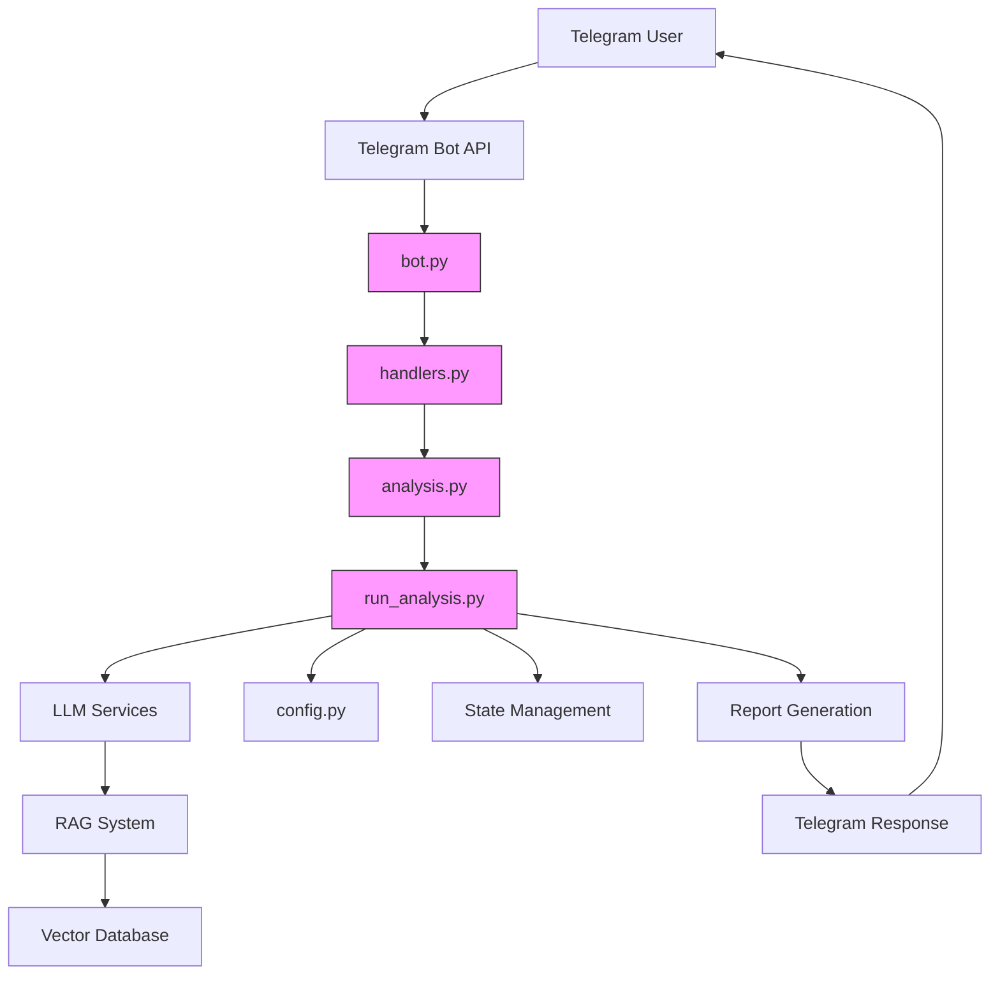
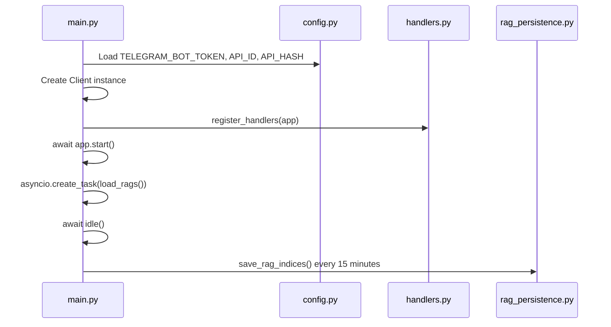
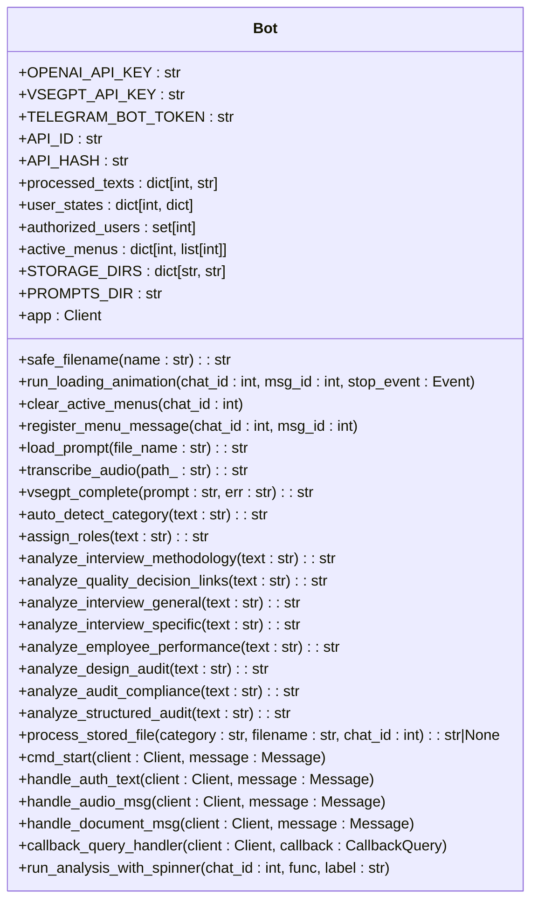
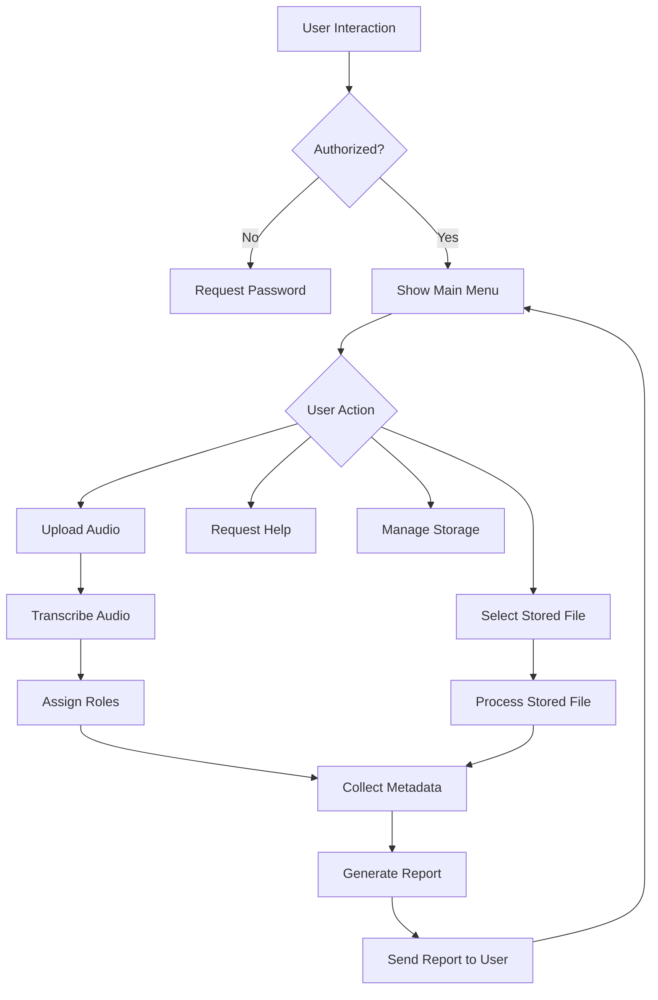
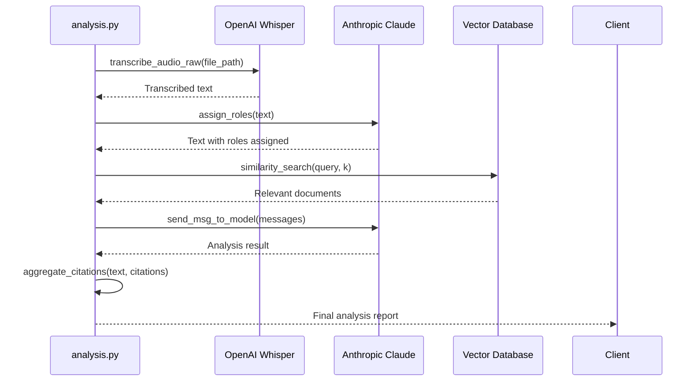
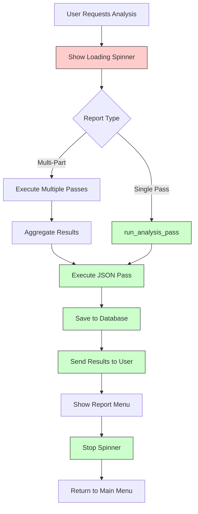
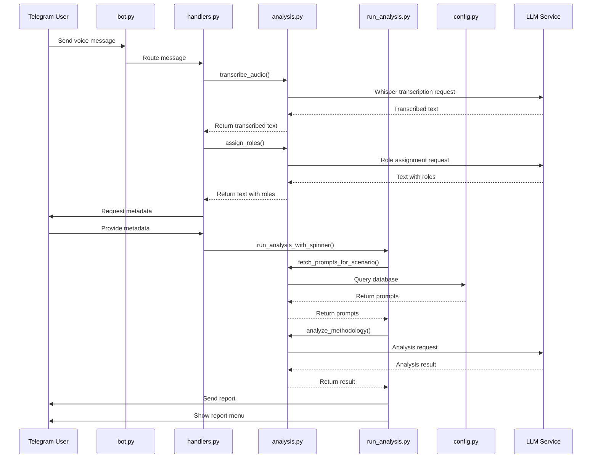

# Core Architecture

<cite>
**Referenced Files in This Document**   
- [main.py](file://src/main.py)
- [bot.py](file://src/bot.py)
- [handlers.py](file://src/handlers.py)
- [analysis.py](file://src/analysis.py)
- [run_analysis.py](file://src/run_analysis.py)
- [config.py](file://src/config.py)
</cite>

## Table of Contents
1. [Introduction](#introduction)
2. [Project Structure](#project-structure)
3. [Core Components](#core-components)
4. [Architecture Overview](#architecture-overview)
5. [Detailed Component Analysis](#detailed-component-analysis)
6. [Component Interactions](#component-interactions)
7. [Configuration and State Management](#configuration-and-state-management)
8. [Design Decisions](#design-decisions)
9. [Conclusion](#conclusion)

## Introduction
VoxPersona is an AI-powered voice analysis platform that processes audio recordings through transcription, role assignment, and intelligent analysis to generate structured reports. The system is built as a modular monolith with clear separation of concerns, integrating Telegram bot functionality with advanced language models for comprehensive voice data analysis. This document details the core architecture, component responsibilities, and interaction patterns that enable VoxPersona to deliver sophisticated analysis workflows through a conversational interface.

## Project Structure
The VoxPersona project follows a layered directory structure that organizes components by functionality. The root directory contains configuration files, deployment scripts, and documentation, while the `src` directory houses the core application logic. The project structure demonstrates a hybrid organization that combines feature-based and layer-based patterns, with specialized directories for different concerns.

```mermaid
graph TD
root[Project Root]
subgraph "Configuration & Deployment"
root --> DEPLOYMENT_GUIDE_MD[DEPLOYMENT_GUIDE.md]
root --> Dockerfile
root --> docker_compose_yml[docker-compose.yml]
root --> README_MD[README.md]
root --> SETUP_MD[SETUP.md]
root --> requirements_txt[requirements.txt]
end
subgraph "Prompts"
root --> prompts_dir[prompts/]
root --> prompts_by_scenario_dir[prompts-by-scenario/]
end
subgraph "Source Code"
root --> src_dir[src/]
subgraph "Core Modules"
src_dir --> main_py[main.py]
src_dir --> bot_py[bot.py]
src_dir --> handlers_py[handlers.py]
src_dir --> analysis_py[analysis.py]
src_dir --> run_analysis_py[run_analysis.py]
src_dir --> config_py[config.py]
end
subgraph "Support Modules"
src_dir --> db_handler_dir[db_handler/]
src_dir --> audio_utils_py[audio_utils.py]
src_dir --> auth_utils_py[auth_utils.py]
src_dir --> datamodels_py[datamodels.py]
src_dir --> markups_py[markups.py]
src_dir --> menus_py[menus.py]
src_dir --> parser_py[parser.py]
src_dir --> rag_persistence_py[rag_persistence.py]
src_dir --> storage_py[storage.py]
src_dir --> utils_py[utils.py]
src_dir --> validators_py[validators.py]
end
end
```

**Diagram sources**
- [main.py](file://src/main.py)
- [bot.py](file://src/bot.py)
- [handlers.py](file://src/handlers.py)
- [analysis.py](file://src/analysis.py)
- [run_analysis.py](file://src/run_analysis.py)

## Core Components
The VoxPersona application consists of several core components that work together to process voice inputs and generate analytical reports. Each component has a well-defined responsibility within the system architecture, following the modular monolith pattern with clear separation of concerns. The main components include the application entry point (main.py), the Telegram bot client manager (bot.py), the message handler orchestrator (handlers.py), the analysis pipeline coordinator (analysis.py), and the multi-step analysis workflow executor (run_analysis.py). These components interact through well-defined interfaces and shared state management, enabling the system to process audio inputs, extract meaningful insights, and deliver structured reports to users through the Telegram interface.

**Section sources**
- [main.py](file://src/main.py)
- [bot.py](file://src/bot.py)
- [handlers.py](file://src/handlers.py)
- [analysis.py](file://src/analysis.py)
- [run_analysis.py](file://src/run_analysis.py)

## Architecture Overview
VoxPersona follows a modular monolith architecture with clear separation of concerns, where different components handle specific aspects of the application lifecycle. The system is designed around a Telegram bot interface that receives voice messages, processes them through a multi-stage analysis pipeline, and returns structured reports to users. The architecture emphasizes simplicity and reliability by using synchronous processing for the core chatbot interactions, while incorporating asynchronous operations for background tasks like RAG model loading and periodic data persistence.

The application entry point in main.py initializes the configuration and launches the Telegram bot, which is managed by the Pyrogram client in bot.py. Message routing is handled by handlers.py, which processes user commands and audio inputs according to a handler pattern. When audio is received, it undergoes transcription and role assignment before being passed to the analysis pipeline in analysis.py, which coordinates transcription, RAG retrieval, and LLM analysis. The run_analysis.py module executes multi-step analysis workflows with error handling and state tracking, ensuring robust processing of complex analytical tasks.

**Diagram sources**
- [main.py](file://src/main.py#L1-L95)
- [bot.py](file://src/bot.py#L1-L670)
- [handlers.py](file://src/handlers.py#L1-L805)
- [analysis.py](file://src/analysis.py#L1-L491)
- [run_analysis.py](file://src/run_analysis.py#L1-L344)

## Detailed Component Analysis

### main.py - Application Entry Point
The main.py file serves as the application entry point, responsible for initializing configuration, setting up the Telegram bot client, and launching the application. It uses the Pyrogram library to create a Client instance with credentials loaded from environment variables through the config.py module. The main function orchestrates the startup sequence by first creating the bot client, registering message handlers, starting the client, and then initiating background tasks for RAG model loading and periodic data persistence.

The file implements a periodic_save_rags function that runs every 15 minutes to persist RAG indices to disk, ensuring data durability. The load_rags function initializes RAG models in the background without blocking bot startup, attempting to load pre-existing indices from storage or creating new ones if necessary. This design ensures that the bot becomes responsive quickly while background processes prepare the analysis capabilities.

**Diagram sources**
- [main.py](file://src/main.py#L1-L95)

**Section sources**
- [main.py](file://src/main.py#L1-L95)

### bot.py - Telegram Bot Client Management
The bot.py file manages the Pyrogram client lifecycle, message routing, and user session handling for the VoxPersona application. It creates a Pyrogram Client instance with Telegram API credentials and implements a comprehensive set of handlers for different message types and user interactions. The file contains the core logic for processing voice messages, including audio transcription using OpenAI's Whisper API and role assignment in dialogues using VSEGPT.

The bot implements a state management system using dictionaries to track user states, processed texts, authorized users, and active menus. It provides a rich interactive interface through inline keyboard menus for storage management, report selection, and help information. The file includes utility functions for safe filename generation, loading animation display, and menu management, enhancing the user experience within the Telegram interface.

**Diagram sources**
- [bot.py](file://src/bot.py#L1-L670)

**Section sources**
- [bot.py](file://src/bot.py#L1-L670)

### handlers.py - Business Logic Orchestrator
The handlers.py file serves as the orchestrator of business logic in the VoxPersona application, processing user commands and audio inputs through a handler pattern. It registers Pyrogram handlers for various message types and callback queries, routing them to appropriate functions based on user interactions. The module manages the complete workflow from user authentication to data collection and report generation, maintaining user state throughout the interaction process.

The file implements a step-based state machine for collecting user input, guiding users through a series of prompts to gather necessary information for report generation. It handles the collection of metadata such as client name, employee name, place name, building type, zone, city, and date, validating inputs and allowing users to edit previously entered information. The handlers coordinate with the analysis pipeline to execute report generation based on user selections, integrating with the RAG system for knowledge retrieval.

**Diagram sources**
- [handlers.py](file://src/handlers.py#L1-L805)

**Section sources**
- [handlers.py](file://src/handlers.py#L1-L805)

### analysis.py - Central Pipeline Coordinator
The analysis.py file acts as the central pipeline coordinator in VoxPersona, integrating transcription, RAG retrieval, and LLM analysis capabilities. It provides a suite of functions for processing audio and text data, including transcription of audio files using OpenAI's Whisper API, role assignment in dialogues, and classification of report types and queries. The module implements sophisticated analysis workflows that chain multiple LLM calls together, with the output of one step serving as input to the next.

The file contains functions for generating database answers by retrieving relevant documents from a vector database and synthesizing responses based on the retrieved information. It implements both synchronous and asynchronous processing patterns, with parallel processing capabilities for handling multiple chunks of text simultaneously across different API keys to maximize throughput. The analysis module also includes utility functions for token counting, prompt management, and error handling, ensuring robust operation of the analysis pipeline.

**Diagram sources**
- [analysis.py](file://src/analysis.py#L1-L491)

**Section sources**
- [analysis.py](file://src/analysis.py#L1-L491)

### run_analysis.py - Multi-Step Analysis Workflow Executor
The run_analysis.py file is responsible for executing multi-step analysis workflows with comprehensive error handling and state tracking. It implements the run_analysis_with_spinner function that provides visual feedback to users during processing, displaying a loading animation while analysis is performed. The module coordinates the execution of analysis passes, managing the sequence of prompt execution and result aggregation.

The file contains the init_rags function that initializes the RAG (Retrieval-Augmented Generation) system by building vector databases from stored reports, enabling semantic search capabilities. It implements both fast and deep search modes for information retrieval, with the deep search mode processing multiple text chunks in parallel across several API keys to improve performance. The run_dialog_mode function enables conversational interaction with the system, classifying user queries and retrieving relevant information from the knowledge base.

**Diagram sources**
- [run_analysis.py](file://src/run_analysis.py#L1-L344)

**Section sources**
- [run_analysis.py](file://src/run_analysis.py#L1-L344)

## Component Interactions
The components of VoxPersona interact through a well-defined architecture that enables seamless processing of voice analysis requests. The interaction begins when a user sends a voice message to the Telegram bot, which is received by the Pyrogram client in bot.py. The message is routed to the appropriate handler in handlers.py, which processes the audio by first transcribing it using functions from analysis.py and then assigning roles in the dialogue.

Once the processed text is available, the handlers module collects necessary metadata from the user through a series of interactive prompts, maintaining state in the user_states dictionary. When the user selects a report type, the handlers module invokes the analysis workflow in run_analysis.py, passing the processed text, collected metadata, and report configuration. The run_analysis module coordinates the execution of the analysis pipeline, potentially making multiple calls to LLM services through functions in analysis.py.

The analysis.py module serves as the central hub for processing, integrating transcription, RAG retrieval, and LLM analysis capabilities. It retrieves prompts from the database, sends requests to LLM APIs, and processes the responses, potentially chaining multiple analysis steps together. Results are returned to run_analysis.py, which handles formatting, persistence, and delivery back to the user through the Telegram interface.

**Diagram sources**
- [bot.py](file://src/bot.py#L1-L670)
- [handlers.py](file://src/handlers.py#L1-L805)
- [analysis.py](file://src/analysis.py#L1-L491)
- [run_analysis.py](file://src/run_analysis.py#L1-L344)

## Configuration and State Management
VoxPersona employs a comprehensive configuration and state management system that enables flexible deployment and reliable operation. Configuration is managed through the config.py module, which loads settings from environment variables using the dotenv library. The configuration includes API keys for external services (OpenAI, Anthropic, Telegram), database connection parameters, and application-specific settings that can be adjusted without code changes.

The system uses a dual-mode configuration approach, with different settings for TEST and PROD environments. This allows for safe testing and development without affecting production data. Database configuration, bucket names, and Telegram bot tokens are all environment-dependent, ensuring isolation between different deployment environments.

State management in VoxPersona is implemented through global dictionaries that track user sessions and processing state. The processed_texts dictionary stores transcribed and processed text for each user, enabling multiple analysis operations on the same input. The user_states dictionary maintains the current step in interactive workflows, allowing the system to guide users through multi-step processes like metadata collection. The authorized_users set tracks authenticated users, while active_menus manages interactive menu messages that can be cleaned up when users navigate away.

The application also implements persistent state management through the RAG index directory, which stores serialized vector databases for fast loading on application startup. The periodic_save_rags function in main.py ensures that these indices are regularly persisted to disk, preventing data loss and reducing startup time. This combination of in-memory and persistent state management enables the system to maintain context across user interactions while ensuring data durability.

**Section sources**
- [config.py](file://src/config.py#L1-L94)
- [main.py](file://src/main.py#L1-L95)
- [handlers.py](file://src/handlers.py#L1-L805)

## Design Decisions
The VoxPersona architecture reflects several key design decisions that prioritize simplicity, reliability, and maintainability in the context of a chatbot application. The most significant decision is the use of synchronous processing for the core chatbot interactions, which ensures predictable behavior and simplifies error handling. While asynchronous operations are used for background tasks like RAG model loading, the main user interaction flow is synchronous, providing a clear and linear execution path that is easier to debug and maintain.

The modular monolith architecture represents another important design choice, balancing the benefits of microservices (separation of concerns, independent development) with the simplicity of a single codebase. This approach avoids the complexity of inter-service communication and deployment coordination while still enabling clear component boundaries and focused responsibility.

The system's reliance on Telegram's update model for state management is a pragmatic decision that leverages the platform's built-in capabilities. Instead of implementing a complex session management system, VoxPersona uses the chat ID as a natural key for user state, storing transient data in memory with the understanding that it can be reconstructed if necessary. This approach reduces infrastructure requirements while providing adequate functionality for the application's use case.

The implementation of a handler pattern in handlers.py demonstrates a clean separation of concerns, with different functions responsible for specific types of user interactions. This design makes the codebase more maintainable and allows for easy extension of functionality. The use of callback queries for menu navigation creates a rich interactive experience within the constraints of the Telegram interface, demonstrating thoughtful adaptation to the platform's capabilities.

**Section sources**
- [main.py](file://src/main.py#L1-L95)
- [bot.py](file://src/bot.py#L1-L670)
- [handlers.py](file://src/handlers.py#L1-L805)
- [analysis.py](file://src/analysis.py#L1-L491)
- [run_analysis.py](file://src/run_analysis.py#L1-L344)

## Conclusion
VoxPersona demonstrates a well-architected modular monolith design that effectively balances complexity and functionality for a specialized voice analysis application. The clear separation of concerns among its core components—main.py as the entry point, bot.py managing the Telegram client, handlers.py orchestrating business logic, analysis.py coordinating the analysis pipeline, and run_analysis.py executing multi-step workflows—creates a maintainable and extensible codebase. The architecture leverages synchronous processing for reliability in chatbot interactions while incorporating asynchronous operations for background tasks, striking an appropriate balance for the application's requirements.

The system's integration of advanced AI capabilities, including speech-to-text transcription, role assignment in dialogues, and RAG-enhanced analysis, is seamlessly orchestrated through a well-defined component interaction model. Configuration management through environment variables and state tracking via Telegram's update model demonstrate pragmatic design choices that prioritize operational simplicity. As VoxPersona continues to evolve, this solid architectural foundation provides a strong basis for adding new analysis capabilities, supporting additional platforms, and enhancing the user experience while maintaining system reliability and performance.