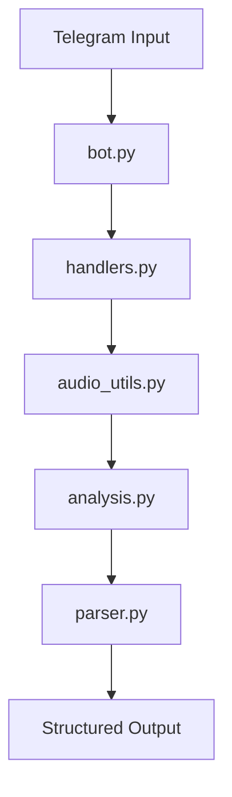
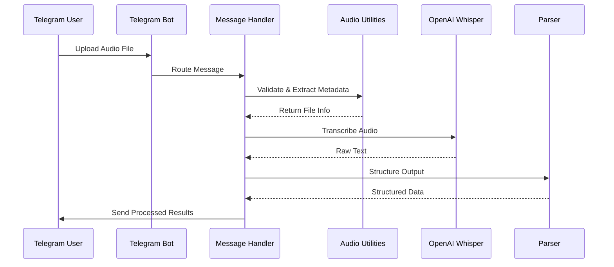
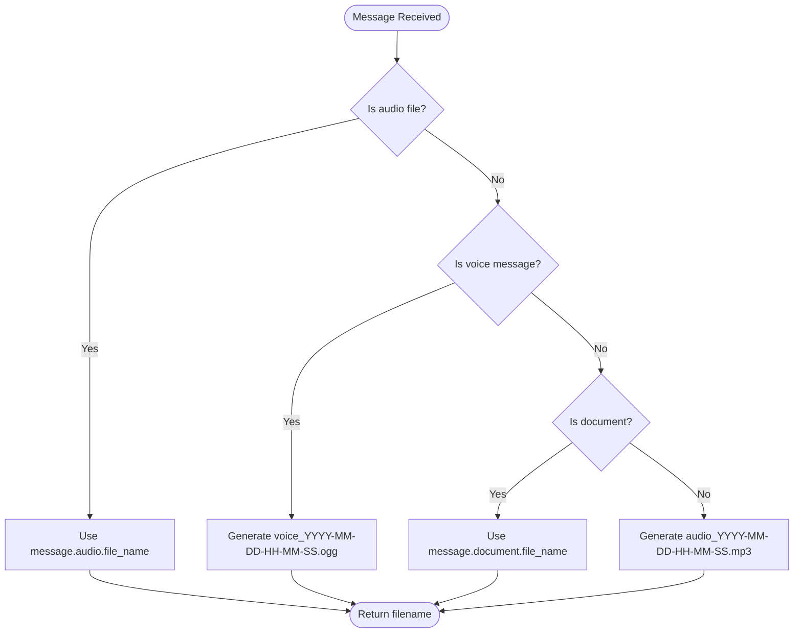
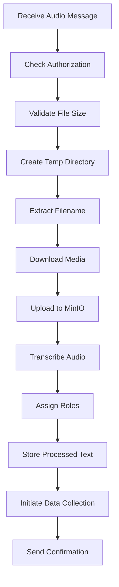
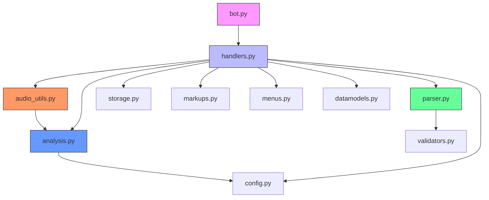

# Audio Processing Pipeline

<cite>
**Referenced Files in This Document**   
- [audio_utils.py](file://src/audio_utils.py)
- [bot.py](file://src/bot.py)
- [handlers.py](file://src/handlers.py)
- [parser.py](file://src/parser.py)
- [analysis.py](file://src/analysis.py)
- [config.py](file://src/config.py)
</cite>

## Table of Contents
1. [Introduction](#introduction)
2. [Project Structure](#project-structure)
3. [Core Components](#core-components)
4. [Architecture Overview](#architecture-overview)
5. [Detailed Component Analysis](#detailed-component-analysis)
6. [Dependency Analysis](#dependency-analysis)
7. [Performance Considerations](#performance-considerations)
8. [Troubleshooting Guide](#troubleshooting-guide)
9. [Conclusion](#conclusion)

## Introduction
VoxPersona is an AI-powered voice analysis platform that transforms audio recordings into structured insights through automatic transcription and intelligent content analysis. The system integrates with Telegram to receive audio files, processes them using OpenAI Whisper for speech-to-text conversion, and leverages advanced AI models for domain-specific analysis. This document details the audio processing pipeline, covering the journey from audio file upload to structured text output, including validation, normalization, preprocessing, and integration with downstream components.

## Project Structure
The project follows a modular structure with clear separation of concerns. The core functionality resides in the `src` directory, while prompts for different scenarios are organized in dedicated directories. Audio processing components are distributed across multiple modules, with specialized files handling different aspects of the pipeline.



**Diagram sources**
- [bot.py](file://src/bot.py#L1-L671)
- [handlers.py](file://src/handlers.py#L1-L805)
- [audio_utils.py](file://src/audio_utils.py#L1-L50)

## Core Components
The audio processing pipeline consists of several interconnected components that handle different stages of audio file processing. These components work together to validate, normalize, and preprocess audio files for transcription by OpenAI Whisper. The system also handles metadata extraction, error recovery, and integration with the Telegram bot interface.

**Section sources**
- [audio_utils.py](file://src/audio_utils.py#L1-L50)
- [handlers.py](file://src/handlers.py#L1-L805)

## Architecture Overview
The audio processing pipeline follows a sequential flow from audio capture to structured output. When a user uploads an audio file via Telegram, the bot receives the message and routes it to the appropriate handler. The handler validates the file, extracts metadata, and initiates the preprocessing workflow. The audio is then transcribed and parsed into domain-specific formats for further analysis.



**Diagram sources**
- [bot.py](file://src/bot.py#L1-L671)
- [handlers.py](file://src/handlers.py#L1-L805)
- [audio_utils.py](file://src/audio_utils.py#L1-L50)
- [parser.py](file://src/parser.py#L1-L175)

## Detailed Component Analysis

### Audio Utilities Analysis
The `audio_utils.py` module provides essential functions for handling audio files from Telegram. It extracts filenames, determines file sizes, and manages the transcription process.

#### Audio Filename Extraction
The `extract_audio_filename` function handles different types of audio inputs from Telegram, generating appropriate filenames based on the message type.



**Diagram sources**
- [audio_utils.py](file://src/audio_utils.py#L5-L35)

#### Audio File Parameters
The `define_audio_file_params` function extracts the file size from Telegram messages, supporting voice messages, audio files, and documents containing audio.

```python
def define_audio_file_params(message: Message) -> int:
    """
    Returns the file size in bytes for voice/audio/document-with-music.
    """
    if message.voice:
        return message.voice.file_size

    if message.audio:
        return message.audio.file_size

    if message.document:
        return message.document.file_size
    
    raise ValueError("Message does not contain audio or voice")
```

**Section sources**
- [audio_utils.py](file://src/audio_utils.py#L37-L49)

### Message Handling Analysis
The `handlers.py` module contains the core logic for processing Telegram messages and managing the audio processing workflow.

#### Audio Message Processing
The `handle_audio_msg` function in `handlers.py` orchestrates the entire audio processing pipeline, from file download to transcription and role assignment.



**Diagram sources**
- [handlers.py](file://src/handlers.py#L350-L490)

#### Audio Processing Workflow
The audio processing workflow involves several key steps to ensure compatibility with OpenAI Whisper and proper integration with the analysis pipeline.

```python
@app.on_message(filters.voice | filters.audio | filter_wav_document)
def handle_audio_msg(app: Client, message: Message, tmpdir: str="/root/Vox/VoxPersona/temp_audio", max_size: int=2 * 1024 * 1024 * 1024):
    """
    Process voice or audio message, up to 2 GB.
    Transcribe → assign_roles → save in processed_texts for further analysis.
    Audio file is saved in MinIO, temporary directory is deleted.
    """
    c_id = message.chat.id
    global audio_file_name_to_save
    global transcription_text
    st = user_states.get(c_id, {})
    mode =  st.get("mode")

    try:
        check_authorized(c_id, authorized_users)
    except ValueError as e:
        logging.exception(e)
        app.send_message(c_id, "You are not authorized.")
        return
    
    file_size = define_audio_file_params(message)

    try:
        check_audio_file_size(file_size, max_size, c_id, app)
    except ValueError as e:
        logging.exception(e)
        return

    os.makedirs(tmpdir, exist_ok=True)

    file_name = extract_audio_filename(message)
    path = os.path.join(tmpdir, file_name)

    msg_ = app.send_message(c_id, "🎙️ Processing audio, please wait...")
    st_ev = threading.Event()
    sp_th = threading.Thread(target=run_loading_animation, args=(c_id, msg_.id, st_ev, app))
    sp_th.start()

    try:
        # Download audio file to temporary directory
        downloaded = app.download_media(message, file_name=path)
        audio_file_name_to_save = os.path.basename(downloaded)

        minio_client.fput_object(
            MINIO_AUDIO_BUCKET_NAME,
            file_name,
            downloaded
        )
        logging.info(f"Audio file {file_name} successfully uploaded to MinIO.")

        transcription_text = transcribe_audio_and_save(downloaded, c_id, processed_texts)

        app.edit_message_text(c_id, msg_.id, "✅ Audio processed!")
        # If user selected "Interview" - assign roles
        handle_assign_roles(c_id, app, mode, processed_texts)
        st["step"] = "inputing_fields"
        if message.caption:
            text = message.caption.strip()
            try:
                parsed_data = parse_message_text(text, mode)
                st["data"] = parsed_data
                show_confirmation_menu(c_id, st, app)
            except Exception as e:
                app.send_message(c_id, "Could not automatically parse data, please fill in fields manually.\nPlease enter file number:")
                logging.error(f"Error parsing data: {e}")
            return
        else:
            app.send_message(c_id, "Could not automatically parse data, please fill in fields manually.\nPlease enter file number:")
    
    except S3Error as e:
        logging.error(f"❌ Error: Could not upload file to MinIO.: {e}")
        app.edit_message_text(c_id, msg_.id, "❌ Error processing audio")
        send_main_menu(c_id, app)
        return

    except OpenAIPermissionError:
        logging.exception("🚫 Error: Whisper is not available (key/region).")
        app.edit_message_text(c_id, msg_.id, "❌ Error processing audio")
        send_main_menu(c_id, app)
    except Exception as e:
        logging.exception(f"❌ Error processing audio: {e}")
        app.edit_message_text(c_id, msg_.id, "❌ Error processing audio")
        send_main_menu(c_id, app)
    finally:
        # Stop spinner
        st_ev.set()
        sp_th.join()

        delete_tmp_params(msg=msg_, tmp_file=downloaded, tmp_dir=tmpdir, client_id=c_id, app=app)
```

**Section sources**
- [handlers.py](file://src/handlers.py#L350-L490)

### Parser Analysis
The `parser.py` module handles the transformation of raw transcription output into structured, domain-specific formats.

#### Message Text Parsing
The `parse_message_text` function extracts structured data from message captions, supporting both "design" and "interview" scenarios.

```python
def parse_message_text(text: str, mode: str) -> dict:
    """
    Parse message text and extract data for "design" or "interview" scenarios.
    :param text: Message text.
    :param mode: Scenario ("design" or "interview").
    :return: Dictionary with extracted data.
    """
    lines = [line.strip() for line in text.split("\n") if line.strip()]
    if mode == "design":
        data = parse_design(lines)

    elif mode == "interview":
        data = parse_interview(lines)

    return data
```

**Section sources**
- [parser.py](file://src/parser.py#L150-L174)

#### Building Information Normalization
The parser includes functions to normalize building information, handling various forms and cases of building types.

```python
def normalize_building_info(building_info: str) -> str:
    """
    1. Removes prepositions 'o', 'ob', 'obo' at the beginning of the string.
    2. Converts 'otelye' -> 'otel', 'tsentre zdorovya' -> 'tsentr zdorovya', 
       'restorane' -> 'restoran', etc.
    """
    text = building_info.lower().strip()

    # 1) Remove initial prepositions: o, ob, obo (with or without spaces)
    # Example: "ob otele", "o tsentre zdorovya"
    text = del_pretext(text)

    # 2) Replace declined forms with "base" form
    synonyms = {
        "otelye": "otel",
        "otel": "otel",  
        
        "tsentre zdorovya": "tsentr zdorovya",
        "tsentr zdorovya": "tsentr zdorovya",
        
        "restorane": "restoran",
        "restoran": "restoran",
    }

    text = synonyms.get(text, text)

    return text.strip()
```

**Section sources**
- [parser.py](file://src/parser.py#L10-L45)

## Dependency Analysis
The audio processing pipeline components have clear dependencies that enable the end-to-end workflow. The system follows a layered architecture with well-defined interfaces between components.



**Diagram sources**
- [bot.py](file://src/bot.py#L1-L671)
- [handlers.py](file://src/handlers.py#L1-L805)
- [audio_utils.py](file://src/audio_utils.py#L1-L50)
- [parser.py](file://src/parser.py#L1-L175)
- [analysis.py](file://src/analysis.py#L1-L491)

## Performance Considerations
The audio processing pipeline incorporates several performance optimizations to handle large files and maintain responsiveness.

### Audio Chunking
For large audio files, the system implements chunking to avoid memory issues and API limitations. The `transcribe_audio_raw` function in `analysis.py` splits audio files into manageable chunks.

```python
def transcribe_audio_raw(
    file_path: str,
    model_name: str = TRANSCRIBATION_MODEL_NAME,
    api_key: str = OPENAI_API_KEY,
    base_url: str = OPENAI_BASE_URL,
    chunk_length_ms: int =3 * 60_000,  # 3 minutes
) -> str:
    """
    Splits audio file into chunks of chunk_length_ms, converts each to MP3, sends to OpenAI Whisper,
    returns concatenated text.
    """
```

### Memory Management
The system implements proper memory management by:
- Using temporary directories for file processing
- Deleting temporary files after processing
- Streaming audio data when possible
- Using generators for large text processing

### Timeout Handling
The system includes timeout handling through spinner animations and thread management, providing feedback to users during long-running operations.

```python
def run_loading_animation(chat_id: int, msg_id: int, stop_event: threading.Event):
    idx=0
    while not stop_event.is_set():
        sp=spinner_chars[idx % len(spinner_chars)]
        try:
            app.edit_message_text(chat_id, msg_id, f"⏳ Processing... {sp}")
        except:
            pass
        idx+=1
        time.sleep(0.5)
```

## Troubleshooting Guide
This section addresses common issues that may occur during audio processing and provides solutions.

### Common Transcription Failures
**Issue**: Whisper returns permission error
**Solution**: Verify that the OPENAI_API_KEY is correctly set in the environment variables and has the necessary permissions.

**Issue**: Audio file is too large
**Solution**: The system supports files up to 2GB. For larger files, consider splitting them into smaller segments before uploading.

**Issue**: Corrupted audio file
**Solution**: The system attempts to handle corrupted files by skipping problematic chunks, but severely corrupted files may fail entirely. Try re-encoding the audio file in a standard format.

### Preprocessing Bottlenecks
**Issue**: Slow processing of large audio files
**Solution**: The system processes audio in 3-minute chunks. For very long recordings, processing time will be proportional to the duration. Consider using higher-performance hardware or optimizing the chunk size based on your specific use case.

**Issue**: Memory exhaustion
**Solution**: Ensure the system has sufficient RAM (8GB+ recommended). The system deletes temporary files after processing, but large files may temporarily consume significant memory.

**Issue**: MinIO upload failures
**Solution**: Verify MinIO configuration (endpoint, access key, secret key) and ensure the audio bucket exists. Check network connectivity between the application and MinIO server.

## Conclusion
The audio processing pipeline in VoxPersona provides a robust framework for transforming audio recordings into structured, analyzable text. By integrating with Telegram, the system offers a user-friendly interface for audio upload and result retrieval. The pipeline handles various audio formats, validates file integrity, and processes files of up to 2GB in size. Through modular design and clear separation of concerns, the system enables efficient audio processing, transcription, and domain-specific analysis. The implementation includes comprehensive error handling, performance optimizations, and scalability features to support real-world usage scenarios.