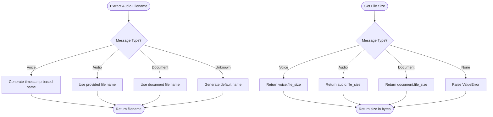

# Data Flow

<cite>
**Referenced Files in This Document**   
- [audio_utils.py](file://src/audio_utils.py)
- [parser.py](file://src/parser.py)
- [rag_persistence.py](file://src/rag_persistence.py)
- [storage.py](file://src/storage.py)
- [db_handler/db.py](file://src/db_handler/db.py)
- [analysis.py](file://src/analysis.py)
- [main.py](file://src/main.py)
- [handlers.py](file://src/handlers.py)
</cite>

## Table of Contents
1. [Introduction](#introduction)
2. [Project Structure](#project-structure)
3. [Core Components](#core-components)
4. [Architecture Overview](#architecture-overview)
5. [Detailed Component Analysis](#detailed-component-analysis)
6. [Data Flow: Happy Path](#data-flow-happy-path)
7. [Data Flow: Error Handling and Retry Mechanisms](#data-flow-error-handling-and-retry-mechanisms)
8. [Performance Considerations](#performance-considerations)
9. [Conclusion](#conclusion)

## Introduction
VoxPersona is an AI-powered voice analysis platform that enables automated transcription, content analysis, and report generation from audio inputs. This document provides a comprehensive end-to-end data flow analysis, tracing the journey of an audio file from Telegram upload to final report delivery. The system leverages OpenAI Whisper for transcription, a RAG-based retrieval system with FAISS and SentenceTransformers for contextual analysis, and PostgreSQL for structured data persistence. The flow includes preprocessing, parsing, storage, retrieval, and feedback loops, with robust error handling and performance optimization strategies.

## Project Structure
The project follows a modular structure with clear separation of concerns. Core application logic resides in the `src/` directory, while prompts are organized by scenario in dedicated folders. Configuration, database handling, and utility functions are encapsulated in individual modules.

**Diagram sources**
- [src/audio_utils.py](file://src/audio_utils.py)
- [src/parser.py](file://src/parser.py)
- [src/rag_persistence.py](file://src/rag_persistence.py)
- [src/storage.py](file://src/storage.py)
- [src/db_handler/db.py](file://src/db_handler/db.py)

**Section sources**
- [src/audio_utils.py](file://src/audio_utils.py)
- [src/parser.py](file://src/parser.py)
- [src/rag_persistence.py](file://src/rag_persistence.py)
- [src/storage.py](file://src/storage.py)
- [src/db_handler/db.py](file://src/db_handler/db.py)

## Core Components
The core components of VoxPersona include audio preprocessing, transcription, text parsing, RAG-based context retrieval, vector and metadata storage, and structured database operations. Each component plays a critical role in transforming raw audio into actionable insights.

**Section sources**
- [audio_utils.py](file://src/audio_utils.py#L1-L50)
- [parser.py](file://src/parser.py#L1-L175)
- [rag_persistence.py](file://src/rag_persistence.py#L1-L37)
- [storage.py](file://src/storage.py#L1-L310)
- [db_handler/db.py](file://src/db_handler/db.py#L1-L399)

## Architecture Overview
The system architecture is event-driven, initiated by a Telegram message containing an audio file. The bot processes the file through a pipeline involving format validation, transcription, parsing, RAG retrieval, and report generation. Results are stored in both vector and relational databases for future retrieval and analysis.

**Diagram sources**
- [audio_utils.py](file://src/audio_utils.py#L1-L50)
- [analysis.py](file://src/analysis.py)
- [parser.py](file://src/parser.py#L1-L175)
- [rag_persistence.py](file://src/rag_persistence.py#L1-L37)
- [storage.py](file://src/storage.py#L1-L310)
- [db_handler/db.py](file://src/db_handler/db.py#L1-L399)

## Detailed Component Analysis

### Audio Processing and Transcription
The audio processing pipeline begins with `audio_utils.py`, which handles file validation, naming, and size extraction. It interfaces with `analysis.py` to perform transcription via the OpenAI Whisper API.

#### Audio Utility Functions

**Diagram sources**
- [audio_utils.py](file://src/audio_utils.py#L1-L50)

**Section sources**
- [audio_utils.py](file://src/audio_utils.py#L1-L50)

### Text Parsing and Structuring
The `parser.py` module parses structured text input (e.g., metadata accompanying audio) into a standardized dictionary format. It normalizes building types, parses dates, and extracts key information based on the scenario (design or interview).

#### Parsing Logic Flow

**Diagram sources**
- [parser.py](file://src/parser.py#L1-L175)

**Section sources**
- [parser.py](file://src/parser.py#L1-L175)

### RAG System and Context Retrieval
The RAG system, managed by `rag_persistence.py`, handles the loading and saving of FAISS vector indices. These indices are created using SentenceTransformers embeddings and are used for semantic retrieval during analysis.

#### RAG Persistence Workflow

**Diagram sources**
- [rag_persistence.py](file://src/rag_persistence.py#L1-L37)
- [main.py](file://src/main.py#L1-L95)

**Section sources**
- [rag_persistence.py](file://src/rag_persistence.py#L1-L37)

### Vector and Metadata Storage
The `storage.py` module manages both in-memory vector databases and persistent storage operations. It creates FAISS indices from markdown text and handles safe filename generation for cross-platform compatibility.

#### Vector Database Creation

**Diagram sources**
- [storage.py](file://src/storage.py#L1-L310)

**Section sources**
- [storage.py](file://src/storage.py#L1-L310)

### Structured Data Storage
The `db_handler/db.py` module provides a transactional interface to PostgreSQL, handling CRUD operations for entities like employees, clients, places, and audits. It uses decorators for database transaction management.

#### Database Transaction Pattern

**Diagram sources**
- [db_handler/db.py](file://src/db_handler/db.py#L1-L399)

**Section sources**
- [db_handler/db.py](file://src/db_handler/db.py#L1-L399)

## Data Flow: Happy Path
This section traces the complete journey of an audio file through the system under ideal conditions.

**Diagram sources**
- [audio_utils.py](file://src/audio_utils.py#L1-L50)
- [parser.py](file://src/parser.py#L1-L175)
- [rag_persistence.py](file://src/rag_persistence.py#L1-L37)
- [storage.py](file://src/storage.py#L1-L310)
- [db_handler/db.py](file://src/db_handler/db.py#L1-L399)

## Data Flow: Error Handling and Retry Mechanisms
The system implements robust error handling at each stage, with logging and non-blocking failure recovery.

**Diagram sources**
- [audio_utils.py](file://src/audio_utils.py#L1-L50)
- [parser.py](file://src/parser.py#L1-L175)
- [rag_persistence.py](file://src/rag_persistence.py#L1-L37)
- [storage.py](file://src/storage.py#L1-L310)
- [db_handler/db.py](file://src/db_handler/db.py#L1-L399)

**Section sources**
- [audio_utils.py](file://src/audio_utils.py#L1-L50)
- [parser.py](file://src/parser.py#L1-L175)
- [rag_persistence.py](file://src/rag_persistence.py#L1-L37)
- [storage.py](file://src/storage.py#L1-L310)
- [db_handler/db.py](file://src/db_handler/db.py#L1-L399)

## Performance Considerations
The system faces potential I/O bottlenecks in audio transcription, vector index loading, and database operations. Key optimization strategies include:

- **Caching**: RAG indices are loaded once and reused, with periodic persistence to disk.
- **Batching**: Database operations are wrapped in transactions to minimize round trips.
- **Asynchronous Processing**: RAG initialization runs in the background without blocking bot startup.
- **Efficient Text Splitting**: Markdown content is split intelligently to balance chunk size and semantic coherence.
- **Connection Pooling**: PostgreSQL connections are managed efficiently through context managers.

The use of `nest_asyncio` allows background tasks like RAG loading and periodic saving to coexist with the Telegram bot's event loop, improving responsiveness.

**Section sources**
- [main.py](file://src/main.py#L1-L95)
- [rag_persistence.py](file://src/rag_persistence.py#L1-L37)
- [storage.py](file://src/storage.py#L1-L310)
- [db_handler/db.py](file://src/db_handler/db.py#L1-L399)

## Conclusion
VoxPersona implements a robust, end-to-end pipeline for transforming audio inputs into structured analytical reports. The system effectively integrates multiple AI services, vector databases, and relational storage with careful attention to error handling and performance. By leveraging asynchronous processing, transactional integrity, and semantic retrieval, it provides a scalable solution for voice-based data analysis. Future improvements could include streaming transcription, enhanced retry logic with exponential backoff, and more sophisticated caching mechanisms for frequently accessed reports.