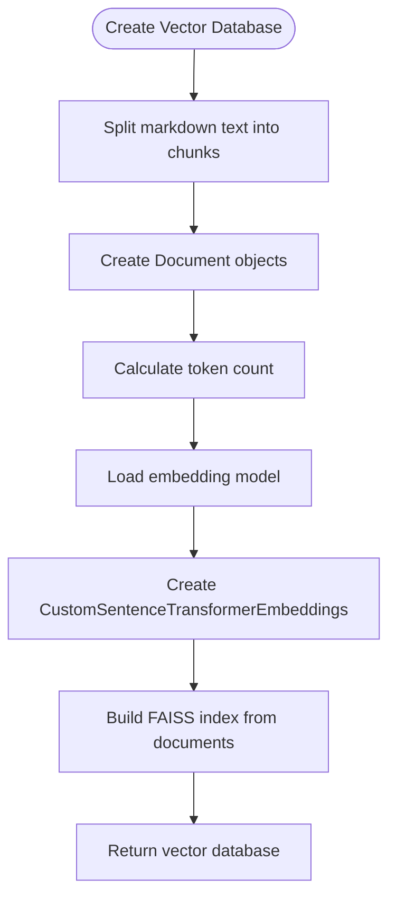
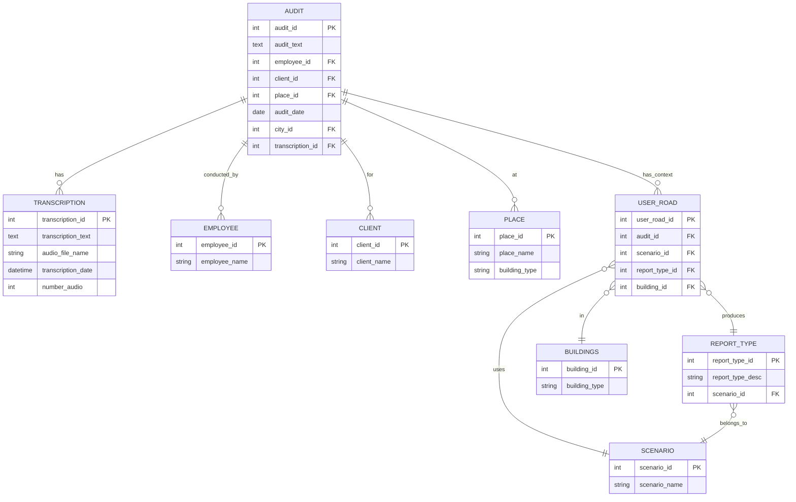
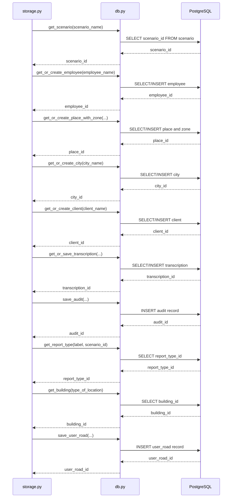
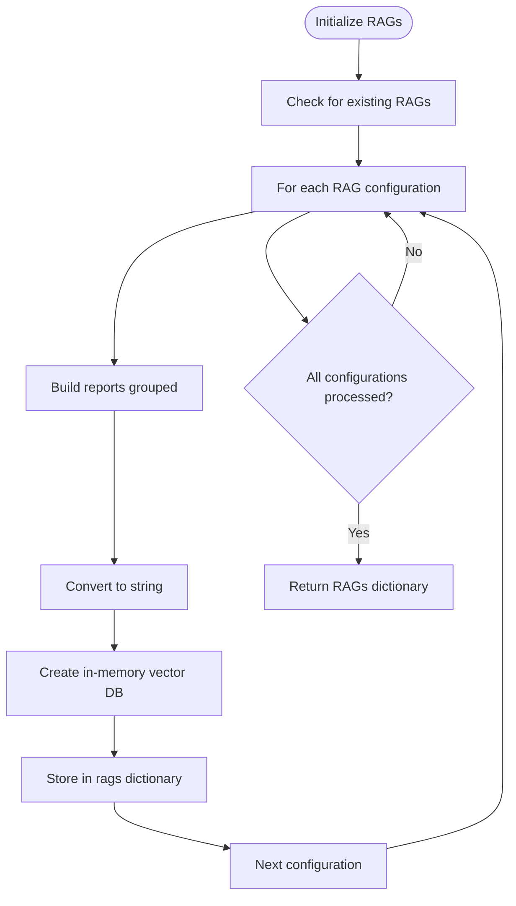

# Data Persistence

<cite>
**Referenced Files in This Document**   
- [src/storage.py](file://src/storage.py)
- [src/db_handler/db.py](file://src/db_handler/db.py)
- [src/datamodels.py](file://src/datamodels.py)
- [src/run_analysis.py](file://src/run_analysis.py)
</cite>

## Table of Contents
1. [Introduction](#introduction)
2. [Core Data Storage Components](#core-data-storage-components)
3. [Entity Relationships and Data Models](#entity-relationships-and-data-models)
4. [Transactional Workflows and Atomicity](#transactional-workflows-and-atomicity)
5. [Database Schema and Indexing Strategy](#database-schema-and-indexing-strategy)
6. [Data Lifecycle Management](#data-lifecycle-management)
7. [Performance Optimization and Caching](#performance-optimization-and-caching)
8. [Error Handling and Data Integrity](#error-handling-and-data-integrity)
9. [Backup and Maintenance](#backup-and-maintenance)
10. [Conclusion](#conclusion)

## Introduction

The VoxPersona application implements a robust data persistence layer that manages both structured metadata in PostgreSQL and unstructured data such as audio transcripts and vector embeddings. This documentation provides a comprehensive analysis of the data storage architecture, focusing on the interaction between `storage.py`, `db_handler/db.py`, `datamodels.py`, and `run_analysis.py`. The system ensures data integrity through transactional workflows, maintains referential integrity via foreign key constraints, and optimizes query performance through strategic indexing and caching.

**Section sources**
- [src/storage.py](file://src/storage.py#L1-L309)
- [src/db_handler/db.py](file://src/db_handler/db.py#L1-L398)

## Core Data Storage Components

The data persistence layer in VoxPersona consists of two primary components: a PostgreSQL database for structured metadata and an in-memory FAISS vector store for unstructured data. The `storage.py` module serves as the main interface for data storage operations, while `db_handler/db.py` provides the database abstraction layer.

### Structured Data Management

The PostgreSQL database stores metadata related to audits, transcriptions, employees, clients, places, and scenarios. The `db_handler/db.py` module implements a decorator-based transaction management system using the `@db_transaction` decorator, which ensures that database operations are executed within proper transaction boundaries.

```python
def db_transaction(commit=True):
    """
    Decorator for executing functions within a database connection context.
    
    :param commit: Flag indicating whether to commit changes. Default is True.
    """
    def decorator(func):
        @wraps(func)
        def wrapper(*args, **kwargs):
            with get_db_connection() as conn:
                with conn.cursor() as cursor:
                    result = func(cursor, *args, **kwargs)
                if commit:
                    conn.commit()
            return result
        return wrapper
    return decorator
```

This transaction management system ensures atomicity for critical operations such as creating audit records and establishing user roads.

### Unstructured Data Management

For unstructured data, VoxPersona uses FAISS (Facebook AI Similarity Search) to create in-memory vector databases from text chunks. The `create_db_in_memory` function in `storage.py` processes markdown text by splitting it into chunks and generating embeddings using a custom sentence transformer model.



**Diagram sources**
- [src/storage.py](file://src/storage.py#L35-L85)

**Section sources**
- [src/storage.py](file://src/storage.py#L35-L85)
- [src/utils.py](file://src/utils.py)

## Entity Relationships and Data Models

The data model in VoxPersona is defined across multiple entities with well-defined relationships. The `datamodels.py` file contains mapping dictionaries that establish the semantic relationships between different data categories.

### Core Entities

The primary entities in the system include:

- **Audit**: Represents an analysis session with associated metadata
- **Transcription**: Stores audio transcription text and file information
- **Employee**: Represents individuals involved in audits
- **Client**: Organizations or entities being audited
- **Place**: Physical locations where audits occur
- **Scenario**: Types of analysis (e.g., "Design", "Interview")
- **ReportType**: Categories of reports generated from analysis
- **Building**: Types of facilities (e.g., "Hotel", "Restaurant", "Spa")

### Relationship Mapping

The entity relationships are established through foreign key constraints in the database schema. The `user_road` table serves as a junction table that connects audits with their corresponding scenarios, report types, and buildings, creating a complete audit context.



**Diagram sources**
- [src/db_handler/db.py](file://src/db_handler/db.py#L150-L350)
- [src/datamodels.py](file://src/datamodels.py#L1-L71)

**Section sources**
- [src/db_handler/db.py](file://src/db_handler/db.py#L150-L350)
- [src/datamodels.py](file://src/datamodels.py#L1-L71)

## Transactional Workflows and Atomicity

The system ensures data consistency through carefully designed transactional workflows, particularly in the audit creation process. The `save_user_input_to_db` function in `storage.py` orchestrates a multi-step transaction that creates related records across multiple tables.

### Audit Creation Workflow

The audit creation process follows a strict sequence of operations that must succeed atomically:

1. Retrieve or create scenario reference
2. Retrieve or create employee, place, city, and client references
3. Retrieve or save transcription record
4. Create audit record
5. Retrieve report type and building references
6. Create user road record establishing the complete context



**Diagram sources**
- [src/storage.py](file://src/storage.py#L87-L170)
- [src/db_handler/db.py](file://src/db_handler/db.py#L150-L350)

**Section sources**
- [src/storage.py](file://src/storage.py#L87-L170)
- [src/db_handler/db.py](file://src/db_handler/db.py#L150-L350)

## Database Schema and Indexing Strategy

The database schema is optimized for query performance with appropriate indexing on frequently accessed fields. The primary keys are implemented as auto-incrementing integers, and foreign key constraints ensure referential integrity.

### Primary Keys and Indexes

The following indexes are strategically placed to optimize query performance:

- **client_name** in the client table (unique index)
- **employee_name** in the employee table (unique index)
- **place_name** and **building_type** in the place table (composite index)
- **city_name** in the city table (unique index)
- **scenario_name** in the scenario table (unique index)
- **report_type_desc** and **scenario_id** in the report_type table (composite index)
- **building_type** in the buildings table (unique index)
- **transcription_text** and **audio_file_name** in the transcription table (composite index)

### Foreign Key Constraints

The schema enforces referential integrity through foreign key constraints:

- audit.employee_id references employee.employee_id
- audit.client_id references client.client_id
- audit.place_id references place.place_id
- audit.city_id references city.city_id
- audit.transcription_id references transcription.transcription_id
- user_road.audit_id references audit.audit_id
- user_road.scenario_id references scenario.scenario_id
- user_road.report_type_id references report_type.report_type_id
- user_road.building_id references buildings.building_id

These constraints prevent orphaned records and maintain data consistency across the system.

**Section sources**
- [src/db_handler/db.py](file://src/db_handler/db.py#L150-L350)

## Data Lifecycle Management

The system implements comprehensive data lifecycle management practices to ensure efficient storage utilization and data availability.

### Audio File Retention

Audio files are stored temporarily during processing and are subject to a retention policy. The system provides utility functions for cleaning up temporary files and directories:

```python
def delete_tmp_dir(tmp_dir: str):
    """Remove temporary directory"""
    try:
        shutil.rmtree(tmp_dir)
        logging.info(f"Temporary directory {tmp_dir} deleted.")
    except Exception as e:
        logging.error(f"Error deleting temporary directory: {e}")

def delete_tmp_file(tmp_file: str):
    """Remove temporary file"""
    try:
        if os.path.exists(tmp_file):
            os.remove(tmp_file)
    except Exception as e:
        logging.error(f"Error deleting temporary file: {e}")
```

### Data Archiving Strategy

The system does not currently implement automated data archiving, but the database schema supports it through timestamp fields (e.g., audit_date, transcription_date). Future enhancements could include automated archiving of older records to cold storage based on configurable retention policies.

**Section sources**
- [src/storage.py](file://src/storage.py#L172-L190)

## Performance Optimization and Caching

The system employs several performance optimization strategies, including connection pooling, query optimization, and result caching.

### Connection Pooling

While not explicitly implemented in the provided code, PostgreSQL connection pooling is recommended for production environments. The `get_db_connection()` function serves as a natural integration point for connection pooling libraries such as `psycopg2.pool`.

### Query Optimization

The system uses parameterized queries to prevent SQL injection and improve query plan caching. The `_SQL` query in `storage.py` is a complex JOIN operation that retrieves comprehensive audit information in a single query, reducing round trips to the database.

```python
_SQL = """
WITH base AS (
    SELECT
        a.transcription_id,
        a.audit_date,
        t.audio_file_name,
        t.number_audio,
        a.audit_id,
        a.audit AS audit_text,
        e.employee_name,
        c.client_name,
        p.place_name,
        p.building_type,
        (
            SELECT json_agg(z.zone_name)
            FROM   place_zone pz
            JOIN   zone z ON z.zone_id = pz.zone_id
            WHERE  pz.place_id = p.place_id
        ) AS zone_names,
        ci.city_name,
        s.scenario_name,
        rt.report_type_desc
    FROM audit a
    JOIN transcription t ON t.transcription_id = a.transcription_id
    JOIN user_road ur ON ur.audit_id = a.audit_id
    JOIN scenario s ON s.scenario_id = ur.scenario_id
    JOIN report_type rt ON rt.report_type_id = ur.report_type_id
    LEFT JOIN employee e ON e.employee_id = a.employee_id
    LEFT JOIN client c ON c.client_id = a.client_id
    LEFT JOIN place p ON p.place_id = a.place_id
    LEFT JOIN city ci ON ci.city_id = a.city_id
    WHERE
      s.scenario_name = %(scenario_name)s
      AND (%(report_type)s IS NULL OR rt.report_type_desc = %(report_type)s)
)
SELECT *
FROM base
ORDER BY transcription_id, report_type_desc, audit_id;
"""
```

This query uses a Common Table Expression (CTE) to organize the data and includes appropriate JOINs and filtering conditions to minimize data transfer.

### Result Caching

The system implements caching through the RAG (Retrieval-Augmented Generation) initialization process in `run_analysis.py`. The `init_rags` function pre-builds vector databases for frequently accessed data, reducing the need for repeated database queries.



**Diagram sources**
- [src/run_analysis.py](file://src/run_analysis.py#L10-L45)

**Section sources**
- [src/run_analysis.py](file://src/run_analysis.py#L10-L45)

## Error Handling and Data Integrity

The system implements comprehensive error handling to maintain data integrity and provide meaningful feedback during database operations.

### Input Validation

The `validate_ids` function in `db_handler/db.py` ensures that referenced IDs exist in their respective tables before proceeding with operations:

```python
def validate_ids(cursor, building_id: int, report_type_id: int):
    """
    Validates that the given building_id and report_type_id exist in their respective tables.
    Raises an exception if either ID is invalid.
    """
    # Validate building_id
    cursor.execute('SELECT 1 FROM buildings WHERE building_id = %s', (building_id,))
    if not cursor.fetchone():
        logging.error(f"Invalid building_id: {building_id}")
        raise ValueError(f"Invalid building_id: {building_id}")

    # Validate report_type_id
    cursor.execute('SELECT 1 FROM report_type WHERE report_type_id = %s', (report_type_id,))
    if not cursor.fetchone():
        logging.error(f"Invalid report_type_id: {report_type_id}")
        raise ValueError(f"Invalid report_type_id: {report_type_id}")
```

### Transaction Safety

The `@db_transaction` decorator ensures that database operations are executed within proper transaction boundaries. When `commit=True`, successful operations are automatically committed, while exceptions trigger a rollback through the context manager.

### Error Recovery

The system implements error recovery mechanisms in critical paths. For example, the `run_analysis_pass` function in `run_analysis.py` includes comprehensive exception handling to ensure that errors in analysis do not leave the system in an inconsistent state:

```python
def run_analysis_pass(
    chat_id: int,
    source_text: str,
    label: str,
    scenario_name: str,
    data: dict,
    prompts: list[tuple[str, int]],
    app: Client,
    transcription_text: str,
    is_show_analysis: bool=True
) -> str:
    # ... [setup code]
    try:
        audit_text = analyze_methodology(source_text, prompts)
        # ... [success handling]
        save_user_input_to_db(transcript=transcription_text, scenario_name=scenario_name, data=data, label=label, audit_text=audit_text)
    except OpenAIPermissionError:
        logging.exception("Invalid API_KEY?")
        app.edit_message_text(chat_id, msg_.id, "🚫 Error: LLM unavailable (key/region).")
    except Exception as e:
        logging.exception("Analysis error")
        app.edit_message_text(chat_id, msg_.id, f"❌ Error: {e}")
        audit_text = ""
    finally:
        st_ev.set()
        sp_th.join()
        try:
            app.delete_messages(chat_id, msg_.id)
        except:
            pass
    return audit_text
```

**Section sources**
- [src/db_handler/db.py](file://src/db_handler/db.py#L200-L225)
- [src/run_analysis.py](file://src/run_analysis.py#L150-L200)

## Backup and Maintenance

While the provided code does not include explicit backup functionality, the database schema and configuration support standard PostgreSQL backup and maintenance procedures.

### Recommended Backup Strategy

A comprehensive backup strategy should include:

1. **Regular automated backups**: Using `pg_dump` or similar tools to create complete database backups
2. **Point-in-time recovery**: Configuring WAL (Write-Ahead Logging) archiving for granular recovery
3. **Offsite storage**: Storing backups in geographically distributed locations
4. **Backup verification**: Regularly testing backup restoration procedures

### Index Optimization

The system would benefit from periodic index optimization to maintain query performance:

```sql
-- Rebuild fragmented indexes
REINDEX TABLE audit;
REINDEX TABLE transcription;
REINDEX TABLE user_road;

-- Update statistics for query planner
ANALYZE;
```

These operations should be scheduled during low-usage periods to minimize impact on application performance.

## Conclusion

The data persistence layer in VoxPersona demonstrates a well-architected approach to managing both structured and unstructured data. By combining PostgreSQL for relational data integrity with FAISS for vector similarity search, the system effectively supports complex audit and analysis workflows. The transactional design ensures data consistency, while the indexing strategy and caching mechanisms optimize query performance. Future enhancements could include more sophisticated data retention policies, automated backup procedures, and enhanced monitoring for database health.

The modular design of the persistence layer, with clear separation between storage interfaces and database implementation, allows for flexibility in adapting to changing requirements while maintaining data integrity and system reliability.