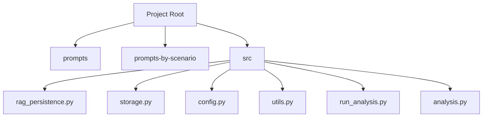
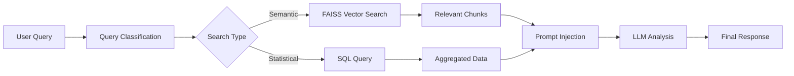
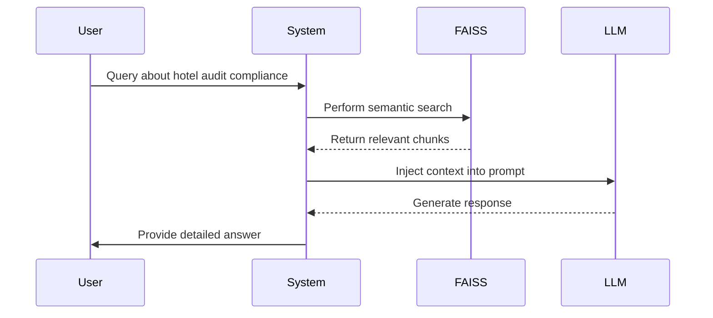
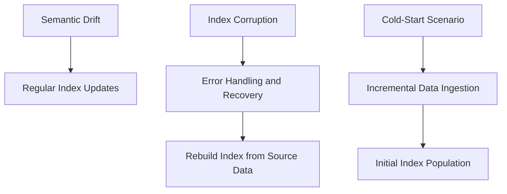
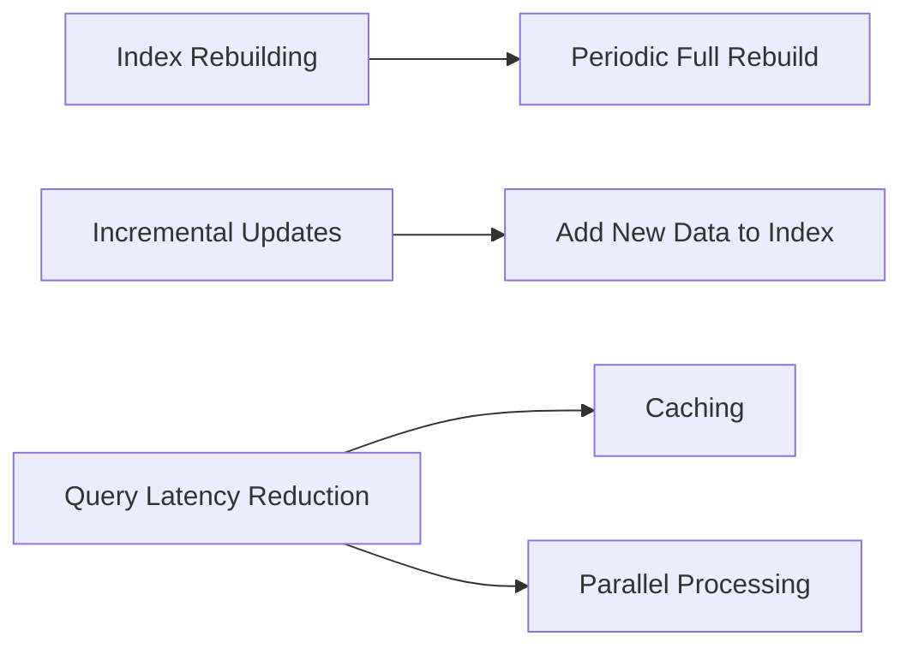

# RAG System

<cite>
**Referenced Files in This Document**   
- [rag_persistence.py](file://src/rag_persistence.py#L0-L36)
- [storage.py](file://src/storage.py#L0-L309)
- [config.py](file://src/config.py#L0-L93)
- [utils.py](file://src/utils.py#L0-L105)
- [run_analysis.py](file://src/run_analysis.py#L0-L249)
- [analysis.py](file://src/analysis.py#L130-L172)
- [main.py](file://src/main.py#L0-L74)
</cite>

## Table of Contents
1. [Introduction](#introduction)
2. [Project Structure](#project-structure)
3. [Core Components](#core-components)
4. [Architecture Overview](#architecture-overview)
5. [Detailed Component Analysis](#detailed-component-analysis)
6. [RAG Initialization and Persistence](#rag-initialization-and-persistence)
7. [Vector Index Management](#vector-index-management)
8. [Retrieval Process](#retrieval-process)
9. [Prompt Injection and LLM Guidance](#prompt-injection-and-llm-guidance)
10. [Configuration Options](#configuration-options)
11. [Use Case Examples](#use-case-examples)
12. [Challenges and Solutions](#challenges-and-solutions)
13. [Optimization Strategies](#optimization-strategies)
14. [Conclusion](#conclusion)

## Introduction
The Retrieval-Augmented Generation (RAG) system in VoxPersona enhances the accuracy and relevance of Large Language Model (LLM) responses by integrating semantic search over historical audit and interview data. This documentation details the architecture, implementation, and operational aspects of the RAG system, focusing on FAISS vector indices, SentenceTransformers embeddings, MinIO and PostgreSQL integration, and prompt engineering strategies.

## Project Structure
The project is organized into several key directories:
- `prompts/`: Contains base prompt templates for various analysis scenarios.
- `prompts-by-scenario/`: Houses scenario-specific prompts, including JSON and non-building variants.
- `src/`: Core source code including RAG persistence, storage, analysis, and configuration modules.



**Diagram sources**
- [rag_persistence.py](file://src/rag_persistence.py#L0-L36)
- [storage.py](file://src/storage.py#L0-L309)

## Core Components
The RAG system in VoxPersona consists of several interconnected components:
- **rag_persistence.py**: Manages the saving and loading of FAISS vector indices.
- **storage.py**: Handles data persistence and retrieval from MinIO and PostgreSQL.
- **config.py**: Defines configuration parameters and global settings.
- **utils.py**: Provides utility functions for text processing and embedding generation.
- **run_analysis.py**: Orchestrates the RAG initialization and analysis workflows.
- **analysis.py**: Implements the core retrieval and generation logic.

**Section sources**
- [rag_persistence.py](file://src/rag_persistence.py#L0-L36)
- [storage.py](file://src/storage.py#L0-L309)
- [config.py](file://src/config.py#L0-L93)
- [utils.py](file://src/utils.py#L0-L105)
- [run_analysis.py](file://src/run_analysis.py#L0-L249)
- [analysis.py](file://src/analysis.py#L130-L172)

## Architecture Overview
The RAG system architecture involves the following steps:
1. **Data Ingestion**: Audio and text files are processed and transcribed.
2. **Index Creation**: Historical audit and interview data are vectorized and stored in FAISS indices.
3. **Persistence**: FAISS indices are saved to disk and synchronized with MinIO and PostgreSQL.
4. **Retrieval**: User queries are matched against the vector indices using semantic search.
5. **Generation**: Retrieved context is injected into prompts to guide LLM analysis.



**Diagram sources**
- [run_analysis.py](file://src/run_analysis.py#L0-L249)
- [analysis.py](file://src/analysis.py#L130-L172)

## Detailed Component Analysis

### RAG Initialization and Persistence
The `rag_persistence.py` module is responsible for persisting and loading FAISS vector indices. It uses the `save_rag_indices` and `load_rag_indices` functions to manage the lifecycle of the indices.

```python
def save_rag_indices(rags: dict) -> None:
    """Persist FAISS indices to disk."""
    for name, index in rags.items():
        if not hasattr(index, "save_local"):
            continue
        path = os.path.join(RAG_INDEX_DIR, safe_filename(name))
        shutil.rmtree(path, ignore_errors=True)
        index.save_local(path)

def load_rag_indices() -> dict:
    """Load FAISS indices from disk."""
    model = get_embedding_model()
    embeddings = CustomSentenceTransformerEmbeddings(model)
    rags = {}
    for name in os.listdir(RAG_INDEX_DIR):
        path = os.path.join(RAG_INDEX_DIR, name)
        if not os.path.isdir(path):
            continue
        try:
            rags[name] = FAISS.load_local(path, embeddings)
        except Exception:
            continue
    return rags
```

**Section sources**
- [rag_persistence.py](file://src/rag_persistence.py#L0-L36)

### Vector Index Management
The `storage.py` module includes the `create_db_in_memory` function, which creates an in-memory FAISS index from markdown text. This function splits the text into chunks, generates embeddings, and constructs the vector store.

```python
def create_db_in_memory(markdown_text: str):
    """Создает векторную базу данных в памяти без сохранения на диск"""
    logging.info("Создаем векторную базу данных в памяти...")
    chunks = split_markdown_text(markdown_text)
    chunks_documents = [Document(page_content=chunk) for chunk in chunks]
    model = get_embedding_model()
    embedding = CustomSentenceTransformerEmbeddings(model)
    db_index = FAISS.from_documents(documents=chunks_documents, embedding=embedding)
    return db_index
```

**Section sources**
- [storage.py](file://src/storage.py#L49-L83)

### Retrieval Process
The retrieval process involves matching parsed interview or audit text against historical knowledge using semantic search. The `generate_db_answer` function in `analysis.py` performs this task by searching for similar documents in the FAISS index.

```python
def generate_db_answer(query: str, db_index, k: int=15, verbose: bool=True, model: str=REPORT_MODEL_NAME):
    system_prompt = """Перед тобой отчеты из бд, касающиеся анализа проведенных интервью с клиентами..."""
    similar_documents = db_index.similarity_search(query, k=k)
    message_content = re.sub(r'\n{2}', ' ', '\n '.join([f'Отчет № {i+1}:\n' + doc.page_content for i, doc in enumerate(similar_documents)]))
    total_tokens = count_tokens(system_prompt) + count_tokens(message_content) + count_tokens(query)
    if verbose:
        logging.info("\nНайденные релевантные отчеты:")
    return message_content
```

**Section sources**
- [analysis.py](file://src/analysis.py#L130-L149)

### Prompt Injection and LLM Guidance
The `prompts/` and `prompts-by-scenario/` directories contain various prompt templates that guide the LLM analysis. These prompts are categorized by scenario (e.g., interview, design) and report type (e.g., compliance, methodology).

```mermaid
graph TD
A[Prompts Directory] --> B[design_audit_methodology.txt]
A --> C[health_center_audit_compliance.txt]
A --> D[hotel_audit_compliance.txt]
A --> E[interview_employee_performance.txt]
A --> F[interview_factors_restaurant.txt]
A --> G[interview_general_factors_health_center.txt]
A --> H[interview_general_factors_hotel.txt]
A --> I[interview_general_factors_restaurant.txt]
A --> J[interview_methodology.txt]
A --> K[interview_specific_factors_health_center.txt]
A --> L[interview_specific_factors_hotel.txt]
A --> M[interview_specific_factors_restaurant.txt]
A --> N[quality_decision_links.txt]
A --> O[restaurant_audit_compliance.txt]
A --> P[structured_health_center_audit.txt]
A --> Q[structured_hotel_audit.txt]
A --> R[structured_restaurant_audit.txt]
```



**Diagram sources**
- [prompts](file://prompts)

### Configuration Options
The `config.py` file defines various configuration options, including similarity thresholds, top-k results, and embedding model selection. These settings can be adjusted to optimize the RAG system's performance.

```python
EMBEDDING_MODEL = None
OPENAI_BASE_URL = os.getenv("OPENAI_BASE_URL")
OPENAI_API_KEY = os.getenv("OPENAI_API_KEY")
TRANSCRIBATION_MODEL_NAME = os.getenv("TRANSCRIBATION_MODEL_NAME")
ANTHROPIC_API_KEY = os.getenv("ANTHROPIC_API_KEY")
REPORT_MODEL_NAME = os.getenv("REPORT_MODEL_NAME")
RAG_INDEX_DIR = "/app/rag_indices"
os.makedirs(RAG_INDEX_DIR, exist_ok=True)
```

**Section sources**
- [config.py](file://src/config.py#L0-L93)

### Use Case Examples
The RAG system supports various use cases, including hotel, restaurant, and health center scenarios. For example, a query about hotel audit compliance would retrieve relevant historical data and generate a detailed response.



**Diagram sources**
- [run_analysis.py](file://src/run_analysis.py#L0-L249)
- [analysis.py](file://src/analysis.py#L130-L172)

### Challenges and Solutions
The RAG system faces several challenges, including semantic drift, index corruption, and cold-start scenarios. These issues are addressed through regular index updates, error handling, and incremental data ingestion.



**Diagram sources**
- [rag_persistence.py](file://src/rag_persistence.py#L0-L36)
- [storage.py](file://src/storage.py#L0-L309)

### Optimization Strategies
To optimize the RAG system, consider the following strategies:
- **Index Rebuilding**: Periodically rebuild the FAISS indices to incorporate new data.
- **Incremental Updates**: Update the indices incrementally to reduce latency.
- **Query Latency Reduction**: Use caching and parallel processing to speed up queries.



**Diagram sources**
- [rag_persistence.py](file://src/rag_persistence.py#L0-L36)
- [run_analysis.py](file://src/run_analysis.py#L0-L249)

## Conclusion
The RAG system in VoxPersona effectively combines semantic search with LLM analysis to provide accurate and contextually relevant responses. By leveraging FAISS vector indices and SentenceTransformers embeddings, the system can efficiently retrieve and utilize historical knowledge. Proper configuration and optimization ensure high performance and reliability across various use cases.