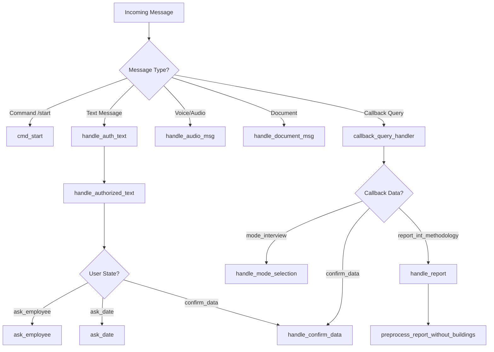
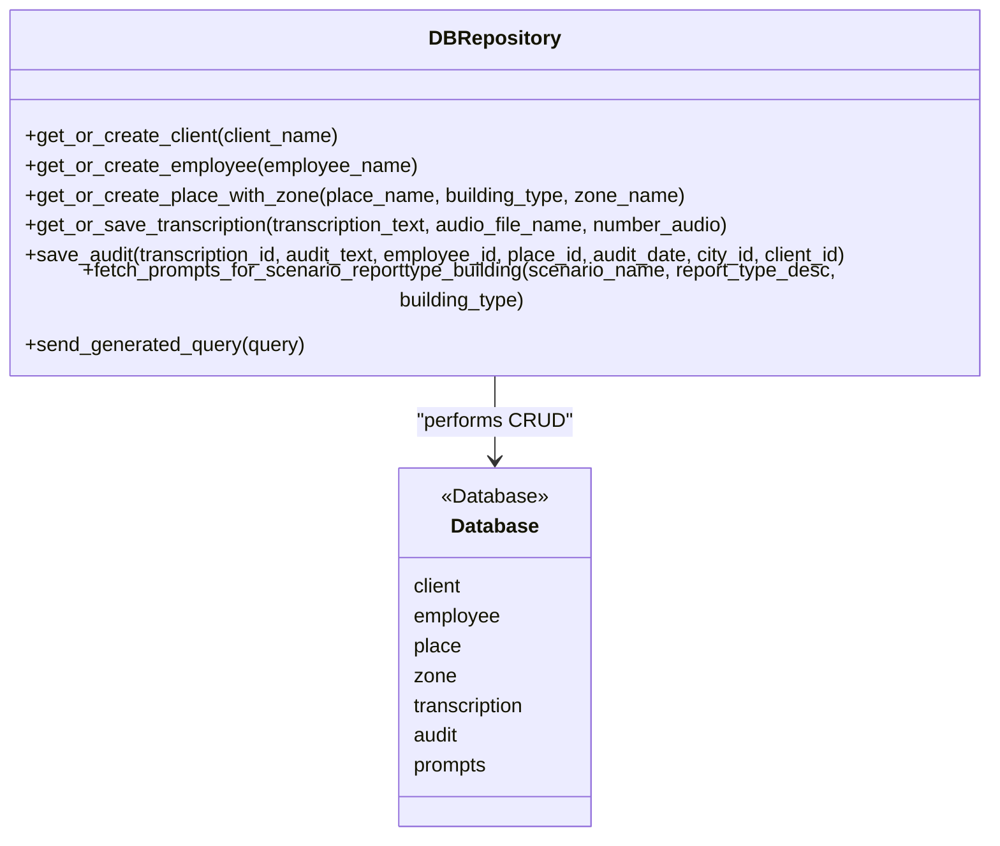
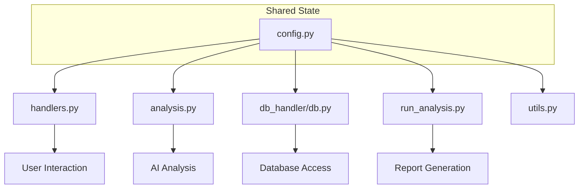
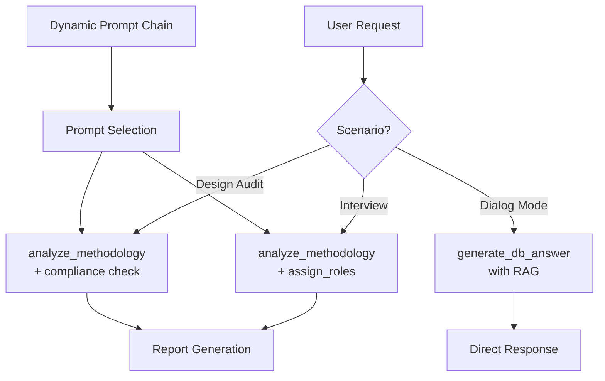

# Design Patterns

<cite>
**Referenced Files in This Document**   
- [handlers.py](file://src/handlers.py#L0-L805)
- [db.py](file://src/db_handler/db.py#L0-L399)
- [config.py](file://src/config.py#L0-L94)
- [analysis.py](file://src/analysis.py#L0-L491)
</cite>

## Table of Contents
1. [Introduction](#introduction)
2. [Handler Pattern in handlers.py](#handler-pattern-in-handlerspy)
3. [Repository Pattern in db_handler/db.py](#repository-pattern-in-db_handlerdbpy)
4. [Singleton Pattern in config.py](#singleton-pattern-in-configpy)
5. [Strategy Pattern in analysis.py](#strategy-pattern-in-analysisplay)
6. [Benefits of Design Patterns](#benefits-of-design-patterns)
7. [Potential Anti-Patterns and Refactoring Suggestions](#potential-anti-patterns-and-refactoring-suggestions)
8. [Conclusion](#conclusion)

## Introduction
This document provides a comprehensive analysis of the design patterns implemented in the VoxPersona project. The system leverages several well-known software design patterns to ensure modularity, maintainability, and scalability. These include the Handler Pattern for routing user inputs, the Repository Pattern for abstracting database operations, the Singleton Pattern for global configuration management, and the Strategy Pattern for dynamic selection of analysis methodologies. Each pattern is examined in detail with code examples, structural diagrams, and discussions on their benefits and limitations.

## Handler Pattern in handlers.py

The Handler Pattern is implemented in `handlers.py` to manage and route incoming user messages and callback queries based on their type or command. This pattern decouples message processing logic from the main application flow, enabling clean separation of concerns and extensible command handling.

Each handler function processes a specific type of input (e.g., text, audio, document, callback) and transitions the user through a state machine defined in `user_states`. The routing is achieved via Pyrogram decorators that bind functions to message filters.



**Diagram sources**
- [handlers.py](file://src/handlers.py#L0-L805)

**Section sources**
- [handlers.py](file://src/handlers.py#L0-L805)

### Key Handler Functions
- **`cmd_start`**: Initiates the user session and checks authorization.
- **`handle_audio_msg`**: Processes voice/audio messages, transcribes them, and triggers role assignment.
- **`callback_query_handler`**: Routes callback queries (e.g., menu selections, report types).
- **`handle_authorized_text`**: Manages text input based on the user's current state in a multi-step form.

This pattern enables a scalable way to add new commands or interaction flows without modifying core routing logic.

## Repository Pattern in db_handler/db.py

The Repository Pattern is used in `db_handler/db.py` to abstract database operations and provide a clean interface for data access. It encapsulates all SQL interactions behind Python functions, isolating the rest of the application from database schema details.

The pattern is implemented using a set of functions decorated with `@db_transaction`, which ensures proper connection handling and transaction control.



**Diagram sources**
- [db.py](file://src/db_handler/db.py#L0-L399)

**Section sources**
- [db.py](file://src/db_handler/db.py#L0-L399)

### Core Repository Functions
- **`get_or_create_*`**: Ensures entities exist or creates them (e.g., client, employee, place).
- **`save_audit`**: Inserts a new audit record with references to related entities.
- **`fetch_prompts_for_scenario_reporttype_building`**: Retrieves prompts based on scenario, report type, and building type.
- **`send_generated_query`**: Executes dynamic SQL queries generated by the AI model.

The `@db_transaction` decorator manages connection lifecycle and commit/rollback behavior, enhancing code reusability and reducing boilerplate.

## Singleton Pattern in config.py

The Singleton Pattern is applied in `config.py` to manage global configuration and shared state across the application. Although Python does not enforce true singletons, the module-level variables act as a de facto singleton due to module caching.

Key global state variables include:
- `user_states`: Tracks conversation state per user (chat_id).
- `processed_texts`: Stores transcribed and processed text per session.
- `authorized_users`: Set of authorized user IDs.
- `DB_CONFIG`, `MINIO_*`, `API_*`: Configuration values loaded from environment variables.

```python
# Global state variables acting as singleton
user_states: dict[int, dict] = {}
processed_texts: dict[int, str] = {}
authorized_users = set()
active_menus: dict[int, list[int]] = {}
```

These variables are imported and shared across modules (`handlers.py`, `analysis.py`, etc.), ensuring consistent access to configuration and runtime state.



**Diagram sources**
- [config.py](file://src/config.py#L0-L94)

**Section sources**
- [config.py](file://src/config.py#L0-L94)

This pattern simplifies access to configuration and shared data but introduces potential risks of state corruption if not managed carefully.

## Strategy Pattern in analysis.py

The Strategy Pattern is implemented in `analysis.py` to dynamically select and execute different analysis methodologies based on the scenario (e.g., interview vs. design audit).

Different strategies are encapsulated in functions that can be invoked based on runtime conditions:
- **`analyze_methodology`**: Executes a sequence of prompts for methodology assessment.
- **`assign_roles`**: Applies role detection logic to interview transcripts.
- **`generate_db_answer`**: Uses RAG (Retrieval-Augmented Generation) for deep search queries.
- **`classify_report_type` / `classify_query`**: Determines the appropriate processing path.



**Diagram sources**
- [analysis.py](file://src/analysis.py#L0-L491)

**Section sources**
- [analysis.py](file://src/analysis.py#L0-L491)

### Example: Dynamic Prompt Chaining
```python
def analyze_methodology(text: str, prompt_list: list[tuple[str, int]]) -> str:
    current_response = None
    for prompt, _ in prompt_list:
        if current_response is None:
            messages = [{"role": "user", "content": f"{prompt}\n\n{text}"}]
        else:
            messages = [{"role": "user", "content": f"{prompt}\n\n{current_response}"}]
        current_response = send_msg_to_model(messages=messages)
    return current_response
```

This allows flexible composition of analysis pipelines without hardcoding logic, supporting future extensions.

## Benefits of Design Patterns

The use of design patterns in VoxPersona provides several key benefits:

- **Modularity**: Each component has a single responsibility, making the codebase easier to understand and maintain.
- **Testability**: Isolated components (e.g., repository functions) can be unit tested independently.
- **Extensibility**: New handlers, analysis strategies, or database entities can be added with minimal changes to existing code.
- **Scalability**: The handler and strategy patterns support adding new features without disrupting core logic.
- **Consistency**: The singleton configuration ensures uniform behavior across modules.

These patterns collectively enhance code quality and reduce technical debt.

## Potential Anti-Patterns and Refactoring Suggestions

Despite the effective use of design patterns, some anti-patterns and improvement opportunities exist:

### 1. Tight Coupling Between Handlers and Analysis Modules
The `handlers.py` module directly imports and calls functions from `analysis.py` (e.g., `assign_roles`, `run_analysis_with_spinner`). This creates tight coupling and reduces testability.

**Suggestion**: Introduce an interface or service layer to decouple handlers from analysis logic.

### 2. Global State Risks in config.py
The extensive use of global mutable state (`user_states`, `processed_texts`) increases the risk of race conditions and makes testing difficult.

**Suggestion**: Replace global state with a context or session manager class that can be injected where needed.

### 3. Hardcoded Paths and Configuration
File paths (e.g., `/root/Vox/VoxPersona/audio_files`) are hardcoded in `config.py`, reducing portability.

**Suggestion**: Use relative paths or environment variables for all file system references.

### 4. Lack of Error Isolation in Transaction Decorator
The `@db_transaction` decorator does not handle nested transactions or rollback on all exceptions.

**Suggestion**: Enhance the decorator to support savepoints and more granular error handling.

### 5. Callback Hell in Handler Logic
The `callback_query_handler` contains a long chain of `if-elif` statements, making it hard to extend.

**Suggestion**: Use a dictionary-based routing table or command registry pattern.

## Conclusion
VoxPersona effectively employs the Handler, Repository, Singleton, and Strategy patterns to build a modular and maintainable system. These patterns enable clean separation of concerns, promote reusability, and support future scalability. While some anti-patterns exist—particularly around global state and tight coupling—refactoring opportunities are clear and would further improve the architecture. Overall, the design demonstrates strong software engineering principles and provides a solid foundation for ongoing development.