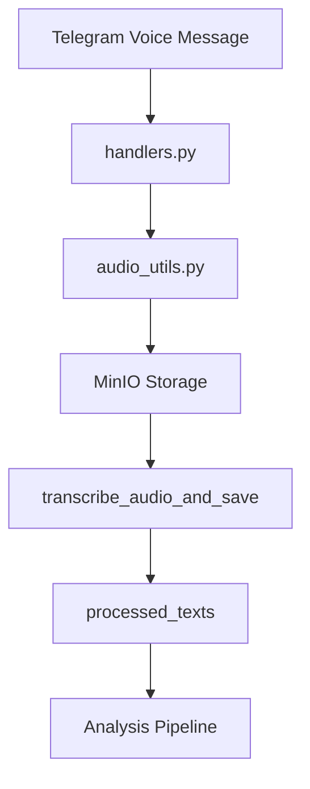
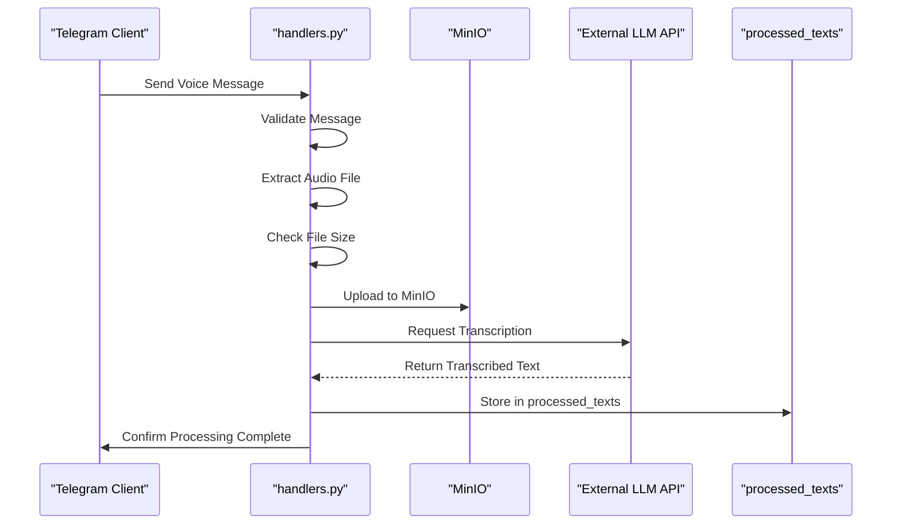
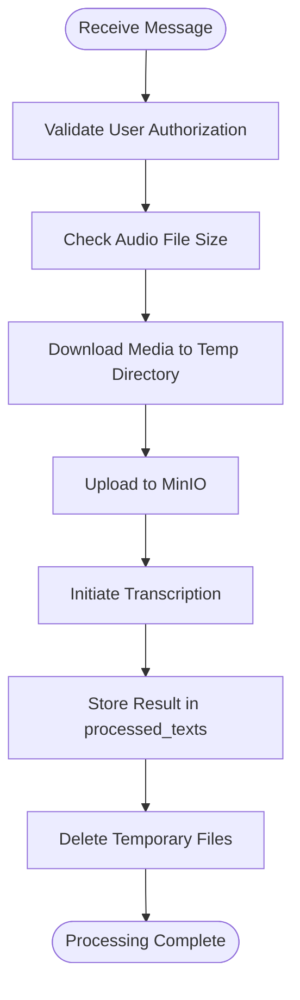
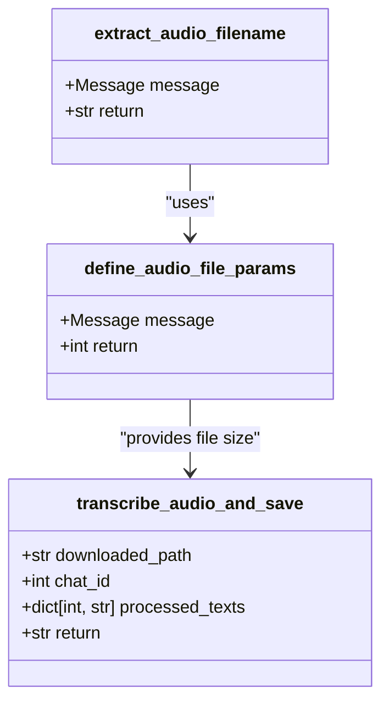
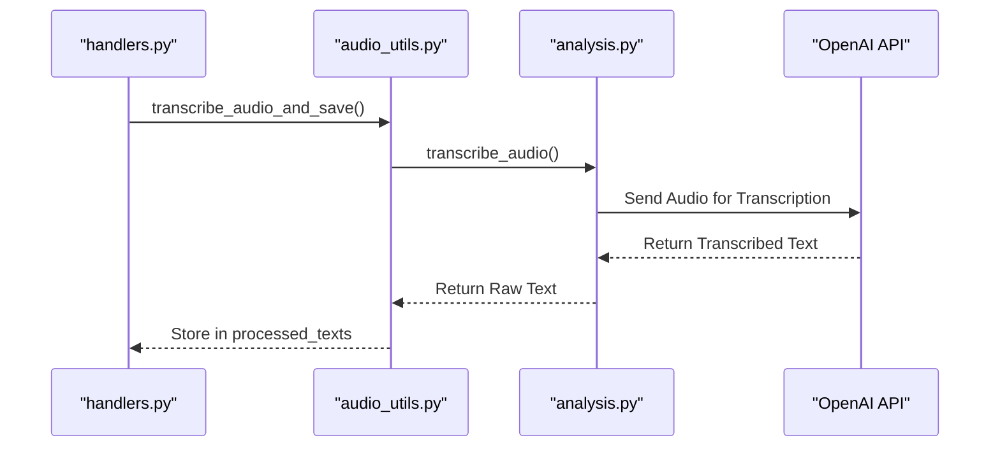
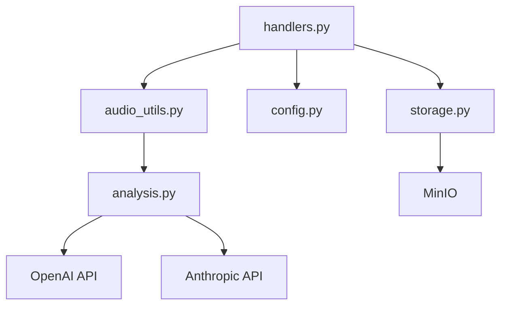

# Audio Processing Pipeline

<cite>
**Referenced Files in This Document**   
- [handlers.py](file://src/handlers.py)
- [audio_utils.py](file://src/audio_utils.py)
- [config.py](file://src/config.py)
- [storage.py](file://src/storage.py)
- [bot.py](file://src/bot.py)
- [analysis.py](file://src/analysis.py)
</cite>

## Table of Contents
1. [Introduction](#introduction)
2. [Project Structure](#project-structure)
3. [Core Components](#core-components)
4. [Architecture Overview](#architecture-overview)
5. [Detailed Component Analysis](#detailed-component-analysis)
6. [Dependency Analysis](#dependency-analysis)
7. [Performance Considerations](#performance-considerations)
8. [Troubleshooting Guide](#troubleshooting-guide)
9. [Conclusion](#conclusion)

## Introduction
The VoxPersona audio processing pipeline handles voice messages received via Telegram, processes them through transcription services, and prepares the output for downstream analysis. This document details the end-to-end flow from audio reception to transcription, including integration with external LLM APIs, error handling, preprocessing steps, and temporary storage mechanisms. The system is designed to be robust, scalable, and accessible to both beginners and developers extending its functionality.

## Project Structure
The project follows a modular structure with distinct components responsible for different aspects of the audio processing workflow. Key directories include `src` for source code, `prompts` for prompt templates, and configuration files for environment settings.

**Diagram sources**
- [handlers.py](file://src/handlers.py#L608-L666)
- [audio_utils.py](file://src/audio_utils.py#L25-L49)

**Section sources**
- [handlers.py](file://src/handlers.py#L608-L707)
- [audio_utils.py](file://src/audio_utils.py#L0-L49)

## Core Components
The core components of the audio processing pipeline include handlers for incoming messages, utilities for audio extraction and validation, and integrations with external transcription services. These components work together to ensure reliable processing of voice messages.

**Section sources**
- [handlers.py](file://src/handlers.py#L608-L707)
- [audio_utils.py](file://src/audio_utils.py#L0-L49)
- [analysis.py](file://src/analysis.py#L0-L490)

## Architecture Overview
The architecture of the audio processing pipeline involves several key stages: receiving voice messages via Telegram, downloading and validating audio files using Pyrogram, storing them in MinIO via the storage module, and initiating transcription using external LLM APIs such as OpenAI or Anthropic. Transcribed text is temporarily stored in memory before further processing.

**Diagram sources**
- [handlers.py](file://src/handlers.py#L608-L666)
- [storage.py](file://src/storage.py#L0-L309)
- [analysis.py](file://src/analysis.py#L0-L490)

## Detailed Component Analysis

### Audio Message Handling
The `handle_audio_msg` function in `handlers.py` is responsible for processing incoming voice and audio messages. It validates the user's authorization, checks the file size, downloads the media, uploads it to MinIO, and initiates transcription.

**Diagram sources**
- [handlers.py](file://src/handlers.py#L608-L666)
- [storage.py](file://src/storage.py#L0-L309)

**Section sources**
- [handlers.py](file://src/handlers.py#L608-L707)

### Audio Extraction and Validation
The `extract_audio_filename` and `define_audio_file_params` functions in `audio_utils.py` handle the extraction of audio file names and validation of file parameters. These utilities ensure that the system can handle various types of audio inputs consistently.

**Diagram sources**
- [audio_utils.py](file://src/audio_utils.py#L0-L49)

**Section sources**
- [audio_utils.py](file://src/audio_utils.py#L0-L49)

### Transcription Integration
The integration with external LLM APIs is handled by the `transcribe_audio_and_save` function, which calls the `transcribe_audio` function from `analysis.py`. This component manages the communication with OpenAI's Whisper API and handles potential errors such as permission issues or timeouts.

**Diagram sources**
- [audio_utils.py](file://src/audio_utils.py#L25-L49)
- [analysis.py](file://src/analysis.py#L0-L490)

**Section sources**
- [audio_utils.py](file://src/audio_utils.py#L25-L49)
- [analysis.py](file://src/analysis.py#L0-L490)

## Dependency Analysis
The audio processing pipeline relies on several internal and external dependencies. Internal dependencies include configuration files, utility modules, and storage handlers, while external dependencies involve third-party services such as OpenAI and MinIO.

**Diagram sources**
- [handlers.py](file://src/handlers.py#L40-L85)
- [config.py](file://src/config.py#L0-L93)
- [storage.py](file://src/storage.py#L0-L309)

**Section sources**
- [handlers.py](file://src/handlers.py#L40-L85)
- [config.py](file://src/config.py#L0-L93)
- [storage.py](file://src/storage.py#L0-L309)

## Performance Considerations
The system implements several performance optimizations to handle large audio files efficiently. These include chunked processing for files exceeding 24MB, retry mechanisms for failed requests, and background threading for non-blocking operations. The maximum file size is limited to 2GB to prevent excessive resource consumption.

**Section sources**
- [handlers.py](file://src/handlers.py#L608-L707)
- [analysis.py](file://src/analysis.py#L0-L490)

## Troubleshooting Guide
Common issues in the audio processing pipeline include failed downloads, transcription timeouts, and authentication errors. The system logs detailed error messages to aid in debugging, and users are notified of failures through Telegram messages. Retry mechanisms are in place to handle transient network issues.

**Section sources**
- [handlers.py](file://src/handlers.py#L680-L707)
- [analysis.py](file://src/analysis.py#L0-L490)

## Conclusion
The VoxPersona audio processing pipeline provides a robust framework for handling voice messages from Telegram, processing them through external LLM APIs, and preparing the output for further analysis. By following best practices in error handling, performance optimization, and modular design, the system ensures reliable operation and ease of extension for future enhancements.