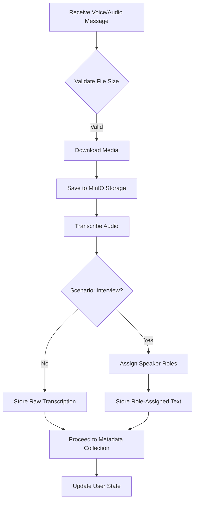
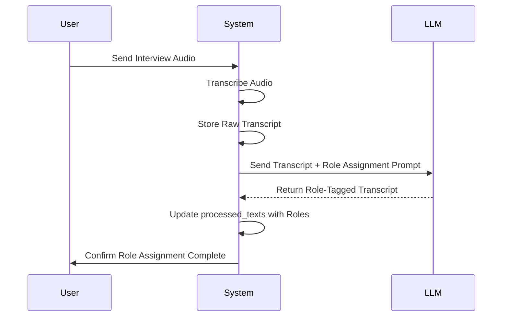
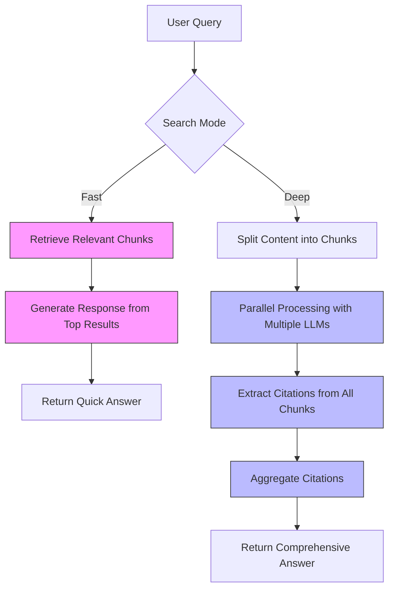
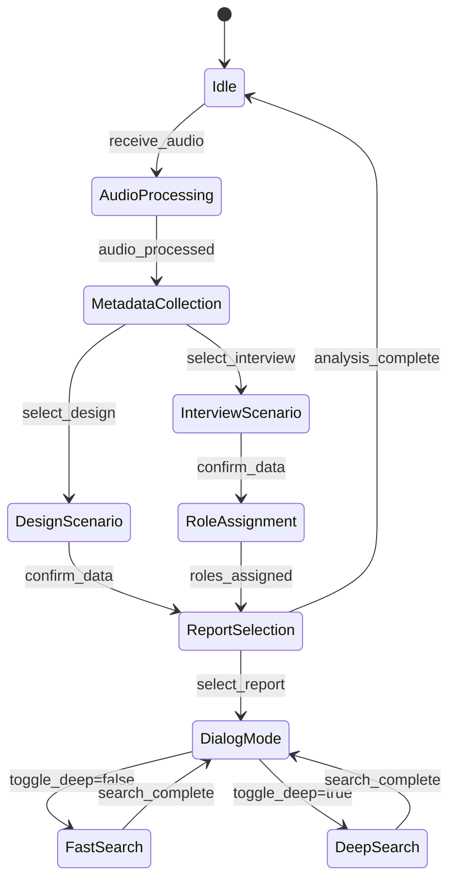
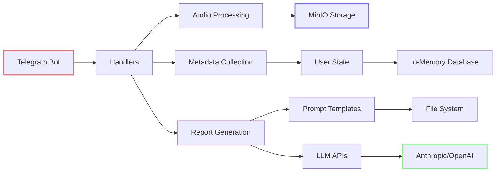
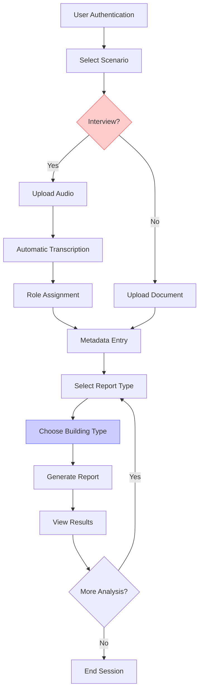

# Core Features

<cite>
**Referenced Files in This Document**   
- [main.py](file://src/main.py)
- [handlers.py](file://src/handlers.py)
- [audio_utils.py](file://src/audio_utils.py)
- [analysis.py](file://src/analysis.py)
- [run_analysis.py](file://src/run_analysis.py)
- [config.py](file://src/config.py)
- [datamodels.py](file://src/datamodels.py)
- [prompts-by-scenario/assign_roles/assign_roles.txt](file://prompts-by-scenario/assign_roles/assign_roles.txt)
</cite>

## Table of Contents
1. [Introduction](#introduction)
2. [Audio Processing Pipeline](#audio-processing-pipeline)
3. [Speaker Role Assignment Mechanism](#speaker-role-assignment-mechanism)
4. [Metadata Collection Workflow](#metadata-collection-workflow)
5. [Structured Report Generation](#structured-report-generation)
6. [Dual Search Functionality](#dual-search-functionality)
7. [User State Management System](#user-state-management-system)
8. [Integration Points and Error Handling](#integration-points-and-error-handling)
9. [Usage Patterns and User Experience](#usage-patterns-and-user-experience)
10. [Conclusion](#conclusion)

## Introduction
VoxPersona is a voice data analysis platform that transforms unstructured audio interviews and design audits into structured, actionable insights. The system integrates voice message processing, speaker role identification, metadata collection, and advanced LLM-driven analysis to support decision-making in hospitality and service industries. This document details the core features of VoxPersona, focusing on its audio processing pipeline, speaker role assignment, metadata workflow, report generation capabilities, dual search functionality, and user state management system. The architecture enables seamless transformation of voice data into structured reports for both interview and design scenarios, leveraging prompt templates and RAG-based knowledge retrieval.

## Audio Processing Pipeline

The audio processing pipeline in VoxPersona handles voice message reception, file downloading, transcription, and storage. When a user sends a voice message or audio file, the system initiates a multi-step process to convert the audio content into text for further analysis.



**Diagram sources**
- [handlers.py](file://src/handlers.py#L400-L490)
- [audio_utils.py](file://src/audio_utils.py#L20-L50)
- [analysis.py](file://src/analysis.py#L100-L150)

The pipeline begins when the `handle_audio_msg` handler captures voice, audio, or document messages. It first validates the file size using `check_audio_file_size` before downloading the media to a temporary directory. The audio file is then uploaded to MinIO object storage for persistent access. Transcription is performed using OpenAI's Whisper model through the `transcribe_audio_and_save` function, which processes the audio file and stores the resulting text in the `processed_texts` dictionary. For interview scenarios, the system automatically triggers speaker role assignment to distinguish between interviewer and interviewee dialogue.

**Section sources**
- [handlers.py](file://src/handlers.py#L400-L490)
- [audio_utils.py](file://src/audio_utils.py#L20-L50)
- [analysis.py](file://src/analysis.py#L100-L150)

## Speaker Role Assignment Mechanism

VoxPersona employs an LLM-based mechanism to assign speaker roles in interview transcripts, distinguishing between interviewer and interviewee contributions. This process enhances the quality of subsequent analysis by providing context-aware segmentation of dialogue.



**Diagram sources**
- [handlers.py](file://src/handlers.py#L350-L390)
- [analysis.py](file://src/analysis.py#L450-L490)
- [prompts-by-scenario/assign_roles/assign_roles.txt](file://prompts-by-scenario/assign_roles/assign_roles.txt)

The role assignment process is triggered by the `handle_assign_roles` function when the user selects the interview scenario. It takes the raw transcription from `processed_texts` and sends it to an LLM with a specialized prompt from `prompts-by-scenario/assign_roles/assign_roles.txt`. The LLM analyzes the dialogue patterns, speech characteristics, and contextual cues to identify and tag each speaker. The resulting role-assigned transcript replaces the raw version in `processed_texts`, enabling more accurate analysis in subsequent steps. This mechanism is critical for interview scenarios where distinguishing between interviewer questions and interviewee responses significantly impacts the quality of insights generated.

**Section sources**
- [handlers.py](file://src/handlers.py#L350-L390)
- [analysis.py](file://src/analysis.py#L450-L490)
- [prompts-by-scenario/assign_roles/assign_roles.txt](file://prompts-by-scenario/assign_roles/assign_roles.txt)

## Metadata Collection Workflow

VoxPersona implements a structured metadata collection workflow that guides users through a multi-step process to capture essential context about each audio recording. This metadata enables targeted analysis and proper categorization of results.

```mermaid
flowchart TD
A[Start Metadata Collection] --> B[Select Scenario: Interview/Design]
B --> C[Enter Audio File Number]
C --> D[Enter Date (YYYY-MM-DD)]
D --> E[Enter Employee Name]
E --> F[Enter Place Name]
F --> G[Enter Building Type]
G --> H{Scenario: Design?}
H --> |Yes| I[Enter City]
H --> |No| J[Enter Client Name]
J --> K[Enter Zone (Optional)]
I --> K
K --> L[Confirm Data]
L --> M[Store Metadata in user_states]
```

**Diagram sources**
- [handlers.py](file://src/handlers.py#L100-L350)
- [config.py](file://src/config.py#L80-L90)
- [datamodels.py](file://src/datamodels.py#L1-L20)

The metadata collection workflow is managed through the `user_states` dictionary, which tracks conversation context across multiple interaction steps. When a user uploads an audio file, the system transitions to the "inputing_fields" state and prompts for specific metadata including file number, date, employee name, place name, and building type. For design scenarios, additional fields like city are required, while interview scenarios require client name. The workflow supports editing of previously entered fields through the `handle_edit_field` function, allowing users to correct mistakes without restarting the process. All collected metadata is stored in the user's state object and used to determine which analysis reports to generate.

**Section sources**
- [handlers.py](file://src/handlers.py#L100-L350)
- [config.py](file://src/config.py#L80-L90)
- [datamodels.py](file://src/datamodels.py#L1-L20)

## Structured Report Generation

VoxPersona generates structured reports for both interview and design scenarios using a multi-stage analysis pipeline that combines sequential prompt execution and JSON-based structured output generation.

```mermaid
classDiagram
class ReportGenerator {
+run_analysis_with_spinner()
+run_analysis_pass()
+analyze_methodology()
+fetch_prompts_for_scenario_reporttype_building()
}
class PromptManager {
+fetch_prompt_by_name()
+fetch_prompts_for_scenario_reporttype_building()
}
class TemplateEngine {
+grouped_reports_to_string()
+build_reports_grouped()
}
ReportGenerator --> PromptManager : "uses"
ReportGenerator --> TemplateEngine : "uses"
PromptManager --> "prompts/" : "reads"
TemplateEngine --> "prompts-by-scenario/" : "reads"
```

**Diagram sources**
- [run_analysis.py](file://src/run_analysis.py#L150-L340)
- [analysis.py](file://src/analysis.py#L10-L90)
- [datamodels.py](file://src/datamodels.py#L30-L70)

The report generation process begins with `run_analysis_with_spinner`, which retrieves the appropriate prompt sequence based on the selected scenario, report type, and building type. For complex reports like "Общие факторы" (Common Factors), the system executes multiple analysis passes: first generating detailed textual analysis, then combining results for a final JSON-formatted quantitative analysis. The `analyze_methodology` function processes prompts sequentially, using the output of one prompt as input to the next, enabling multi-step reasoning. Prompt templates are organized in the `prompts-by-scenario` directory with separate paths for interview and design scenarios, each containing specialized prompts for different report types and building categories.

**Section sources**
- [run_analysis.py](file://src/run_analysis.py#L150-L340)
- [analysis.py](file://src/analysis.py#L10-L90)
- [datamodels.py](file://src/datamodels.py#L30-L70)

## Dual Search Functionality

VoxPersona implements a dual search functionality comprising fast RAG-based search and deep parallel LLM search, providing users with flexible information retrieval options based on their needs for speed versus comprehensiveness.



**Diagram sources**
- [run_analysis.py](file://src/run_analysis.py#L50-L150)
- [analysis.py](file://src/analysis.py#L200-L450)
- [config.py](file://src/config.py#L40-L50)

The fast RAG-based search (`run_fast_search`) uses a vector database to quickly retrieve the most relevant document chunks and generate a concise response. This mode prioritizes speed and efficiency, ideal for general inquiries. In contrast, the deep parallel LLM search (`run_deep_search`) processes all relevant chunks simultaneously across multiple LLM instances, extracting detailed information from each chunk before aggregating results. This approach leverages seven different API keys to distribute the workload, overcoming rate limits while maintaining high throughput. The deep search is particularly effective for complex queries requiring comprehensive analysis across multiple documents, providing more thorough and nuanced answers at the cost of increased processing time.

**Section sources**
- [run_analysis.py](file://src/run_analysis.py#L50-L150)
- [analysis.py](file://src/analysis.py#L200-L450)
- [config.py](file://src/config.py#L40-L50)

## User State Management System

VoxPersona employs a sophisticated user state management system that tracks conversation context across multiple steps, enabling seamless multi-turn interactions and preserving user progress throughout the analysis workflow.



**Diagram sources**
- [handlers.py](file://src/handlers.py#L1-L400)
- [config.py](file://src/config.py#L70-L80)
- [datamodels.py](file://src/datamodels.py#L60-L70)

The state management system is centered around the `user_states` dictionary, which stores per-user context including current step, selected scenario, collected metadata, and analysis preferences. Each user interaction updates the state object, allowing the system to maintain context across messages. The state machine pattern enables complex workflows with branching paths based on user choices, such as different metadata requirements for interview versus design scenarios. The system supports state transitions through callback queries that modify the "step" parameter, guiding users through the analysis pipeline. Additionally, the state management system handles edge cases like interrupted workflows and allows users to edit previously entered information through the "edit" functionality.

**Section sources**
- [handlers.py](file://src/handlers.py#L1-L400)
- [config.py](file://src/config.py#L70-L80)
- [datamodels.py](file://src/datamodels.py#L60-L70)

## Integration Points and Error Handling

VoxPersona integrates multiple components through well-defined interfaces while implementing comprehensive error handling to ensure system reliability and user experience continuity.



**Diagram sources**
- [main.py](file://src/main.py#L1-L95)
- [handlers.py](file://src/handlers.py#L1-L805)
- [config.py](file://src/config.py#L1-L94)

Key integration points include the Telegram bot interface, MinIO object storage, external LLM APIs (Anthropic and OpenAI), and the local file system for prompt templates. The system handles errors at multiple levels: input validation prevents invalid data entry, try-catch blocks manage exceptions during audio processing and LLM calls, and fallback mechanisms maintain system operation during partial failures. For example, if RAG index loading fails, the system continues startup and attempts to initialize models in the background. Error messages are logged for debugging while user-facing messages provide actionable feedback without exposing technical details. The system also implements periodic RAG index saving to prevent data loss during unexpected shutdowns.

**Section sources**
- [main.py](file://src/main.py#L1-L95)
- [handlers.py](file://src/handlers.py#L1-L805)
- [config.py](file://src/config.py#L1-L94)

## Usage Patterns and User Experience

VoxPersona supports distinct usage patterns for interview and design scenarios, each with tailored workflows that optimize the user experience for their specific analytical needs.



**Diagram sources**
- [handlers.py](file://src/handlers.py#L400-L805)
- [menus.py](file://src/menus.py)
- [markups.py](file://src/markups.py)

For interview scenarios, users typically upload voice messages that are automatically transcribed and processed with speaker role assignment. The workflow emphasizes rapid analysis of customer feedback, with reports focusing on decision-making factors and interview methodology assessment. Design scenarios often involve uploading pre-recorded audit files, with metadata collection emphasizing location details like city and specific zones. The user experience is enhanced through interactive menus, loading animations during processing, and the ability to toggle between fast and deep search modes. The system guides users through each step with clear prompts and confirmation screens, while allowing flexibility to edit previous entries. This structured yet adaptable approach enables efficient transformation of unstructured voice data into actionable business insights.

**Section sources**
- [handlers.py](file://src/handlers.py#L400-L805)
- [menus.py](file://src/menus.py)
- [markups.py](file://src/markups.py)

## Conclusion
VoxPersona effectively transforms unstructured voice data into actionable insights through its integrated audio processing pipeline, speaker role assignment, metadata collection, and structured report generation capabilities. The system's dual search functionality provides users with flexible options for information retrieval, while the robust user state management system ensures seamless multi-step interactions. By leveraging specialized prompt templates and RAG-based knowledge retrieval, VoxPersona delivers targeted analysis for both interview and design scenarios in the hospitality industry. The architecture demonstrates effective integration of multiple components with comprehensive error handling, creating a reliable and user-friendly platform for voice data analysis. These core features work together to automate what would otherwise be time-consuming manual analysis, enabling organizations to derive value from voice data at scale.