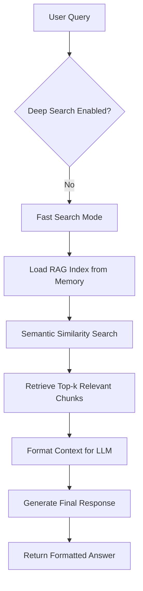
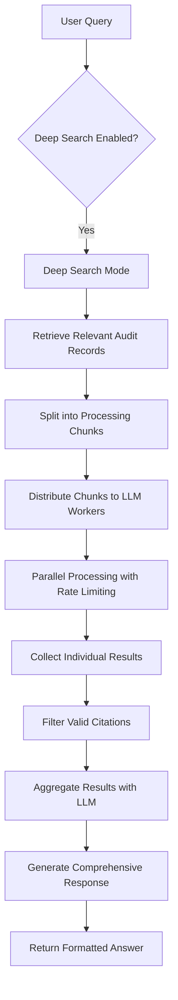
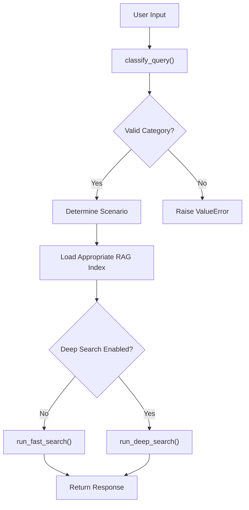

# Dual-Mode Search System

<cite>
**Referenced Files in This Document**   
- [main.py](file://src/main.py)
- [rag_persistence.py](file://src/rag_persistence.py)
- [run_analysis.py](file://src/run_analysis.py)
- [analysis.py](file://src/analysis.py)
- [handlers.py](file://src/handlers.py)
- [config.py](file://src/config.py)
</cite>

## Table of Contents
1. [Introduction](#introduction)
2. [Fast Search (RAG-Based Retrieval)](#fast-search-rag-based-retrieval)
3. [Deep Search (Parallel LLM Processing)](#deep-search-parallel-llm-processing)
4. [Search Query Routing and Classification](#search-query-routing-and-classification)
5. [Response Formatting for Telegram Output](#response-formatting-for-telegram-output)
6. [Performance Trade-offs and Latency Considerations](#performance-trade-offs-and-latency-considerations)
7. [Vector Index Optimization and Memory Management](#vector-index-optimization-and-memory-management)
8. [Conclusion](#conclusion)

## Introduction
The VoxPersona system implements a dual-mode search architecture designed to balance speed and depth in information retrieval. The system provides two distinct search modes: 'fast search' for rapid semantic retrieval using pre-loaded knowledge vectors, and 'deep search' for comprehensive analysis through parallel LLM processing across multiple historical reports. This document details the implementation, workflow, and optimization strategies for both search modes, focusing on their initialization, execution, and integration within the Telegram-based interface.

**Section sources**
- [main.py](file://src/main.py#L0-L95)
- [run_analysis.py](file://src/run_analysis.py#L0-L343)

## Fast Search (RAG-Based Retrieval)
The fast search mode leverages a Retrieval-Augmented Generation (RAG) system to provide rapid responses based on semantic similarity matching. The RAG system is initialized in main.py through asynchronous loading of pre-built vector indices from persistent storage. During initialization, the system attempts to load existing RAG indices from the directory specified in RAG_INDEX_DIR. If indices are missing or incomplete, the system triggers init_rags() to rebuild them from source data.

The RAG persistence mechanism, implemented in rag_persistence.py, uses FAISS vector stores for efficient similarity search. The save_rag_indices() and load_rag_indices() functions handle the serialization and deserialization of vector databases to and from disk storage. Vector embeddings are generated using a SentenceTransformer model wrapped in a CustomSentenceTransformerEmbeddings class, ensuring consistent embedding generation across sessions.

When executing a fast search, the system performs semantic similarity matching against the pre-loaded vector index. The generate_db_answer() function in analysis.py retrieves the most relevant documents (default k=15) using the similarity_search() method of the FAISS index. These retrieved documents are then formatted with contextual information and submitted to the LLM with a system prompt that instructs the model to answer precisely based on the provided context, avoiding speculation when information is unavailable.

**Diagram sources**
- [main.py](file://src/main.py#L0-L95)
- [rag_persistence.py](file://src/rag_persistence.py#L0-L36)
- [analysis.py](file://src/analysis.py#L150-L172)

**Section sources**
- [main.py](file://src/main.py#L0-L95)
- [rag_persistence.py](file://src/rag_persistence.py#L0-L36)
- [run_analysis.py](file://src/run_analysis.py#L46-L76)
- [analysis.py](file://src/analysis.py#L150-L172)

## Deep Search (Parallel LLM Processing)
The deep search mode provides comprehensive analysis by processing multiple historical reports in parallel using multiple LLM instances. This mode is triggered when users enable the "Глубокое исследование" (Deep Research) option in the Telegram interface. The deep search workflow begins by retrieving relevant audit records from PostgreSQL through the build_reports_grouped() function, which aggregates reports based on the identified scenario (e.g., "Дизайн" or "Интервью").

Once the relevant reports are retrieved, they are split into individual chunks using a regular expression pattern that identifies transcription boundaries. The system then processes these chunks in parallel using multiple Anthropic API keys, allowing for concurrent LLM inference across different model instances. The extract_from_chunk_parallel_async() function in analysis.py implements this parallel processing with rate limiting controls to prevent API throttling.

Each chunk is processed independently with the same extraction prompt, and the results are aggregated using a secondary LLM call with an aggregation prompt. This two-stage process ensures comprehensive coverage of all relevant reports while maintaining coherence in the final response. The system implements sophisticated rate limiting with both token-per-minute and requests-per-minute constraints for each API key, dynamically calculating delays based on the token count of each chunk.

**Diagram sources**
- [run_analysis.py](file://src/run_analysis.py#L46-L76)
- [analysis.py](file://src/analysis.py#L265-L305)

**Section sources**
- [run_analysis.py](file://src/run_analysis.py#L46-L76)
- [analysis.py](file://src/analysis.py#L265-L305)
- [db_handler/db.py](file://src/db_handler/db.py)

## Search Query Routing and Classification
The system employs a sophisticated query classification mechanism to determine the appropriate search mode and scenario. When a user submits a query in dialog mode, the classify_query() function analyzes the input text to determine whether it pertains to "Дизайн" (Design) or "Интервью" (Interview) scenarios. This classification is performed using a dedicated LLM prompt that returns a JSON-formatted response containing the category information.

The routing logic is implemented in run_dialog_mode() within run_analysis.py, which first classifies the query and then routes it to either fast search or deep search based on the user's selection. The user interface, managed through handlers.py, provides a toggle button ("🔍 Глубокое исследование" or "✅ Глубокое исследование") that allows users to switch between search modes. The state of this toggle is stored in the user_states dictionary and determines the execution path when a query is submitted.

For deep search operations, the system further classifies the report type using classify_report_type(), which determines the specific type of audit report to analyze. This multi-level classification ensures that queries are directed to the most appropriate knowledge base and processing pipeline, optimizing both accuracy and efficiency.

**Diagram sources**
- [run_analysis.py](file://src/run_analysis.py#L75-L112)
- [analysis.py](file://src/analysis.py#L305-L340)

**Section sources**
- [run_analysis.py](file://src/run_analysis.py#L75-L112)
- [analysis.py](file://src/analysis.py#L305-L340)
- [handlers.py](file://src/handlers.py#L183-L214)

## Response Formatting for Telegram Output
The system formats responses for optimal presentation in the Telegram interface using Markdown formatting. After processing a search query, the system generates a formatted response that includes the request category and the answer content. The response is constructed using a template that applies Markdown syntax to highlight the category information.

To handle potentially long responses, the system implements a split_and_send_long_text() utility function that breaks lengthy messages into smaller chunks suitable for Telegram's message size limits. This ensures reliable delivery of comprehensive responses without truncation or transmission failures. The system also implements logging with truncation for responses exceeding 3,000 characters, preserving performance while maintaining auditability.

The final response includes contextual navigation options, presenting users with a reply markup that allows them to continue asking questions or return to the main menu. This interactive design enhances user experience by maintaining context and providing clear next steps after each query resolution.

**Section sources**
- [run_analysis.py](file://src/run_analysis.py#L133-L159)
- [utils.py](file://src/utils.py)
- [markups.py](file://src/markups.py#L57-L81)

## Performance Trade-offs and Latency Considerations
The dual-mode search system presents distinct performance characteristics and trade-offs between the two search modes. Fast search offers significantly lower latency, typically responding within seconds, as it relies on pre-computed vector indices and a single LLM call. This mode is optimized for queries that can be answered using a limited set of highly relevant documents retrieved through semantic similarity.

In contrast, deep search incurs higher latency due to its comprehensive processing workflow. The parallel LLM processing, while faster than sequential processing, still requires substantial time to process multiple report chunks, aggregate results, and generate a final response. The system mitigates this through asynchronous execution and progress indicators ("⏳ Думаю...") to maintain user engagement during processing.

Resource usage differs significantly between modes. Fast search primarily consumes memory for maintaining vector indices in RAM, while deep search demands substantial API resources and network bandwidth due to multiple concurrent LLM calls. The system manages these resources through rate limiting, connection pooling, and careful API key rotation to avoid throttling and ensure reliable operation.

**Section sources**
- [run_analysis.py](file://src/run_analysis.py#L46-L76)
- [analysis.py](file://src/analysis.py#L265-L305)
- [config.py](file://src/config.py#L66-L92)

## Vector Index Optimization and Memory Management
The system implements several strategies for optimizing vector indexes and managing memory for large knowledge bases. The RAG indices are persisted to disk in the RAG_INDEX_DIR directory, which is configured as a mounted volume to ensure data persistence across container restarts. This persistent storage allows for rapid initialization of the RAG system without requiring complete re-indexing on each startup.

To optimize memory usage, the system implements periodic saving of RAG indices through a background task (periodic_save_rags()) that runs every 15 minutes. This ensures that any updates to the knowledge base are regularly persisted, reducing data loss risk while maintaining performance. The system also implements a safe_filename() utility to ensure compatibility between index names and filesystem requirements.

For large knowledge bases, the system could be enhanced with additional optimization techniques such as hierarchical navigable small world (HNSW) indexes for faster similarity search, quantization to reduce vector storage requirements, or incremental indexing to minimize memory footprint during updates. The current implementation balances performance and complexity, prioritizing reliability and ease of maintenance.

**Section sources**
- [main.py](file://src/main.py#L37-L74)
- [rag_persistence.py](file://src/rag_persistence.py#L0-L36)
- [config.py](file://src/config.py#L66-L92)

## Conclusion
The dual-mode search system in VoxPersona effectively balances the need for rapid information retrieval with comprehensive analytical capabilities. The fast search mode provides immediate responses for straightforward queries using RAG-based semantic retrieval, while the deep search mode enables thorough analysis of multiple historical reports through parallel LLM processing. The system's architecture, with its clear separation of concerns and thoughtful resource management, demonstrates a sophisticated approach to balancing performance, accuracy, and user experience in a conversational AI application.