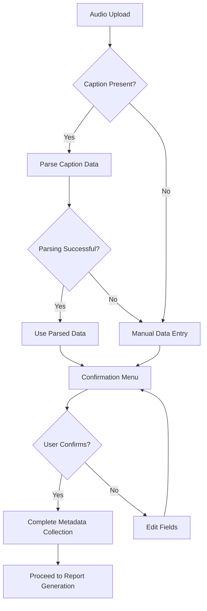
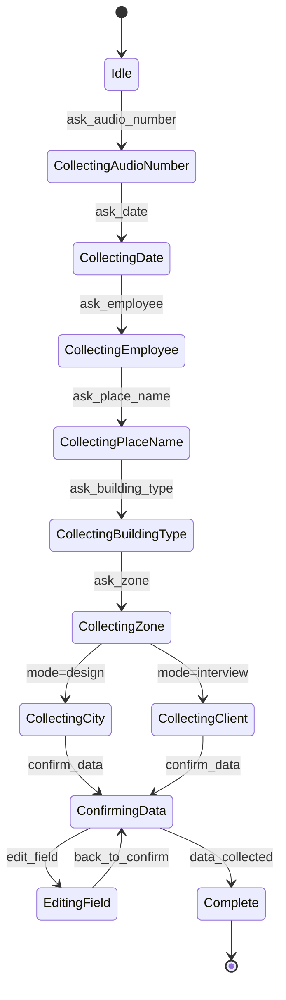
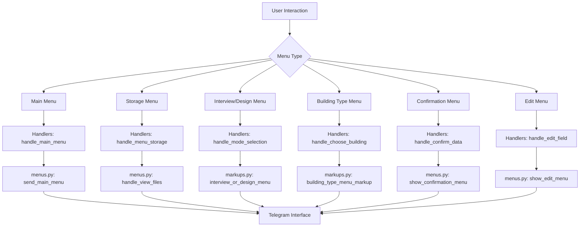
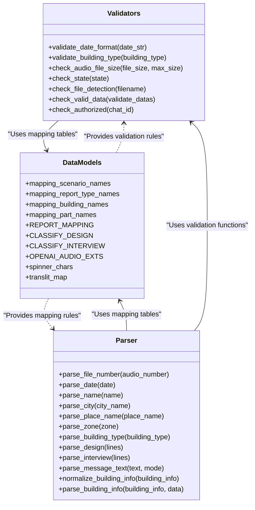

# Metadata Collection Workflow

<cite>
**Referenced Files in This Document**   
- [handlers.py](file://src/handlers.py)
- [menus.py](file://src/menus.py)
- [markups.py](file://src/markups.py)
- [validators.py](file://src/validators.py)
- [datamodels.py](file://src/datamodels.py)
- [parser.py](file://src/parser.py)
- [config.py](file://src/config.py)
</cite>

## Table of Contents
1. [Introduction](#introduction)
2. [Metadata Collection Process](#metadata-collection-process)
3. [State Machine Implementation](#state-machine-implementation)
4. [Interactive Menu System](#interactive-menu-system)
5. [Input Validation and Data Mapping](#input-validation-and-data-mapping)
6. [Edge Case Handling](#edge-case-handling)
7. [Best Practices for Conversational Flows](#best-practices-for-conversational-flows)
8. [Conclusion](#conclusion)

## Introduction
The VoxPersona system implements a comprehensive metadata collection workflow that captures essential contextual information after audio upload. This workflow enables the system to generate targeted reports based on the specific establishment type, audit/interview scenario, and location details. The process is designed as a conversational interface that guides users through a series of structured inputs, ensuring data completeness before initiating report generation.

**Section sources**
- [handlers.py](file://src/handlers.py#L0-L805)
- [config.py](file://src/config.py#L0-L93)

## Metadata Collection Process
The metadata collection workflow begins after an audio file is uploaded to the system. The bot initiates a structured conversation to gather contextual information necessary for report generation. The process follows a sequential flow that collects information about the establishment type (hotel, restaurant, spa), audit/interview scenario, and specific location details.

When a user uploads an audio file, the system first processes the audio and transcribes it. Following this, the metadata collection process begins by prompting the user for specific information in a predetermined sequence. The workflow starts with collecting the audio file number, followed by the date of recording, employee name, establishment name, building type, zone information, and city (for design scenarios). For interview scenarios, the client's name is also collected.

The system supports both manual data entry and automated parsing from message captions. When a user includes metadata in the caption of an audio message, the system attempts to parse this information automatically using the parser module. If parsing fails or no caption is provided, the system falls back to interactive data collection through direct messaging.

**Diagram sources**
- [handlers.py](file://src/handlers.py#L0-L805)
- [parser.py](file://src/parser.py#L0-L174)

**Section sources**
- [handlers.py](file://src/handlers.py#L0-L805)
- [parser.py](file://src/parser.py#L0-L174)

## State Machine Implementation
The metadata collection workflow is powered by a state machine implemented in handlers.py that tracks user progress through the data entry process. The state machine uses the user_states dictionary to maintain conversation context for each user session, allowing the system to handle multiple concurrent users.

The state machine operates through a series of defined steps, each representing a specific data collection point in the workflow. These steps include "ask_audio_number", "ask_date", "ask_employee", "ask_place_name", "ask_building_type", "ask_zone", "ask_city", and "ask_client". The current step is stored in the state dictionary under the "step" key, which determines the next expected input from the user.

When a user sends a message, the handle_authorized_text function checks the current state and routes the input to the appropriate handler function based on the current step. For example, if the state indicates "ask_date", the input is passed to the ask_date function for validation and processing. This state-driven approach ensures that users progress through the metadata collection process in a logical sequence.

The state machine also supports non-linear navigation through the edit functionality. Users can modify previously entered data by selecting specific fields to edit, which temporarily changes the state to an editing mode (e.g., "edit_date", "edit_employee"). After editing, the state reverts to the confirmation step, allowing users to review all data before final submission.

**Diagram sources**
- [handlers.py](file://src/handlers.py#L0-L805)
- [config.py](file://src/config.py#L0-L93)

**Section sources**
- [handlers.py](file://src/handlers.py#L0-L805)
- [config.py](file://src/config.py#L0-L93)

## Interactive Menu System
The interactive menu system in VoxPersona is implemented through the combined functionality of menus.py and markups.py, which work together to create dynamic Telegram interfaces for user interaction. The system generates context-specific menus and inline buttons that guide users through the metadata collection process and provide navigation options.

The markups.py module defines the structure of various interactive menus using Telegram's InlineKeyboardMarkup. These include the main menu, storage menu, interview/design selection menu, building type selection menu, and confirmation/edit menus. Each menu is constructed with callback data that triggers specific actions when selected by the user. For example, the building_type_menu_markup function creates a keyboard with options for "Отель", "Ресторан", and "Центр здоровья", each associated with a callback that identifies the selected building type.

The menus.py module handles the presentation and lifecycle of these menus within the Telegram interface. It includes functions for sending the main menu, clearing active menus, registering menu messages for cleanup, and displaying confirmation and edit menus. The show_confirmation_menu function, for instance, generates a summary of collected data and presents users with options to confirm or edit their inputs.

The system maintains a record of active menu messages through the active_menus dictionary in config.py, allowing it to clean up previous messages when displaying new menus. This prevents interface clutter and ensures users always interact with the most relevant menu options. When a user navigates between menu levels, the system clears previous messages and displays the appropriate new menu, maintaining a clean and focused interface.

**Diagram sources**
- [menus.py](file://src/menus.py#L0-L93)
- [markups.py](file://src/markups.py#L0-L132)
- [handlers.py](file://src/handlers.py#L0-L805)

**Section sources**
- [menus.py](file://src/menus.py#L0-L93)
- [markups.py](file://src/markups.py#L0-L132)

## Input Validation and Data Mapping
The metadata collection workflow incorporates robust input validation and data mapping through the validators.py and datamodels.py modules. These components ensure data quality and consistency by validating user inputs and mapping various input formats to standardized internal representations.

The validators.py module contains several validation functions that check user inputs for correctness and completeness. The validate_date_format function uses regular expressions to ensure dates follow the YYYY-MM-DD format. The validate_building_type function normalizes building type inputs by recognizing variations of establishment names (e.g., "отел", "отель", "отеле") and mapping them to standardized values. The check_audio_file_size function validates that uploaded audio files do not exceed the 2GB size limit.

Data mapping is implemented through dictionaries in datamodels.py that translate between user-facing terms and internal identifiers. The mapping_scenario_names dictionary maps "design" and "interview" to their Russian equivalents for display purposes. The mapping_building_names dictionary standardizes building type inputs to consistent values like "Отель", "Ресторан", and "Центр Здоровья". The REPORT_MAPPING dictionary connects report identifiers (e.g., "report_int_general") with their descriptive names.

The parser.py module plays a crucial role in data mapping by extracting structured information from free-form text. It can parse multi-line messages containing metadata and map each line to the appropriate data field based on the scenario (design or interview). The parsing functions handle variations in input format and apply normalization to ensure consistent data storage.

**Diagram sources**
- [validators.py](file://src/validators.py#L0-L49)
- [datamodels.py](file://src/datamodels.py#L0-L71)
- [parser.py](file://src/parser.py#L0-L174)

**Section sources**
- [validators.py](file://src/validators.py#L0-L49)
- [datamodels.py](file://src/datamodels.py#L0-L71)
- [parser.py](file://src/parser.py#L0-L174)

## Edge Case Handling
The metadata collection workflow includes comprehensive handling of edge cases to ensure system reliability and user experience. The implementation addresses invalid inputs, navigation between menu levels, and session management to provide a robust user interface.

For invalid inputs, the system provides immediate feedback and prompts users to correct their entries. When a user enters a date in an incorrect format, the validate_date_format function returns false, and the system responds with a clear error message specifying the required format (YYYY-MM-DD). Similarly, if a user enters an invalid building type, the system attempts to match partial inputs and provides standardized options through the building type menu.

The workflow supports flexible navigation between menu levels, allowing users to backtrack and modify previous entries. The edit functionality enables users to change specific fields without restarting the entire process. When a user selects a field to edit, the system temporarily stores the previous step, processes the edit, and then returns to the confirmation menu, maintaining context throughout the interaction.

Session management is implemented through the user_states dictionary, which tracks each user's progress through the metadata collection process. If a user sends a message without an active state, the system interprets this as a context-free interaction and responds with the main menu. This prevents errors from out-of-sequence inputs and provides a graceful recovery path when conversations become disrupted.

The system also handles file-related edge cases, such as missing or undetectable files. The check_file_detection function verifies that requested files exist in storage, and if not, provides appropriate error feedback. For audio processing, the system includes error handling for transcription failures, MinIO storage issues, and permission errors, ensuring that partial failures do not compromise the entire workflow.

**Section sources**
- [handlers.py](file://src/handlers.py#L0-L805)
- [validators.py](file://src/validators.py#L0-L49)
- [storage.py](file://src/storage.py#L0-L309)

## Best Practices for Conversational Flows
The metadata collection workflow in VoxPersona exemplifies several best practices for designing intuitive conversational interfaces. These practices ensure data completeness, minimize user errors, and create a seamless experience from audio upload to report generation.

One key practice is progressive disclosure, where the system reveals information and options gradually rather than overwhelming users with all choices at once. The workflow begins with audio upload and then sequentially prompts for each piece of metadata, maintaining focus on the current task. This approach reduces cognitive load and helps users provide accurate information.

Another best practice is immediate validation with helpful feedback. Rather than collecting all data and then validating it, the system validates each input as it's received. When validation fails, the system provides specific guidance on the correct format, such as "Используйте формат ГГГГ-ММ-ДД (например, 2025-01-01)". This immediate feedback loop helps users correct mistakes while the context is still fresh in their minds.

The system also implements a confirmation step before finalizing data collection. The show_confirmation_menu function presents users with a summary of all entered information, allowing them to review and edit any fields before proceeding. This double-check mechanism significantly reduces errors and ensures data quality before initiating resource-intensive report generation.

Context preservation is another important practice demonstrated in the workflow. The state machine maintains conversation context across messages, allowing users to take breaks and return to the process without losing their progress. The edit functionality enables targeted corrections without requiring users to restart the entire process, respecting the time and effort already invested.

Finally, the system provides multiple input methods to accommodate different user preferences. Users can either respond to sequential prompts or provide all metadata at once in a message caption. The parser attempts to extract structured data from captions, falling back to interactive collection if parsing fails. This flexibility makes the system accessible to both novice users who prefer guided input and experienced users who want to streamline the process.

**Section sources**
- [handlers.py](file://src/handlers.py#L0-L805)
- [menus.py](file://src/menus.py#L0-L93)
- [markups.py](file://src/markups.py#L0-L132)

## Conclusion
The metadata collection workflow in VoxPersona represents a sophisticated conversational interface that effectively gathers contextual information for audio analysis and report generation. By combining a state machine architecture with interactive menus, robust validation, and flexible data mapping, the system creates a user-friendly experience that ensures data completeness and accuracy.

The workflow's design prioritizes usability through progressive disclosure, immediate validation feedback, and context preservation. The integration of automated parsing with manual input options accommodates different user preferences and skill levels. Comprehensive error handling and navigation features make the system resilient to user mistakes and technical issues.

This implementation serves as a model for conversational interfaces in specialized domains, demonstrating how structured data collection can be made intuitive and efficient. The separation of concerns between state management, user interface, validation, and data mapping creates a maintainable architecture that can be extended to support additional scenarios and data types in the future.