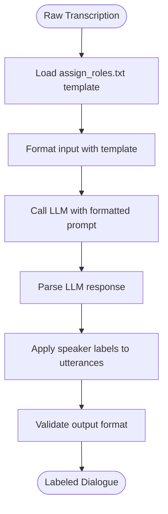
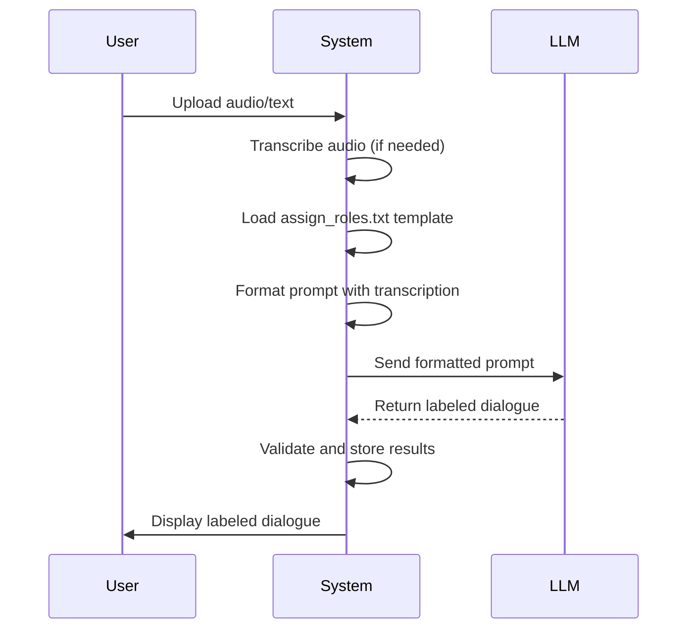

# Speaker Role Assignment

<cite>
**Referenced Files in This Document**   
- [assign_roles.txt](file://prompts-by-scenario/assign_roles/assign_roles.txt)
- [bot.py](file://src/bot.py)
- [handlers.py](file://src/handlers.py)
- [run_analysis.py](file://src/run_analysis.py)
</cite>

## Table of Contents
1. [Introduction](#introduction)
2. [Role Assignment Process](#role-assignment-process)
3. [Prompt Template Structure](#prompt-template-structure)
4. [Integration with Analysis Pipeline](#integration-with-analysis-pipeline)
5. [LLM Call Implementation](#llm-call-implementation)
6. [Accuracy Challenges and Improvements](#accuracy-challenges-and-improvements)
7. [User State Management](#user-state-management)
8. [Customization for New Domains](#customization-for-new-domains)
9. [Conclusion](#conclusion)

## Introduction
The VoxPersona system implements a speaker role assignment mechanism to identify and label different participants in transcribed conversations. This functionality is critical for downstream analysis, enabling the system to distinguish between roles such as interviewer, interviewee, manager, or client based on speech patterns and contextual cues. The role assignment process leverages prompt-based LLM classification to analyze raw transcriptions and apply appropriate speaker labels, creating structured dialogue data for subsequent reporting and analysis.

## Role Assignment Process
The speaker role assignment mechanism operates as a post-transcription processing step that identifies and labels speakers in conversational data. When a user uploads audio or text, the system first generates a raw transcription and then applies role labels using an LLM-based classification approach. The process specifically targets dialogues where two participants' utterances are intermixed, requiring the system to disambiguate which statements belong to which speaker.

The core functionality is implemented in the `assign_roles` function, which takes raw transcribed text as input and returns the same text with speaker labels prepended to each utterance. The system uses predefined role labels such as "[Сотрудник:]" (Employee) and "[Клиент:]" (Client) to mark each speaker's contributions. This labeling occurs before any analytical processing, ensuring that subsequent analysis can leverage the speaker context.

**Section sources**
- [bot.py](file://src/bot.py#L378-L404)
- [handlers.py](file://src/handlers.py#L496-L521)

## Prompt Template Structure
The role assignment process is governed by the `assign_roles.txt` prompt template located in the prompts-by-scenario directory. This template provides explicit instructions to the LLM on how to process the input text and apply speaker labels. The prompt specifies that the LLM should split the interview text into utterances and add specific labels before each speaker's statements.

The template includes five important rules that guide the LLM's behavior:
1. Return only the labeled text without any introductions, conclusions, or comments
2. Include the entire interview text completely without omitting any parts
3. Use context and logic to determine the most likely speaker when attribution is unclear
4. Use only the specified labels ([Сотрудник:] and [Клиент:]) without adding additional markers
5. Preserve the original formatting and structure of the text

This structured approach ensures consistent output formatting and prevents the LLM from adding extraneous content that could interfere with downstream processing.

**Diagram sources**
- [assign_roles.txt](file://prompts-by-scenario/assign_roles/assign_roles.txt#L1-L12)

## Integration with Analysis Pipeline
The speaker role assignment process is tightly integrated into VoxPersona's analysis pipeline, occurring immediately after transcription and before any analytical processing. When a user uploads audio or selects a stored transcription, the system automatically triggers the role assignment process if the selected mode is "interview."

The integration occurs through the `handle_audio_msg` function in handlers.py, which processes incoming audio messages by first transcribing them and then calling `handle_assign_roles`. This function manages the workflow by displaying a loading animation while the role assignment is in progress and updating the user interface upon completion. The processed text with assigned roles is stored in the `processed_texts` dictionary, making it available for subsequent analysis steps.

For stored text files without roles, the system applies the same role assignment process when the file is selected from storage, ensuring consistent processing regardless of the input source. This integration ensures that all interview analyses operate on properly labeled dialogue data.

**Section sources**
- [handlers.py](file://src/handlers.py#L585-L608)
- [bot.py](file://src/bot.py#L378-L404)

## LLM Call Implementation
The LLM call implementation for speaker role assignment follows a structured pattern that combines prompt loading, input formatting, and response handling. The `assign_roles` function in bot.py orchestrates this process by first loading the prompt template from the file system using the `load_prompt` function. If the template cannot be loaded, a fallback instruction is used to guide the LLM.

The implementation constructs the final prompt by combining the template with the raw transcription text, clearly separating the instructions from the input data. The system then calls the LLM through the `vsegpt_complete` wrapper function, which handles the API communication with appropriate error handling. The wrapper configures the LLM request with a temperature of 0.7 and a maximum token limit of 3000 to balance creativity with consistency.

Upon receiving the response, the system logs the input and output text lengths for monitoring purposes and returns the labeled dialogue. The implementation includes comprehensive error handling to manage API failures and other exceptions, ensuring the system remains robust even when the LLM service is temporarily unavailable.

**Diagram sources**
- [bot.py](file://src/bot.py#L378-L404)
- [handlers.py](file://src/handlers.py#L496-L521)

## Accuracy Challenges and Improvements
The speaker role assignment system faces several accuracy challenges, particularly with ambiguous speech patterns where contextual cues are insufficient to confidently determine speaker identity. The current implementation relies on the LLM's ability to infer roles based on linguistic patterns, but this approach can struggle with atypical dialogue structures or when speakers deviate from expected conversational norms.

To address these challenges, the system employs several strategies. First, the prompt template explicitly instructs the LLM to use context and logic to determine the most likely speaker when attribution is unclear, encouraging reasoned inference rather than arbitrary assignment. Second, the system preserves the original text structure, minimizing the risk of misalignment between labels and utterances.

Potential improvements include refining the prompt template with more specific examples of speech patterns associated with each role, implementing confidence scoring for role assignments, and incorporating feedback loops where users can correct mislabeled utterances to improve future performance. Additionally, expanding the role taxonomy beyond the current binary employee-client distinction could enhance accuracy in more complex conversational scenarios.

**Section sources**
- [assign_roles.txt](file://prompts-by-scenario/assign_roles/assign_roles.txt#L1-L12)
- [bot.py](file://src/bot.py#L378-L404)

## User State Management
The speaker role assignment process integrates with VoxPersona's user state management system to maintain context across multi-part messages and extended interactions. The system uses the `user_states` dictionary to track each user's current mode (interview or design) and other relevant parameters that influence role assignment behavior.

When processing audio messages, the system checks the user's current mode to determine whether to apply role assignment. This state-aware approach ensures that the role labeling process is only triggered when appropriate, conserving resources and preventing unnecessary processing. The processed text with assigned roles is stored in the `processed_texts` dictionary, indexed by user ID, allowing subsequent analysis steps to access the properly labeled dialogue.

The state management system also supports error recovery and user interaction, with the ability to restart the role assignment process if it fails and to provide appropriate feedback to users through the Telegram interface. This integration ensures a seamless user experience while maintaining the integrity of the role assignment workflow.

**Section sources**
- [handlers.py](file://src/handlers.py#L496-L521)
- [bot.py](file://src/bot.py#L378-L404)

## Customization for New Domains
The speaker role assignment system can be customized for new domains or industries by modifying the prompt template and expanding the role taxonomy. While the current implementation focuses on the employee-client dichotomy, the underlying architecture supports additional roles such as interviewer-interviewee, manager-subordinate, or specialist-client.

Customization involves creating new prompt templates that define the specific roles relevant to the target domain and providing clear examples of the speech patterns associated with each role. These templates can be organized in the prompts-by-scenario directory following the existing structure, with subdirectories for different domains or use cases.

The system's modular design allows new role configurations to be implemented without modifying the core role assignment logic. By updating the prompt templates and adjusting the LLM configuration parameters, organizations can adapt VoxPersona to analyze conversations in healthcare, legal, educational, or other specialized contexts while maintaining the same fundamental processing pipeline.

**Section sources**
- [assign_roles.txt](file://prompts-by-scenario/assign_roles/assign_roles.txt#L1-L12)
- [bot.py](file://src/bot.py#L378-L404)

## Conclusion
The speaker role assignment mechanism in VoxPersona provides a critical foundation for conversational analysis by identifying and labeling participants in transcribed dialogues. Through prompt-based LLM classification, the system transforms raw, unlabeled transcripts into structured dialogue data that enables more sophisticated downstream analysis. The integration of this functionality into the broader analysis pipeline ensures that all reporting and insights are generated with proper speaker context, enhancing the accuracy and relevance of the system's outputs. While the current implementation focuses on a binary employee-client distinction, the architecture supports expansion to more complex role taxonomies, making it adaptable to a wide range of conversational analysis scenarios.