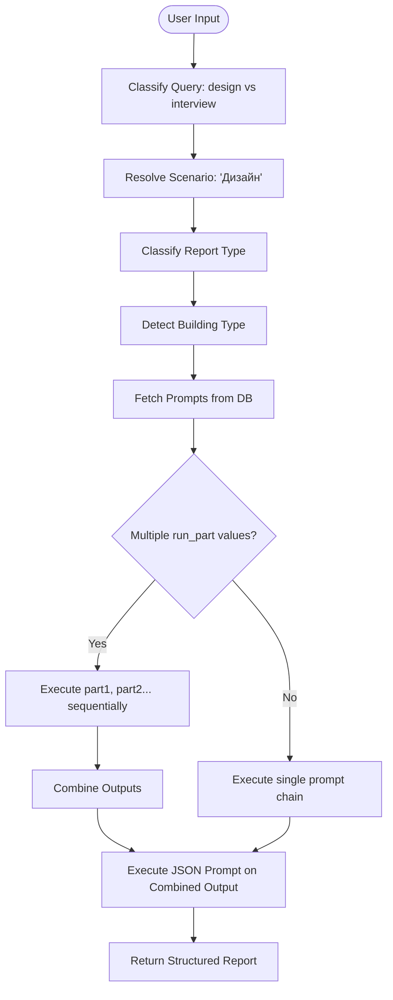
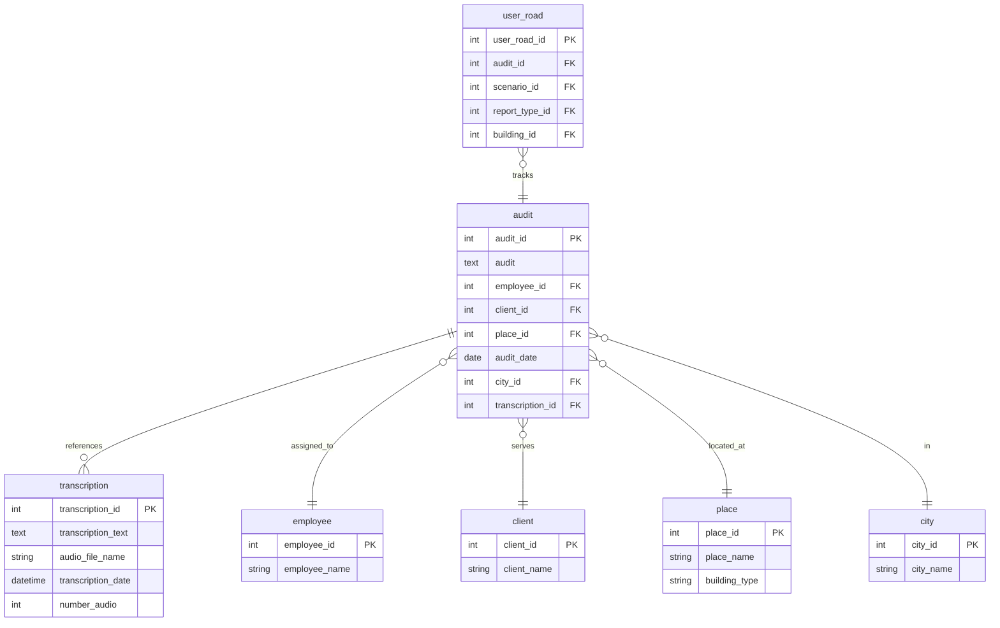

# Design Scenario Reports

<cite>
**Referenced Files in This Document**   
- [run_analysis.py](file://src/run_analysis.py)
- [parser.py](file://src/parser.py)
- [db.py](file://src/db_handler/db.py)
- [analysis.py](file://src/analysis.py)
- [datamodels.py](file://src/datamodels.py)
- [Дизайн.Оценка методологии аудита. Json.txt](file://prompts-by-scenario/design/Assessment-of-the-audit-methodology/json-prompt/Дизайн.Оценка методологии аудита. Json.txt)
- [Дизайн. Соответствие программе аудита. Отель. Json.txt](file://prompts-by-scenario/design/Information-on-compliance-with-the-audit-program/hotel/json-prompt/Дизайн. Соответствие программе аудита. Отель. Json.txt)
- [Дизайн. Структ отчет отель. Подсчет пунктов информации. json.txt](file://prompts-by-scenario/design/Structured-information-on-the-audit-program/hotel/json-prompt/Дизайн. Структ отчет отель. Подсчет пунктов информации. json.txt)
</cite>

## Table of Contents
1. [Introduction](#introduction)
2. [Three-Tiered Reporting System](#three-tiered-reporting-system)
3. [Prompt Chain Selection and Orchestration](#prompt-chain-selection-and-orchestration)
4. [JSON-Formatted Prompts and Output Consistency](#json-formatted-prompts-and-output-consistency)
5. [Response Parsing and Validation](#response-parsing-and-validation)
6. [Audit Result Storage and Database Integration](#audit-result-storage-and-database-integration)
7. [Multi-Step LLM Orchestration via run_analysis.py](#multi-step-llm-orchestration-via-run_analysispy)
8. [Code Flow Example: Prompt Loading and LLM Invocation](#code-flow-example-prompt-loading-and-llm-invocation)
9. [Strategies for Prompt Versioning and Audit Traceability](#strategies-for-prompt-versioning-and-audit-traceability)
10. [Handling LLM Inconsistencies and Error Resilience](#handling-llm-inconsistencies-and-error-resilience)

## Introduction
VoxPersona implements a structured, multi-tiered system for generating design scenario reports across hotels, restaurants, and spas. The system leverages large language models (LLMs) to analyze audit data and generate standardized reports through a series of orchestrated prompt chains. This document details the architecture and workflow of the reporting pipeline, focusing on the three-tiered structure: audit methodology assessment, compliance evaluation, and structured audit summaries. It explains how user input and building type determine prompt selection, how JSON-formatted prompts ensure consistent output, and how the system validates, stores, and traces audit results.

## Three-Tiered Reporting System

The design scenario reporting system in VoxPersona is organized into three distinct tiers, each serving a specific analytical purpose:

1. **Audit Methodology Assessment**: Evaluates the quality and completeness of the audit process itself.
2. **Compliance Evaluation**: Assesses adherence to predefined audit program standards based on building type.
3. **Structured Audit Summaries**: Generates detailed, quantifiable summaries of audit findings segmented by location type.

Each tier corresponds to a directory within the `prompts-by-scenario/design/` path:
- `Assessment-of-the-audit-methodology`
- `Information-on-compliance-with-the-audit-program`
- `Structured-information-on-the-audit-program`

These directories contain subdirectories for each building type (`hotel`, `restaurant`, `spa`) and include both standard text prompts and JSON-formatted prompts used for structured output generation.

**Section sources**
- [datamodels.py](file://src/datamodels.py#L10-L30)
- [run_analysis.py](file://src/run_analysis.py#L150-L200)

## Prompt Chain Selection and Orchestration

The application dynamically selects prompt chains based on user input and detected building type. The orchestration logic resides primarily in `run_analysis.py`, where the `run_analysis_with_spinner` function determines the appropriate scenario, report type, and building type from user context.

Prompt selection is performed via the `fetch_prompts_for_scenario_reporttype_building` function in `db.py`, which queries the database using the resolved scenario name (e.g., "Дизайн"), report type description (e.g., "Соответствие программе аудита"), and building type (e.g., "Отель"). The database returns a list of prompts, each with metadata including `run_part` (execution order) and `is_json_prompt` (format indicator).

For complex reports like "Общие факторы", the system executes multiple passes: first processing `part1` and `part2` non-JSON prompts, then combining their outputs for a final JSON-formatted analysis.

**Diagram sources**
- [run_analysis.py](file://src/run_analysis.py#L250-L340)
- [db.py](file://src/db_handler/db.py#L300-L350)

**Section sources**
- [run_analysis.py](file://src/run_analysis.py#L200-L340)
- [db.py](file://src/db_handler/db.py#L300-L350)

## JSON-Formatted Prompts and Output Consistency

To ensure consistent, machine-readable outputs, VoxPersona uses JSON-formatted prompts stored in dedicated `json-prompt` subdirectories. These prompts instruct the LLM to generate responses in strict JSON format, enabling reliable parsing and downstream processing.

Examples include:
- `Дизайн.Оценка методологии аудита. Json.txt`
- `Дизайн. Соответствие программе аудита. Отель. Json.txt`
- `Дизайн. Структ отчет отель. Подсчет пунктов информации. json.txt`

These prompts are tagged with `is_json_prompt = True` in the database and are executed after preliminary analysis passes. Their structured output facilitates automated aggregation, reporting, and integration with external systems.

**Section sources**
- [Дизайн.Оценка методологии аудита. Json.txt](file://prompts-by-scenario/design/Assessment-of-the-audit-methodology/json-prompt/Дизайн.Оценка методологии аудита. Json.txt)
- [Дизайн. Соответствие программе аудита. Отель. Json.txt](file://prompts-by-scenario/design/Information-on-compliance-with-the-audit-program/hotel/json-prompt/Дизайн. Соответствие программе аудита. Отель. Json.txt)
- [run_analysis.py](file://src/run_analysis.py#L270-L280)

## Response Parsing and Validation

The `parser.py` module is responsible for validating and structuring raw LLM outputs. While the current implementation focuses on input parsing (e.g., normalizing building types, extracting metadata from user messages), the system relies on the JSON schema enforced by the prompt templates to ensure output consistency.

The `parse_message_text` function routes input to either `parse_design` or `parse_interview` based on mode, extracting structured data such as employee name, place name, building type, and date. Although direct JSON response parsing logic is not visible in the provided code, the use of JSON prompts implies that downstream components expect and validate JSON output before storage or presentation.

**Section sources**
- [parser.py](file://src/parser.py#L100-L170)

## Audit Result Storage and Database Integration

Audit results are persisted through the `db.py` module, which provides a transactional interface to PostgreSQL. The `save_audit` function stores the final audit text along with references to employee, place, city, and transcription records.

The system uses several database tables to maintain referential integrity:
- `audit`: Stores the final generated report text
- `transcription`: Stores the original input text or audio transcription
- `employee`, `client`, `place`, `city`: Dimension tables for entities
- `user_road`: Tracks the user's analysis path (scenario, report type, building)

The `save_user_road` function logs the analytical journey, enabling audit traceability by recording which report types were generated for which buildings and scenarios.

**Diagram sources**
- [db.py](file://src/db_handler/db.py#L200-L250)
- [db.py](file://src/db_handler/db.py#L350-L400)

**Section sources**
- [db.py](file://src/db_handler/db.py#L200-L400)

## Multi-Step LLM Orchestration via run_analysis.py

The `run_analysis.py` module orchestrates the entire LLM interaction pipeline. The `run_analysis_with_spinner` function manages the user-facing workflow, displaying loading animations while executing analysis passes.

Each analysis pass is handled by `run_analysis_pass`, which:
1. Displays a loading indicator
2. Invokes `analyze_methodology` with the selected prompts
3. Sends the result to the user
4. Saves the audit text and metadata to the database via `save_user_input_to_db`

The system supports both sequential and parallel LLM calls. For deep search operations, `run_deep_search` uses `extract_from_chunk_parallel_async` to distribute queries across multiple API keys, respecting rate limits for tokens and requests per minute.

**Section sources**
- [run_analysis.py](file://src/run_analysis.py#L100-L200)
- [analysis.py](file://src/analysis.py#L300-L400)

## Code Flow Example: Prompt Loading and LLM Invocation

The following sequence illustrates how a structured audit summary is generated for a hotel:

1. User selects "Structured Audit Summary" for a hotel
2. `run_analysis_with_spinner` resolves:
   - `scenario_name = "Дизайн"`
   - `report_type_desc = "Структурированный отчет аудита"`
   - `building_type = "Отель"`
3. `fetch_prompts_for_scenario_reporttype_building` retrieves:
   - Two non-JSON prompts (`part1`, `part2`)
   - One JSON prompt (`is_json_prompt = True`)
4. `run_analysis_pass` executes `part1` and `part2` prompts sequentially
5. Outputs are concatenated and passed to the JSON prompt
6. Final JSON response is sent to the user and stored in the database

This flow ensures that complex reports are built incrementally, with intermediate results feeding into the final structured output.

**Section sources**
- [run_analysis.py](file://src/run_analysis.py#L250-L340)
- [analysis.py](file://src/analysis.py#L10-L50)

## Strategies for Prompt Versioning and Audit Traceability

Prompt versioning is managed through the database schema, where prompts are stored in the `prompts` table and linked to scenarios, report types, and buildings via junction tables (`prompts_buildings`). This allows for:
- Tracking which prompt version was used in each audit
- Rolling out updated prompts without disrupting historical data
- A/B testing different prompt formulations

Audit traceability is ensured by:
- Storing the original transcription (`transcription` table)
- Logging the user's analysis path (`user_road` table)
- Saving the final audit text with metadata (`audit` table)
- Preserving the relationship between input, processing steps, and output

This end-to-end traceability enables reproducibility and compliance auditing.

**Section sources**
- [db.py](file://src/db_handler/db.py#L300-L350)
- [datamodels.py](file://src/datamodels.py#L40-L50)

## Handling LLM Inconsistencies and Error Resilience

The system implements several strategies to handle LLM inconsistencies and API failures:

1. **Rate Limiting**: The `extract_from_chunk_parallel_async` function enforces token and request rate limits across multiple API keys, preventing 429 errors.
2. **Retry Logic**: `send_msg_to_model` implements exponential backoff for rate-limited requests, retrying with increasing delays.
3. **Fallback Mechanisms**: If a JSON parse fails during classification, the system defaults to "Не определено" (Not Defined).
4. **Error Propagation**: Errors are logged and communicated to the user via Telegram messages (e.g., "Ошибка Claude").
5. **Thread Safety**: Loading animations run in separate threads to maintain UI responsiveness during long-running analyses.

These mechanisms ensure robust operation even under high load or intermittent API failures.

**Section sources**
- [analysis.py](file://src/analysis.py#L400-L490)
- [run_analysis.py](file://src/run_analysis.py#L100-L150)