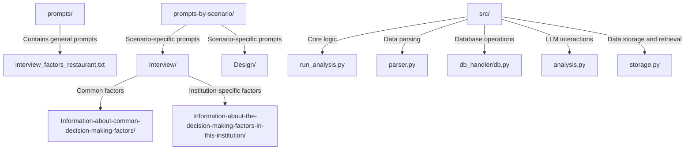
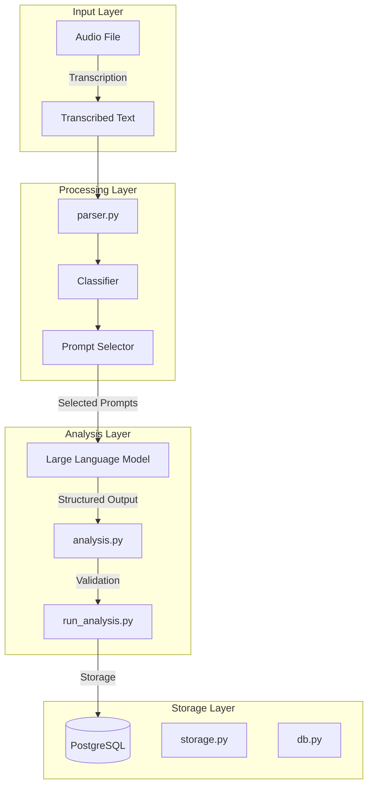
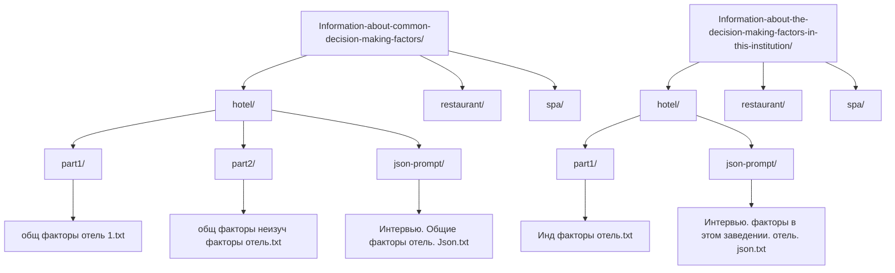
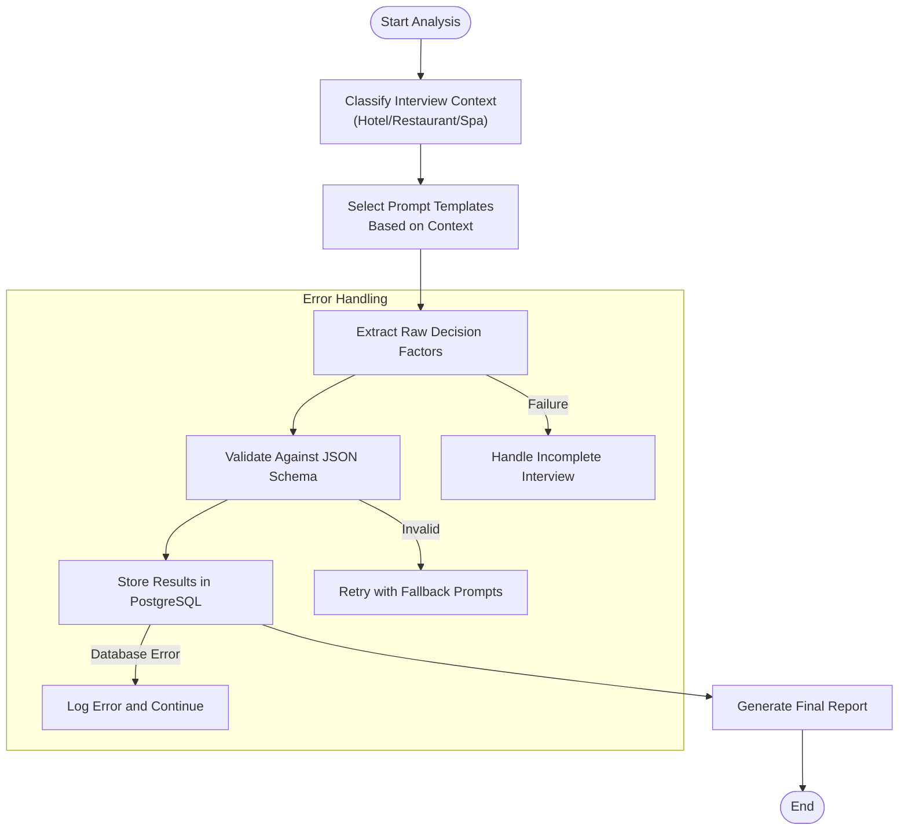
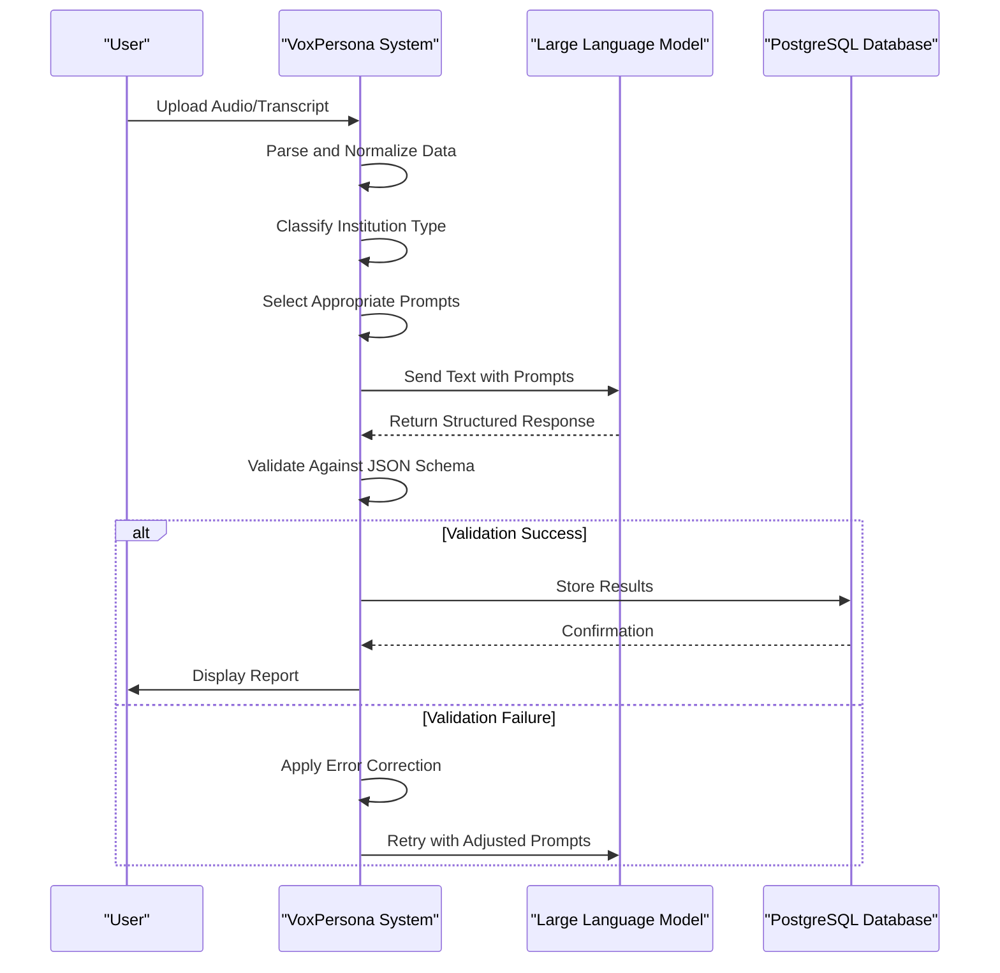
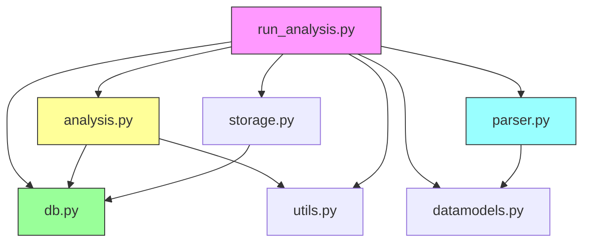

# Interview Scenario Reports

<cite>
**Referenced Files in This Document**   
- [run_analysis.py](file://src/run_analysis.py)
- [parser.py](file://src/parser.py)
- [db.py](file://src/db_handler/db.py)
- [datamodels.py](file://src/datamodels.py)
- [analysis.py](file://src/analysis.py)
- [storage.py](file://src/storage.py)
- [Information-about-common-decision-making-factors](file://prompts-by-scenario/interview/Information-about-common-decision-making-factors)
- [Information-about-the-decision-making-factors-in-this-institution](file://prompts-by-scenario/interview/Information-about-the-decision-making-factors-in-this-institution)
</cite>

## Table of Contents
1. [Introduction](#introduction)
2. [Project Structure](#project-structure)
3. [Core Components](#core-components)
4. [Architecture Overview](#architecture-overview)
5. [Detailed Component Analysis](#detailed-component-analysis)
6. [Dependency Analysis](#dependency-analysis)
7. [Performance Considerations](#performance-considerations)
8. [Troubleshooting Guide](#troubleshooting-guide)
9. [Conclusion](#conclusion)

## Introduction
This document provides a comprehensive analysis of the interview scenario report generation system in VoxPersona. The system processes transcribed interview audio to extract both common and institution-specific decision-making factors across hotels, restaurants, and health centers. It leverages structured prompt templates, large language models (LLMs), and PostgreSQL storage to generate consistent, validated reports. The pipeline includes mechanisms for error resilience, handling incomplete interviews, and ensuring consistency across multiple responses. This documentation details the architecture, data flow, prompt management, and extensibility of the system.

## Project Structure
The VoxPersona project is organized into distinct directories that separate concerns such as prompts, source code, and configuration. The `prompts-by-scenario` directory contains structured prompt templates categorized by scenario (e.g., interview, design), with subdirectories for specific report types and institution types. The `src` directory houses the core application logic, including analysis, database handling, and utility functions. Configuration files and deployment artifacts are located at the root level.

**Diagram sources**
- [prompts-by-scenario](file://prompts-by-scenario)
- [src](file://src)

**Section sources**
- [prompts-by-scenario](file://prompts-by-scenario)
- [src](file://src)

## Core Components
The core components of the interview scenario report generation system include the prompt management system, LLM processing pipeline, data validation mechanism, and PostgreSQL integration. The system uses a multi-stage analysis process where transcribed audio is first processed through a series of prompts to extract decision-making factors. The `run_analysis.py` module orchestrates this process, while `parser.py` handles input data extraction and normalization. The `db.py` module manages database interactions, ensuring structured storage of both raw data and generated reports.

**Section sources**
- [run_analysis.py](file://src/run_analysis.py#L1-L343)
- [parser.py](file://src/parser.py#L1-L174)
- [db.py](file://src/db_handler/db.py#L1-L398)

## Architecture Overview
The interview scenario report generation system follows a modular architecture that separates data ingestion, processing, analysis, and storage. The system begins with audio transcription and role assignment, followed by classification of the interview context (hotel, restaurant, or health center). Based on this classification, the system selects appropriate prompt templates and routes the data through LLMs for factor extraction. The results are validated and stored in PostgreSQL for future retrieval and analysis.

**Diagram sources**
- [run_analysis.py](file://src/run_analysis.py#L1-L343)
- [parser.py](file://src/parser.py#L1-L174)
- [db.py](file://src/db_handler/db.py#L1-L398)
- [analysis.py](file://src/analysis.py#L1-L490)
- [storage.py](file://src/storage.py#L1-L309)

## Detailed Component Analysis

### Prompt Template System
The system uses a hierarchical prompt template structure organized by scenario, report type, and institution. For interview analysis, two key directories contain specialized prompts: `Information-about-common-decision-making-factors` and `Information-about-the-decision-making-factors-in-this-institution`. Each institution type (hotel, restaurant, spa) has its own subdirectory with prompt parts and JSON schema definitions.

**Diagram sources**
- [Information-about-common-decision-making-factors](file://prompts-by-scenario/interview/Information-about-common-decision-making-factors)
- [Information-about-the-decision-making-factors-in-this-institution](file://prompts-by-scenario/interview/Information-about-the-decision-making-factors-in-this-institution)

**Section sources**
- [run_analysis.py](file://src/run_analysis.py#L1-L343)
- [datamodels.py](file://src/datamodels.py#L1-L71)

### Analysis Pipeline
The analysis pipeline in `run_analysis.py` orchestrates the entire report generation process. It begins by classifying the interview context and selecting appropriate prompts based on the institution type. The system then processes the transcribed text through multiple stages, first extracting raw information and then structuring it according to JSON schemas defined in the `json-prompt` files.

**Diagram sources**
- [run_analysis.py](file://src/run_analysis.py#L1-L343)
- [parser.py](file://src/parser.py#L1-L174)

**Section sources**
- [run_analysis.py](file://src/run_analysis.py#L1-L343)
- [analysis.py](file://src/analysis.py#L1-L490)

### Data Flow and Validation
The system ensures data integrity through a multi-step validation process. After LLM processing, the structured outputs are validated using the JSON schemas defined in the `json-prompt` files. The `parser.py` module handles input data normalization, while the `db.py` module ensures proper storage in PostgreSQL with appropriate foreign key relationships.

**Diagram sources**
- [run_analysis.py](file://src/run_analysis.py#L1-L343)
- [parser.py](file://src/parser.py#L1-L174)
- [db.py](file://src/db_handler/db.py#L1-L398)

**Section sources**
- [run_analysis.py](file://src/run_analysis.py#L1-L343)
- [parser.py](file://src/parser.py#L1-L174)
- [db.py](file://src/db_handler/db.py#L1-L398)
- [analysis.py](file://src/analysis.py#L1-L490)

## Dependency Analysis
The system components are tightly integrated through well-defined interfaces. The `run_analysis.py` module depends on `analysis.py` for LLM interactions, `parser.py` for data parsing, and `db.py` for database operations. The prompt selection logic relies on mappings defined in `datamodels.py`, which connect user context (e.g., hotel vs spa) to specific prompt templates.

**Diagram sources**
- [run_analysis.py](file://src/run_analysis.py#L1-L343)
- [analysis.py](file://src/analysis.py#L1-L490)
- [parser.py](file://src/parser.py#L1-L174)
- [db.py](file://src/db_handler/db.py#L1-L398)
- [datamodels.py](file://src/datamodels.py#L1-L71)
- [storage.py](file://src/storage.py#L1-L309)

**Section sources**
- [run_analysis.py](file://src/run_analysis.py#L1-L343)
- [analysis.py](file://src/analysis.py#L1-L490)
- [parser.py](file://src/parser.py#L1-L174)
- [db.py](file://src/db_handler/db.py#L1-L398)

## Performance Considerations
The system is designed with performance and scalability in mind. The `run_analysis.py` module implements asynchronous processing for LLM interactions, allowing multiple requests to be handled concurrently. The use of connection pooling and prepared statements in `db.py` optimizes database performance. For large transcripts, the system processes data in chunks to manage memory usage and prevent timeouts.

The prompt template system enables efficient processing by pre-loading commonly used prompts into memory. The JSON schema validation is performed client-side to reduce round trips to the database. The system also implements caching mechanisms for frequently accessed data, reducing the load on the PostgreSQL database.

## Troubleshooting Guide
When encountering issues with interview scenario report generation, consider the following common problems and solutions:

**Section sources**
- [run_analysis.py](file://src/run_analysis.py#L1-L343)
- [parser.py](file://src/parser.py#L1-L174)
- [db.py](file://src/db_handler/db.py#L1-L398)
- [analysis.py](file://src/analysis.py#L1-L490)

## Conclusion
The interview scenario report generation system in VoxPersona provides a robust framework for extracting decision-making factors from interview transcripts across different institution types. By leveraging structured prompt templates, JSON schema validation, and PostgreSQL storage, the system ensures consistent, reliable report generation. The modular architecture allows for easy extension with new interview factors or institution types by simply adding appropriate prompt templates and updating the configuration mappings. The system's error resilience mechanisms handle incomplete interviews and LLM processing failures gracefully, ensuring reliable operation in production environments.