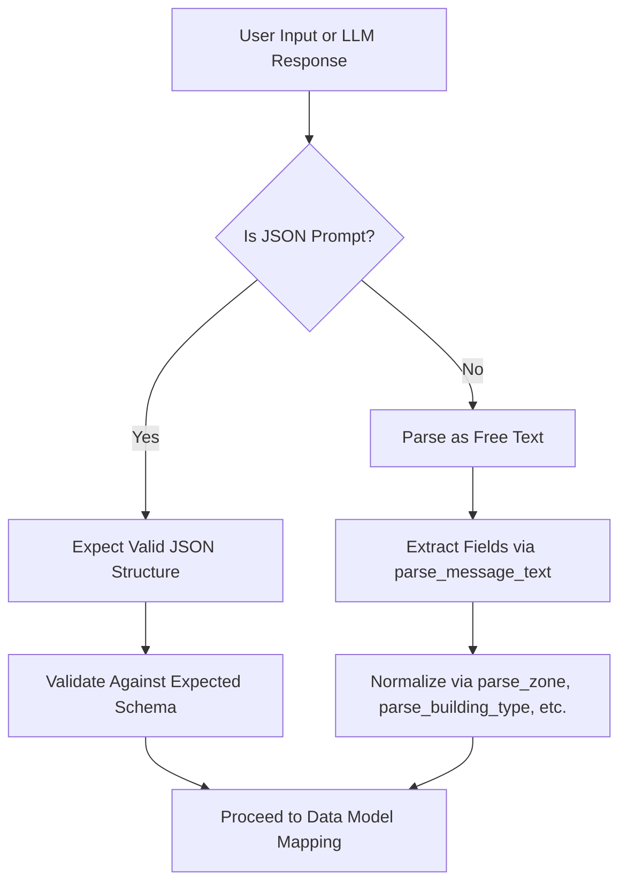
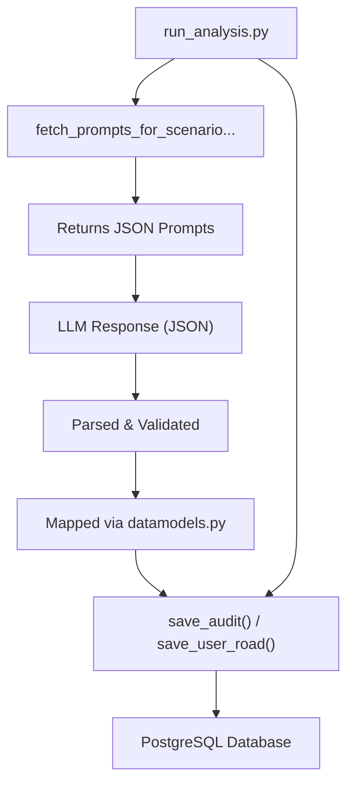

# Report Structure and Formatting

<cite>
**Referenced Files in This Document**   
- [parser.py](file://src/parser.py)
- [datamodels.py](file://src/datamodels.py)
- [db.py](file://src/db_handler/db.py)
- [fill_prompts_table.py](file://src/db_handler/fill_prompts_table.py)
- [run_analysis.py](file://src/run_analysis.py)
</cite>

## Table of Contents
1. [Introduction](#introduction)
2. [JSON-Prompt Structure and Schema Enforcement](#json-prompt-structure-and-schema-enforcement)
3. [Response Parsing and Validation with parser.py](#response-parsing-and-validation-with-parserpy)
4. [Data Model Mapping via datamodels.py](#data-model-mapping-via-datamodelspy)
5. [Database Integration and Storage via db.py](#database-integration-and-storage-via-dbpy)
6. [Error Handling and Fallback Mechanisms](#error-handling-and-fallback-mechanisms)
7. [Logging and Debugging Format Issues](#logging-and-debugging-format-issues)
8. [Best Practices for JSON Prompt Design](#best-practices-for-json-prompt-design)
9. [Conclusion](#conclusion)

## Introduction
VoxPersona employs a structured reporting system that ensures consistency and reliability in LLM-generated outputs. This document details how structured reports are formatted, validated, and processed throughout the system. The core mechanism relies on JSON-schema-enforced prompts stored in `json-prompt` directories, which guide LLMs to produce predictable, analyzable responses. These responses are then parsed, normalized, and mapped to internal data models before being stored in PostgreSQL. This documentation covers the full lifecycle of structured report processing, from prompt design to database insertion, including error handling, logging, and best practices for maintaining backward compatibility.

## JSON-Prompt Structure and Schema Enforcement
The `json-prompt` subdirectories within `prompts-by-scenario` contain specially formatted prompt files designed to enforce strict JSON output structures from LLMs. These prompts are identified by their placement in folders named `json-prompt` and are marked in the database with the `is_json_prompt = True` flag during ingestion via `fill_prompts_table.py`.

Each JSON prompt includes explicit instructions for the LLM to respond only in valid JSON format, often specifying required fields, data types, and nesting structures. For example, prompts for hotel compliance audits or spa decision factor analysis are tailored to extract domain-specific structured data. The system uses these prompts during analysis workflows triggered in `run_analysis.py`, where they are retrieved based on scenario, report type, and building type using `fetch_prompts_for_scenario_reporttype_building()`.

The directory structure enforces modularity:
- `design/` and `interview/` represent high-level scenarios.
- Subdirectories like `Information-on-compliance-with-the-audit-program/` define report types.
- Building-specific folders (`hotel`, `spa`, `restaurant`) allow customization.
- The `json-prompt` folder contains the schema-enforced version used for structured extraction.

This hierarchical organization ensures that the correct JSON prompt is selected based on context, guaranteeing consistent output formats across different audit and interview scenarios.

**Section sources**
- [fill_prompts_table.py](file://src/db_handler/fill_prompts_table.py#L123-L148)
- [run_analysis.py](file://src/run_analysis.py#L215-L249)

## Response Parsing and Validation with parser.py
The `parser.py` module is responsible for extracting and normalizing metadata from user input and LLM responses. While it primarily handles initial message parsing for audit and interview scenarios, its design principles align with structured data processing.

Key functions include:
- `parse_message_text()`: Routes input to either `parse_design()` or `parse_interview()` based on mode.
- Field-specific parsers (`parse_name`, `parse_date`, `parse_city`) ensure consistent formatting.
- `parse_zone()` and `parse_building_type()` apply linguistic normalization using rules and synonym mapping to standardize inputs like "отеле" → "отель".

For JSON responses, although explicit JSON parsing logic isn't shown in the provided code, the system relies on external LLM behavior guided by JSON prompts. When such responses are received, they are expected to conform to predefined schemas. Any deviation would result in parsing errors downstream, handled through exception handling in calling modules.

Normalization includes:
- Removing prepositions like "о", "об", "про" from building descriptions.
- Lemmatizing words using `pymorphy2` to reduce inflected forms to base forms.
- Applying title case consistently across textual fields.

These transformations ensure that parsed data is uniform before being passed to the data model layer.

**Diagram sources**
- [parser.py](file://src/parser.py#L0-L174)

**Section sources**
- [parser.py](file://src/parser.py#L0-L174)

## Data Model Mapping via datamodels.py
The `datamodels.py` file defines critical mappings that translate external identifiers into internal representations used throughout the application. These mappings ensure consistency between user-facing labels and database-stored values.

Key components include:
- `mapping_scenario_names`: Maps internal keys like `"design"` to display names like `"Дизайн"`.
- `mapping_report_type_names`: Translates folder names (e.g., `Assessment-of-the-audit-methodology`) into human-readable report types.
- `mapping_building_names`: Standardizes building types (`hotel` → `Отель`, `spa` → `Центр Здоровья`).
- `REPORT_MAPPING`: Provides reverse lookup from callback identifiers to report type descriptions.
- `CLASSIFY_DESIGN` and `CLASSIFY_INTERVIEW`: Define ordered classifications for report generation.

These mappings are used in `run_analysis.py` to determine which set of prompts to load and how to label generated reports. They act as a translation layer between the structured output of LLMs and the internal logic of the application, ensuring that parsed results are correctly categorized and routed.

Additionally, constants like `OPENAI_AUDIO_EXTS` and `translit_map` support auxiliary functions such as file handling and safe filename generation, contributing to robust data processing pipelines.

**Section sources**
- [datamodels.py](file://src/datamodels.py#L0-L71)

## Database Integration and Storage via db.py
The `db.py` module handles all interactions with the PostgreSQL database, including the storage of structured reports derived from LLM outputs. It uses a decorator-based transaction system (`@db_transaction`) to manage connections and commits, ensuring data integrity.

Key functions involved in report processing:
- `fetch_prompts_for_scenario_reporttype_building()`: Retrieves all prompts (including JSON prompts) based on scenario, report type, and building type. This function joins multiple tables (`scenario`, `report_type`, `buildings`, `prompts`) to resolve the correct prompt set.
- `save_audit()`: Stores the final audit text along with metadata (employee, place, date) into the `audit` table.
- `get_or_save_transcription()`: Ensures idempotent storage of transcriptions, preventing duplicates.
- `save_user_road()`: Records the analytical path taken (audit, scenario, report type, building), enabling traceability.

The database schema supports structured reporting through:
- The `prompts` table, which stores both free-text and JSON prompts with a boolean `is_json_prompt` flag.
- The `prompts_buildings` junction table, linking prompts to specific building-report type combinations.
- Normalized tables (`building`, `report_type`, `scenario`) that enable flexible querying and reporting.

When a structured report is generated, the parsed JSON output is mapped to database fields via the internal data model and inserted using appropriate `save_*` functions. This ensures that even complex nested responses are flattened and stored in a queryable format.

**Diagram sources**
- [db.py](file://src/db_handler/db.py#L0-L398)

**Section sources**
- [db.py](file://src/db_handler/db.py#L0-L398)
- [fill_prompts_table.py](file://src/db_handler/fill_prompts_table.py#L93-L126)

## Error Handling and Fallback Mechanisms
VoxPersona implements defensive programming practices to handle malformed inputs and system errors gracefully.

In `parser.py`, `ValueError` exceptions are raised when input lines do not match expected counts for `design` or `interview` modes. These errors prevent partial or incorrect data from propagating further.

The `db.py` module includes validation functions:
- `validate_ids()`: Checks that `building_id` and `report_type_id` exist before proceeding.
- `ensure_buildings_report_type_exists()`: Verifies that the combination of building and report type is valid, raising `ValueError` if not.

These validations ensure referential integrity and prevent orphaned records. When exceptions occur, descriptive error messages are logged, and the transaction is aborted due to the use of `@db_transaction(commit=True)`.

For JSON responses, while no explicit parser recovery logic is visible, the reliance on schema-enforced prompts reduces the likelihood of malformed JSON. In cases where parsing fails, the calling context in `run_analysis.py` would likely catch the exception and either retry or fall back to alternative processing paths.

Additionally, `get_or_create_*` functions provide idempotent behavior, ensuring that duplicate entries are avoided even under repeated execution or partial failures.

**Section sources**
- [parser.py](file://src/parser.py#L120-L125)
- [db.py](file://src/db_handler/db.py#L150-L175)

## Logging and Debugging Format Issues
The system uses Python’s `logging` module extensively to record operations and diagnose issues. Every database operation in `db.py` includes an `info` log upon success, such as:
- `"Данные в таблицу employee успешно сохранены"`
- `"Найдены данные по client_name = ... из таблицы client"`

These logs help trace the flow of data and identify where processing may have failed. Errors are logged using `logging.error()` with descriptive messages, including parameter values for debugging.

In `fill_prompts_table.py`, print statements are used for invalid directory names, aiding in script-level debugging during prompt ingestion.

For format-related issues—such as unexpected JSON structure or failed parsing—the combination of structured logging and exception messages allows developers to reconstruct the input and processing context. This is particularly valuable when refining JSON prompts or adapting to schema changes.

Logs are essential for monitoring the reliability of structured report generation and for auditing the consistency of LLM outputs over time.

**Section sources**
- [db.py](file://src/db_handler/db.py#L0-L398)
- [fill_prompts_table.py](file://src/db_handler/fill_prompts_table.py#L172-L192)

## Best Practices for JSON Prompt Design
To ensure reliable structured reporting in VoxPersona, follow these best practices when designing new JSON prompts:

1. **Use Clear Schema Definitions**: Explicitly specify required fields, data types (string, number, boolean), and allowed values in the prompt.
2. **Enforce Strict Output Format**: Instruct the LLM to respond *only* with valid JSON, without additional text or explanations.
3. **Include Examples**: Where possible, provide sample JSON responses to guide the model.
4. **Organize by Scenario and Building Type**: Place prompts in the correct subdirectory (`design/json-prompt`, `interview/json-prompt`) and under the appropriate building folder (`hotel`, `spa`, `restaurant`).
5. **Maintain Backward Compatibility**: When evolving report schemas, avoid removing fields; instead, mark them as deprecated and introduce new ones. Update `datamodels.py` mappings accordingly.
6. **Test Thoroughly**: Validate that new prompts produce consistent, parseable JSON across multiple runs and edge cases.
7. **Use Descriptive Prompt Names**: Ensure filenames reflect content and purpose for easier maintenance.
8. **Leverage Part-Based Execution**: Use `part1`, `part2` folders to break complex analyses into sequential steps, as seen in interview workflows.

By adhering to these practices, new structured reports can be integrated seamlessly into the existing pipeline, ensuring compatibility with parsing, mapping, and storage components.

**Section sources**
- [datamodels.py](file://src/datamodels.py#L0-L71)
- [run_analysis.py](file://src/run_analysis.py#L248-L275)

## Conclusion
VoxPersona’s structured reporting system combines schema-enforced JSON prompts, robust parsing, and consistent data modeling to ensure reliable LLM output processing. The use of `json-prompt` directories guarantees predictable response formats, while `parser.py` and `datamodels.py` normalize and map data for downstream use. The `db.py` module ensures safe, transactional storage in PostgreSQL, with comprehensive logging and error handling throughout. By following best practices in prompt design and schema evolution, the system maintains high data quality and operational integrity across diverse audit and interview scenarios.