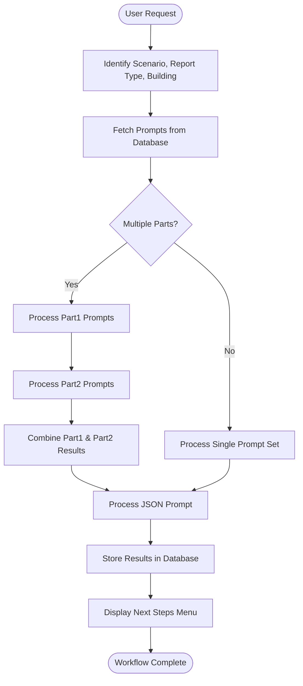
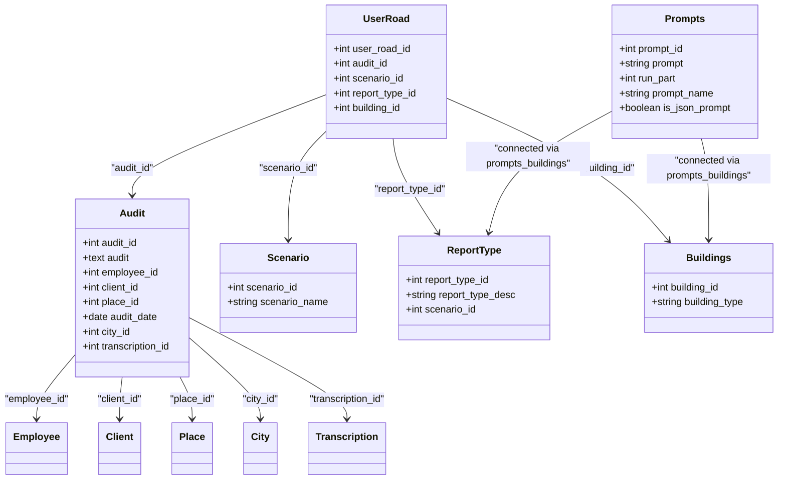

# Structured Report Generation

<cite>
**Referenced Files in This Document**   
- [run_analysis.py](file://src/run_analysis.py)
- [parser.py](file://src/parser.py)
- [db.py](file://src/db_handler/db.py)
- [datamodels.py](file://src/datamodels.py)
- [analysis.py](file://src/analysis.py)
- [fill_prompts_table.py](file://src/db_handler/fill_prompts_table.py)
- [Дизайн.Оценка методологии аудита. Json.txt](file://prompts-by-scenario/design/Assessment-of-the-audit-methodology/json-prompt/Дизайн.Оценка методологии аудита. Json.txt)
</cite>

## Table of Contents
1. [Introduction](#introduction)
2. [Template Selection and Context Mapping](#template-selection-and-context-mapping)
3. [Multi-Step Analysis Pipeline](#multi-step-analysis-pipeline)
4. [JSON-Structured Prompt System](#json-structured-prompt-system)
5. [Response Processing and Report Compilation](#response-processing-and-report-compilation)
6. [Template Management and Versioning](#template-management-and-versioning)
7. [Error Handling and LLM Provider Resilience](#error-handling-and-llm-provider-resilience)
8. [Conclusion](#conclusion)

## Introduction
The VoxPersona structured report generation system automates the creation of comprehensive audit and interview analysis reports through a multi-stage pipeline that leverages Large Language Models (LLMs). The system supports two primary scenarios: design audits and client interviews, each with specialized report types. It processes user input to determine context, selects appropriate prompt templates, chains multiple LLM calls for progressive analysis, ensures structured output through JSON-formatted prompts, and stores results in a PostgreSQL database. This document details the architecture and workflow of this system, focusing on template selection, analysis pipelines, structured output generation, and error resilience.

## Template Selection and Context Mapping

The system selects prompt templates based on user-selected context through a hierarchical mapping system that correlates scenarios, report types, and building types. When a user initiates a report generation process, the system determines the appropriate template chain by analyzing the callback data and associated metadata.

The template selection process begins with scenario identification. The system distinguishes between "interview" and "design" scenarios, which are mapped to their Russian equivalents "Интервью" and "Дизайн" via the `mapping_scenario_names` dictionary in `datamodels.py`. Once the scenario is identified, the system determines the report type from the callback data using the `REPORT_MAPPING` dictionary, which maps identifiers like "report_int_methodology" to descriptive names like "Оценка методологии интервью".

Building type identification occurs through the `mapping_building_names` dictionary, which translates identifiers like "hotel" to "Отель", "restaurant" to "Ресторан", and "spa" to "Центр Здоровья". The system then queries the database using `fetch_prompts_for_scenario_reporttype_building()` to retrieve all relevant prompts for the specific combination of scenario, report type, and building type.

The directory structure under `prompts-by-scenario` organizes templates hierarchically: scenario → report type → building type → prompt variants. Special subdirectories like "json-prompt", "part1", "part2", and "part3" indicate specific processing requirements. The "json-prompt" subdirectory contains templates designed to produce JSON-formatted output, while numbered "part" directories indicate multi-phase analysis workflows.

**Section sources**
- [run_analysis.py](file://src/run_analysis.py#L200-L300)
- [datamodels.py](file://src/datamodels.py#L1-L72)
- [db.py](file://src/db_handler/db.py#L300-L350)

## Multi-Step Analysis Pipeline

The analysis pipeline in `run_analysis.py` implements a sophisticated multi-step process that chains LLM calls to progressively refine and structure audit information. The pipeline is orchestrated through the `run_analysis_with_spinner()` function, which manages the entire workflow from user input to final report generation.

The pipeline begins with `run_analysis_pass()`, which executes a single analysis pass with a loading animation. This function calls `analyze_methodology()` from `analysis.py`, which processes a list of prompts sequentially. Each prompt's output becomes the input for the next prompt in the chain, enabling progressive refinement of the analysis. This chaining mechanism allows for complex workflows where initial prompts perform broad analysis, and subsequent prompts focus on specific aspects.

For certain report types like "Общие факторы" (Common Factors) in interviews, the system implements a two-phase analysis. First, it processes prompts from "part1" to generate a report on common decision-making factors, then processes prompts from "part2" to analyze unexplored factors. The results from both phases are concatenated and passed to a JSON-formatted prompt for quantitative analysis and structured output generation.

The pipeline also supports different analysis modes through the `run_dialog_mode()` function, which offers both "fast search" and "deep search" options. Fast search uses a pre-built RAG (Retrieval-Augmented Generation) database for quick responses, while deep search processes individual chunks of content through parallel LLM calls, aggregating the results for comprehensive analysis.

**Diagram sources **
- [run_analysis.py](file://src/run_analysis.py#L200-L343)
- [analysis.py](file://src/analysis.py#L50-L100)

**Section sources**
- [run_analysis.py](file://src/run_analysis.py#L200-L343)
- [analysis.py](file://src/analysis.py#L50-L150)

## JSON-Structured Prompt System

The system ensures consistent output structure through JSON-formatted prompts stored in "json-prompt" subdirectories. These specialized prompts are designed to extract specific quantitative data from analysis results and format it as JSON, enabling reliable parsing and integration with downstream systems.

The JSON prompt system works in conjunction with the multi-phase analysis workflow. After initial analysis phases generate comprehensive textual reports, the final phase uses a JSON-formatted prompt to extract key metrics. For example, in the design audit methodology assessment, the JSON prompt extracts the "Итоговой оценки качества отчета" (final quality assessment score) and returns only this numerical value in JSON format.

The system identifies JSON prompts through the `is_json_prompt` field in the database query results. During template retrieval, prompts are separated into `json_prompts` and `ordinary_prompts` based on this flag. Ordinary prompts are processed first to generate the analytical content, and their combined output is then passed to the JSON prompt for structured data extraction.

This approach ensures that while the initial analysis can be flexible and comprehensive, the final output is standardized and machine-readable. The JSON structure facilitates integration with reporting dashboards, data analytics tools, and automated decision-making systems that require structured input.

**Section sources**
- [run_analysis.py](file://src/run_analysis.py#L250-L280)
- [db.py](file://src/db_handler/db.py#L300-L350)
- [Дизайн.Оценка методологии аудита. Json.txt](file://prompts-by-scenario/design/Assessment-of-the-audit-methodology/json-prompt/Дизайн.Оценка методологии аудита. Json.txt#L1-L12)

## Response Processing and Report Compilation

The system processes LLM responses and compiles reports through a coordinated workflow between `parser.py`, `db.py`, and the analysis modules. After LLM processing completes, the results are structured, validated, and stored in PostgreSQL, creating a comprehensive audit trail.

The `parser.py` module handles initial data parsing from user input, extracting structured information like file numbers, dates, employee names, and building details. It normalizes building information by removing prepositions and standardizing forms (e.g., "отеле" → "отель"), ensuring consistent categorization. The parser also handles zone information, extracting locations like "центр здоровья при отеле" and normalizing them for database storage.

Report compilation occurs in `run_analysis_pass()`, which coordinates the entire process. After LLM analysis completes, the function calls `save_user_input_to_db()` to store the audit text along with metadata including the transcript, scenario name, user data, label, and audit text. This function internally uses multiple database operations to ensure referential integrity across related tables.

The database layer in `db.py` implements a sophisticated schema with tables for scenarios, report types, buildings, and their relationships. The `save_audit()` function creates audit records linked to employees, clients, places, and cities, while `save_user_road()` records the user's navigation path through the analysis options. The system ensures data consistency through foreign key relationships and transactional integrity.

**Diagram sources **
- [parser.py](file://src/parser.py#L1-L175)
- [db.py](file://src/db_handler/db.py#L150-L250)

**Section sources**
- [parser.py](file://src/parser.py#L1-L175)
- [db.py](file://src/db_handler/db.py#L150-L399)

## Template Management and Versioning

Template management and versioning are handled through the `fill_prompts_table.py` script, which populates the database with prompt templates from the filesystem. This system enables flexible template organization, version control through file management, and easy addition of new report types.

The template ingestion process begins by scanning the `prompts-by-scenario` directory structure. The script uses mapping dictionaries to translate directory names into database values. For example, the "design" directory is mapped to "Дизайн" using `mapping_scenario_names`, and "hotel" is mapped to "Отель" using `mapping_building_names`.

The system creates a comprehensive database schema with tables for scenarios, report types, buildings, and prompts, connected through junction tables like `buildings_report_type` and `prompts_buildings`. This relational structure allows for flexible template assignment and retrieval. When a new template file is added to the appropriate directory, the script automatically creates the necessary database records and relationships.

Template versioning is managed through the filesystem, allowing teams to use version control systems like Git to track changes to prompt templates. The hierarchical directory structure supports organization by scenario, report type, building, and processing phase. Special directories like "json-prompt" and "part1"/"part2" provide metadata about template usage without requiring changes to the core system.

Adding new report types is straightforward: create a new directory under the appropriate scenario ("interview" or "design") with a name that maps to an entry in `mapping_report_type_names`, then add prompt files in the appropriate subdirectories for each building type. The ingestion script will automatically create the necessary database records and relationships.

**Section sources**
- [fill_prompts_table.py](file://src/db_handler/fill_prompts_table.py#L1-L228)
- [datamodels.py](file://src/datamodels.py#L1-L72)

## Error Handling and LLM Provider Resilience

The system implements comprehensive error handling to ensure reliability during report generation and maintain consistency across different LLM providers. Error handling occurs at multiple levels, from individual LLM calls to the overall analysis workflow.

At the LLM interaction level, the `send_msg_to_model()` function in `analysis.py` includes retry logic with exponential backoff for rate limit errors. When a `RateLimitError` occurs, the system waits and retries with increasing delays (1s, 2s, 4s, etc.), up to a maximum backoff period. This approach gracefully handles API rate limiting from providers like Anthropic.

The system also implements parallel processing resilience through `extract_from_chunk_parallel_async()`, which distributes work across multiple API keys. This function uses a queue-based approach with rate limiting based on tokens per minute and requests per minute for each API key. By distributing requests across multiple keys, the system can maintain throughput even when individual keys hit rate limits.

In the analysis pipeline, `run_analysis_pass()` uses a try-except-finally block to ensure that loading animations are properly cleaned up even if errors occur. The function catches specific exceptions like `OpenAIPermissionError` for authentication issues and general exceptions for other errors, providing appropriate user feedback while logging detailed error information.

Database operations use the `@db_transaction` decorator to ensure atomicity and consistency. This decorator manages database connections and transactions, automatically committing changes on success and rolling back on error. The system also includes validation functions like `validate_ids()` and `ensure_buildings_report_type_exists()` to prevent referential integrity violations.

**Section sources**
- [analysis.py](file://src/analysis.py#L400-L450)
- [run_analysis.py](file://src/run_analysis.py#L280-L300)
- [db.py](file://src/db_handler/db.py#L1-L50)

## Conclusion
The VoxPersona structured report generation system represents a sophisticated pipeline for automated analysis of design audits and client interviews. By combining hierarchical template selection, multi-phase LLM processing, JSON-structured output, and robust database integration, the system delivers consistent, reliable reports while maintaining flexibility for different scenarios and building types. The architecture supports easy extension through the filesystem-based template management system and ensures reliability through comprehensive error handling and rate limit management. This approach enables organizations to scale their analysis capabilities while maintaining quality and consistency across diverse audit and interview contexts.