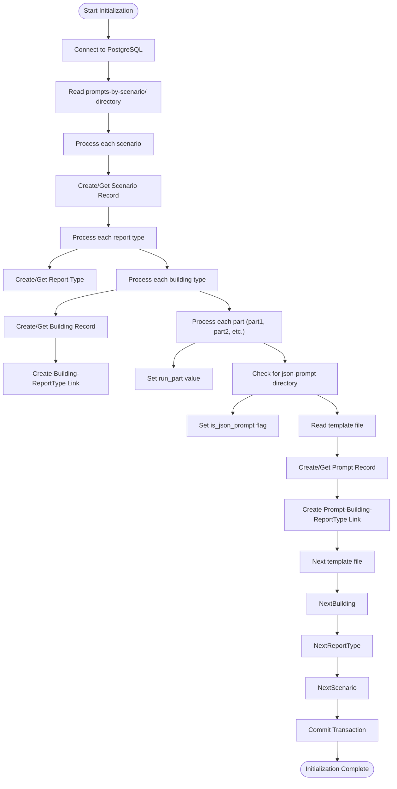
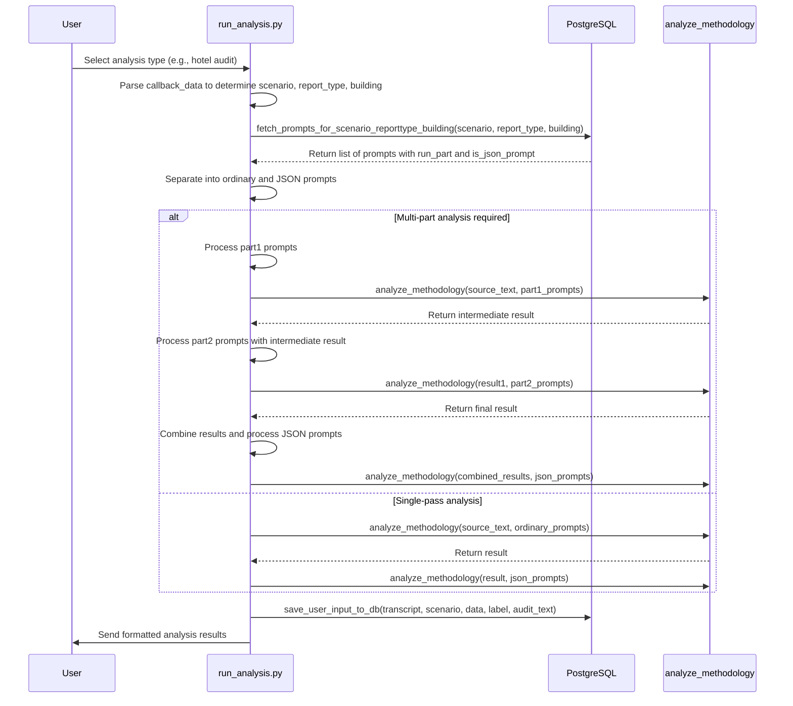

# Template Management and Extension

<cite>
**Referenced Files in This Document**   
- [fill_prompts_table.py](file://src/db_handler/fill_prompts_table.py)
- [run_analysis.py](file://src/run_analysis.py)
- [datamodels.py](file://src/datamodels.py)
- [db.py](file://src/db_handler/db.py)
</cite>

## Table of Contents
1. [Introduction](#introduction)
2. [Prompt Directory Structure](#prompt-directory-structure)
3. [Template Initialization Process](#template-initialization-process)
4. [Runtime Template Selection and Injection](#runtime-template-selection-and-injection)
5. [Adding New Report Types](#adding-new-report-types)
6. [Template Variables and Conditional Logic](#template-variables-and-conditional-logic)
7. [Versioning, Validation, and Testing](#versioning-validation-and-testing)
8. [Rollback Procedures](#rollback-procedures)

## Introduction
The VoxPersona system implements a structured template management framework for generating analytical reports based on user inputs and selected scenarios. This document details the architecture and workflow of the prompt template system, focusing on the organization of base prompts and scenario-specific templates, their initialization into PostgreSQL, dynamic selection during runtime, and procedures for extending the system with new report types. The system supports different building types (hotel, restaurant, health center) and processing stages through a hierarchical directory structure and database-backed template resolution.

**Section sources**
- [fill_prompts_table.py](file://src/db_handler/fill_prompts_table.py#L1-L227)
- [run_analysis.py](file://src/run_analysis.py#L1-L343)

## Prompt Directory Structure
The template system organizes prompts in two primary directories: `prompts/` for base templates and `prompts-by-scenario/` for scenario-specific templates. The `prompts/` directory contains foundational templates used across various analyses, including audit methodology designs, interview performance evaluations, and compliance assessments for different building types.

The `prompts-by-scenario/` directory implements a hierarchical organization by use case, building type, and processing stage. It contains subdirectories for different scenarios such as `design`, `interview`, and `sql_prompts`. Within each scenario, templates are further categorized by report type (e.g., `Assessment-of-the-audit-methodology`, `Information-on-compliance-with-the-audit-program`). Each report type directory contains subdirectories for specific building types (`hotel`, `restaurant`, `spa`) or `non-building` for general templates. The structure also includes `part1`, `part2`, and `part3` subdirectories to organize templates by processing stage, and `json-prompt` directories for structured JSON output templates.

**Section sources**
- [datamodels.py](file://src/datamodels.py#L1-L71)
- [fill_prompts_table.py](file://src/db_handler/fill_prompts_table.py#L1-L227)

## Template Initialization Process
The initialization of templates into the PostgreSQL database is handled by `fill_prompts_table.py`, which recursively processes the `prompts-by-scenario/` directory structure and populates several related database tables. The script establishes connections to the database using configuration from `DB_CONFIG` and begins processing from the `BASE_DIR` path.

The initialization follows a hierarchical approach: first creating or retrieving scenario records (e.g., "Дизайн" for design, "Интервью" for interview), then processing each report type within the scenario to create corresponding `report_type` entries. For each building type encountered (hotel, restaurant, spa, non-building), the script ensures the building exists in the `buildings` table and establishes the appropriate relationships in the `buildings_report_type` table.

As the script traverses the directory structure, it processes template files by reading their content and storing them in the `prompts` table with metadata including `run_part` (processing stage) and `is_json_prompt` (structured output indicator). The script then creates associations between prompts, buildings, and report types in the `prompts_buildings` table, establishing the complete mapping required for runtime template selection.

Special handling is implemented for the `assign_roles` and `sql_prompts` scenarios, which follow slightly different organizational patterns but are integrated into the same database schema.

**Diagram sources**
- [fill_prompts_table.py](file://src/db_handler/fill_prompts_table.py#L1-L227)

**Section sources**
- [fill_prompts_table.py](file://src/db_handler/fill_prompts_table.py#L1-L227)
- [datamodels.py](file://src/datamodels.py#L1-L71)

## Runtime Template Selection and Injection
During runtime, the system dynamically selects and injects templates based on user choices through the `run_analysis.py` module. The template selection process begins when a user selects a specific analysis type (e.g., hotel audit, restaurant interview), which triggers the `run_analysis_with_spinner` function.

This function determines the appropriate scenario, building type, and report type based on the user's selection and callback data. It then calls `fetch_prompts_for_scenario_reporttype_building` from `db_handler.db` to retrieve the relevant templates from the database. This query joins multiple tables (`scenario`, `report_type`, `buildings`, `prompts_buildings`) to find all prompts associated with the specified combination of scenario, report type, and building type.

The retrieved prompts are separated into ordinary prompts and JSON prompts based on the `is_json_prompt` flag. For complex analyses like "Общие факторы" (Common Factors) in interviews, the system processes templates in multiple passes according to their `run_part` value. It first executes analysis with part1 templates, then part2 templates, and finally combines the results to generate a structured JSON output using the JSON prompts.

The `run_analysis_pass` function handles the actual template injection, passing the selected prompts to the `analyze_methodology` function along with the source text. After analysis, results are saved to the database with context about the scenario, building, and user data.

**Diagram sources**
- [run_analysis.py](file://src/run_analysis.py#L1-L343)
- [db.py](file://src/db_handler/db.py#L326-L383)

**Section sources**
- [run_analysis.py](file://src/run_analysis.py#L1-L343)
- [db.py](file://src/db_handler/db.py#L326-L383)

## Adding New Report Types
To add new report types to the VoxPersona system, follow this structured procedure that maintains consistency with the existing template management framework.

### Directory Structure Conventions
Create new report types within the appropriate scenario directory (`prompts-by-scenario/design/` or `prompts-by-scenario/interview/`). Use the English descriptive name as the directory name, following the pattern of existing directories like `Assessment-of-the-audit-methodology` or `Information-about-common-decision-making-factors`. Within the new report type directory, create subdirectories for each supported building type (`hotel`, `restaurant`, `spa`) or `non-building` for general templates.

For multi-stage analyses, create `part1`, `part2`, and `part3` subdirectories within each building type directory. For structured JSON output templates, create a `json-prompt` subdirectory at the same level as building type directories.

### JSON Prompt Creation
Create template files with `.txt` extension within the appropriate subdirectories. For JSON output templates, place them in the `json-prompt` directory and ensure they generate valid JSON structures. Template filenames should be descriptive and follow the existing naming convention, typically starting with the scenario name followed by the specific purpose (e.g., `Дизайн. Соответствие программе аудита. Отель. Json.txt`).

Ensure templates use consistent variable placeholders and formatting to maintain compatibility with the analysis functions. Include appropriate instructions for the LLM to follow, including output format requirements, content guidelines, and any conditional logic.

### Database Synchronization
After creating the new template files, synchronize them with the database by running the `fill_prompts_table.py` script. This script will automatically detect the new directories and files, creating the necessary database records and relationships.

Verify the synchronization by querying the database to confirm that the new scenario, report type, and prompt records have been created with the correct associations. Test the new report type through the application interface to ensure proper template selection and analysis execution.

**Section sources**
- [fill_prompts_table.py](file://src/db_handler/fill_prompts_table.py#L1-L227)
- [datamodels.py](file://src/datamodels.py#L1-L71)

## Template Variables and Conditional Logic
The template system supports dynamic content generation through variable injection and conditional processing logic. Templates use plain text with implicit variable references that are resolved during the analysis process based on context from user inputs and previous analysis stages.

The system implements conditional logic through its multi-pass processing architecture. For example, the "Общие факторы" (Common Factors) analysis for interviews uses separate templates for different processing stages (`part1` for general factors, `part2` for unexplored factors). The results from earlier stages are then combined and processed with JSON templates to generate structured output.

Template selection itself represents a form of conditional logic, where the system chooses different templates based on the combination of scenario, building type, and report type. The `mapping_scenario_names`, `mapping_report_type_names`, and `mapping_building_names` dictionaries in `datamodels.py` facilitate this conditional routing by translating between directory names and their corresponding database values.

The `run_part` parameter enables sequential processing of templates, allowing later stages to build upon the results of earlier stages. This creates a pipeline where each stage can conditionally process content based on the outputs of previous stages, enabling complex analytical workflows.

**Section sources**
- [datamodels.py](file://src/datamodels.py#L1-L71)
- [run_analysis.py](file://src/run_analysis.py#L1-L343)

## Versioning, Validation, and Testing
The template management system incorporates several mechanisms for versioning, validation, and testing to ensure reliability and maintainability.

### Versioning Strategies
Template versioning is implicitly managed through the file system and database structure. Since templates are loaded from files into the database, the file system serves as the source of truth and version control can be implemented through Git. Each template file represents a specific version, and changes to templates require re-running the initialization script to update the database.

The separation of templates by scenario, building type, and processing stage provides a form of structural versioning, allowing different versions of analysis for different contexts without naming conflicts.

### Template Validation
The system validates templates during both initialization and runtime. During initialization in `fill_prompts_table.py`, the script checks that template files can be read successfully and that their content is not empty before storing them in the database.

At runtime, the `fetch_prompts_for_scenario_reporttype_building` function validates that prompts exist for the requested scenario, report type, and building combination, raising a `ValueError` if no prompts are found. Similarly, `fetch_prompt_by_name` validates the existence of specifically named prompts.

### Testing Workflows
Testing new templates involves several steps:
1. Verify that the template files are correctly formatted and can be read by the initialization script
2. Run `fill_prompts_table.py` and confirm that the templates are properly loaded into the database
3. Test the template through the application interface with sample inputs
4. Validate that the expected output format is generated, especially for JSON templates
5. Check that error handling works appropriately when templates fail to produce valid results

The system's logging framework provides detailed information about template loading and analysis execution, facilitating debugging and validation.

**Section sources**
- [fill_prompts_table.py](file://src/db_handler/fill_prompts_table.py#L1-L227)
- [db.py](file://src/db_handler/db.py#L326-L383)

## Rollback Procedures
In case of deployment issues with new templates, the system supports several rollback procedures to restore previous functionality.

The primary rollback method leverages the separation between the file system templates and the database. If problematic templates have been loaded into the database, administrators can:
1. Revert the template files in the `prompts-by-scenario/` directory to a previous version using Git
2. Clear the affected records from the database tables (`prompts`, `prompts_buildings`, etc.)
3. Re-run `fill_prompts_table.py` to reload the previous template versions

For critical issues requiring immediate resolution, a direct database approach can be used:
1. Identify the `prompt_id` values of the problematic templates
2. Delete the corresponding records from `prompts_buildings` and `prompts` tables
3. Restore previous template versions from backup or version control
4. Reload the templates using the initialization script

The system's modular design, where each template set is isolated by scenario, report type, and building, allows for targeted rollbacks that affect only specific analysis types without disrupting the entire system.

**Section sources**
- [fill_prompts_table.py](file://src/db_handler/fill_prompts_table.py#L1-L227)
- [db.py](file://src/db_handler/db.py#L326-L383)