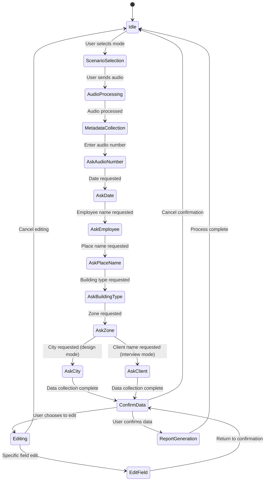
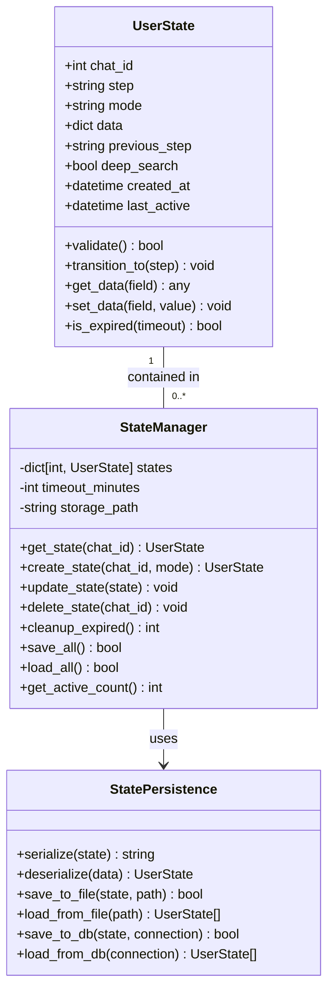

# User State Management

<cite>
**Referenced Files in This Document**   
- [handlers.py](file://src/handlers.py)
- [config.py](file://src/config.py)
- [validators.py](file://src/validators.py)
- [menus.py](file://src/menus.py)
</cite>

## Table of Contents
1. [Introduction](#introduction)
2. [State Tracking Mechanism](#state-tracking-mechanism)
3. [State Lifecycle and Workflow Integration](#state-lifecycle-and-workflow-integration)
4. [State Persistence and Session Management](#state-persistence-and-session-management)
5. [Concurrency and Race Condition Handling](#concurrency-and-race-condition-handling)
6. [Memory Management and Scalability](#memory-management-and-scalability)
7. [Best Practices for Extending State Model](#best-practices-for-extending-state-model)
8. [Conclusion](#conclusion)

## Introduction
The VoxPersona application implements a user state management system to maintain conversation context across multiple interaction steps. This system enables the bot to guide users through complex multi-step workflows such as audio processing, metadata collection, and report generation. The state management is built around an in-memory dictionary that tracks each user's current workflow stage, allowing the application to provide a seamless conversational experience.

**Section sources**
- [handlers.py](file://src/handlers.py#L183-L214)
- [config.py](file://src/config.py#L66-L70)

## State Tracking Mechanism
The user state management system in VoxPersona is centered around the `user_states` dictionary, which maps user IDs (chat IDs) to their current workflow state. This dictionary is defined as a global variable in the configuration module and stores state information as nested dictionaries.

Each user state contains several key properties:
- **step**: Current workflow stage (e.g., "ask_audio_number", "ask_date", "confirm_data")
- **mode**: Selected scenario ("interview" or "design")
- **data**: Collected metadata fields (audio number, date, employee name, etc.)
- **previous_step**: Previous state for navigation purposes
- **deep_search**: Boolean flag for dialog mode configuration

The system uses a step-based approach where each user input triggers a transition to the next step in the workflow. When a user sends a message, the `handle_authorized_text` function in handlers.py checks the current state and routes the input to the appropriate handler function based on the current step.

```mermaid
flowchart TD
Start([Message Received]) --> CheckState["Check user state exists"]
CheckState --> |No State| ShowMenu["Show main menu"]
CheckState --> |Has State| GetStep["Get current step"]
GetStep --> StepRouter{Current Step}
StepRouter --> |ask_audio_number| HandleAudio["Process audio number"]
StepRouter --> |ask_date| HandleDate["Validate and store date"]
StepRouter --> |ask_employee| HandleEmployee["Store employee name"]
StepRouter --> |ask_place_name| HandlePlace["Store place name"]
StepRouter --> |ask_building_type| HandleBuilding["Parse building type"]
StepRouter --> |ask_zone| HandleZone["Store zone information"]
StepRouter --> |ask_client| HandleClient["Store client name"]
StepRouter --> |ask_city| HandleCity["Store city name"]
StepRouter --> |edit_*| HandleEdit["Process field edit"]
StepRouter --> |dialog_mode| HandleDialog["Process dialog query"]
HandleAudio --> UpdateState["Update state: step = 'ask_date'"]
HandleDate --> UpdateState2["Update state: step = 'ask_employee'"]
HandleEmployee --> UpdateState3["Update state: step = 'ask_place_name'"]
HandlePlace --> UpdateState4["Update state: step = 'ask_building_type'"]
HandleBuilding --> UpdateState5["Update state: step = 'ask_zone'"]
HandleZone --> Conditional{Mode = "design"?}
Conditional --> |Yes| UpdateState6["Update state: step = 'ask_city'"]
Conditional --> |No| UpdateState7["Update state: step = 'ask_client'"]
HandleClient --> UpdateState8["Update state: step = 'confirm_data'"]
HandleCity --> UpdateState9["Update state: step = 'confirm_data'"]
HandleEdit --> ReturnToPrevious["Return to previous step"]
HandleDialog --> ProcessQuery["Process dialog mode query"]
UpdateState --> PromptNext["Prompt for date"]
UpdateState2 --> PromptNext2["Prompt for employee name"]
UpdateState3 --> PromptNext3["Prompt for place name"]
UpdateState4 --> PromptNext4["Prompt for building type"]
UpdateState5 --> PromptNext5["Prompt for zone"]
UpdateState6 --> PromptNext6["Prompt for city"]
UpdateState7 --> PromptNext7["Prompt for client name"]
UpdateState8 --> ShowConfirmation["Show confirmation menu"]
UpdateState9 --> ShowConfirmation
ReturnToPrevious --> ShowFieldPrompt["Show edit field prompt"]
ProcessQuery --> ReturnResponse["Return AI-generated response"]
```

**Diagram sources**
- [handlers.py](file://src/handlers.py#L242-L282)
- [handlers.py](file://src/handlers.py#L134-L162)

**Section sources**
- [handlers.py](file://src/handlers.py#L183-L214)
- [handlers.py](file://src/handlers.py#L242-L282)
- [config.py](file://src/config.py#L66-L70)

## State Lifecycle and Workflow Integration
The state lifecycle in VoxPersona follows a structured progression through various workflow stages. When a user begins interacting with the bot, their state is initialized during scenario selection (interview or design mode). The `handle_mode_selection` function creates a new state entry with the selected mode and an empty data object.

The workflow progresses through several stages:
1. Audio processing and transcription
2. Metadata collection (audio number, date, employee, etc.)
3. Data confirmation and editing
4. Report generation

During metadata collection, the system follows a sequential pattern where each user input advances the state to the next collection step. For example, after entering an audio number, the state transitions from "ask_audio_number" to "ask_date", prompting the user for the next piece of information.

The system also supports state modification through the editing functionality. When a user chooses to edit a field, the current step is stored in "previous_step" and the state transitions to an "edit_{field}" step. After editing, the state returns to the previous step, maintaining workflow continuity.



**Diagram sources**
- [handlers.py](file://src/handlers.py#L769-L803)
- [handlers.py](file://src/handlers.py#L158-L185)

**Section sources**
- [handlers.py](file://src/handlers.py#L242-L282)
- [handlers.py](file://src/handlers.py#L158-L185)
- [menus.py](file://src/menus.py#L34-L70)

## State Persistence and Session Management
The current implementation of user state management in VoxPersona does not include persistence across bot restarts. The `user_states` dictionary is stored in memory and is lost when the application terminates. This design choice has significant implications for user experience:

When the bot restarts, all active user sessions are reset, requiring users to restart their workflows from the beginning. This can be particularly disruptive for users engaged in long multi-step processes such as report generation.

The lack of persistence is evident in the configuration file where `user_states` is defined as a simple in-memory dictionary without any serialization or storage mechanism. While this approach provides simplicity and performance benefits during normal operation, it creates fragility in the user experience.

For audio processing workflows, this means that if a user has partially completed metadata collection and the bot restarts, they must re-upload the audio file and restart the entire process. Similarly, for dialog mode interactions, any context built during the conversation is lost upon restart.

The system does include some data persistence mechanisms for other components (such as RAG indices saved to disk), but these do not extend to user session states. The periodic saving functionality in main.py focuses on RAG models rather than user states.

**Section sources**
- [config.py](file://src/config.py#L66-L70)
- [main.py](file://src/main.py#L0-L38)

## Concurrency and Race Condition Handling
The user state management system in VoxPersona operates in an asynchronous environment with potential concurrency issues. The application uses threading for loading animations and other background tasks, creating opportunities for race conditions when multiple threads access the same user state.

Currently, the system does not implement explicit synchronization mechanisms for state access. The `user_states` dictionary is accessed and modified by various handler functions without locks or atomic operations. This could lead to race conditions in high-concurrency scenarios where multiple messages from the same user are processed simultaneously.

The system does include some defensive programming practices:
- State validation using the `check_state` function in validators.py
- Error handling for missing states
- Graceful degradation when states are not found

However, these measures do not fully address potential race conditions. For example, if two messages from the same user are processed concurrently, both could read the same state, make modifications, and write back results, potentially overwriting each other's changes.

The callback query handler includes exception handling for value errors and general exceptions, which helps prevent crashes but does not ensure data consistency in concurrent scenarios.

**Section sources**
- [handlers.py](file://src/handlers.py#L769-L803)
- [validators.py](file://src/validators.py#L0-L32)

## Memory Management and Scalability
The in-memory state management approach in VoxPersona has implications for memory usage and scalability. Each active user session consumes memory to store their state object, which includes metadata and workflow information.

As the number of concurrent users increases, so does the memory footprint of the application. Long-running sessions, particularly those in dialog mode with extensive conversation history, can accumulate significant memory usage over time.

The current implementation does not include mechanisms for:
- State expiration or timeout
- Automatic cleanup of inactive sessions
- Memory usage monitoring
- Session size limits

This could lead to memory exhaustion in high-traffic scenarios. The system relies on users completing their workflows or manually canceling them, but there is no automatic cleanup for abandoned sessions.

The use of global dictionaries for state storage also limits horizontal scalability, as state cannot be easily shared across multiple application instances in a distributed deployment.

**Section sources**
- [config.py](file://src/config.py#L66-L70)
- [handlers.py](file://src/handlers.py#L183-L214)

## Best Practices for Extending State Model
To extend the state model while maintaining code clarity and scalability, consider the following best practices:

1. **Implement State Persistence**: Add serialization to store user states in a database or file system, allowing recovery after restarts.

2. **Add State Expiration**: Implement timeout mechanisms to automatically clean up inactive sessions and prevent memory leaks.

3. **Introduce State Validation**: Create a schema for state objects to ensure consistency and prevent invalid states.

4. **Implement Synchronization**: Add locking mechanisms or use thread-safe data structures to prevent race conditions.

5. **Create State Management Service**: Extract state management into a dedicated service class with well-defined interfaces.

6. **Add Monitoring**: Implement metrics to track state count, memory usage, and session duration.

7. **Support State Migration**: Design the system to handle schema changes when adding new state properties.

8. **Implement State Backup**: Create periodic backups of user states to prevent data loss.

When adding new multi-step features, follow these guidelines:
- Define clear state transitions
- Use descriptive step names
- Implement proper error handling for each step
- Provide clear user feedback at each stage
- Support navigation between steps
- Allow cancellation at any point



**Diagram sources**
- [handlers.py](file://src/handlers.py#L183-L214)
- [config.py](file://src/config.py#L66-L70)

**Section sources**
- [handlers.py](file://src/handlers.py#L183-L214)
- [config.py](file://src/config.py#L66-L70)

## Conclusion
The user state management system in VoxPersona provides a functional foundation for tracking conversation context across multiple interaction steps. By using an in-memory dictionary to map user IDs to their current workflow stage, the system enables complex multi-step processes for audio processing, metadata collection, and report generation.

However, the current implementation has limitations in persistence, concurrency handling, and scalability. The lack of state persistence across restarts creates a fragile user experience, while the absence of synchronization mechanisms leaves the system vulnerable to race conditions. Memory management for long-running sessions also presents scalability challenges.

Future improvements should focus on adding state persistence, implementing proper concurrency controls, and introducing memory management features like session expiration. These enhancements would make the system more robust and scalable while maintaining the intuitive user experience that the current design provides.